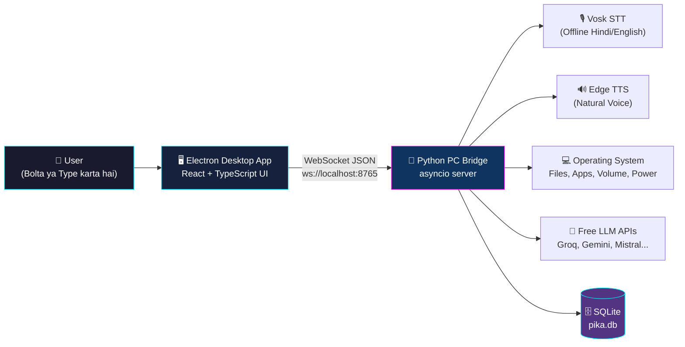
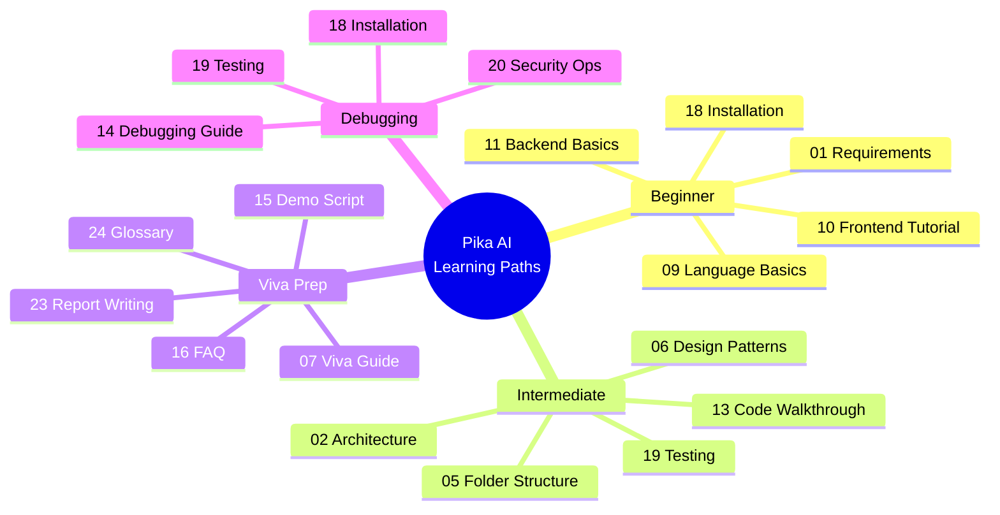
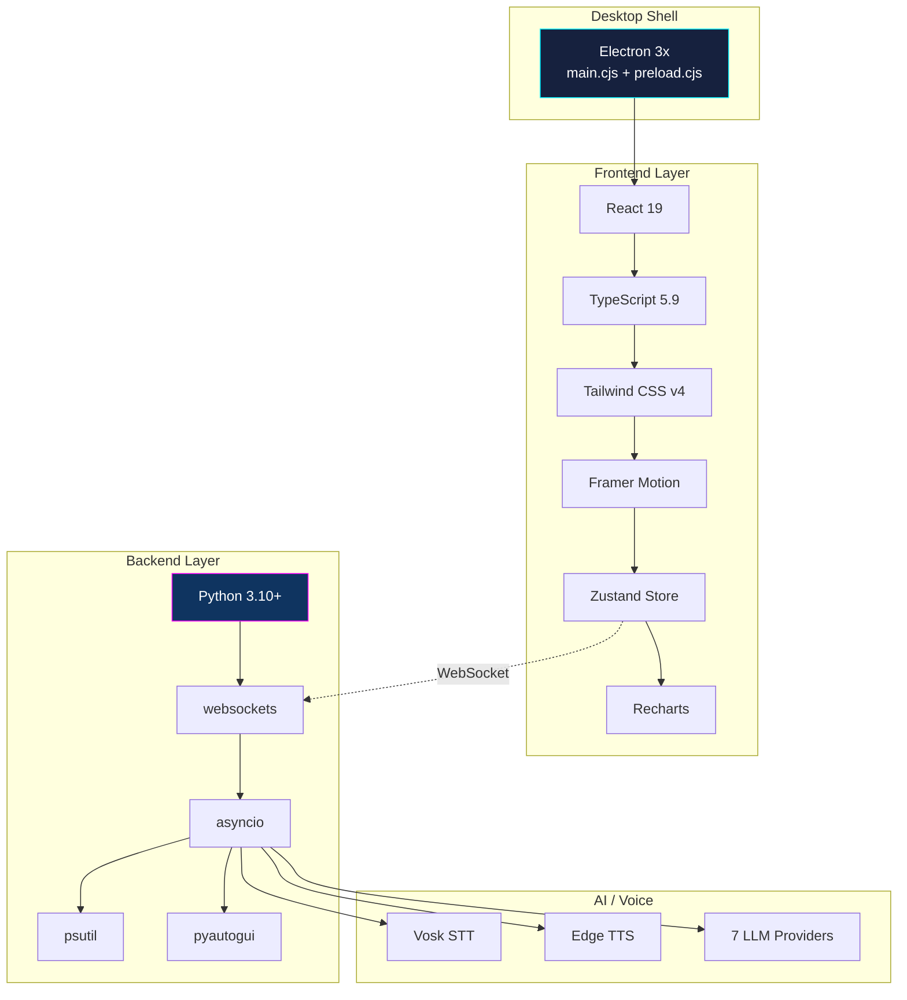

# 🏠 00 — START HERE (Master Index)

> **Pika AI Assistant** — Electron Desktop App with Offline Voice Control
> Namaste! 👋 Yeh documentation suite aapko **zero se hero** bana degi.
> Chahe aap absolute beginner ho ya viva ki tayari kar rahe ho — sab kuch yahan hai.

---

## ⚡ 30-Second System Overview

Pehle ek nazar mein samjho ki Pika kya hai:



**Ek line mein:** Aap Hindi/English mein bolte ho → Vosk offline samajhta hai → Python aapka PC control karta hai → Edge TTS jawab bolta hai. Sab kuch **aapke computer par**, koi cloud nahi (except optional AI chat).

---

## 📚 Complete Table of Contents

### 📁 Section 1 — Basics, Resources & Overview
| # | File | Kya milega? |
|---|------|-------------|
| 00 | **START-HERE** (yahi file) | Master index + learning paths |
| 01 | [Requirements](./01-REQUIREMENTS.md) | Kya install karna hai, kya seekhna hai |
| 17 | [Free Resources](./17-FREE-RESOURCES.md) | 100% free YouTube + docs links |

### 📁 Section 2 — Architecture & Design
| # | File | Kya milega? |
|---|------|-------------|
| 02 | [Architecture](./02-ARCHITECTURE.md) | 3-layer design, threading, data pipeline |
| 03 | [Database](./03-DATABASE.md) | ER diagram, tables, indexes, constraints |
| 04 | [API & Network Flow](./04-API-FLOW.md) | WebSocket protocol, sequence diagrams |
| 05 | [Folder Structure](./05-FOLDER-STRUCTURE.md) | Har file ka kaam, ASCII tree |
| 06 | [Design Patterns](./06-ARCH-PATTERNS.md) | OOP + patterns UML diagrams |

### 📁 Section 3 — Step-by-Step Development
| # | File | Kya milega? |
|---|------|-------------|
| 08 | [5-Day Build Plan](./08-STEP-BY-STEP.md) | Gantt chart + milestones |
| 09 | [Language Basics](./09-LANGUAGE-BASICS.md) | TypeScript + Python refresher |
| 10 | [Frontend Tutorial](./10-FRONTEND-TUTORIAL.md) | React, Tailwind, Zustand guide |
| 11 | [Backend Basics](./11-BACKEND-BASICS.md) | WebSocket + asyncio simplified |
| 12 | [Database Basics](./12-DATABASE-BASICS.md) | SQLite CRUD, injection prevention |
| 13 | [Code Walkthrough](./13-CODE-WALKTHROUGH.md) | Line-by-line explanation |

### 📁 Section 4 — Operations, Testing & Troubleshooting
| # | File | Kya milega? |
|---|------|-------------|
| 18 | [Installation Setup](./18-INSTALLATION-SETUP.md) | venv, npm, build, package |
| 19 | [Testing & QA](./19-TESTING-QUALITY.md) | 30+ test cases with results |
| 20 | [Security & Ops](./20-SECURITY-OPERATIONS.md) | Hashing, sanitization, backups |
| 21 | [Data Practice Lab](./21-DATA-PRACTICE-LAB.md) | Hands-on SQL challenges |
| 22 | [User Manual](./22-UI-USER-MANUAL.md) | Screen-by-screen operator guide |
| 14 | [Debugging Guide](./14-DEBUGGING-GUIDE.md) | 20+ common errors + fixes |

### 📁 Section 5 — Report, Viva & Defense
| # | File | Kya milega? |
|---|------|-------------|
| 23 | [Report Writing](./23-PROJECT-REPORT-WRITING.md) | 40-60 page thesis structure |
| 24 | [Glossary](./24-GLOSSARY.md) | A-Z technical dictionary |
| 07 | [Viva Guide](./07-VIVA-GUIDE.md) | Top 20 examiner questions |
| 15 | [Demo Script](./15-DEMO-SCRIPT.md) | Word-by-word 10-min presentation |
| 16 | [FAQ](./16-FAQ.md) | 50+ questions answered |
| 25 | [Packaging & Distribution](./25-PACKAGING-DISTRIBUTION.md) | Single .exe, no Python install, GitHub Releases |

### 🔀 Option A — Electron + Packaged Python Sidecar
| File | Description |
|------|-------------|
| [A-SIDECAR-ARCHITECTURE.md](./A-SIDECAR-ARCHITECTURE.md) | Architecture: stdin/stdout IPC, sidecar pattern |
| [A-PACKAGING-GUIDE.md](./A-PACKAGING-GUIDE.md) | PyInstaller + electron-builder + GitHub Actions |
| [A-MOBILE-GATEWAY.md](./A-MOBILE-GATEWAY.md) | Phone PIN pairing, secure gateway |

### ⚡ Option B — Pure Electron + Node.js (No Python)
| File | Description |
|------|-------------|
| [B-PURE-ELECTRON-ARCHITECTURE.md](./B-PURE-ELECTRON-ARCHITECTURE.md) | Architecture: 14 Node.js services, 2026 analysis |
| [B-NODE-SERVICES-GUIDE.md](./B-NODE-SERVICES-GUIDE.md) | Service implementations with working code |
| [B-LIMITATIONS.md](./B-LIMITATIONS.md) | Honest tradeoffs: voice, macros, OCR |

---

## 🛤️ 4 Custom Learning Paths

Apne level ke hisaab se path choose karo:



### 🌱 Path 1: Absolute Beginner (2 weeks)
> *"Mujhe coding aati hai par yeh project bilkul naya hai"*

1. [01-REQUIREMENTS](./01-REQUIREMENTS.md) — Tools install karo
2. [09-LANGUAGE-BASICS](./09-LANGUAGE-BASICS.md) — TypeScript + Python revise
3. [10-FRONTEND-TUTORIAL](./10-FRONTEND-TUTORIAL.md) — React samjho
4. [11-BACKEND-BASICS](./11-BACKEND-BASICS.md) — WebSocket samjho
5. [18-INSTALLATION-SETUP](./18-INSTALLATION-SETUP.md) — Project chalao
6. [22-UI-USER-MANUAL](./22-UI-USER-MANUAL.md) — App use karo

### 🚀 Path 2: Intermediate Developer (1 week)
> *"Main code padh sakta hoon, architecture samajhna hai"*

1. [02-ARCHITECTURE](./02-ARCHITECTURE.md) → 2. [05-FOLDER-STRUCTURE](./05-FOLDER-STRUCTURE.md) → 3. [04-API-FLOW](./04-API-FLOW.md) → 4. [13-CODE-WALKTHROUGH](./13-CODE-WALKTHROUGH.md) → 5. [06-ARCH-PATTERNS](./06-ARCH-PATTERNS.md)

### 🎓 Path 3: Viva Prep (2 days) — **SABSE IMPORTANT**
> *"Kal viva hai, bacha lo!"*

1. [07-VIVA-GUIDE](./07-VIVA-GUIDE.md) — 20 questions ratt lo
2. [15-DEMO-SCRIPT](./15-DEMO-SCRIPT.md) — Demo practice karo
3. [24-GLOSSARY](./24-GLOSSARY.md) — Terms revise karo
4. [02-ARCHITECTURE](./02-ARCHITECTURE.md) — Diagram yaad karo
5. [16-FAQ](./16-FAQ.md) — Edge cases dekho

### 🐛 Path 4: Debugging (jab kuch kaam na kare)
1. [14-DEBUGGING-GUIDE](./14-DEBUGGING-GUIDE.md) → 2. [18-INSTALLATION-SETUP](./18-INSTALLATION-SETUP.md) → 3. [19-TESTING-QUALITY](./19-TESTING-QUALITY.md)

---

## 🎯 Project Elevator Pitch (Viva mein bolne ke liye)

> "Pika AI ek **cross-platform Electron desktop assistant** hai jo Hindi, English aur Hinglish
> voice commands se poora PC control karta hai. Iska STT engine **Vosk** hai jo 100% offline
> chalta hai — internet ki zaroorat nahi. TTS ke liye **Microsoft Edge Neural voices** use hoti
> hain with automatic offline fallback. Backend **Python asyncio WebSocket server** hai jo
> 120+ NLU regex patterns se commands parse karta hai, aur 7 free LLM providers ko
> auto-fallback ke saath route karta hai. Frontend **React 19 + TypeScript** hai with a
> real-time cyberpunk HUD dashboard."

---

## 📊 Tech Stack at a Glance



| Layer | Technology | Version | Kyun choose kiya? |
|-------|-----------|---------|-------------------|
| Desktop Shell | Electron | 3x.x | Cross-platform, native OS access |
| UI Framework | React | 19.2 | Component reusability, huge ecosystem |
| Language | TypeScript | 5.9 | Compile-time type safety |
| Styling | Tailwind CSS | v4 | Utility-first, fast prototyping |
| State | Zustand | 5.x | Redux se simple, boilerplate zero |
| Animation | Framer Motion | 11.x | Declarative, 60fps animations |
| Charts | Recharts | 2.x | SVG-based, React-native feel |
| Backend | Python | 3.10+ | Best PC automation libraries |
| Protocol | WebSocket | RFC 6455 | Full-duplex real-time |
| STT | Vosk | 0.3.45 | Offline, Hindi support |
| TTS | Edge TTS | 6.1 | Free neural voices |
| Database | SQLite | 3.x | Zero-config, embedded |

---

## ✅ Quick Start (5 minutes)

```bash
# 1. Repository clone karo
git clone <your-repo-url> && cd pika-ai

# 2. Windows: bas double-click
start.bat

# 2. Mac/Linux:
python3 start.py

# 3. Desktop app mode:
npm run electron:dev
```

Detail ke liye → [18-INSTALLATION-SETUP.md](./18-INSTALLATION-SETUP.md)

---

## 🔗 Sabse Useful Free Resources

| Topic | Resource | Link |
|-------|----------|------|
| React | Official Docs | [react.dev](https://react.dev/learn) |
| React (Hindi) | CodeWithHarry | [YouTube Playlist](https://www.youtube.com/playlist?list=PLu0W_9lII9agx66oZnT6IyhcMIbUMNMdt) |
| TypeScript | Official Handbook | [typescriptlang.org](https://www.typescriptlang.org/docs/handbook/intro.html) |
| Python (Hindi) | CodeWithHarry | [YouTube Playlist](https://www.youtube.com/playlist?list=PLu0W_9lII9agICnT8t4iYVSZ3eykIAOME) |
| Electron | Official Docs | [electronjs.org](https://www.electronjs.org/docs/latest/) |
| WebSocket | MDN Guide | [developer.mozilla.org](https://developer.mozilla.org/en-US/docs/Web/API/WebSockets_API) |
| SQLite | Official Tutorial | [sqlitetutorial.net](https://www.sqlitetutorial.net/) |
| Tailwind CSS | Official Docs | [tailwindcss.com](https://tailwindcss.com/docs) |

Poori list → [17-FREE-RESOURCES.md](./17-FREE-RESOURCES.md)

---

## 💡 Pro Tip for Viva

> **Examiner ka favourite question:** *"Aapne yeh technology hi kyun choose ki?"*
>
> Har technology ka **ek trade-off** yaad rakho. Example:
> *"Maine Zustand choose kiya Redux ke bajaye kyunki Redux mein har state update ke liye
> action + reducer + dispatch chahiye — bohot boilerplate. Zustand mein sirf `set()` call
> karo. Chhote-medium apps ke liye yeh 70% kam code hai. Lekin agar time-travel debugging
> ya strict action logging chahiye toh Redux better hota."*
>
> Aise answers se examiner impress hota hai! Poori list → [07-VIVA-GUIDE.md](./07-VIVA-GUIDE.md)

---

🏠 **You are here: Master Index** | [➡️ Next: Requirements](./01-REQUIREMENTS.md)
