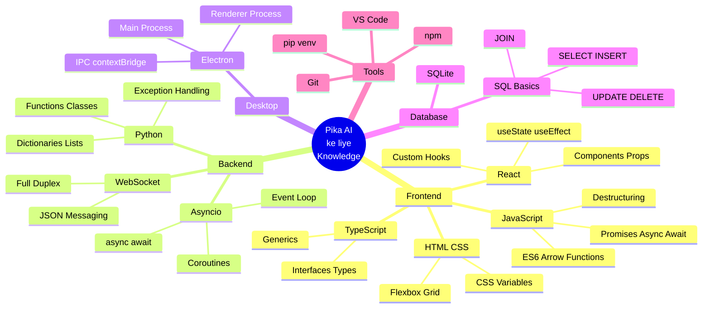
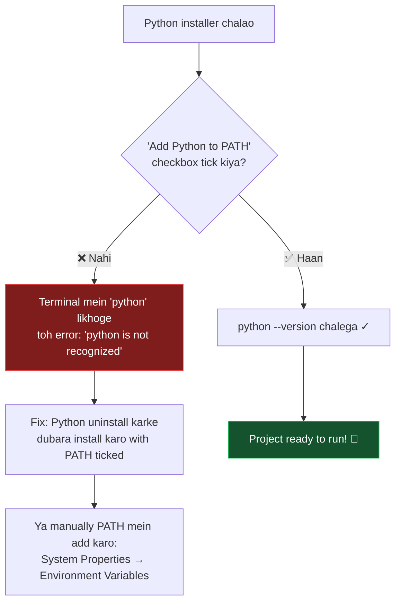
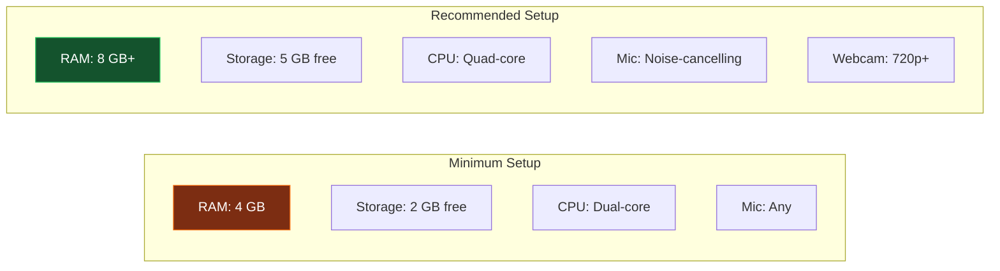

[⬅️ Previous: Start Here](./00-START-HERE.md) | [🏠 Back to Master Index](./00-START-HERE.md) | [➡️ Next: Architecture](./02-ARCHITECTURE.md)

---

# 📋 01 — REQUIREMENTS (Prerequisites)

> Bhai, project chalane se pehle machine ready karni padegi. Yeh file batayegi
> **kya install karna hai** aur **kya concept pata hona chahiye**. Tension mat lo —
> har cheez ke liye free tutorial link diya hai. 🚀

---

## 🧠 Knowledge Mindmap — Kya Seekhna Padega?



---

## 💻 Software Installation Checklist

| # | Software | Minimum Version | Download Link | Zaroori? |
|---|----------|-----------------|---------------|----------|
| 1 | **Node.js** | 18.0+ (20 LTS recommended) | [nodejs.org](https://nodejs.org/en/download) | ✅ MUST |
| 2 | **Python** | 3.10+ | [python.org](https://www.python.org/downloads/) | ✅ MUST |
| 3 | **Git** | 2.30+ | [git-scm.com](https://git-scm.com/downloads) | ✅ MUST |
| 4 | **VS Code** | Latest | [code.visualstudio.com](https://code.visualstudio.com/) | 🟡 Recommended |
| 5 | **Tesseract OCR** | 5.0+ | [UB-Mannheim build](https://github.com/UB-Mannheim/tesseract/wiki) | 🔵 Optional (OCR feature) |
| 6 | **DB Browser for SQLite** | Latest | [sqlitebrowser.org](https://sqlitebrowser.org/dl/) | 🔵 Optional (DB dekhne ke liye) |

### ⚠️ Sabse Common Galti — Python PATH

Windows par Python install karte waqt **"Add Python to PATH"** checkbox tick karna **MUST** hai!



---

## ✅ Installation Verify Karo

Terminal (CMD / PowerShell / Bash) kholo aur ek-ek karke chalao:

```bash
node --version      # Expected: v20.x.x ya v18.x.x
npm --version       # Expected: 10.x.x
python --version    # Expected: Python 3.10.x ya upar
pip --version       # Expected: pip 23.x
git --version       # Expected: git version 2.x
```

**Agar koi command "not recognized" bole:**
- Windows: Software reinstall karo with "Add to PATH" ticked
- Mac: `brew install node python git`
- Linux: `sudo apt install nodejs npm python3 python3-pip git`

---

## 📦 Project Dependencies

### Frontend (npm) — `package.json`
| Package | Kaam kya hai? |
|---------|---------------|
| `react`, `react-dom` | UI library |
| `typescript` | Type safety |
| `vite` | Super-fast build tool |
| `tailwindcss` | Utility CSS |
| `zustand` | Global state management |
| `framer-motion` | Animations |
| `lucide-react` | Icons |
| `recharts` | Live charts |
| `electron` | Desktop shell |
| `electron-builder` | .exe / .dmg packaging |

### Backend (pip) — `requirements.txt`
| Package | Kaam kya hai? |
|---------|---------------|
| `websockets` | WebSocket server (**MUST**) |
| `vosk` | Offline speech-to-text |
| `edge-tts` | Neural text-to-speech |
| `pyttsx3` | Offline TTS fallback |
| `psutil` | CPU/RAM/Disk/Battery info |
| `pyautogui` | Keyboard/mouse automation |
| `pyperclip` | Clipboard access |
| `requests` | HTTP calls (LLM APIs) |
| `python-dotenv` | .env file loading |
| `pywin32` | Windows COM (pyttsx3 ke liye) |

---

## 🔑 Concept Prerequisites — Learning Links

### 1️⃣ JavaScript / TypeScript Fundamentals
| Concept | Free Resource |
|---------|---------------|
| JS Basics (Hindi) | [CodeWithHarry JS Playlist](https://www.youtube.com/playlist?list=PLu0W_9lII9ah7DDtYtflgwMwpT3xmjXY9) |
| Async/Await | [JavaScript.info Async](https://javascript.info/async-await) |
| TypeScript Handbook | [typescriptlang.org](https://www.typescriptlang.org/docs/handbook/intro.html) |
| TS in 100 seconds | [Fireship YouTube](https://www.youtube.com/watch?v=zQnBQ4tB3ZA) |
| ES6 Features | [W3Schools ES6](https://www.w3schools.com/js/js_es6.asp) |

### 2️⃣ React
| Concept | Free Resource |
|---------|---------------|
| Official Tutorial | [react.dev/learn](https://react.dev/learn) |
| React (Hindi) | [Apna College React](https://www.youtube.com/watch?v=SqcY0GlETPk) |
| Hooks Deep Dive | [react.dev/reference/react](https://react.dev/reference/react) |
| React Patterns | [patterns.dev](https://www.patterns.dev/react) |

### 3️⃣ Python
| Concept | Free Resource |
|---------|---------------|
| Python (Hindi) | [CodeWithHarry Python](https://www.youtube.com/playlist?list=PLu0W_9lII9agICnT8t4iYVSZ3eykIAOME) |
| Official Tutorial | [docs.python.org/3/tutorial](https://docs.python.org/3/tutorial/) |
| Asyncio Guide | [realpython.com/async-io-python](https://realpython.com/async-io-python/) |
| GeeksForGeeks Python | [geeksforgeeks.org/python-programming-language](https://www.geeksforgeeks.org/python-programming-language/) |

### 4️⃣ Electron
| Concept | Free Resource |
|---------|---------------|
| Official Docs | [electronjs.org/docs/latest](https://www.electronjs.org/docs/latest/) |
| Security Checklist | [electronjs.org/docs/latest/tutorial/security](https://www.electronjs.org/docs/latest/tutorial/security) |
| Electron Course | [Traversy Media](https://www.youtube.com/watch?v=kN1Czs0m1SU) |

### 5️⃣ Databases
| Concept | Free Resource |
|---------|---------------|
| SQL Basics | [W3Schools SQL](https://www.w3schools.com/sql/) |
| SQLite Tutorial | [sqlitetutorial.net](https://www.sqlitetutorial.net/) |
| SQL (Hindi) | [CodeWithHarry SQL](https://www.youtube.com/watch?v=hlGoQC332VM) |
| GFG DBMS | [geeksforgeeks.org/dbms](https://www.geeksforgeeks.org/dbms/) |

---

## 🖥️ Hardware Requirements



| Component | Minimum | Recommended | Kyun? |
|-----------|---------|-------------|-------|
| RAM | 4 GB | 8 GB+ | Electron + Python + Vosk model ek saath |
| Storage | 2 GB | 5 GB | Vosk model ~45 MB, node_modules ~500 MB |
| CPU | Dual-core | Quad-core | Real-time STT processing |
| Microphone | Koi bhi | Noise-cancelling | Better accent detection |
| Internet | Optional | Broadband | Sirf AI chat + weather ke liye |

> **Important:** Voice recognition **offline** chalti hai! Internet sirf LLM chat,
> weather aur crypto prices ke liye chahiye. Bina internet ke bhi 80% features kaam karenge.

---

## 🔐 Optional: Free API Keys

AI chat ke liye (bilkul FREE, credit card nahi chahiye):

| Provider | Free Limit | Signup Link |
|----------|-----------|-------------|
| **Groq** ⭐ | 30 requests/min | [console.groq.com](https://console.groq.com) |
| Google Gemini | 15 RPM | [aistudio.google.com](https://aistudio.google.com) |
| Cerebras | 100k tokens/day | [cloud.cerebras.ai](https://cloud.cerebras.ai) |
| Mistral | 1M tokens/day | [console.mistral.ai](https://console.mistral.ai) |
| OpenRouter | 20+ free models | [openrouter.ai](https://openrouter.ai) |

Key milne ke baad `.env` file banao:
```env
GROQ_API_KEY=gsk_your_key_here
GEMINI_API_KEY=your_key_here
```

Ya app ke **Settings → AI प्रोवाइडर** section mein directly paste kar do.

---

## 🎯 Pre-flight Checklist

Aage badhne se pehle yeh sab tick hona chahiye:

- [ ] Node.js installed aur `node --version` chal raha hai
- [ ] Python 3.10+ installed aur `python --version` chal raha hai
- [ ] Git installed
- [ ] VS Code (ya koi editor) installed
- [ ] Terminal/CMD use karna aata hai (`cd`, `ls`/`dir`)
- [ ] Basic JavaScript pata hai (variables, functions, arrays)
- [ ] Basic Python pata hai (def, dict, list, try/except)
- [ ] Microphone kaam kar raha hai
- [ ] 2 GB free disk space hai

Sab tick? **Perfect!** Ab [02-ARCHITECTURE.md](./02-ARCHITECTURE.md) padho. 🚀

---

[⬅️ Previous: Start Here](./00-START-HERE.md) | [🏠 Back to Master Index](./00-START-HERE.md) | [➡️ Next: Architecture](./02-ARCHITECTURE.md)
