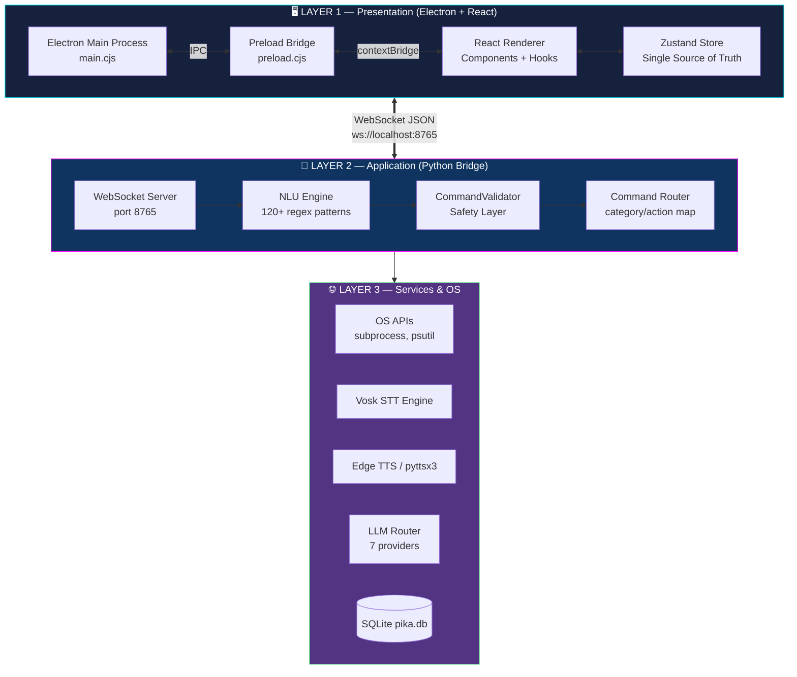
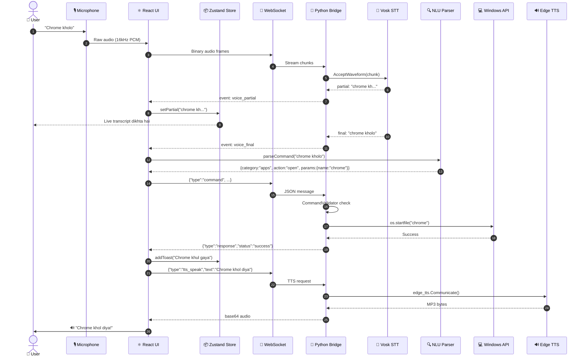
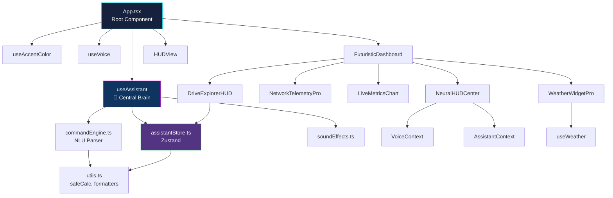
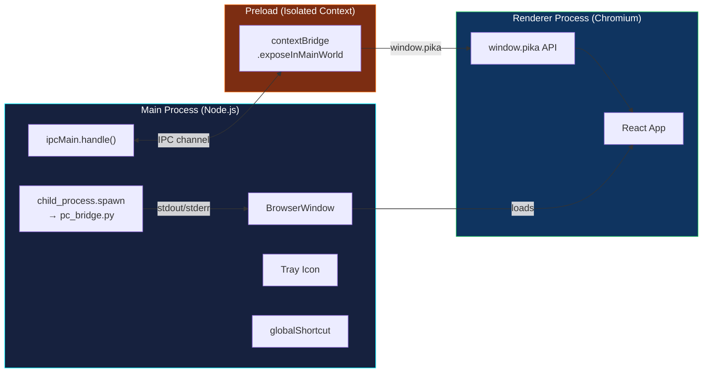

[⬅️ Previous: Requirements](./01-REQUIREMENTS.md) | [🏠 Back to Master Index](./00-START-HERE.md) | [➡️ Next: Database](./03-DATABASE.md)

---

# 🏗️ 02 — SYSTEM ARCHITECTURE

> Yeh file project ka **blueprint** hai. Viva mein examiner sabse pehle yahi poochta hai:
> *"Beta, apne project ka architecture samjhao."* Yahan se seedha copy karke bol dena! 😎

---

## 🎯 High-Level: 3-Layer Architecture

Pika AI **3 alag-alag layers** mein bata hua hai. Har layer ka apna kaam hai aur
ek layer doosri se **loosely coupled** hai (matlab ek badlo toh doosri nahi tootegi).



### Layer Responsibilities Table

| Layer | Technology | Responsibility | Kya NAHI karta |
|-------|-----------|----------------|----------------|
| **L1 Presentation** | Electron + React + TS | UI rendering, user input, state | OS ko directly touch nahi karta |
| **L2 Application** | Python asyncio | Command parsing, validation, routing | UI ke baare mein kuch nahi jaanta |
| **L3 Services** | OS APIs, AI models | Actual execution | Business logic nahi rakhta |

> **Viva line:** *"Yeh **Separation of Concerns** principle follow karta hai. UI ko nahi
> pata ki file kaise delete hoti hai, aur Python ko nahi pata ki button kaunse color ka hai.
> Isse code maintainable aur testable ban jaata hai."*

---

## 🔄 Complete Request-Response Data Pipeline

Jab aap bolte ho **"chrome kholo"**, toh andar kya-kya hota hai:



**Total latency:** ~800ms (STT 300ms + parse 5ms + exec 200ms + TTS 300ms)

---

## 🧵 Threading & Concurrency Model

Yeh sabse important topic hai viva ke liye. **Python single-threaded hai, phir bhi
sab kuch parallel kaise chalta hai?** Answer: **asyncio event loop**.

```mermaid
flowchart TD
    subgraph "Python Process (Single Main Thread)"
        EL["🔄 asyncio Event Loop"]
        EL --> T1["Task: handle_client()<br/>WebSocket messages"]
        EL --> T2["Task: status_loop()<br/>Har 5 sec system stats"]
        EL --> T3["Task: llm_stream()<br/>LLM chunks yield"]
        EL --> T4["Task: reminder timers"]
    end

    subgraph "Worker Threads (ThreadPoolExecutor)"
        W1["Thread: requests.post()<br/>LLM API blocking call"]
        W2["Thread: pyttsx3 TTS<br/>Blocking audio gen"]
        W3["Thread: Vosk model download"]
    end

    T3 -.run_in_executor.-> W1
    EL -.asyncio.to_thread.-> W2
    EL -.threading.Thread.-> W3

    W1 -.call_soon_threadsafe.-> EL
    W2 -.await result.-> EL

    style EL fill:#0f3460,stroke:#00f0ff,color:#fff
    style W1 fill:#7c2d12,stroke:#f97316,color:#fff
```

### Concurrency Rules (Yaad rakho!)

| Rule | Explanation |
|------|-------------|
| ❌ **Never block the event loop** | `time.sleep()` mat use karo, `await asyncio.sleep()` karo |
| ✅ **Blocking I/O → executor** | `requests.post()` jaise blocking calls ko `run_in_executor` mein daalo |
| ✅ **Thread → loop communication** | `loop.call_soon_threadsafe()` use karo |
| ✅ **Shared state → Lock** | `_reminders_lock = threading.Lock()` |
| ✅ **UI thread safety** | React state sirf main thread se update, WebSocket callbacks bhi wahi |

**Real code example (`pc_bridge.py` se):**

```python
# ❌ GALAT — event loop block ho jayega, poora app freeze
def bad_llm_call():
    resp = requests.post(url, json=payload)  # 30 seconds block!
    return resp.json()

# ✅ SAHI — worker thread mein bhejo, loop free rahega
async def good_llm_call():
    loop = asyncio.get_event_loop()
    q = asyncio.Queue()

    def worker():
        resp = requests.post(url, json=payload, stream=True)
        for line in resp.iter_lines():
            loop.call_soon_threadsafe(q.put_nowait, line)  # thread-safe!

    loop.run_in_executor(None, worker)
    while True:
        item = await q.get()  # non-blocking wait
        if item is None: break
        yield item
```

---

## 📦 Module Dependency Graph

Kaun sa module kis par depend karta hai:



### Dependency Rules
1. **Components → Hooks → Store** (kabhi ulta nahi)
2. **Store kisi component ko import nahi karta** (circular dependency avoid)
3. **`lib/` folder pure functions** — koi React import nahi
4. **Contexts sirf providers ke through** — direct import nahi

---

## 🔌 Electron Process Architecture



### Security Model (Bahut important!)

| Setting | Value | Kyun? |
|---------|-------|-------|
| `contextIsolation` | `true` ✅ | Renderer aur preload ka separate JS context |
| `nodeIntegration` | `false` ✅ | Renderer ko `require()` nahi milta |
| `sandbox` | `false` | Preload ko limited Node API chahiye |
| `webSecurity` | `true` ✅ | CORS + same-origin enforce |

> **Viva line:** *"Agar `nodeIntegration: true` kar dete toh koi bhi XSS attack
> `require('child_process').exec('rm -rf /')` chala sakta tha. contextBridge se hum
> sirf 15 specific functions expose karte hain — aur kuch nahi."*

---

## 🎨 Design Principles Applied

| Principle | Kahan use hua? |
|-----------|----------------|
| **Separation of Concerns** | 3-layer architecture |
| **Single Responsibility** | Har component ka ek hi kaam |
| **DRY (Don't Repeat Yourself)** | `HudCard`, `GlassCard`, `GlowButton` reusable |
| **Graceful Degradation** | `desktop.ts` browser mein no-op ban jaata hai |
| **Fail-Safe Defaults** | Bridge down → demo mode, LLM fail → local fallback |
| **Defense in Depth** | Validator + blocked paths + confirmation dialog |
| **Loose Coupling** | WebSocket JSON contract — dono side independent |

---

## 📊 Performance Characteristics

| Operation | Latency | Bottleneck |
|-----------|---------|------------|
| UI render (60fps) | 16ms | GPU compositing |
| WebSocket round-trip | 2-8ms | Localhost network |
| Vosk STT (partial) | 80-150ms | CPU inference |
| Vosk STT (final) | 200-400ms | CPU inference |
| Command parse (regex) | <1ms | Negligible |
| OS command exec | 50-500ms | Windows API |
| Edge TTS generation | 300-800ms | Network + Microsoft API |
| LLM first token | 200-1500ms | Provider API |
| System status push | Every 5s | psutil sampling |

---

## 🔗 Related Reading

- Database schema → [03-DATABASE.md](./03-DATABASE.md)
- WebSocket protocol details → [04-API-FLOW.md](./04-API-FLOW.md)
- Folder-by-folder breakdown → [05-FOLDER-STRUCTURE.md](./05-FOLDER-STRUCTURE.md)
- Design patterns UML → [06-ARCH-PATTERNS.md](./06-ARCH-PATTERNS.md)

**External learning:**
- [Software Architecture Patterns (free O'Reilly)](https://www.oreilly.com/library/view/software-architecture-patterns/9781491971437/)
- [Electron Process Model](https://www.electronjs.org/docs/latest/tutorial/process-model)
- [Python Asyncio Docs](https://docs.python.org/3/library/asyncio.html)
- [GeeksForGeeks Software Architecture](https://www.geeksforgeeks.org/software-architecture-patterns/)

---

[⬅️ Previous: Requirements](./01-REQUIREMENTS.md) | [🏠 Back to Master Index](./00-START-HERE.md) | [➡️ Next: Database](./03-DATABASE.md)
