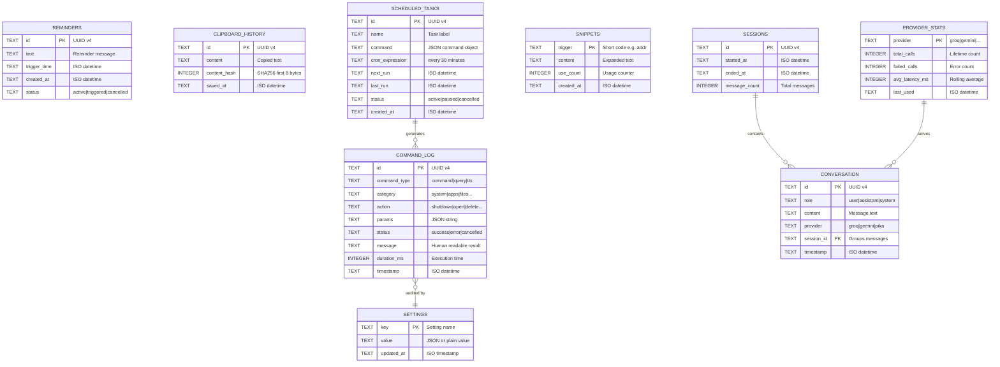
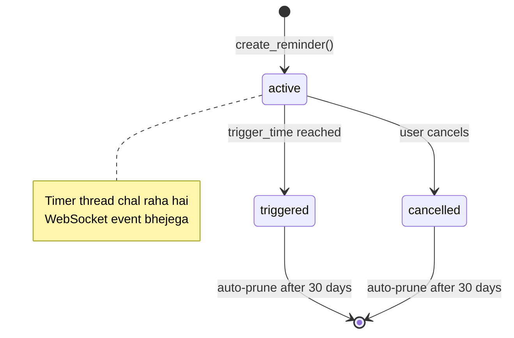
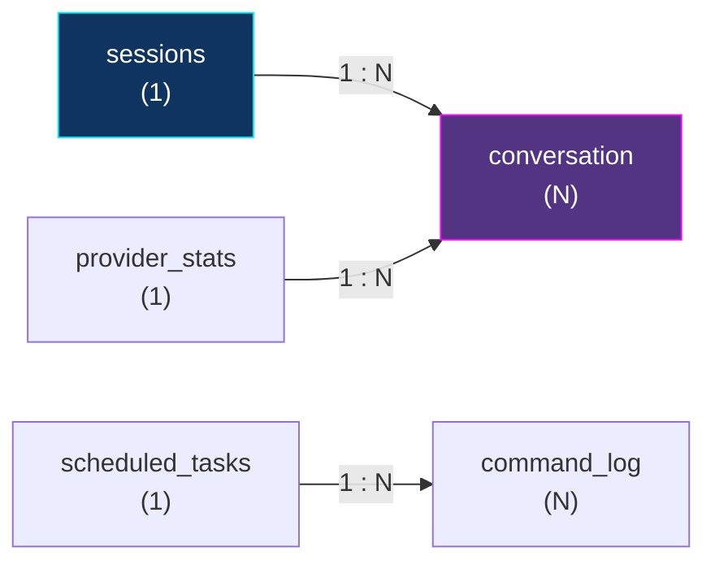
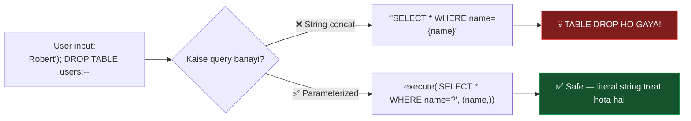

[⬅️ Previous: Architecture](./02-ARCHITECTURE.md) | [🏠 Back to Master Index](./00-START-HERE.md) | [➡️ Next: API Flow](./04-API-FLOW.md)

---

# 🗄️ 03 — DATABASE DESIGN & ERD

> Pika **SQLite** use karta hai — zero configuration, ek single file `data/pika.db`.
> Server install karne ki zaroorat nahi, MySQL/Postgres ka jhanjhat nahi. Perfect for
> desktop apps! 🎯

---

## 🧩 Complete Entity-Relationship Diagram



---

## 📋 Table-by-Table Breakdown

### 1️⃣ `settings` — Key-Value Config Store

```sql
CREATE TABLE IF NOT EXISTS settings (
    key         TEXT PRIMARY KEY NOT NULL,
    value       TEXT NOT NULL,
    updated_at  TEXT NOT NULL DEFAULT (datetime('now'))
);
```

| Column | Type | Constraint | Purpose |
|--------|------|-----------|---------|
| `key` | TEXT | PRIMARY KEY | Setting ka naam (`accent_color`, `tts_voice`) |
| `value` | TEXT | NOT NULL | Value ya JSON string |
| `updated_at` | TEXT | DEFAULT now | Last modification |

**Sample data:**
| key | value |
|-----|-------|
| `accent_color` | `#00f0ff` |
| `tts_voice` | `hi-IN-SwaraNeural` |
| `ai_provider` | `groq` |
| `wake_word_enabled` | `1` |

> **Kyun key-value?** Kyunki settings dynamic hain — naya setting add karne ke liye
> `ALTER TABLE` nahi karna padta, bas nayi row insert karo. **Schema-less flexibility!**

---

### 2️⃣ `reminders` — Timers aur Reminders

```sql
CREATE TABLE IF NOT EXISTS reminders (
    id            TEXT PRIMARY KEY NOT NULL,
    text          TEXT NOT NULL,
    trigger_time  TEXT NOT NULL,
    created_at    TEXT NOT NULL DEFAULT (datetime('now')),
    status        TEXT NOT NULL DEFAULT 'active'
                  CHECK(status IN ('active','triggered','cancelled'))
);

CREATE INDEX IF NOT EXISTS idx_reminders_status_time
    ON reminders(status, trigger_time);
```

> **Index kyun?** Har second hum query karte hain: *"kaun se active reminders ka time
> aa gaya?"* — Bina index ke poora table scan hota (O(n)). Index se B-tree lookup
> hota hai (O(log n)). 1000 reminders par 100x faster! ⚡

**State machine:**



---

### 3️⃣ `command_log` — Audit Trail

```sql
CREATE TABLE IF NOT EXISTS command_log (
    id            TEXT PRIMARY KEY NOT NULL,
    command_type  TEXT NOT NULL,
    category      TEXT,
    action        TEXT,
    params        TEXT,
    status        TEXT NOT NULL CHECK(status IN ('success','error','cancelled')),
    message       TEXT,
    duration_ms   INTEGER DEFAULT 0,
    timestamp     TEXT NOT NULL DEFAULT (datetime('now'))
);

CREATE INDEX IF NOT EXISTS idx_cmdlog_time ON command_log(timestamp DESC);
CREATE INDEX IF NOT EXISTS idx_cmdlog_cat  ON command_log(category, action);
```

**Kyun zaroori hai?**
- 🔍 **Debugging** — kaunsi command fail hui?
- 📊 **Analytics** — sabse zyada kaunsa command use hota hai?
- 🔐 **Security audit** — kisne shutdown kiya, kab?

**Useful queries:**
```sql
-- Top 10 most-used commands
SELECT category, action, COUNT(*) AS uses
FROM command_log
WHERE status = 'success'
GROUP BY category, action
ORDER BY uses DESC
LIMIT 10;

-- Average execution time per category
SELECT category, ROUND(AVG(duration_ms), 1) AS avg_ms, COUNT(*) AS n
FROM command_log
GROUP BY category
ORDER BY avg_ms DESC;

-- Error rate
SELECT
    ROUND(100.0 * SUM(CASE WHEN status='error' THEN 1 ELSE 0 END) / COUNT(*), 2)
    AS error_percent
FROM command_log;
```

---

### 4️⃣ `snippets` — Text Expander

```sql
CREATE TABLE IF NOT EXISTS snippets (
    trigger     TEXT PRIMARY KEY NOT NULL,
    content     TEXT NOT NULL,
    use_count   INTEGER NOT NULL DEFAULT 0,
    created_at  TEXT NOT NULL DEFAULT (datetime('now'))
);
```

`trigger` khud hi PRIMARY KEY hai — duplicate trigger allowed nahi. Smart! ✅

---

### 5️⃣ `conversation` + `sessions` — Chat History

```sql
CREATE TABLE IF NOT EXISTS sessions (
    id             TEXT PRIMARY KEY NOT NULL,
    started_at     TEXT NOT NULL DEFAULT (datetime('now')),
    ended_at       TEXT,
    message_count  INTEGER NOT NULL DEFAULT 0
);

CREATE TABLE IF NOT EXISTS conversation (
    id          TEXT PRIMARY KEY NOT NULL,
    role        TEXT NOT NULL CHECK(role IN ('user','assistant','system')),
    content     TEXT NOT NULL,
    provider    TEXT,
    session_id  TEXT NOT NULL,
    timestamp   TEXT NOT NULL DEFAULT (datetime('now')),
    FOREIGN KEY (session_id) REFERENCES sessions(id) ON DELETE CASCADE
);

CREATE INDEX IF NOT EXISTS idx_conv_session ON conversation(session_id, timestamp);
```

> **`ON DELETE CASCADE` ka matlab:** Agar session delete karo, uske saare messages
> automatically delete ho jayenge. **Orphan records** nahi bachenge. Yeh
> **Referential Integrity** kehlaata hai.

⚠️ **SQLite gotcha:** Foreign keys **default OFF** hote hain! Enable karna padta hai:
```python
conn.execute("PRAGMA foreign_keys = ON")
```

---

## 🔗 Relationship Diagram



| Relationship | Type | Explanation |
|--------------|------|-------------|
| sessions → conversation | **1 : N** | Ek session mein bohot saare messages |
| scheduled_tasks → command_log | **1 : N** | Ek task baar-baar chalta hai, har run log hota hai |
| provider_stats → conversation | **1 : N** | Ek provider bohot messages serve karta hai |

---

## 🐍 Python Database Class (Complete Implementation)

```python
import sqlite3
import json
import uuid
from pathlib import Path
from datetime import datetime, timedelta
from contextlib import contextmanager
import threading


class Database:
    """
    Thread-safe SQLite wrapper with connection pooling (Singleton pattern).
    Har method try/finally ke andar hai — resource leak nahi hoga.
    """

    _instance = None
    _lock = threading.Lock()

    def __new__(cls, db_path: str = "./data/pika.db"):
        # Singleton — poore app mein sirf EK instance
        with cls._lock:
            if cls._instance is None:
                cls._instance = super().__new__(cls)
                cls._instance._initialized = False
            return cls._instance

    def __init__(self, db_path: str = "./data/pika.db"):
        if self._initialized:
            return
        self.db_path = Path(db_path)
        self.db_path.parent.mkdir(parents=True, exist_ok=True)
        self._local = threading.local()
        self._init_tables()
        self._initialized = True

    def _get_conn(self) -> sqlite3.Connection:
        """Har thread ko apna connection — SQLite thread-safe nahi hai by default."""
        if not hasattr(self._local, "conn"):
            self._local.conn = sqlite3.connect(
                str(self.db_path), check_same_thread=False, timeout=10.0
            )
            self._local.conn.row_factory = sqlite3.Row  # dict-like access
            self._local.conn.execute("PRAGMA foreign_keys = ON")
            self._local.conn.execute("PRAGMA journal_mode = WAL")  # better concurrency
        return self._local.conn

    @contextmanager
    def transaction(self):
        """
        Auto commit/rollback context manager.
        Usage:
            with db.transaction() as cur:
                cur.execute("INSERT ...")
        Agar exception aaya toh automatic rollback ho jayega.
        """
        conn = self._get_conn()
        cur = conn.cursor()
        try:
            yield cur
            conn.commit()
        except Exception:
            conn.rollback()
            raise
        finally:
            cur.close()

    def _init_tables(self) -> None:
        schema = """
        CREATE TABLE IF NOT EXISTS settings (
            key TEXT PRIMARY KEY NOT NULL,
            value TEXT NOT NULL,
            updated_at TEXT NOT NULL DEFAULT (datetime('now'))
        );
        CREATE TABLE IF NOT EXISTS reminders (
            id TEXT PRIMARY KEY NOT NULL,
            text TEXT NOT NULL,
            trigger_time TEXT NOT NULL,
            created_at TEXT NOT NULL DEFAULT (datetime('now')),
            status TEXT NOT NULL DEFAULT 'active'
                CHECK(status IN ('active','triggered','cancelled'))
        );
        CREATE INDEX IF NOT EXISTS idx_reminders_status_time
            ON reminders(status, trigger_time);
        CREATE TABLE IF NOT EXISTS clipboard_history (
            id TEXT PRIMARY KEY NOT NULL,
            content TEXT NOT NULL,
            content_hash INTEGER,
            saved_at TEXT NOT NULL DEFAULT (datetime('now'))
        );
        CREATE TABLE IF NOT EXISTS command_log (
            id TEXT PRIMARY KEY NOT NULL,
            command_type TEXT NOT NULL,
            category TEXT, action TEXT, params TEXT,
            status TEXT NOT NULL CHECK(status IN ('success','error','cancelled')),
            message TEXT, duration_ms INTEGER DEFAULT 0,
            timestamp TEXT NOT NULL DEFAULT (datetime('now'))
        );
        CREATE INDEX IF NOT EXISTS idx_cmdlog_time ON command_log(timestamp DESC);
        CREATE INDEX IF NOT EXISTS idx_cmdlog_cat ON command_log(category, action);
        CREATE TABLE IF NOT EXISTS scheduled_tasks (
            id TEXT PRIMARY KEY NOT NULL, name TEXT NOT NULL,
            command TEXT NOT NULL, cron_expression TEXT NOT NULL,
            next_run TEXT, last_run TEXT,
            status TEXT NOT NULL DEFAULT 'active',
            created_at TEXT NOT NULL DEFAULT (datetime('now'))
        );
        CREATE TABLE IF NOT EXISTS snippets (
            trigger TEXT PRIMARY KEY NOT NULL,
            content TEXT NOT NULL,
            use_count INTEGER NOT NULL DEFAULT 0,
            created_at TEXT NOT NULL DEFAULT (datetime('now'))
        );
        CREATE TABLE IF NOT EXISTS sessions (
            id TEXT PRIMARY KEY NOT NULL,
            started_at TEXT NOT NULL DEFAULT (datetime('now')),
            ended_at TEXT, message_count INTEGER NOT NULL DEFAULT 0
        );
        CREATE TABLE IF NOT EXISTS conversation (
            id TEXT PRIMARY KEY NOT NULL,
            role TEXT NOT NULL CHECK(role IN ('user','assistant','system')),
            content TEXT NOT NULL, provider TEXT,
            session_id TEXT NOT NULL,
            timestamp TEXT NOT NULL DEFAULT (datetime('now')),
            FOREIGN KEY (session_id) REFERENCES sessions(id) ON DELETE CASCADE
        );
        CREATE INDEX IF NOT EXISTS idx_conv_session ON conversation(session_id, timestamp);
        CREATE TABLE IF NOT EXISTS provider_stats (
            provider TEXT PRIMARY KEY NOT NULL,
            total_calls INTEGER NOT NULL DEFAULT 0,
            failed_calls INTEGER NOT NULL DEFAULT 0,
            avg_latency_ms INTEGER NOT NULL DEFAULT 0,
            last_used TEXT
        );
        """
        conn = self._get_conn()
        try:
            conn.executescript(schema)
            conn.commit()
        except sqlite3.Error as e:
            print(f"[db] Schema init failed: {e}")
            raise

    # ─── Settings CRUD ────────────────────────────────────────────────
    def set_setting(self, key: str, value) -> None:
        val = json.dumps(value) if not isinstance(value, str) else value
        with self.transaction() as cur:
            cur.execute(
                """INSERT INTO settings(key, value, updated_at)
                   VALUES(?, ?, datetime('now'))
                   ON CONFLICT(key) DO UPDATE SET
                     value = excluded.value, updated_at = excluded.updated_at""",
                (key, val),
            )

    def get_setting(self, key: str, default=None):
        conn = self._get_conn()
        row = conn.execute("SELECT value FROM settings WHERE key = ?", (key,)).fetchone()
        return row["value"] if row else default

    # ─── Reminders CRUD ───────────────────────────────────────────────
    def add_reminder(self, text: str, trigger_time: datetime) -> str:
        rid = str(uuid.uuid4())
        with self.transaction() as cur:
            cur.execute(
                "INSERT INTO reminders(id, text, trigger_time) VALUES(?, ?, ?)",
                (rid, text, trigger_time.isoformat()),
            )
        return rid

    def get_active_reminders(self) -> list[dict]:
        conn = self._get_conn()
        rows = conn.execute(
            "SELECT * FROM reminders WHERE status = 'active' ORDER BY trigger_time ASC"
        ).fetchall()
        return [dict(r) for r in rows]

    def update_reminder_status(self, rid: str, status: str) -> None:
        with self.transaction() as cur:
            cur.execute("UPDATE reminders SET status = ? WHERE id = ?", (status, rid))

    # ─── Command Log ──────────────────────────────────────────────────
    def log_command(self, cmd_type, category, action, params,
                    status, message, duration_ms=0) -> None:
        with self.transaction() as cur:
            cur.execute(
                """INSERT INTO command_log
                   (id, command_type, category, action, params, status, message, duration_ms)
                   VALUES(?, ?, ?, ?, ?, ?, ?, ?)""",
                (str(uuid.uuid4()), cmd_type, category, action,
                 json.dumps(params or {}), status, message, duration_ms),
            )

    def get_command_stats(self) -> list[dict]:
        conn = self._get_conn()
        rows = conn.execute(
            """SELECT category, action, COUNT(*) AS uses,
                      ROUND(AVG(duration_ms),1) AS avg_ms
               FROM command_log WHERE status='success'
               GROUP BY category, action ORDER BY uses DESC LIMIT 20"""
        ).fetchall()
        return [dict(r) for r in rows]

    # ─── Maintenance ──────────────────────────────────────────────────
    def auto_prune(self, days: int = 30) -> int:
        """30 din se purane records delete — DB chhota rehta hai."""
        cutoff = (datetime.now() - timedelta(days=days)).isoformat()
        total = 0
        with self.transaction() as cur:
            for table, col in [("command_log", "timestamp"),
                               ("clipboard_history", "saved_at"),
                               ("conversation", "timestamp")]:
                cur.execute(f"DELETE FROM {table} WHERE {col} < ?", (cutoff,))
                total += cur.rowcount
        self._get_conn().execute("VACUUM")  # reclaim disk space
        return total

    def close(self) -> None:
        if hasattr(self._local, "conn"):
            self._local.conn.close()
            del self._local.conn
```

---

## 🛡️ SQL Injection Prevention



**Golden Rule:** Kabhi bhi f-string ya `+` se SQL mat banao. Hamesha `?` placeholder use karo.

```python
# ❌ NEVER DO THIS
cur.execute(f"SELECT * FROM users WHERE name = '{user_input}'")

# ✅ ALWAYS DO THIS
cur.execute("SELECT * FROM users WHERE name = ?", (user_input,))
```

---

## 📊 Normalization Level

| Normal Form | Status | Explanation |
|-------------|--------|-------------|
| **1NF** | ✅ | Har cell mein atomic value, koi repeating group nahi |
| **2NF** | ✅ | Sab non-key columns fully dependent on PK |
| **3NF** | ✅ | Koi transitive dependency nahi |
| **BCNF** | ✅ | Har determinant ek candidate key hai |

**Denormalization kahan kiya?**
`provider_stats.avg_latency_ms` — yeh derived value hai (calculate ho sakta hai
`command_log` se), par har baar `AVG()` chalane se slow hoga. Isliye pre-computed
rakha hai. Yeh **intentional denormalization for performance** hai.

---

## 🔗 Related Reading
- SQL practice exercises → [21-DATA-PRACTICE-LAB.md](./21-DATA-PRACTICE-LAB.md)
- Database tutorial for beginners → [12-DATABASE-BASICS.md](./12-DATABASE-BASICS.md)
- Backup & restore scripts → [20-SECURITY-OPERATIONS.md](./20-SECURITY-OPERATIONS.md)

**External:**
- [SQLite Official Docs](https://www.sqlite.org/docs.html)
- [SQLite Tutorial](https://www.sqlitetutorial.net/)
- [W3Schools SQL](https://www.w3schools.com/sql/)
- [GFG Normalization](https://www.geeksforgeeks.org/normal-forms-in-dbms/)
- [Python sqlite3 module](https://docs.python.org/3/library/sqlite3.html)

---

[⬅️ Previous: Architecture](./02-ARCHITECTURE.md) | [🏠 Back to Master Index](./00-START-HERE.md) | [➡️ Next: API Flow](./04-API-FLOW.md)
