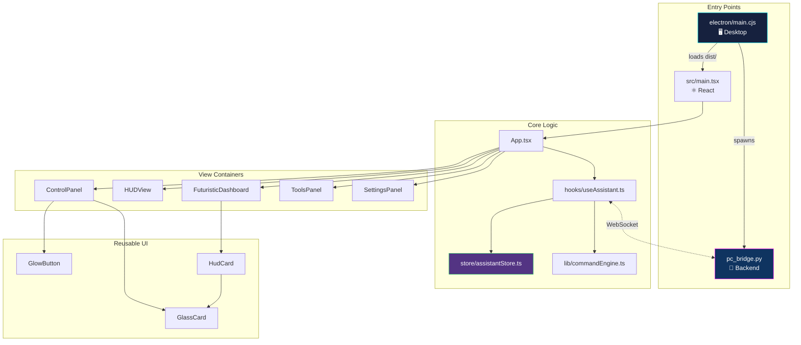
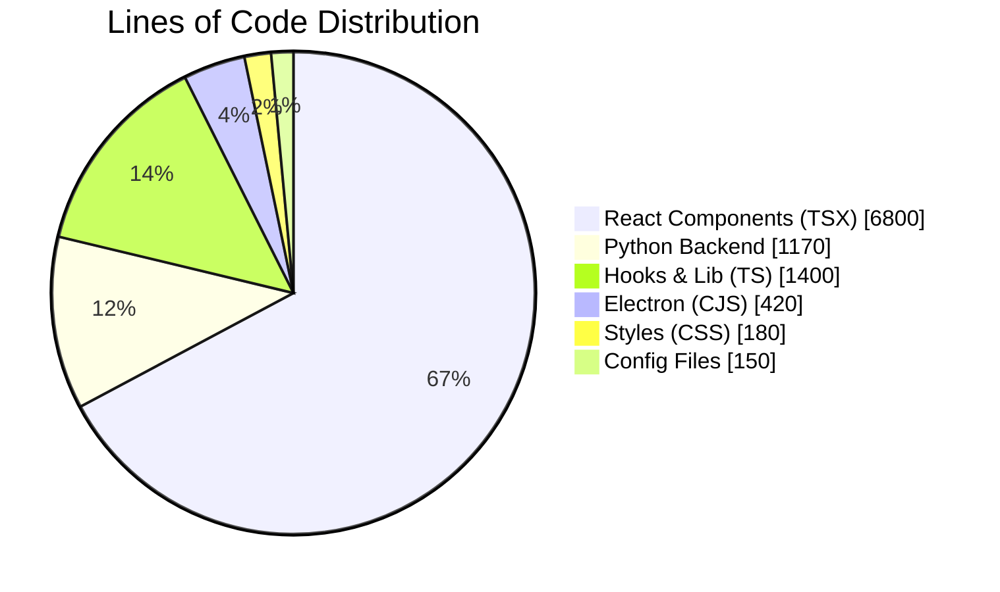

[⬅️ Previous: API Flow](./04-API-FLOW.md) | [🏠 Back to Master Index](./00-START-HERE.md) | [➡️ Next: Design Patterns](./06-ARCH-PATTERNS.md)

---

# 📁 05 — FOLDER STRUCTURE & FILE ROLES

> Project ka har folder aur file kya karti hai — yeh file uska **complete map** hai.
> Viva mein examiner poochh sakta hai: *"Yeh file kahan hai aur kya karti hai?"*
> Yahan sab likha hai! 🗺️

---

## 🌳 Complete Directory Tree

```
pika-ai/
│
├── 📄 package.json               # npm dependencies + scripts
├── 📄 vite.config.ts             # Vite build config (host: 0.0.0.0 for mobile)
├── 📄 tsconfig.json              # TypeScript compiler options
├── 📄 index.html                 # HTML entry point (Vite injects React here)
├── 📄 electron-builder.yml       # .exe / .dmg packaging config
├── 📄 requirements.txt           # Python pip dependencies
├── 📄 .env.example               # API keys template (copy to .env)
├── 📄 start.bat                  # Windows one-click launcher (venv aware)
├── 📄 start.py                   # Cross-platform Python launcher
├── 📄 start.sh                   # Linux/Mac shell launcher
├── 📄 pc_bridge.py               # 🐍 ENTIRE Python backend (1100+ lines)
├── 📄 test_bridge.py             # Backend health-check test script
├── 📄 showcase.html              # Standalone GitHub Pages landing page
├── 📄 README.md                  # Project overview
│
├── 📁 electron/                  # 🖥️ Desktop shell
│   ├── main.cjs                  #   Main process: window, tray, IPC, spawn Python
│   └── preload.cjs               #   Security bridge: contextBridge API
│
├── 📁 docs/                      # 📚 This documentation suite (25 files)
│   ├── 00-START-HERE.md
│   ├── 01-REQUIREMENTS.md
│   └── ... (23 more)
│
├── 📁 data/                      # 🗄️ Runtime persistent data (auto-created)
│   ├── pika.db                   #   SQLite database
│   ├── conversation_history.json #   Chat backup
│   └── command_log.json          #   Audit trail backup
│
├── 📁 models/                    # 🎙️ Vosk STT models (auto-downloaded ~45MB)
│   └── hi/                       #   Hindi small model
│
├── 📁 screenshots/               # 📸 Saved screenshots (auto-created)
├── 📁 venv/                      # 🐍 Python virtual environment (auto-created)
├── 📁 node_modules/              # 📦 npm packages (auto-created)
├── 📁 dist/                      # 🏗️ Vite production build output
├── 📁 release/                   # 📦 electron-builder .exe output
│
└── 📁 src/                       # ⚛️ React frontend source
    │
    ├── 📄 main.tsx               # React entry: createRoot(...).render(<App/>)
    ├── 📄 App.tsx                # Root component: routing, providers, layout
    ├── 📄 index.css              # Global styles, CSS vars, keyframes, Tailwind
    │
    ├── 📁 types/
    │   └── index.ts              # ALL TypeScript interfaces (WSMessage, etc.)
    │
    ├── 📁 store/
    │   └── assistantStore.ts     # 🧠 Zustand global state (single source of truth)
    │
    ├── 📁 lib/                   # Pure logic — NO React imports
    │   ├── commandEngine.ts      #   NLU: 60+ regex → command objects
    │   ├── constants.ts          #   APP_LIST, WEBSITE_LIST, PROVIDERS
    │   ├── utils.ts              #   safeCalc, formatBytes, hexToRgb, etc.
    │   ├── soundEffects.ts       #   Web Audio API tone generator
    │   ├── apiHealth.ts          #   LLM provider ping/latency tester
    │   └── desktop.ts            #   Electron window.pika type-safe wrapper
    │
    ├── 📁 hooks/                 # Reusable React logic
    │   ├── useAssistant.ts       #   🧠 CENTRAL BRAIN: WebSocket + command routing
    │   ├── useVoice.ts           #   Mic capture + browser SpeechRecognition
    │   ├── useWeather.ts         #   Open-Meteo API + geolocation
    │   ├── useAccentColor.ts     #   Live theme → CSS variables
    │   ├── useLocalIP.ts         #   WebRTC-based LAN IP detection
    │   ├── useRealPiP.ts         #   Document Picture-in-Picture API
    │   ├── AssistantContext.tsx  #   Context provider for assistant API
    │   └── VoiceContext.tsx      #   Shared single SpeechRecognition instance
    │
    ├── 📁 utils/
    │   └── cn.ts                 # clsx + tailwind-merge class combiner
    │
    └── 📁 components/            # 40+ UI components
        │
        ├── ── Core Layout ──
        ├── App shell             (App.tsx handles)
        ├── Sidebar.tsx           #   Left nav (8 tabs, collapsible)
        ├── TopBar.tsx            #   Standard mode header
        ├── FuturistHeader.tsx    #   Futurist mode header
        ├── DesktopTitleBar.tsx   #   ⭐ Electron frameless title bar
        ├── StatusBar.tsx         #   Connection/provider/battery pills
        ├── Dashboard.tsx         #   Clock + mini CPU/RAM bars
        │
        ├── ── View Containers ──
        ├── HUDView.tsx           #   Standard mode 3-column HUD
        ├── FuturisticDashboard.tsx # ⭐ Futurist mode full dashboard
        ├── ControlPanel.tsx      #   10 sub-tabs of PC controls
        ├── ToolsPanel.tsx        #   9 sub-tabs of utilities
        ├── SettingsPanel.tsx     #   All settings + API keys
        │
        ├── ── HUD Widgets ──
        ├── NeuralHUDCenter.tsx   #   ⭐ Center orb: 4 rings + 8 nodes + radar
        ├── PikaOrb.tsx           #   Standard mode orb variant
        ├── NetworkTelemetryPro.tsx # Latency/download/upload + traffic bars
        ├── TelemetryPanel.tsx    #   Compact telemetry variant
        ├── LiveMetricsChart.tsx  #   Recharts CPU/RAM/Temp tabs
        ├── CoreMetricsPanel.tsx  #   Circular gauges + sparklines
        ├── SystemHealthPanel.tsx #   Hexagonal radar chart
        ├── DriveExplorerHUD.tsx  #   ⭐ Drive listing + usage bars
        ├── WebcamPanel.tsx       #   ⭐ Facial scan laser HUD
        ├── WeatherWidgetPro.tsx  #   Open-Meteo + 5-day forecast
        ├── WeatherHUD.tsx        #   Compact weather variant
        ├── ActiveRemindersHUD.tsx#   Live countdown + progress bars
        ├── RemindersHUD.tsx      #   Compact reminders variant
        ├── CryptoTickerHUD.tsx   #   ⭐ CoinGecko live prices
        ├── WorldClockHUD.tsx     #   ⭐ 5 timezone clocks
        ├── NASAExplorerHUD.tsx   #   ⭐ NASA APOD daily image
        │
        ├── ── Chat & Voice ──
        ├── TranscriptPanel.tsx   #   Chat log + Pika avatar + quick actions
        ├── ChatInterface.tsx     #   Standard chat view
        ├── ChatMessage.tsx       #   Single message bubble
        ├── MarkdownRenderer.tsx  #   Code blocks + bold/italic/links
        ├── VoiceButton.tsx       #   Mic with pulsing rings
        ├── VoiceWaveform.tsx     #   20-bar audio visualizer
        ├── PikaAvatar.tsx        #   Animated face (4 moods)
        │
        ├── ── Feature Panels ──
        ├── MacroEngine.tsx       #   Record/play/save macros
        ├── ReminderPanel.tsx     #   Full reminders manager
        ├── ProcessManager.tsx    #   Process table + kill
        ├── SchedulerPanel.tsx    #   Cron-like tasks
        │
        ├── ── Overlays ──
        ├── LivePiP.tsx           #   ⭐ Draggable + Document PiP monitor
        ├── PiPWindow.tsx         #   Legacy in-page PiP
        ├── ConfirmationDialog.tsx#   Destructive action modal
        ├── Toast.tsx             #   Notification system
        │
        ├── ── Backgrounds ──
        ├── AuroraBackground.tsx  #   Animated gradient + cyber grid + scanline
        ├── ParticleBackground.tsx#   40 floating CSS particles
        ├── NetworkNodes.tsx      #   Canvas neural network animation
        │
        └── ── Reusable Primitives ──
            ├── GlassCard.tsx     #   Glassmorphism container
            ├── GlowButton.tsx    #   4 variants with hover glow
            ├── HudCard.tsx       #   HUD panel with header + dot
            ├── PanelHeader.tsx   #   Icon + title + description
            ├── Toggle.tsx        #   Pill on/off switch
            ├── AccentPicker.tsx  #   ⭐ Dual-color theme picker
            ├── CircularGauge.tsx #   SVG animated ring gauge
            ├── RadarChart.tsx    #   SVG hexagonal spider chart
            ├── Sparkline.tsx     #   Minimal SVG line chart
            ├── AnimatedCounter.tsx#  Easing number counter
            ├── ScrambleText.tsx  #   Cyberpunk glyph scramble
            ├── Typewriter.tsx    #   Character-by-character reveal
            └── LoadingSpinner.tsx#   AI thinking animation
```

---

## 🗺️ Visual Dependency Map



---

## 📝 Key File Deep Dives

### `src/store/assistantStore.ts` — Zustand Global State

**Role:** Single source of truth. Poore app ki state yahan hai.

**Skeleton:**
```typescript
interface AssistantState {
  // Connection
  isConnected: boolean;
  connectionStatus: "disconnected" | "connecting" | "connected" | "error";
  demoMode: boolean;

  // Chat
  messages: ChatMessage[];
  isAiThinking: boolean;

  // Voice
  isListening: boolean;
  isSpeaking: boolean;
  partialTranscript: string;
  voiceWaveformData: number[];

  // System
  systemStatus: SystemStatus | null;
  drives: Drive[];
  activityLog: ActivityEntry[];

  // UI
  activeTab: TabName;
  uiMode: "standard" | "futurist";
  sidebarExpanded: boolean;

  // Settings
  settings: AppSettings;
  apiHealth: Record<string, ProviderHealth>;

  // Overlays
  toasts: Toast[];
  pendingConfirmation: PendingConfirmation | null;

  // ~30 action methods
  setConnection: (status) => void;
  addMessage: (msg) => string;
  appendToMessage: (id, chunk) => void;
  // ... etc
}
```

**Kyun Zustand?** Redux mein ek state update ke liye chahiye: action type +
action creator + reducer + dispatch + selector = 5 files. Zustand mein: `set({x: 1})`.
Bas. 🎯

---

### `src/hooks/useAssistant.ts` — The Brain 🧠

**Role:** WebSocket connection, message routing, command execution, demo fallback.

**Main functions:**
| Function | Kaam |
|----------|------|
| `connect()` | WebSocket kholta hai, exponential backoff reconnect |
| `handleMessage(raw)` | Incoming JSON parse karke store update |
| `processInput(text)` | User text → NLU parse → command ya LLM |
| `resolveConfirmation(bool)` | Confirm dialog ka jawab handle |
| `streamText(text)` | Demo mode mein word-by-word typing effect |
| `sendRaw(msg)` | Direct WebSocket message bhejna |

---

### `src/lib/commandEngine.ts` — NLU Parser

**Role:** Natural language → structured command. Regex-based, no ML needed.

```typescript
interface Rule {
  re: RegExp;                          // Pattern
  handle: (m: RegExpMatchArray) => CommandResult;
}

const RULES: Rule[] = [
  {
    re: /(?:open|kholo|खोलो)\s+(.+)/i,
    handle: (m) => cmd("apps", "open", { name: m[1].trim() },
                       `🚀 ${m[1]} खोल रहा हूँ।`)
  },
  // ... 60+ more rules
];

export function parseCommand(text: string): CommandResult {
  for (const rule of RULES) {
    const m = text.trim().match(rule.re);
    if (m) return rule.handle(m);
  }
  return { parsed: null, reply: "", isLLM: true };  // fallback to AI
}
```

> **Order matters!** Zyada specific patterns pehle honi chahiye. `"close chrome"`
> ki rule `"open ..."` se pehle honi chahiye warna galat match ho jayega.

---

### `pc_bridge.py` — Complete Backend

**Section-wise breakdown:**
| Lines | Section | Content |
|-------|---------|---------|
| 1-60 | Imports | Required + optional with graceful fallback |
| 60-130 | Constants | APP_MAP (40+), URL_MAP (25+), WAKE_WORDS |
| 130-200 | Helpers | `resolve_path`, `is_path_safe`, `ok()`, `err()` |
| 200-690 | Command handlers | `cmd_system`, `cmd_volume`, `cmd_files`... |
| 690-710 | ROUTES map | Dictionary dispatch table |
| 660-760 | LLM Router | 5 providers, streaming, fallback |
| 745-800 | TTS Engine | Edge TTS + pyttsx3 fallback |
| 800-925 | Vosk STT | Model download, wake word, shortcuts |
| 925-1090 | WebSocket | `handle_client`, `status_loop`, IPC |
| 1090-1170 | Main | Banner, server start |

---

## 🏗️ Naming Conventions

| Type | Convention | Example |
|------|-----------|---------|
| React components | PascalCase.tsx | `NeuralHUDCenter.tsx` |
| Hooks | camelCase starting with `use` | `useAssistant.ts` |
| Utilities | camelCase.ts | `commandEngine.ts` |
| Types/Interfaces | PascalCase | `WSMessage`, `AppSettings` |
| Constants | SCREAMING_SNAKE | `APP_MAP`, `WAKE_WORDS` |
| Python functions | snake_case | `cmd_system`, `resolve_path` |
| Python classes | PascalCase | `Database`, `LLMRouter` |
| CSS variables | kebab-case | `--accent`, `--secondary-accent` |
| Electron files | `.cjs` extension | `main.cjs` (CommonJS required) |

> **Electron `.cjs` kyun?** Project `"type": "module"` hai (ESM). Par Electron main
> process ko CommonJS chahiye. `.cjs` extension Node ko batata hai "yeh CommonJS hai".

---

## 📊 Codebase Statistics



| Metric | Count |
|--------|-------|
| Total React components | 48 |
| Custom hooks | 8 |
| TypeScript interfaces | 15+ |
| Python command handlers | 18 |
| NLU regex patterns | 60+ |
| Supported voice commands | 120+ |
| Database tables | 9 |
| WebSocket message types | 8 |
| Documentation files | 25 |

---

## 🔗 Related Reading
- What each pattern does → [06-ARCH-PATTERNS.md](./06-ARCH-PATTERNS.md)
- Line-by-line code → [13-CODE-WALKTHROUGH.md](./13-CODE-WALKTHROUGH.md)
- How to build from scratch → [08-STEP-BY-STEP.md](./08-STEP-BY-STEP.md)

**External:**
- [React Folder Structure Best Practices](https://react.dev/learn/thinking-in-react)
- [Bulletproof React (GitHub)](https://github.com/alan2207/bulletproof-react)
- [Electron App Structure](https://www.electronjs.org/docs/latest/tutorial/quick-start)

---

[⬅️ Previous: API Flow](./04-API-FLOW.md) | [🏠 Back to Master Index](./00-START-HERE.md) | [➡️ Next: Design Patterns](./06-ARCH-PATTERNS.md)
