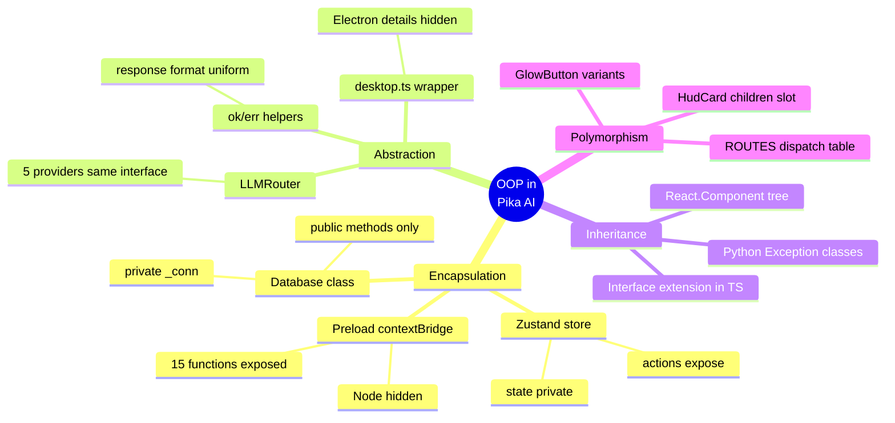
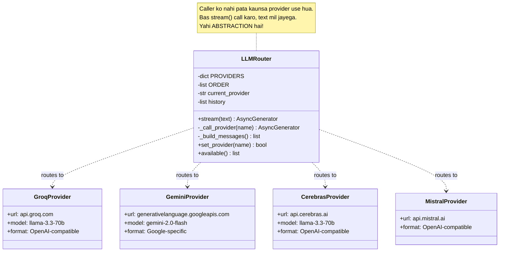
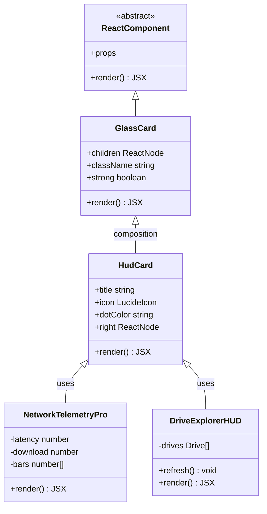
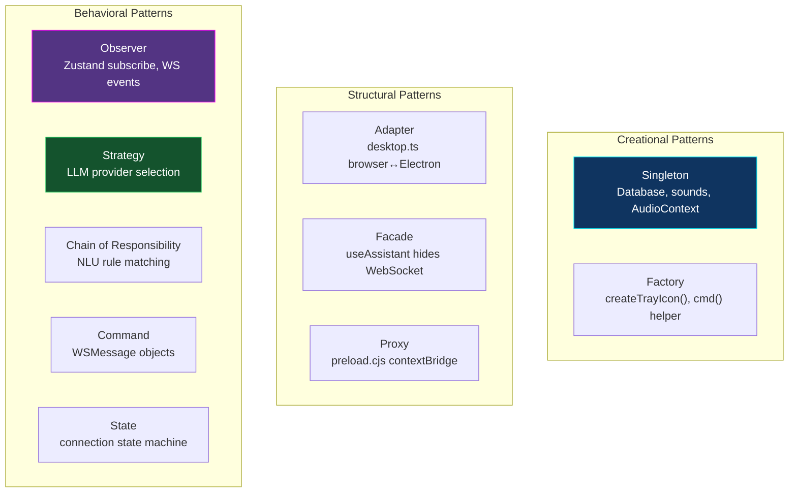
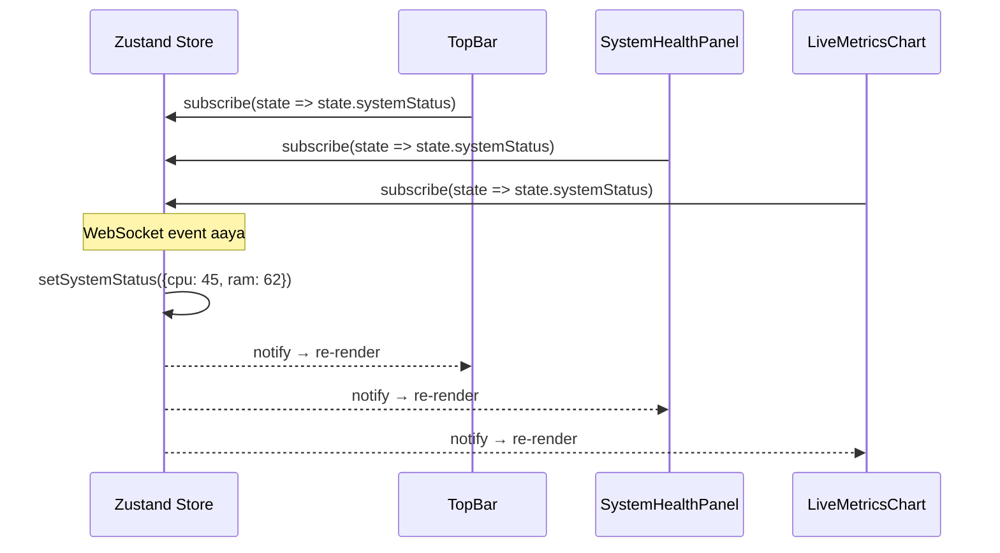
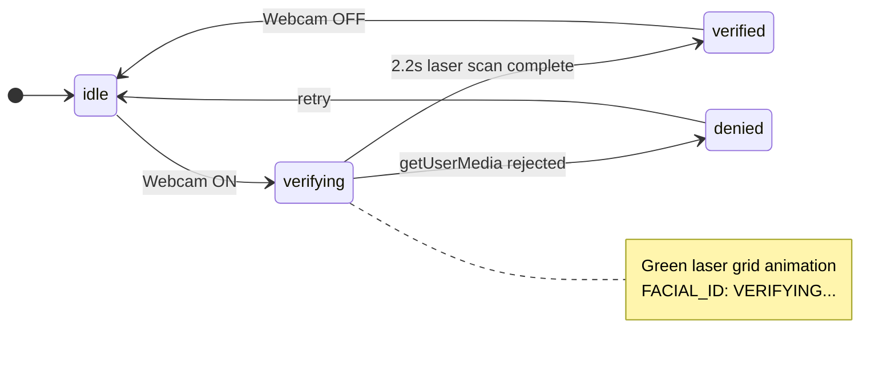

[⬅️ Previous: Folder Structure](./05-FOLDER-STRUCTURE.md) | [🏠 Back to Master Index](./00-START-HERE.md) | [➡️ Next: Viva Guide](./07-VIVA-GUIDE.md)

---

# 🎨 06 — OOP CONCEPTS & DESIGN PATTERNS

> Yeh file batati hai ki **kahan-kahan** OOP ke 4 pillars aur classic design patterns
> use hue hain. Viva mein yeh sabse zyada marks dilata hai! 💯

---

## 🏛️ The 4 Pillars of OOP in Pika



---

## 1️⃣ ENCAPSULATION — Data Hiding

### Example A: `Database` class (Python)

```python
class Database:
    """
    Encapsulation: _local, _lock, _instance sab PRIVATE hain (underscore prefix).
    Bahar se koi directly connection touch nahi kar sakta — sirf methods se.
    """
    _instance = None          # ← private class variable
    _lock = threading.Lock()  # ← private lock

    def __init__(self, db_path: str = "./data/pika.db"):
        self._local = threading.local()   # ← private thread storage
        self.db_path = Path(db_path)      # ← public config
        self._init_tables()               # ← private method

    def _get_conn(self) -> sqlite3.Connection:
        """Private helper — naam mein underscore = 'internal use only'."""
        ...

    # ✅ PUBLIC API — sirf yeh methods bahar available hain
    def add_reminder(self, text: str, trigger_time: datetime) -> str: ...
    def get_active_reminders(self) -> list[dict]: ...
    def log_command(self, ...) -> None: ...
```

**Fayda:** Kal ko agar SQLite se PostgreSQL par shift karna ho, toh sirf
`_get_conn()` badalna hai. Baaki poora app waisa hi chalega. **Loose coupling!**

### Example B: Electron `preload.cjs`

```javascript
// Renderer ko Node.js ka DIRECT access nahi milta — encapsulated!
contextBridge.exposeInMainWorld("pika", {
  minimize: () => ipcRenderer.invoke("window:minimize"),
  pickFile: () => ipcRenderer.invoke("dialog:pick-file"),
  // ... sirf 15 safe functions
});
// `fs`, `child_process`, `path` — sab HIDDEN. Security by encapsulation. 🔒
```

---

## 2️⃣ ABSTRACTION — Complexity Hiding

### Example: `LLMRouter` — 5 providers, 1 interface



**Caller ka code:**
```python
# Caller ko zero idea hai ki Groq, Gemini ya Mistral kaun chala
async for chunk, provider, done in llm_stream("joke sunao"):
    print(chunk)  # bas text mil raha hai
```

**Andar kya ho raha hai:** Provider order try karo → fail ho toh next → sab fail
ho toh local fallback message. Caller ko kuch pata nahi chalta. 🎩

### Example: `desktop.ts` — Browser vs Electron abstraction

```typescript
// Component ko yeh nahi sochna padta ki hum Electron mein hain ya browser mein
export const desktop: PikaDesktopApi = {
  minimize: async () => window.pika?.minimize(),  // Electron mein kaam karega
                                                   // Browser mein silently no-op
  openExternal: async (url) => {
    if (window.pika) return window.pika.openExternal(url);  // Electron: shell
    window.open(url, "_blank");                              // Browser: new tab
  },
};
```

---

## 3️⃣ INHERITANCE — Code Reuse

### React Component Hierarchy



> **React mein "composition over inheritance"** preferred hai. Hum classes extend
> nahi karte, balki components ko **wrap** karte hain. `HudCard` andar `GlassCard`
> use karta hai — yeh **composition** hai, technically inheritance se better!

### TypeScript Interface Inheritance

```typescript
// Base interface
interface BaseMessage {
  id: string;
  timestamp: string;
}

// Extended interfaces — inheritance!
interface WSMessage extends BaseMessage {
  type: "command" | "query" | "config" | ...;
  category?: string;
  action?: string;
  params?: Record<string, unknown>;
}

interface WSResponse extends BaseMessage {
  type: "response";
  status: "success" | "error" | "confirmation_required";
  data?: unknown;
  message: string;
}
```

---

## 4️⃣ POLYMORPHISM — Same Interface, Different Behavior

### Example A: `ROUTES` Dispatch Table (Python)

```python
# Har handler ka SAME signature: (action: str, params: dict) -> dict
ROUTES = {
    "system":     cmd_system,      # ← different implementation
    "volume":     cmd_volume,      # ← different implementation
    "files":      cmd_files,       # ← different implementation
    "processes":  cmd_processes,
    "calculator": cmd_calculator,
    # ... 18 handlers
}

def route_command(data: dict) -> dict:
    handler = ROUTES.get(data["category"])
    # 🎯 POLYMORPHISM: same call, different behavior based on category
    return handler(data["action"], data["params"])
```

**Yeh if-else chain se better kyun?**
```python
# ❌ Bad — 18 if-else, O(n) lookup, hard to extend
if category == "system": return cmd_system(action, params)
elif category == "volume": return cmd_volume(action, params)
elif category == "files": return cmd_files(action, params)
# ... 15 more

# ✅ Good — dictionary O(1) lookup, naya handler add karna trivial
return ROUTES[category](action, params)
```

### Example B: `GlowButton` variants (React)

```typescript
// EK component, 4 alag-alag appearances = polymorphism
<GlowButton variant="default">Normal</GlowButton>
<GlowButton variant="primary">Accent</GlowButton>
<GlowButton variant="danger">Delete</GlowButton>
<GlowButton variant="ghost">Subtle</GlowButton>
```

---

## 🏗️ Design Patterns Used



### Pattern 1: SINGLETON

**Kahan?** `Database`, `sounds`, `AudioContext`, Electron single-instance lock

```python
class Database:
    _instance = None
    _lock = threading.Lock()

    def __new__(cls, db_path="./data/pika.db"):
        with cls._lock:                     # thread-safe
            if cls._instance is None:
                cls._instance = super().__new__(cls)
            return cls._instance            # hamesha SAME object
```

**Kyun?** Multiple DB connections = file locking issues + memory waste.
Ek hi instance chahiye.

```javascript
// Electron mein bhi
const gotLock = app.requestSingleInstanceLock();
if (!gotLock) app.quit();  // dusri copy band
```

---

### Pattern 2: OBSERVER (Pub-Sub)

**Kahan?** Zustand store, WebSocket events, Electron IPC listeners



```typescript
// Har component apne aap "subscribe" karta hai
const status = useStore((s) => s.systemStatus);  // ← observer
// Jab bhi systemStatus change hoga, yeh component auto re-render hoga
```

---

### Pattern 3: STRATEGY

**Kahan?** LLM provider selection, TTS engine selection

```python
# Strategy: runtime par decide karo kaunsa algorithm use karna hai
async def generate_tts(text: str, voice: str):
    online = await check_network()

    if HAS_EDGE_TTS and online:
        return await edge_tts_strategy(text, voice)      # Strategy A
    else:
        return await pyttsx3_offline_strategy(text)      # Strategy B
```

---

### Pattern 4: CHAIN OF RESPONSIBILITY

**Kahan?** NLU pattern matching

```typescript
export function parseCommand(text: string): CommandResult {
  // Har rule ko chance do — pehla match jeetega
  for (const rule of RULES) {
    const m = text.trim().match(rule.re);
    if (m) return rule.handle(m);       // ← handled, chain break
  }
  // Koi handle nahi kar paya → LLM fallback (last in chain)
  return { parsed: null, reply: "", isLLM: true };
}
```

---

### Pattern 5: COMMAND

**Kahan?** WebSocket messages — har command ek object hai

```typescript
interface WSMessage {
  type: "command";
  category: string;   // Receiver
  action: string;     // Method to invoke
  params: object;     // Arguments
  id: string;         // For undo/tracking
}
```

**Fayda:** Commands ko queue, log, undo, replay kar sakte hain. Macro engine isi
par based hai!

---

### Pattern 6: FACADE

**Kahan?** `useAssistant` hook

```typescript
// Component ko sirf yeh 5 functions chahiye
const { processInput, resolveConfirmation, connect, disconnect, sendRaw } = useAssistant();

// Andar kya-kya ho raha hai (hidden):
// - WebSocket connection management
// - Exponential backoff reconnection
// - Message parsing & routing
// - NLU command parsing
// - Demo mode simulation
// - Toast notifications
// - Sound effects
// - Activity logging
// - Reminder timers
```

---

### Pattern 7: ADAPTER

**Kahan?** `desktop.ts` — Electron API ko browser-safe banata hai

```typescript
// Adaptee: window.pika (Electron only, may be undefined)
// Adapter: desktop object (always works)
// Client: React components (blissfully unaware)

export const desktop: PikaDesktopApi = {
  pickFile: async () => (await window.pika?.pickFile()) ?? null,
  //                     ↑ optional chaining = adapter magic
};
```

---

### Pattern 8: STATE MACHINE

**Kahan?** Connection status, reminder lifecycle, webcam scan phases



---

## 🎯 SOLID Principles Check

| Principle | Applied? | Where |
|-----------|:--------:|-------|
| **S** — Single Responsibility | ✅ | Har component ka ek kaam. `VoiceWaveform` sirf bars draw karta hai |
| **O** — Open/Closed | ✅ | Naya command add karne ke liye `ROUTES` mein entry — existing code untouched |
| **L** — Liskov Substitution | ✅ | Koi bhi LLM provider dusre ki jagah use ho sakta hai |
| **I** — Interface Segregation | ✅ | `PikaDesktopApi` mein sirf zaroori 15 methods, 50 nahi |
| **D** — Dependency Inversion | ✅ | Components `useAssistant` interface par depend karte hain, WebSocket implementation par nahi |

---

## 📊 Pattern Usage Summary Table

| Pattern | File | Line Reference | Purpose |
|---------|------|----------------|---------|
| Singleton | `pc_bridge.py` | `Database.__new__` | One DB instance |
| Singleton | `soundEffects.ts` | `getCtx()` | One AudioContext |
| Observer | `assistantStore.ts` | Zustand `create()` | Reactive UI |
| Strategy | `pc_bridge.py` | `generate_tts()` | TTS engine choice |
| Chain of Resp. | `commandEngine.ts` | `parseCommand()` | NLU matching |
| Command | `types/index.ts` | `WSMessage` | Serializable actions |
| Facade | `useAssistant.ts` | Hook return | Simplified API |
| Adapter | `desktop.ts` | `desktop` object | Cross-platform |
| Factory | `main.cjs` | `createTrayIcon()` | Object creation |
| Proxy | `preload.cjs` | `contextBridge` | Controlled access |
| State Machine | `WebcamPanel.tsx` | `ScanPhase` type | Scan lifecycle |

---

## 🔗 Related Reading
- Code implementation → [13-CODE-WALKTHROUGH.md](./13-CODE-WALKTHROUGH.md)
- Architecture overview → [02-ARCHITECTURE.md](./02-ARCHITECTURE.md)
- Viva questions on patterns → [07-VIVA-GUIDE.md](./07-VIVA-GUIDE.md)

**External:**
- [Refactoring Guru — Design Patterns](https://refactoring.guru/design-patterns) ⭐ Best visual guide
- [GeeksForGeeks Design Patterns](https://www.geeksforgeeks.org/software-design-patterns/)
- [SOLID Principles Explained](https://www.freecodecamp.org/news/solid-principles-explained-in-plain-english/)
- [React Patterns](https://www.patterns.dev/react)

---

[⬅️ Previous: Folder Structure](./05-FOLDER-STRUCTURE.md) | [🏠 Back to Master Index](./00-START-HERE.md) | [➡️ Next: Viva Guide](./07-VIVA-GUIDE.md)
