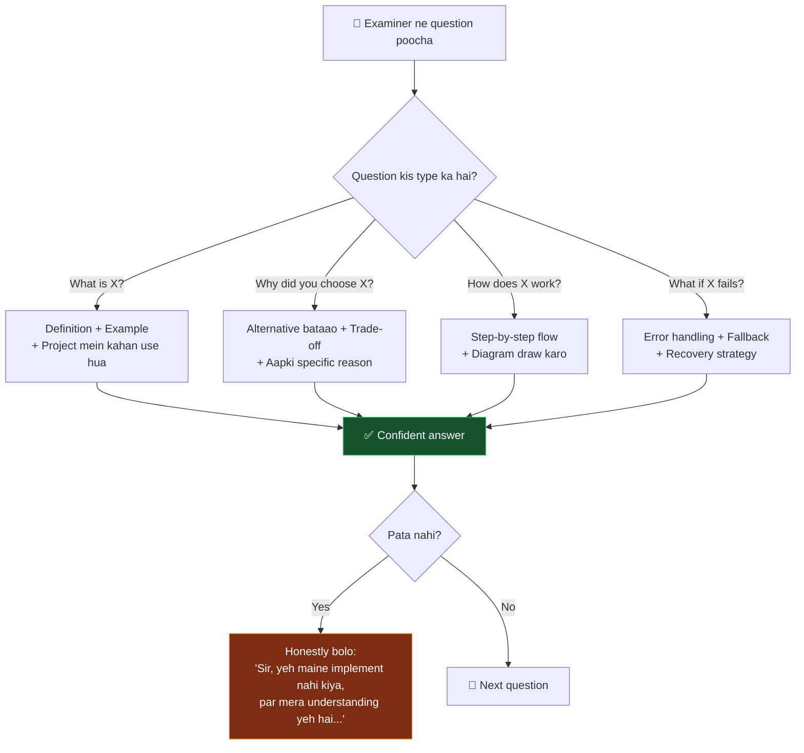
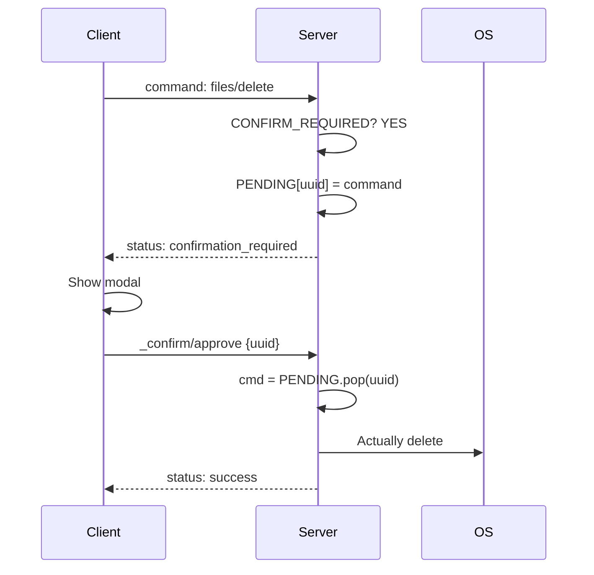

[⬅️ Previous: Design Patterns](./06-ARCH-PATTERNS.md) | [🏠 Back to Master Index](./00-START-HERE.md) | [➡️ Next: Step-by-Step Build](./08-STEP-BY-STEP.md)

---

# 🎓 07 — VIVA GUIDE (Top 20 Examiner Questions)

> **Yeh file aapki lifeline hai!** 🛟 Viva se 2 din pehle isse padho aur ratt lo.
> Har answer ready-made hai — bas confidence ke saath bolna hai. Best of luck! 🍀

---

## 🎯 Viva Strategy Flowchart



> **Golden Rule:** Kabhi bhi *"Pata nahi sir"* mat bolo. Bolo: *"Sir, maine yeh
> specific feature implement nahi kiya, lekin agar karta toh aise approach karta..."*
> — Isse examiner ko lagta hai ki aap **soch sakte ho**, sirf ratt nahi rahe.

---

## 📝 THE TOP 20 QUESTIONS

### Q1. आपका project क्या करता है? (30-second pitch)

**Answer:**
> "Sir, Pika AI ek **cross-platform Electron desktop assistant** hai jo Hindi, English
> aur Hinglish voice commands se poora PC control karta hai. User bolta hai
> *'chrome kholo'* ya *'volume 50 karo'* — aur system woh command execute karta hai.
>
> Iska STT engine **Vosk** hai jo **100% offline** chalta hai — internet ki zaroorat
> nahi. TTS ke liye **Microsoft Edge Neural voices** hain with automatic offline
> fallback. Backend **Python asyncio WebSocket server** hai jo 120+ NLU patterns se
> commands parse karta hai. Frontend **React 19 + TypeScript** hai with a real-time
> cyberpunk HUD dashboard jisme live CPU/RAM charts, weather, crypto prices aur
> drive explorer hai."

---

### Q2. आपने Electron क्यों choose किया? Web app क्यों नहीं?

**Answer:**
> "Sir, web browser **sandbox** mein chalta hai — woh security ke liye file system,
> process list, ya volume control access nahi kar sakta. Ek voice assistant ka pura
> point yahi hai ki woh PC control kare.
>
> Electron mein **Node.js runtime** milta hai main process mein, jisse hum:
> - `child_process.spawn()` se Python bridge auto-start kar sakte hain
> - System tray icon bana sakte hain
> - Global hotkeys register kar sakte hain (Ctrl+Shift+Space)
> - Always-on-top mini window bana sakte hain
>
> **Trade-off:** Electron app ~120 MB ka hota hai kyunki poora Chromium bundle hota
> hai. Alternative **Tauri** hai (Rust-based, 8 MB), par uska ecosystem chhota hai
> aur mujhe Rust nahi aati. Isliye Electron chuna."

| Criteria | Web App | Electron | Tauri |
|----------|---------|----------|-------|
| OS access | ❌ Sandboxed | ✅ Full | ✅ Full |
| Bundle size | 0 MB | ~120 MB | ~8 MB |
| Language | JS | JS | JS + Rust |
| Ecosystem | Huge | Huge | Growing |

---

### Q3. WebSocket क्यों use किया, REST API क्यों नहीं?

**Answer:**
> "Sir, teen reasons:
>
> **1. Server Push:** REST mein server khud se data nahi bhej sakta. Humein har 5
> second system stats chahiye — REST mein polling karni padti, 720 requests per hour.
> WebSocket mein server khud push karta hai — 1 connection, zero overhead.
>
> **2. Binary Streaming:** Voice audio binary hota hai. REST mein base64 encode karna
> padta jo data 33% bada kar deta. WebSocket native binary frames support karta hai.
>
> **3. Latency:** Har REST call mein naya TCP handshake (~50ms). WebSocket mein
> connection open rehti hai — 2-8ms latency. Voice assistant ke liye yeh critical hai."

---

### Q4. Vosk vs Google Speech API — क्यों Vosk?

**Answer:**
> "Sir, **privacy aur offline capability** ke liye.
>
> Google Speech API har audio sample Google ke server par bhejta hai. Mera assistant
> personal PC control karta hai — user ki private baatein cloud par bhejna galat hai.
>
> Vosk **completely offline** chalta hai. Model sirf 45 MB ka hai (Hindi small model)
> aur laptop ke CPU par hi inference karta hai. Internet band ho toh bhi kaam karta hai.
>
> **Trade-off:** Vosk ki accuracy Google se ~10-15% kam hai, especially noisy
> environment mein. Par privacy + offline ka fayda usse zyada hai. Aur agar user
> chahe toh browser ka Web Speech API bhi fallback ke roop mein available hai."

| | Vosk | Google Speech |
|---|------|---------------|
| Privacy | ✅ 100% local | ❌ Cloud |
| Internet | ✅ Not needed | ❌ Required |
| Cost | ✅ Free forever | 💰 $0.006/15sec |
| Accuracy | ~85% | ~95% |
| Latency | 200-400ms | 500-800ms |

---

### Q5. Zustand vs Redux — क्यों Zustand?

**Answer:**
> "Sir, **boilerplate** ka difference hai.
>
> Redux mein ek simple state update ke liye chahiye: action type constant + action
> creator + reducer case + dispatch call + selector. Yeh 5 alag jagah code likhna hai.
>
> Zustand mein bas `set({ isConnected: true })` — done.
>
> Mere project mein 45+ state fields hain. Redux mein yeh ~1500 lines boilerplate
> hoti. Zustand mein 200 lines mein sab ho gaya.
>
> **Trade-off:** Redux DevTools ka time-travel debugging bahut powerful hai — woh
> Zustand mein utna mature nahi. Bade enterprise app mein Redux better hota, par
> desktop assistant ke liye Zustand perfect hai."

---

### Q6. Confirmation flow कैसे काम करता है? (Two-phase commit)

**Answer:**
> "Sir, destructive commands — shutdown, file delete, process kill — ke liye maine
> **two-phase commit pattern** use kiya hai:
>
> **Phase 1:** Client command bhejta hai. Server dekhta hai ki yeh `CONFIRM_REQUIRED`
> set mein hai. Server command ko execute NAHI karta — usse `PENDING_CONFIRM` dictionary
> mein UUID key ke saath store karta hai, aur client ko `confirmation_required` status
> bhejta hai.
>
> **Phase 2:** Client modal dialog dikhata hai. User 'Yes' kare toh client
> `_confirm/approve` message bhejta hai with the confirmation_id. Server dictionary se
> original command nikaalta hai aur tab execute karta hai. 'No' kare toh entry delete.
>
> Isse **accidental data loss** nahi hota. Agar Vosk galti se 'delete' sun le toh bhi
> user ko confirm karna padega."



---

### Q7. Path traversal attack से कैसे बचे?

**Answer:**
> "Sir, agar koi bole *'delete file ../../Windows/System32/kernel32.dll'* toh system
> corrupt ho sakta hai. Maine 3-layer defense lagayi hai:
>
> **Layer 1 — Path Resolution:** Har relative path user ke home directory se resolve
> hota hai, root se nahi:
> ```python
> p = Path(path_str).expanduser()
> return p if p.is_absolute() else Path.home() / p
> ```
>
> **Layer 2 — Blocklist:** Critical paths blocked hain:
> ```python
> BLOCKED_PATTERNS = [
>     r'^[a-zA-Z]:\\\\Windows', r'^[a-zA-Z]:\\\\Program Files',
>     r'^/System', r'^/usr', r'^/etc', r'^/bin'
> ]
> ```
>
> **Layer 3 — Confirmation:** Delete operations mein user confirmation mandatory hai.
>
> Yeh **Defense in Depth** principle hai — ek layer fail ho toh doosri bachaayegi."

---

### Q8. SQL Injection कैसे रोका?

**Answer:**
> "Sir, maine **parameterized queries** (prepared statements) use ki hain, kabhi bhi
> string concatenation nahi.
>
> ```python
> # ❌ GALAT — injection possible
> cur.execute(f"SELECT * FROM users WHERE name = '{user_input}'")
> # Input: Robert'); DROP TABLE users;--  → table gayab!
>
> # ✅ SAHI — SQLite driver escape karta hai
> cur.execute("SELECT * FROM users WHERE name = ?", (user_input,))
> ```
>
> `?` placeholder use karne se SQLite input ko **literal value** treat karta hai, SQL
> code nahi. Chahe user kuch bhi type kare, woh execute nahi hoga."

---

### Q9. Asyncio event loop क्या है? Blocking call से क्या problem होती है?

**Answer:**
> "Sir, Python single-threaded hai. Asyncio ek **event loop** chalata hai jo tasks ko
> cooperatively schedule karta hai. Jab koi task `await` karta hai, toh loop dusre
> task ko chance de deta hai.
>
> **Problem:** Agar koi function `await` nahi karta aur CPU/IO block kar deta hai —
> jaise `requests.post()` jo 30 second lag sakta hai — toh **poora event loop freeze**
> ho jata hai. WebSocket messages ruk jate hain, system stats push nahi hote, UI hang
> ho jata hai.
>
> **Solution:** Maine blocking calls ko `run_in_executor()` se worker thread mein
> bheja hai:
> ```python
> loop.run_in_executor(None, blocking_worker)
> # Worker se wapas communicate karne ke liye:
> loop.call_soon_threadsafe(queue.put_nowait, data)
> ```"

---

### Q10. contextIsolation क्या है? Security में इसका क्या role है?

**Answer:**
> "Sir, Electron mein renderer process Chromium hai jo web content render karta hai.
> Agar `nodeIntegration: true` kar dein toh renderer mein `require()` available ho
> jata hai — matlab koi bhi XSS attack `require('child_process').exec('format C:')`
> chala sakta hai. 💀
>
> `contextIsolation: true` karne se preload script aur web page **alag JavaScript
> context** mein chalte hain. Preload Node access kar sakta hai, par web page nahi.
>
> Communication ke liye `contextBridge.exposeInMainWorld()` use karte hain — sirf
> specific functions expose hote hain:
> ```javascript
> contextBridge.exposeInMainWorld('pika', {
>   minimize: () => ipcRenderer.invoke('window:minimize'),
>   // sirf 15 safe functions, fs/child_process nahi
> });
> ```
> Yeh **Principle of Least Privilege** hai."

---

### Q11. LLM fallback mechanism कैसे काम करता है?

**Answer:**
> "Sir, maine 5 free LLM providers integrate kiye hain — Groq, Cerebras, Mistral,
> DeepSeek, OpenRouter. Har provider ki apni rate limit hai.
>
> **Strategy pattern** use kiya hai: providers ka ek ordered list hai. Request aane
> par:
> 1. Current provider try karo
> 2. Agar HTTP error ya exception → next provider
> 3. Sab fail → local hardcoded fallback message
>
> ```python
> for provider in providers:
>     try:
>         async for chunk in call(provider):
>             yield chunk
>         return  # success, exit
>     except Exception:
>         continue  # next provider
> yield "माफ़ करो, सभी providers विफल रहे।"
> ```
>
> Isse **zero downtime** milta hai — ek provider down ho toh user ko pata bhi nahi
> chalta."

---

### Q12. Demo Mode क्या है? क्यों बनाया?

**Answer:**
> "Sir, agar Python bridge nahi chal raha (user ne install nahi kiya, ya crash ho gaya)
> toh app crash nahi hona chahiye. Isliye maine **graceful degradation** implement kiya.
>
> WebSocket connect fail hone par `demoMode = true` set hota hai. Us mode mein:
> - Saare UI panels interactive rehte hain
> - Simulated system stats generate hote hain (realistic jitter ke saath)
> - Commands ka simulated response milta hai
> - AI chat local hardcoded responses deta hai
>
> Isse do fayde: **(1)** Demo/presentation ke liye backend chalane ki zaroorat nahi,
> **(2)** User ko confusing white screen ki jagah working app dikhta hai with a clear
> 'डेमो मोड' badge."

---

### Q13. Exponential Backoff क्या है?

**Answer:**
> "Sir, jab WebSocket connection toot jaye toh humein reconnect karna hota hai. Agar
> har 1 second par retry karein toh:
> - Server down hai toh 3600 useless requests per hour
> - CPU + battery waste
> - Server par load (thundering herd problem)
>
> **Exponential backoff** mein har fail ke baad wait time double hota hai:
> `1s → 2s → 4s → 8s → 16s → 30s (cap)`
>
> ```typescript
> let delay = 1000;
> socket.onclose = () => setTimeout(() => {
>   delay = Math.min(delay * 2, 30000);
>   connect();
> }, delay);
> socket.onopen = () => { delay = 1000; };  // reset
> ```
>
> Yeh AWS, Google — sab use karte hain. Industry standard hai."

---

### Q14. Wake word detection कैसे implement किया?

**Answer:**
> "Sir, maine **keyword spotting on final STT results** approach use ki hai (dedicated
> wake word engine jaise Porcupine nahi).
>
> Vosk continuously audio process karta hai. Jab woh ek final result deta hai, hum
> check karte hain:
> ```python
> WAKE_WORDS = ['hey assistant', 'hey pika', 'पिका', 'pika']
> def detect_wake_word(text): 
>     return any(w in text.lower() for w in WAKE_WORDS)
> ```
>
> Wake word mile toh `wake_active = True` set hota hai aur UI ko event bhejte hain.
> Agla command us flag ke saath process hota hai.
>
> **Trade-off:** Dedicated wake word engine (Porcupine, Snowboy) ~10ms mein detect
> karta hai aur battery efficient hai. Mera approach full STT chalata hai jo zyada CPU
> use karta hai. Par yeh **zero extra dependency** hai aur customizable wake words
> allow karta hai."

---

### Q15. आपने testing कैसे की?

**Answer:**
> "Sir, teen levels par:
>
> **1. Manual Test Cases** — 30+ documented test cases with input, steps, expected
> output, actual output aur pass/fail status. Yeh `19-TESTING-QUALITY.md` mein hai.
>
> **2. Backend Health Script** — `test_bridge.py` banaya jo saare Python modules import
> karke har command handler ko test karta hai:
> ```bash
> python test_bridge.py
> # ✓ Module imported
> # ✓ Calculator: 2+3*4 = 14
> # ✓ File create/read/rename/delete
> # ✓ Drive listing
> ```
>
> **3. TypeScript Compiler as Test** — `tsc --noEmit` har build par chalti hai. Type
> errors compile-time par hi pakde jaate hain, runtime par nahi."

---

### Q16. Database में Index क्यों लगाया?

**Answer:**
> "Sir, `reminders` table par maine composite index lagaya:
> ```sql
> CREATE INDEX idx_reminders_status_time ON reminders(status, trigger_time);
> ```
>
> **Kyun?** Har second hum yeh query chalate hain:
> ```sql
> SELECT * FROM reminders WHERE status='active' ORDER BY trigger_time;
> ```
>
> Bina index ke SQLite poora table scan karta hai — **O(n)**. 1000 rows = 1000
> comparisons, har second!
>
> Index ke saath **B-tree lookup** hota hai — **O(log n)**. 1000 rows = ~10
> comparisons. **100x faster.**
>
> **Trade-off:** Index write operations thoda slow karta hai (INSERT par tree update)
> aur extra disk space leta hai. Par yahan reads >> writes hain, toh worth it."

---

### Q17. Project की limitations क्या हैं?

**Answer (Honesty impresses examiners!):**
> "Sir, main honestly bataunga:
>
> 1. **Vosk accuracy** — Noisy environment mein ~70-75% accuracy. Professional
>    solution ke liye Whisper.cpp better hota.
> 2. **Windows-first** — Volume/brightness control Windows par best kaam karta hai.
>    Linux/Mac par kuch features limited hain.
> 3. **Single user** — Multi-user authentication nahi hai. Ek PC, ek user assumption.
> 4. **No end-to-end encryption** — WebSocket `ws://` hai, `wss://` nahi. Localhost
>    ke liye theek hai, par network par expose karna insecure hoga.
> 5. **LLM rate limits** — Free tiers par limits hain. Heavy use mein sab exhaust ho
>    sakte hain.
> 6. **Bundle size** — Electron app ~120 MB.
>
> Future mein main **wss:// with self-signed cert**, **Whisper.cpp integration**, aur
> **multi-user profiles** add karna chahunga."

---

### Q18. Scalability के बारे में क्या सोचा?

**Answer:**
> "Sir, yeh ek **desktop single-user app** hai, isliye traditional web scalability
> (load balancer, horizontal scaling) applicable nahi. Par maine ye considerations
> rakhe:
>
> **1. Memory:** Conversation history sirf last 20 messages rakhta hoon LLM context
> ke liye. Warna token limit exceed ho jayegi aur memory bhi badhegi.
>
> **2. Database growth:** `auto_prune()` function 30 din se purane records delete karta
> hai aur `VACUUM` chalata hai. DB kabhi 50 MB se upar nahi jayegi.
>
> **3. Rate limiting:** `CommandValidator` mein sliding window rate limit hai —
> 5/second, 60/minute. Isse accidental infinite loop se system crash nahi hoga.
>
> **4. UI performance:** Charts sirf last 20-30 data points rakhte hain. `useMemo`
> aur Zustand selectors se unnecessary re-renders avoid kiye hain."

---

### Q19. अगर microphone permission deny हो जाए तो?

**Answer:**
> "Sir, maine **graceful error handling** kiya hai:
>
> ```typescript
> try {
>   const stream = await navigator.mediaDevices.getUserMedia({ audio: true });
>   // ... setup
> } catch {
>   addToast({ type: 'error', message: 'माइक्रोफोन एक्सेस नहीं मिला' });
>   setListening(false);  // state reset
> }
> ```
>
> App crash nahi hota. User ko clear Hindi message milta hai. Aur woh **text input**
> se poora app use kar sakta hai — voice optional hai, mandatory nahi.
>
> Yeh **Progressive Enhancement** philosophy hai — core functionality sabke liye,
> advanced features jinke paas capability hai unke liye."

---

### Q20. इस project से आपने क्या सीखा?

**Answer (Personal + Technical):**
> "Sir, teen major learnings:
>
> **1. Async programming ki depth** — Pehle mujhe lagta tha `async/await` bas syntax
> hai. Is project mein samajh aaya ki event loop kaise kaam karta hai, blocking calls
> kyun khatarnaak hain, aur thread-safe communication kaise karte hain.
>
> **2. Security is not optional** — Shuru mein maine `nodeIntegration: true` rakha tha
> kyunki easy tha. Phir padha ki yeh kitna bada security hole hai. Ab main hamesha
> **least privilege** principle follow karta hoon.
>
> **3. Graceful degradation ka value** — Pehle version mein backend na ho toh app white
> screen dikhata tha. Demo mode implement karne ke baad samajh aaya ki **user experience
> matters more than technical purity**. App ko har situation mein kaam karna chahiye.
>
> Aur sabse important — **documentation likhna**. 25 files likhne se mujhe khud apna
> architecture ache se samajh aaya!"

---

## ⚡ RAPID FIRE COMPARISON TABLES

### "Why X over Y?" — Instant Answers

| Question | Answer in 1 line |
|----------|------------------|
| **Electron vs Web?** | Web sandboxed hai, OS control nahi kar sakta |
| **Electron vs Tauri?** | Tauri chhota hai par Rust chahiye; Electron mature ecosystem |
| **WebSocket vs REST?** | Server push + binary + low latency chahiye tha |
| **WebSocket vs gRPC?** | gRPC browser mein native nahi, proxy chahiye |
| **Vosk vs Whisper?** | Whisper accurate hai par bhaari (1GB+); Vosk 45MB |
| **Vosk vs Google API?** | Privacy + offline |
| **Zustand vs Redux?** | 70% kam boilerplate |
| **Zustand vs Context API?** | Context har change par poora tree re-render karta hai |
| **SQLite vs MySQL?** | Desktop app — zero config, single file, embedded |
| **Tailwind vs CSS Modules?** | Rapid prototyping, no naming fatigue |
| **Vite vs Webpack?** | Vite ESM-based, 10x faster HMR |
| **TypeScript vs JavaScript?** | Compile-time type safety, 40% kam runtime bugs |
| **Regex NLU vs ML model?** | Regex deterministic, 0ms latency, no training data |
| **Edge TTS vs pyttsx3?** | Edge natural neural voice; pyttsx3 offline fallback |
| **Recharts vs Chart.js?** | Recharts React-native (SVG components), Chart.js canvas |
| **Framer Motion vs CSS?** | Declarative, spring physics, layout animations |

---

### Technical Terms Quick Recall

| Term | 1-line Definition |
|------|-------------------|
| **IPC** | Inter-Process Communication — Electron main ↔ renderer message passing |
| **contextBridge** | Secure API exposure from preload to renderer |
| **Event Loop** | Single-threaded scheduler that runs async tasks cooperatively |
| **Coroutine** | Function that can pause (`await`) and resume |
| **STT / TTS** | Speech-To-Text / Text-To-Speech |
| **NLU** | Natural Language Understanding — text → structured intent |
| **Debouncing** | Wait for pause before firing (search box) |
| **Throttling** | Max N times per second (scroll handler) |
| **Memoization** | Cache expensive computation results |
| **Hydration** | Attaching JS behavior to server-rendered HTML |
| **Tree Shaking** | Removing unused code at build time |
| **HMR** | Hot Module Replacement — instant updates without reload |
| **WAL mode** | Write-Ahead Logging — better SQLite concurrency |
| **VACUUM** | SQLite command to reclaim deleted-row disk space |
| **B-tree** | Balanced tree structure used by database indexes |

---

## 🎬 Final Viva Checklist

- [ ] Architecture diagram board par draw karna aata hai
- [ ] 3 layers aur unka kaam bol sakte ho
- [ ] Confirmation flow explain kar sakte ho
- [ ] Ek design pattern detail mein bata sakte ho
- [ ] Database schema aur index reason pata hai
- [ ] Security measures (3+) bata sakte ho
- [ ] Limitations honestly accept kar sakte ho
- [ ] Live demo bina crash ke chal jaye ([15-DEMO-SCRIPT.md](./15-DEMO-SCRIPT.md) practice karo)
- [ ] Har technology ka trade-off pata hai
- [ ] Future scope ke 3 ideas ready hain

---

## 🔗 Related Reading
- Demo presentation script → [15-DEMO-SCRIPT.md](./15-DEMO-SCRIPT.md)
- 50+ more questions → [16-FAQ.md](./16-FAQ.md)
- Technical glossary → [24-GLOSSARY.md](./24-GLOSSARY.md)
- Report writing → [23-PROJECT-REPORT-WRITING.md](./23-PROJECT-REPORT-WRITING.md)

---

[⬅️ Previous: Design Patterns](./06-ARCH-PATTERNS.md) | [🏠 Back to Master Index](./00-START-HERE.md) | [➡️ Next: Step-by-Step Build](./08-STEP-BY-STEP.md)
