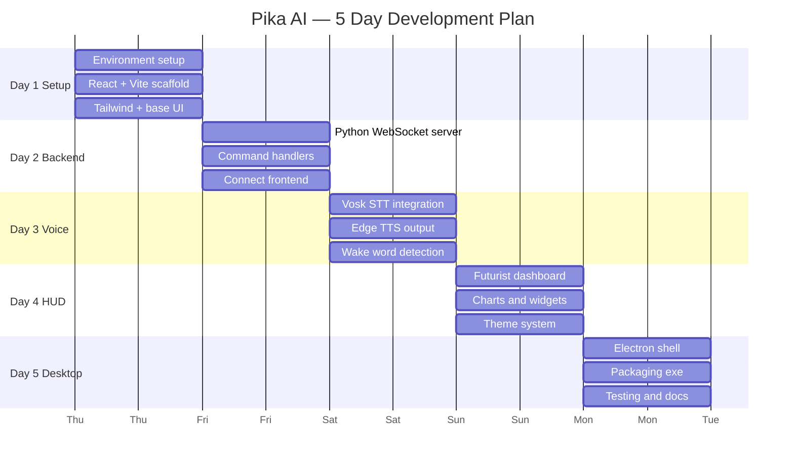
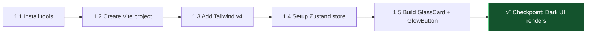
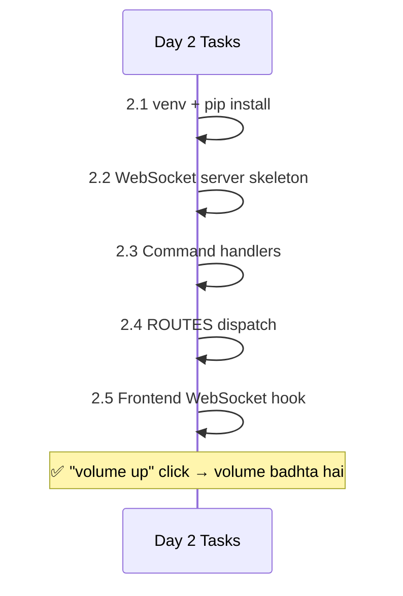
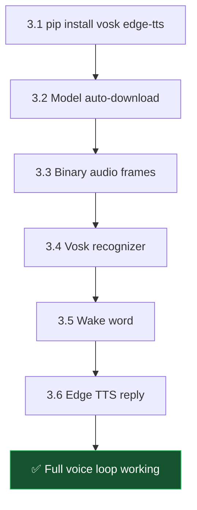

[⬅️ Previous: Viva Guide](./07-VIVA-GUIDE.md) | [🏠 Back to Master Index](./00-START-HERE.md) | [➡️ Next: Language Basics](./09-LANGUAGE-BASICS.md)

---

# 🛠️ 08 — 5-DAY BUILD PLAN (Step-by-Step)

> Zero se poora project banane ka **day-by-day roadmap**. Har din ke end mein ek
> working checkpoint milega. Follow karo, 5 din mein Pika ready! 🚀

---

## 📅 Master Gantt Chart



---

## 🗓️ DAY 1 — Foundation & UI Shell

### Milestone: Ek chalta hua React app with dark glassmorphism theme



### Step 1.1 — Environment Setup
```bash
node --version   # v18+ chahiye
python --version # 3.10+ chahiye
```
Missing hai? → [01-REQUIREMENTS.md](./01-REQUIREMENTS.md)

### Step 1.2 — Create Project
```bash
npm create vite@latest pika-ai -- --template react-ts
cd pika-ai
npm install
```

### Step 1.3 — Tailwind CSS v4
```bash
npm install -D tailwindcss @tailwindcss/vite
```

`vite.config.ts`:
```typescript
import { defineConfig } from "vite";
import react from "@vitejs/plugin-react";
import tailwindcss from "@tailwindcss/vite";
import path from "path";

export default defineConfig({
  plugins: [react(), tailwindcss()],
  resolve: { alias: { "@": path.resolve(__dirname, "src") } },
  server: { host: "0.0.0.0", port: 3000 },  // mobile access ke liye
});
```

`src/index.css`:
```css
@import "tailwindcss";

:root {
  --accent: #00f0ff;
  --accent-rgb: 0, 240, 255;
  --secondary-accent: #ff00ff;
  --secondary-accent-rgb: 255, 0, 255;
}

body {
  background: #0a0b10;
  color: #e5e7eb;
  overflow: hidden;
}

.glass-card {
  background: rgba(255, 255, 255, 0.06);
  border: 1px solid rgba(255, 255, 255, 0.10);
  backdrop-filter: blur(20px);
}
```

### Step 1.4 — Zustand Store
```bash
npm install zustand
```

```typescript
// src/store/assistantStore.ts
import { create } from "zustand";

interface State {
  isConnected: boolean;
  messages: { id: string; role: string; content: string }[];
  setConnected: (v: boolean) => void;
  addMessage: (m: { role: string; content: string }) => void;
}

export const useStore = create<State>((set) => ({
  isConnected: false,
  messages: [],
  setConnected: (v) => set({ isConnected: v }),
  addMessage: (m) => set((s) => ({
    messages: [...s.messages, { ...m, id: crypto.randomUUID() }]
  })),
}));
```

### Step 1.5 — Reusable Primitives
```typescript
// src/components/GlassCard.tsx
export function GlassCard({ children, className = "" }: {
  children: React.ReactNode; className?: string;
}) {
  return (
    <div className={`glass-card rounded-2xl shadow-lg ${className}`}>
      {children}
    </div>
  );
}
```

### ✅ Day 1 Verification
```bash
npm run dev
# http://localhost:3000 par dark theme wala page dikhna chahiye
```
- [ ] Vite dev server chal raha hai
- [ ] Tailwind classes apply ho rahi hain
- [ ] Dark background dikh raha hai
- [ ] `GlassCard` render ho raha hai
- [ ] Console mein koi error nahi

---

## 🗓️ DAY 2 — Python Backend & WebSocket

### Milestone: Frontend se command bhejo, PC par execute ho



### Step 2.1 — Python Environment
```bash
python -m venv venv
# Windows:
venv\Scripts\activate
# Mac/Linux:
source venv/bin/activate

pip install websockets psutil pyautogui pyperclip requests python-dotenv
```

### Step 2.2 — Minimal WebSocket Server
```python
# pc_bridge.py
import asyncio, json, platform
from datetime import datetime
import websockets
from websockets.asyncio.server import serve

HOST, PORT = "0.0.0.0", 8765

def ok(msg, data=None):
    return {"success": True, "message": msg, "data": data}

def err(msg):
    return {"success": False, "message": msg, "data": None}

async def handle_client(ws):
    print(f"[+] Client connected")
    await ws.send(json.dumps({
        "type": "event", "event": "connection_ready",
        "data": {"os": platform.system()},
        "timestamp": datetime.utcnow().isoformat()
    }))
    try:
        async for message in ws:
            data = json.loads(message)
            print(f"[cmd] {data.get('category')}/{data.get('action')}")
            result = route_command(data)
            await ws.send(json.dumps({
                "type": "response",
                "status": "success" if result["success"] else "error",
                "message": result["message"],
                "data": result["data"],
                "id": data.get("id"),
                "timestamp": datetime.utcnow().isoformat()
            }))
    except websockets.exceptions.ConnectionClosed:
        print("[-] Client disconnected")

async def main():
    print(f"⚡ Pika Bridge running on ws://localhost:{PORT}")
    async with serve(handle_client, HOST, PORT):
        await asyncio.Future()

if __name__ == "__main__":
    asyncio.run(main())
```

### Step 2.3 — Command Handlers
```python
import subprocess, os, webbrowser
import pyautogui, psutil

IS_WIN = platform.system() == "Windows"

def cmd_volume(action, params):
    try:
        if action == "up":
            for _ in range(5): pyautogui.press("volumeup")
            return ok("आवाज़ बढ़ा दी।")
        if action == "down":
            for _ in range(5): pyautogui.press("volumedown")
            return ok("आवाज़ कम कर दी।")
        if action == "mute":
            pyautogui.press("volumemute")
            return ok("म्यूट टॉगल।")
        return err(f"Unknown volume action: {action}")
    except Exception as e:
        return err(str(e))

def cmd_apps(action, params):
    name = params.get("name", "").lower()
    APP_MAP = {"chrome": "chrome", "notepad": "notepad", "calculator": "calc"}
    try:
        if action == "open":
            exe = APP_MAP.get(name, name)
            if IS_WIN: os.startfile(exe)
            else: subprocess.Popen([exe])
            return ok(f"{name} खोल दिया।")
        return err(f"Unknown apps action: {action}")
    except Exception as e:
        return err(str(e))

def cmd_info(action, params):
    try:
        if action == "cpu":
            pct = psutil.cpu_percent(interval=0.4)
            return ok(f"CPU {pct}%", {"percent": pct})
        if action == "ram":
            m = psutil.virtual_memory()
            return ok(f"RAM {m.percent}%", {"percent": m.percent})
        return err(f"Unknown info action: {action}")
    except Exception as e:
        return err(str(e))
```

### Step 2.4 — ROUTES Dispatch Table
```python
ROUTES = {
    "volume": cmd_volume,
    "apps": cmd_apps,
    "info": cmd_info,
}

def route_command(data):
    handler = ROUTES.get(data.get("category"))
    if not handler:
        return err(f"Unknown category: {data.get('category')}")
    return handler(data.get("action"), data.get("params", {}))
```

### Step 2.5 — React WebSocket Hook
```typescript
// src/hooks/useWebSocket.ts
import { useEffect, useRef, useCallback } from "react";
import { useStore } from "@/store/assistantStore";

export function useWebSocket(url = "ws://localhost:8765") {
  const ws = useRef<WebSocket | null>(null);
  const setConnected = useStore((s) => s.setConnected);

  const connect = useCallback(() => {
    const socket = new WebSocket(url);
    ws.current = socket;
    socket.onopen = () => setConnected(true);
    socket.onclose = () => {
      setConnected(false);
      setTimeout(connect, 2000);  // simple reconnect
    };
    socket.onmessage = (e) => console.log("[ws]", JSON.parse(e.data));
  }, [url, setConnected]);

  const send = useCallback((msg: object) => {
    if (ws.current?.readyState === WebSocket.OPEN) {
      ws.current.send(JSON.stringify(msg));
    }
  }, []);

  useEffect(() => { connect(); return () => ws.current?.close(); }, [connect]);
  return { send };
}
```

### ✅ Day 2 Verification
```bash
# Terminal 1
python pc_bridge.py

# Terminal 2
npm run dev
```
- [ ] Bridge console mein "Client connected" dikha
- [ ] Button click par volume actually badha
- [ ] Chrome khula
- [ ] CPU % real value dikhi
- [ ] Bridge band karo → app crash nahi hua

---

## 🗓️ DAY 3 — Voice (Vosk STT + Edge TTS)

### Milestone: Bolo aur PC sune, phir jawab de



### Step 3.1 — Install Voice Libraries
```bash
pip install vosk edge-tts pyttsx3
```

### Step 3.2 — Auto-Download Vosk Model
```python
import urllib.request, zipfile
from pathlib import Path

VOSK_MODEL_URL = "https://alphacephei.com/vosk/models/vosk-model-small-hi-0.22.zip"
VOSK_MODEL_DIR = Path(__file__).parent / "models" / "hi"

def ensure_vosk_model() -> bool:
    if VOSK_MODEL_DIR.exists():
        return True
    print("Downloading Vosk Hindi model (~45MB)...")
    root = VOSK_MODEL_DIR.parent
    root.mkdir(parents=True, exist_ok=True)
    zip_path = root / "vosk-hi.zip"
    urllib.request.urlretrieve(VOSK_MODEL_URL, zip_path)
    with zipfile.ZipFile(zip_path) as z:
        z.extractall(root)
    (root / "vosk-model-small-hi-0.22").rename(VOSK_MODEL_DIR)
    zip_path.unlink()
    print("Model ready ✓")
    return True
```

### Step 3.3 — Frontend Audio Capture
```typescript
const stream = await navigator.mediaDevices.getUserMedia({ audio: true });
const ctx = new AudioContext({ sampleRate: 16000 });
const source = ctx.createMediaStreamSource(stream);
const processor = ctx.createScriptProcessor(4096, 1, 1);

processor.onaudioprocess = (e) => {
  const float32 = e.inputBuffer.getChannelData(0);
  // Float32 → Int16 PCM
  const int16 = new Int16Array(float32.length);
  for (let i = 0; i < float32.length; i++) {
    int16[i] = Math.max(-32768, Math.min(32767, float32[i] * 32768));
  }
  ws.send(int16.buffer);  // binary frame
};

source.connect(processor);
processor.connect(ctx.destination);
```

### Step 3.4 — Vosk Recognition (Backend)
```python
from vosk import Model, KaldiRecognizer

_vosk_model = None

def get_recognizer(sample_rate=16000):
    global _vosk_model
    if _vosk_model is None:
        _vosk_model = Model(str(VOSK_MODEL_DIR))
    return KaldiRecognizer(_vosk_model, sample_rate)

# handle_client() ke andar:
async for message in ws:
    if isinstance(message, bytes):
        if recognizer.AcceptWaveform(message):
            res = json.loads(recognizer.Result())
            text = res.get("text", "").strip()
            if text:
                await ws.send(json.dumps({
                    "type": "event", "event": "voice_final",
                    "data": {"text": text},
                    "timestamp": datetime.utcnow().isoformat()
                }))
        else:
            partial = json.loads(recognizer.PartialResult()).get("partial", "")
            if partial:
                await ws.send(json.dumps({
                    "type": "event", "event": "voice_partial",
                    "data": {"text": partial},
                    "timestamp": datetime.utcnow().isoformat()
                }))
        continue
```

### Step 3.5 — Wake Word
```python
WAKE_WORDS = ["hey assistant", "hey pika", "पिका", "pika"]

def detect_wake_word(text: str) -> bool:
    return any(w in text.lower() for w in WAKE_WORDS)
```

### Step 3.6 — Edge TTS
```python
import edge_tts, base64, tempfile, os

async def generate_tts(text: str, voice="hi-IN-SwaraNeural") -> dict:
    try:
        communicate = edge_tts.Communicate(text, voice)
        with tempfile.NamedTemporaryFile(suffix=".mp3", delete=False) as tmp:
            tmp_name = tmp.name
        await communicate.save(tmp_name)
        with open(tmp_name, "rb") as f:
            audio = base64.b64encode(f.read()).decode()
        os.unlink(tmp_name)
        return {"success": True, "audio": audio, "format": "mp3"}
    except Exception as e:
        return {"success": False, "message": str(e)}
```

Frontend playback:
```typescript
const audio = new Audio(`data:audio/mpeg;base64,${base64Audio}`);
audio.play();
```

### ✅ Day 3 Verification
- [ ] Model auto-download hua (models/hi/ folder bana)
- [ ] Mic button click → partial text live dikha
- [ ] "chrome kholo" bola → Chrome khula
- [ ] "hey assistant" bola → wake word toast aaya
- [ ] TTS audio play hua

---

## 🗓️ DAY 4 — Futurist HUD Dashboard

### Milestone: Cyberpunk dashboard with live charts

### Step 4.1 — Install UI Libraries
```bash
npm install framer-motion lucide-react recharts
```

### Step 4.2 — Neural Orb (Center Piece)
```typescript
// 4 rotating rings + 8 orbiting nodes
{[100, 78, 58, 40].map((size, i) => (
  <motion.div
    key={i}
    className="absolute rounded-full border"
    style={{
      left: `${(100 - size) / 2}%`, top: `${(100 - size) / 2}%`,
      width: `${size}%`, height: `${size}%`,
      borderColor: "rgba(var(--accent-rgb), 0.3)",
      borderStyle: i % 2 ? "dashed" : "solid",
    }}
    animate={{ rotate: i % 2 === 0 ? 360 : -360 }}
    transition={{ duration: 24 - i * 4, repeat: Infinity, ease: "linear" }}
  />
))}
```

### Step 4.3 — Live Chart
```typescript
import { AreaChart, Area, ResponsiveContainer, YAxis } from "recharts";

<ResponsiveContainer width="100%" height={56}>
  <AreaChart data={history}>
    <defs>
      <linearGradient id="grad" x1="0" y1="0" x2="0" y2="1">
        <stop offset="5%" stopColor="var(--accent)" stopOpacity={0.4} />
        <stop offset="95%" stopColor="var(--accent)" stopOpacity={0} />
      </linearGradient>
    </defs>
    <YAxis domain={[0, 100]} hide />
    <Area type="monotone" dataKey="v" stroke="var(--accent)"
          fill="url(#grad)" isAnimationActive={false} />
  </AreaChart>
</ResponsiveContainer>
```

### Step 4.4 — Live Theme System
```typescript
// src/hooks/useAccentColor.ts
export function useAccentColor() {
  const accent = useStore((s) => s.settings.accentColor);
  const secondary = useStore((s) => s.settings.secondaryAccentColor);

  useEffect(() => {
    document.documentElement.style.setProperty("--accent", accent);
    document.documentElement.style.setProperty("--accent-rgb", hexToRgb(accent));
    document.documentElement.style.setProperty("--secondary-accent", secondary);
  }, [accent, secondary]);
}
```

### ✅ Day 4 Verification
- [ ] Orb ke rings rotate ho rahe hain
- [ ] CPU chart har 2 sec update ho raha hai
- [ ] Theme picker se poora UI ka color badalta hai
- [ ] Widgets responsive hain (window resize karke check)

---

## 🗓️ DAY 5 — Electron Desktop App

### Milestone: Installable .exe file

### Step 5.1 — Install Electron
```bash
npm install -D electron electron-builder concurrently wait-on cross-env
```

### Step 5.2 — package.json Additions
```json
{
  "main": "electron/main.cjs",
  "scripts": {
    "dev": "vite",
    "build": "tsc -b && vite build",
    "electron:dev": "concurrently -k \"vite\" \"wait-on tcp:3000 && cross-env NODE_ENV=development electron .\"",
    "electron:build": "npm run build && electron-builder",
    "electron:win": "npm run build && electron-builder --win --x64"
  }
}
```

### Step 5.3 — Test Desktop Mode
```bash
npm run electron:dev
```

### Step 5.4 — Package
```bash
npm run electron:win
# Output: release/Pika-AI-Setup-1.0.0.exe
```

### ✅ Day 5 Verification
- [ ] `npm run electron:dev` se desktop window khula
- [ ] Custom title bar dikha (minimize/maximize/close kaam kare)
- [ ] Tray icon dikha
- [ ] Ctrl+Shift+Space se voice toggle hua
- [ ] Python bridge auto-start hua
- [ ] `.exe` file bani aur install hui

---

## 📊 Progress Tracker

| Day | Deliverable | Files Created | LOC | Status |
|-----|-------------|---------------|-----|--------|
| 1 | UI Shell | ~8 | 400 | ⬜ |
| 2 | Backend + WS | ~4 | 600 | ⬜ |
| 3 | Voice Pipeline | ~5 | 500 | ⬜ |
| 4 | HUD Dashboard | ~20 | 2500 | ⬜ |
| 5 | Electron + Package | ~4 | 500 | ⬜ |

---

## 🔗 Related Reading
- Detailed installation → [18-INSTALLATION-SETUP.md](./18-INSTALLATION-SETUP.md)
- Frontend deep dive → [10-FRONTEND-TUTORIAL.md](./10-FRONTEND-TUTORIAL.md)
- Backend deep dive → [11-BACKEND-BASICS.md](./11-BACKEND-BASICS.md)
- If stuck → [14-DEBUGGING-GUIDE.md](./14-DEBUGGING-GUIDE.md)

---

[⬅️ Previous: Viva Guide](./07-VIVA-GUIDE.md) | [🏠 Back to Master Index](./00-START-HERE.md) | [➡️ Next: Language Basics](./09-LANGUAGE-BASICS.md)
