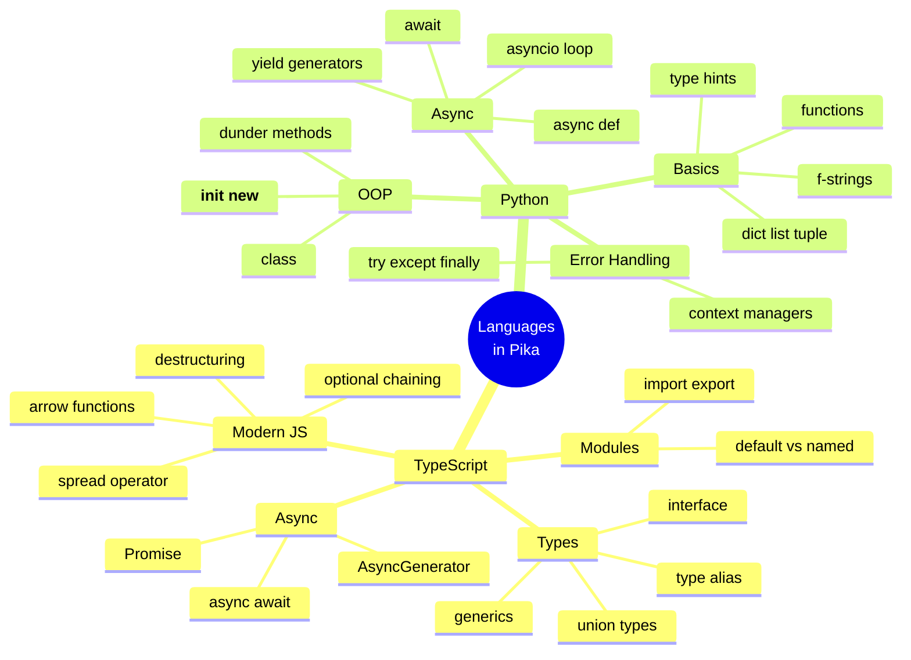
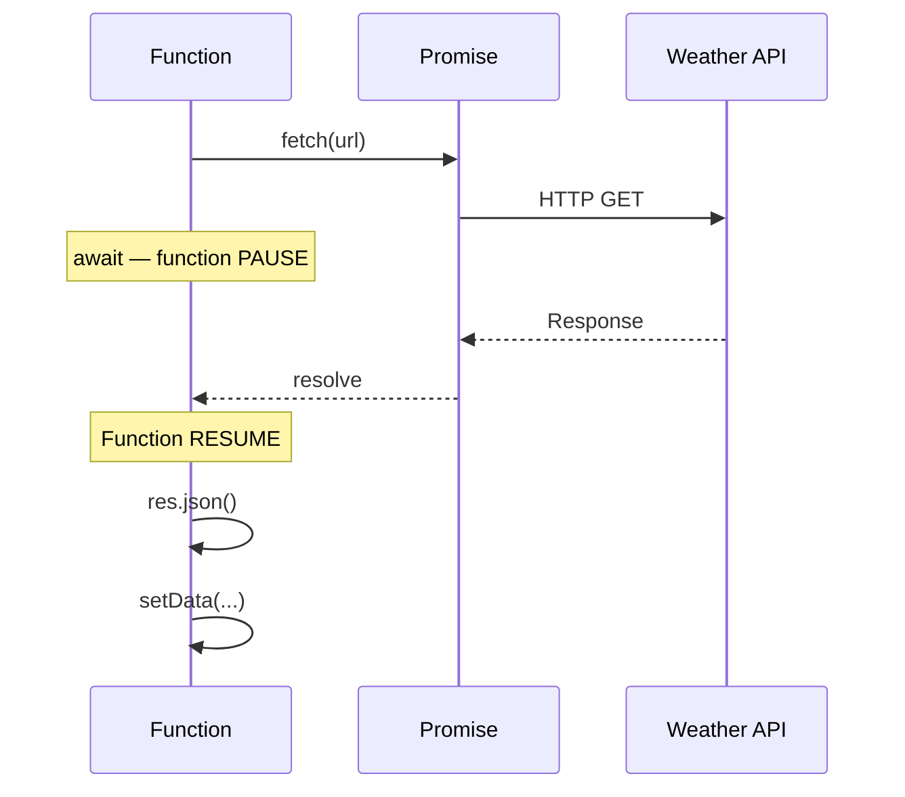
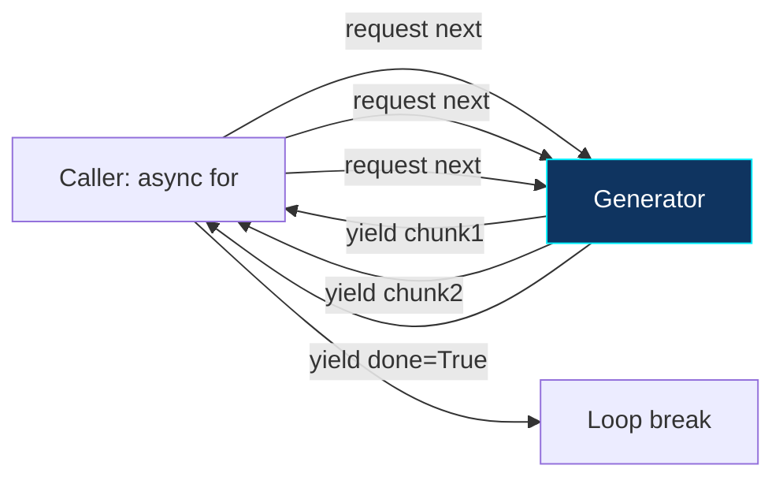

[⬅️ Previous: Step-by-Step Build](./08-STEP-BY-STEP.md) | [🏠 Back to Master Index](./00-START-HERE.md) | [➡️ Next: Frontend Tutorial](./10-FRONTEND-TUTORIAL.md)

---

# 📘 09 — LANGUAGE BASICS (TypeScript + Python Refresher)

> Is project mein **do languages** hain: TypeScript (frontend) aur Python (backend).
> Yeh file dono ka crash course hai — **real project code** ke examples ke saath! 🎓

---

## 🗺️ Language Concept Map



---

# PART A — TypeScript Essentials

## 1️⃣ Types & Interfaces

**Project code se real example:**

```typescript
// src/types/index.ts

// INTERFACE — object ki shape define karta hai
export interface ChatMessage {
  id: string;
  role: "user" | "assistant" | "system";  // ← UNION TYPE, sirf yeh 3 values
  content: string;
  timestamp: string;
  provider?: string;      // ← "?" matlab OPTIONAL
  isStreaming?: boolean;
}

// TYPE ALIAS — kisi bhi type ko naam do
export type TabName = "chat" | "controls" | "settings" | "tools";

// Usage
const msg: ChatMessage = {
  id: "abc",
  role: "user",        // ✅ valid
  // role: "admin",    // ❌ Error: Type '"admin"' is not assignable
  content: "namaste",
  timestamp: new Date().toISOString(),
};
```

**Interface vs Type — kaunsa use karein?**

| Feature | `interface` | `type` |
|---------|------------|--------|
| Object shapes | ✅ Best | ✅ Works |
| Union types | ❌ No | ✅ Yes |
| Extending | `extends` | `&` intersection |
| Declaration merging | ✅ Yes | ❌ No |
| **Rule of thumb** | Objects ke liye | Unions/primitives ke liye |

---

## 2️⃣ Generics — Reusable Type Logic

```typescript
// src/hooks/useAssistant.ts se
function pick<T>(arr: T[]): T {
  return arr[Math.floor(Math.random() * arr.length)];
}

// Usage — TypeScript automatically type infer karta hai
const name = pick(["Amit", "Priya"]);      // type: string
const num = pick([1, 2, 3]);               // type: number
const msg = pick<ChatMessage>(messages);   // type: ChatMessage
```

**`<T>` ka matlab:** "Yeh function kisi bhi type ke saath kaam karega, aur return
type input ke same hoga."

---

## 3️⃣ Optional Chaining & Nullish Coalescing

Yeh do operators **project mein everywhere** use hue hain:

```typescript
// src/lib/desktop.ts se

// ?. — OPTIONAL CHAINING
// Agar window.pika undefined hai toh crash nahi hoga, undefined return hoga
window.pika?.minimize();

// ?? — NULLISH COALESCING
// Agar left side null/undefined hai toh right side use karo
const result = (await window.pika?.maximize()) ?? false;

// Comparison with || (OR)
const a = 0 || 100;    // 100  ← 0 falsy hai, isliye 100
const b = 0 ?? 100;    // 0    ← 0 null/undefined nahi hai, isliye 0 ✅
```

> **Important:** `||` falsy values (0, "", false) par bhi fallback deta hai.
> `??` sirf `null` aur `undefined` par. Numbers ke liye hamesha `??` use karo!

---

## 4️⃣ Destructuring & Spread

```typescript
// DESTRUCTURING — object se values nikalna
const { isConnected, messages, addMessage } = useStore();

// Renaming
const { isConnected: connected } = useStore();

// Default values
const { theme = "dark" } = settings;

// Array destructuring
const [input, setInput] = useState("");

// SPREAD — copy + merge
const newSettings = { ...oldSettings, accentColor: "#00f0ff" };
const newMessages = [...messages, newMessage];

// Real project code:
updateSettings: (p) => set((s) => ({
  settings: { ...s.settings, ...p }   // purani settings + nayi patch
})),
```

---

## 5️⃣ Async / Await & Promises

```typescript
// src/hooks/useWeather.ts se — real project code
const load = useCallback(async (lat: number, lon: number) => {
  setLoading(true);
  try {
    const url = `https://api.open-meteo.com/v1/forecast?latitude=${lat}&longitude=${lon}&current=temperature_2m`;
    const res = await fetch(url);            // ← wait for response
    if (!res.ok) throw new Error("failed");
    const json = await res.json();           // ← wait for JSON parse
    setData({ tempC: json.current.temperature_2m });
    setError(null);
  } catch {
    setError("मौसम लोड नहीं हो सका");
  } finally {
    setLoading(false);                       // ← hamesha chalega
  }
}, []);
```



---

## 6️⃣ Modules — import / export

```typescript
// NAMED EXPORT (recommended — auto-complete better hota hai)
export function GlassCard() { ... }
export const APP_LIST = [...];

// Import
import { GlassCard, APP_LIST } from "@/components/GlassCard";

// DEFAULT EXPORT (ek file mein sirf ek)
export default function App() { ... }

// Import
import App from "@/App";

// TYPE-ONLY IMPORT (build size chhota rehta hai)
import type { ChatMessage } from "@/types";
```

> **`@/` kya hai?** Yeh path alias hai jo `vite.config.ts` mein set kiya:
> ```typescript
> resolve: { alias: { "@": path.resolve(__dirname, "src") } }
> ```
> Isse `../../../components/X` ki jagah `@/components/X` likh sakte hain. 🎯

---

# PART B — Python Essentials

## 1️⃣ Type Hints (Modern Python)

```python
# pc_bridge.py se real code

def resolve_path(path_str: str) -> Path:
    """String → Path object. Type hints se IDE autocomplete milta hai."""
    home = Path.home()
    if not path_str:
        return home / "Desktop"
    return Path(path_str).expanduser()

def ok(msg: str, data=None) -> dict:
    return {"success": True, "message": msg, "data": data}

# Modern union syntax (Python 3.10+)
def find_user(uid: int) -> dict | None:
    return db.get(uid)  # dict ya None

# Collections
def get_drives() -> list[dict]:
    return [{"name": "C:\\", "percent": 68}]
```

> Type hints **runtime par enforce nahi hote** — sirf documentation aur IDE help ke
> liye hain. Par bade projects mein bahut helpful hain!

---

## 2️⃣ Dictionaries — Python ka Superpower

```python
# pc_bridge.py se

APP_MAP = {
    "chrome": "chrome",
    "notepad": "notepad",
    "calculator": "calc",
    "कैलकुलेटर": "calc",   # Hindi bhi key ho sakti hai!
}

# Safe access — KeyError se bachne ke liye
exe = APP_MAP.get(name, name)         # default value
exe = APP_MAP.get(name)               # None if missing

# Dictionary as dispatch table (POLYMORPHISM!)
ROUTES = {
    "system": cmd_system,
    "volume": cmd_volume,
    "files": cmd_files,
}
handler = ROUTES.get(category)
result = handler(action, params)      # ← O(1) lookup

# Merging (Python 3.9+)
merged = {**defaults, **user_settings}
```

---

## 3️⃣ f-strings — String Formatting

```python
name = "Amit"
percent = 67.891

print(f"CPU: {percent}%")              # CPU: 67.891%
print(f"CPU: {percent:.1f}%")          # CPU: 67.9%      ← 1 decimal
print(f"CPU: {percent:>8.1f}%")        # CPU:     67.9%  ← right align
print(f"{name=}")                      # name='Amit'     ← debug shortcut

# Multi-line
msg = (
    f"System: {platform.system()}\n"
    f"CPU: {cpu}%\n"
    f"RAM: {ram}%"
)
```

---

## 4️⃣ Classes & Dunder Methods

```python
class Database:
    _instance = None
    _lock = threading.Lock()

    def __new__(cls, db_path="./data/pika.db"):
        """__new__ object CREATE karta hai (before __init__).
           Singleton pattern isi se banta hai."""
        with cls._lock:
            if cls._instance is None:
                cls._instance = super().__new__(cls)
                cls._instance._initialized = False
            return cls._instance

    def __init__(self, db_path="./data/pika.db"):
        """__init__ object INITIALIZE karta hai."""
        if self._initialized:
            return                    # already init, skip
        self.db_path = Path(db_path)
        self._initialized = True

    def __repr__(self) -> str:
        """print(db) par yeh dikhega"""
        return f"<Database path={self.db_path}>"

    def __enter__(self):
        """with statement ke liye"""
        return self

    def __exit__(self, exc_type, exc_val, exc_tb):
        """with block khatam hone par cleanup"""
        self.close()
```

| Dunder | Kab chalta hai |
|--------|----------------|
| `__new__` | Object create hone se pehle |
| `__init__` | Object initialize karte waqt |
| `__repr__` | `print()` ya REPL mein |
| `__str__` | `str()` conversion par |
| `__enter__` / `__exit__` | `with` statement mein |
| `__len__` | `len()` call par |

---

## 5️⃣ Async Python (asyncio)

```python
import asyncio

# COROUTINE — async function
async def fetch_weather(city: str) -> dict:
    await asyncio.sleep(1)          # non-blocking wait
    return {"temp": 32}

# Calling
async def main():
    data = await fetch_weather("Delhi")     # sequential
    print(data)

    # PARALLEL execution
    results = await asyncio.gather(
        fetch_weather("Delhi"),
        fetch_weather("Mumbai"),
        fetch_weather("Chennai"),
    )   # teeno EK SAATH chalenge, 3s nahi 1s lagega!

asyncio.run(main())
```

### ASYNC GENERATOR (LLM streaming ke liye)

```python
# pc_bridge.py se real code
async def llm_stream(text: str):
    """yield karta hai — caller ek-ek chunk le sakta hai"""
    for provider in providers:
        async for chunk in call_provider(provider, text):
            yield (chunk, provider, False)      # partial
        yield ("", provider, True)              # done marker
        return

# Consuming
async for chunk, provider, done in llm_stream("joke sunao"):
    print(chunk, end="")
    if done: break
```



---

## 6️⃣ Exception Handling

```python
# pc_bridge.py pattern — har handler mein
def cmd_files(action, params):
    try:
        p = resolve_path(params.get("path", ""))
        if not is_path_safe(p):
            return err("सुरक्षा: यह पथ प्रतिबंधित है।")
        p.write_text(params.get("content", ""), encoding="utf-8")
        return ok(f"फाइल बनी: {p}")
    except PermissionError:
        return err("अनुमति नहीं — admin के रूप में चलाएँ")
    except FileNotFoundError:
        return err("पथ नहीं मिला")
    except Exception as e:          # catch-all — app crash na ho
        return err(str(e))
    finally:
        pass                        # cleanup (hamesha chalega)
```

### Optional Import Pattern (Graceful Degradation)

```python
# Yeh pattern pc_bridge.py mein use hua hai
try:
    import psutil
except ImportError:
    psutil = None
    print("[warn] psutil not available — system info limited")

# Usage
def cmd_info(action, params):
    if not psutil:
        return err("psutil ज़रूरी है (pip install psutil)")
    return ok(f"CPU {psutil.cpu_percent()}%")
```

> Isse app **kabhi crash nahi hota** — library missing ho toh clear message milta hai.

---

## 7️⃣ Context Managers

```python
# Automatic cleanup — file khud band ho jayegi
with open("data.txt", "r", encoding="utf-8") as f:
    content = f.read()
# yahan f.close() automatic

# Custom context manager
from contextlib import contextmanager

@contextmanager
def transaction(self):
    conn = self._get_conn()
    cur = conn.cursor()
    try:
        yield cur
        conn.commit()       # success → commit
    except Exception:
        conn.rollback()     # error → rollback
        raise
    finally:
        cur.close()         # hamesha close

# Usage
with db.transaction() as cur:
    cur.execute("INSERT INTO reminders VALUES(?, ?, ?)", (id, text, time))
# Exception aaya toh automatic rollback! 🎯
```

---

## 🔄 TypeScript vs Python — Side by Side

| Concept | TypeScript | Python |
|---------|-----------|--------|
| Variable | `const x = 5;` | `x = 5` |
| Typed var | `const x: number = 5;` | `x: int = 5` |
| Function | `function f(a: number): string {}` | `def f(a: int) -> str:` |
| Arrow/Lambda | `(a) => a * 2` | `lambda a: a * 2` |
| Array/List | `const a: number[] = [1,2]` | `a: list[int] = [1,2]` |
| Object/Dict | `{ key: "val" }` | `{"key": "val"}` |
| String format | `` `Hi ${name}` `` | `f"Hi {name}"` |
| Async fn | `async function f() {}` | `async def f():` |
| Await | `await promise` | `await coroutine` |
| Null | `null` / `undefined` | `None` |
| Try-catch | `try {} catch(e) {}` | `try: except Exception as e:` |
| Class | `class A { constructor() {} }` | `class A: def __init__(self):` |
| Import | `import { x } from "y"` | `from y import x` |
| Comment | `// single` `/* multi */` | `# single` `""" multi """` |
| Ternary | `a ? b : c` | `b if a else c` |
| Spread | `{...obj}` `[...arr]` | `{**dict}` `[*list]` |

---

## 🎓 Free Learning Resources

### TypeScript
| Resource | Link |
|----------|------|
| Official Handbook | [typescriptlang.org/docs](https://www.typescriptlang.org/docs/handbook/intro.html) |
| TS Playground (browser) | [typescriptlang.org/play](https://www.typescriptlang.org/play) |
| Total TypeScript (free tier) | [totaltypescript.com](https://www.totaltypescript.com/tutorials) |
| TS in 100 Seconds | [Fireship](https://www.youtube.com/watch?v=zQnBQ4tB3ZA) |
| JS Basics (Hindi) | [CodeWithHarry](https://www.youtube.com/playlist?list=PLu0W_9lII9ah7DDtYtflgwMwpT3xmjXY9) |
| W3Schools JS | [w3schools.com/js](https://www.w3schools.com/js/) |

### Python
| Resource | Link |
|----------|------|
| Official Tutorial | [docs.python.org/3/tutorial](https://docs.python.org/3/tutorial/) |
| Python (Hindi) | [CodeWithHarry](https://www.youtube.com/playlist?list=PLu0W_9lII9agICnT8t4iYVSZ3eykIAOME) |
| Real Python Asyncio | [realpython.com/async-io-python](https://realpython.com/async-io-python/) |
| GeeksForGeeks Python | [geeksforgeeks.org/python-programming-language](https://www.geeksforgeeks.org/python-programming-language/) |
| Python Playground | [replit.com/languages/python3](https://replit.com/languages/python3) |
| Type Hints Guide | [docs.python.org/3/library/typing](https://docs.python.org/3/library/typing.html) |

---

## 🔗 Related Reading
- React specifics → [10-FRONTEND-TUTORIAL.md](./10-FRONTEND-TUTORIAL.md)
- WebSocket/asyncio → [11-BACKEND-BASICS.md](./11-BACKEND-BASICS.md)
- Real code explained → [13-CODE-WALKTHROUGH.md](./13-CODE-WALKTHROUGH.md)

---

[⬅️ Previous: Step-by-Step Build](./08-STEP-BY-STEP.md) | [🏠 Back to Master Index](./00-START-HERE.md) | [➡️ Next: Frontend Tutorial](./10-FRONTEND-TUTORIAL.md)
