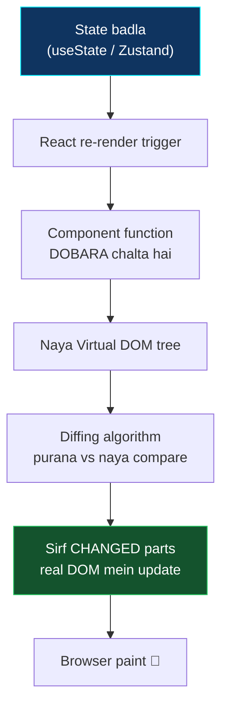
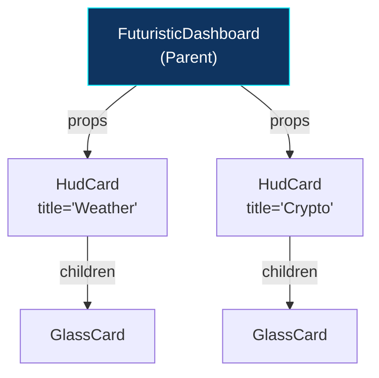
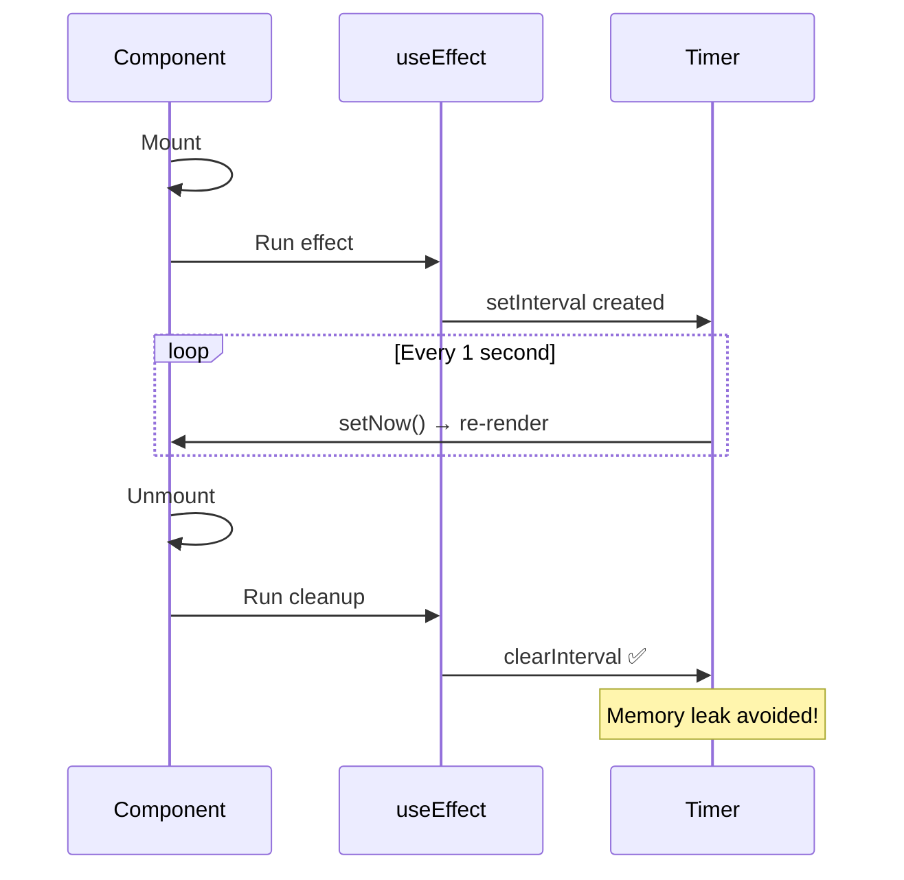
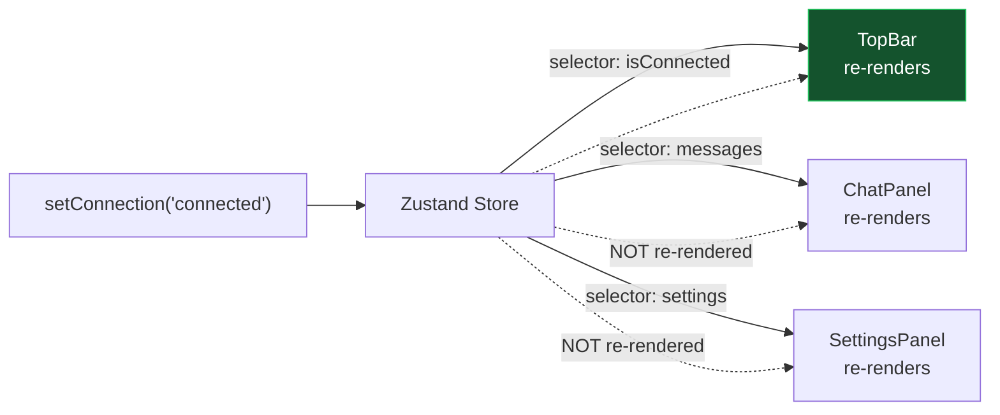

[⬅️ Previous: Language Basics](./09-LANGUAGE-BASICS.md) | [🏠 Back to Master Index](./00-START-HERE.md) | [➡️ Next: Backend Basics](./11-BACKEND-BASICS.md)

---

# ⚛️ 10 — FRONTEND TUTORIAL (React + Tailwind + Zustand + Electron)

> React seekhna hai? Yeh file **Pika ke actual code** se React sikhaayegi. Last mein
> ek chhota standalone login form bhi banayenge practice ke liye! 🎨

---

## 🧩 React Mental Model



> **Key insight:** React mein aap DOM ko directly touch nahi karte. Aap **state**
> badalte ho, React khud DOM update karta hai. Yeh **declarative programming** hai.

---

## 1️⃣ Components — Building Blocks

### Simplest Component (Pika se real)

```typescript
// src/components/GlassCard.tsx
import type { ReactNode } from "react";
import { cn } from "@/utils/cn";

export function GlassCard({
  children,
  className,
  strong = false,        // ← default value
}: {
  children: ReactNode;
  className?: string;
  strong?: boolean;
}) {
  return (
    <div className={cn(
      strong ? "glass-strong" : "glass-card",
      "rounded-2xl shadow-lg transition-all duration-300",
      className
    )}>
      {children}
    </div>
  );
}
```

**Usage:**
```typescript
<GlassCard className="p-4">
  <h2>Weather</h2>
  <p>32°C</p>
</GlassCard>
```

### Props — Data flow parent → child



> **Props read-only hote hain!** Child props ko modify nahi kar sakta. Data change
> karna hai toh parent se callback function pass karo.

---

## 2️⃣ Hooks — State & Side Effects

### `useState` — Component ki local memory

```typescript
// src/components/NeuralHUDCenter.tsx se
const [input, setInput] = useState("");          // string state
const [orbSize, setOrbSize] = useState(300);     // number state
const [reaction, setReaction] = useState(0.025);

// Update
setInput("hello");                    // direct value
setOrbSize((prev) => prev + 10);      // function form (safer)
```

> **Function form kab use karein?** Jab naya value purane par depend kare. React
> batching ke wajah se direct value stale ho sakti hai.

### `useEffect` — Side effects (API, timers, subscriptions)

```typescript
// Real code — 3 different patterns

// Pattern 1: Run ONCE on mount (empty dependency array)
useEffect(() => {
  loadWeather();
}, []);

// Pattern 2: Run when dependency changes
useEffect(() => {
  document.documentElement.style.setProperty("--accent", accent);
}, [accent]);   // ← accent badla toh chalega

// Pattern 3: With CLEANUP (very important!)
useEffect(() => {
  const timer = setInterval(() => setNow(new Date()), 1000);
  return () => clearInterval(timer);   // ← cleanup, memory leak se bachao
}, []);
```



### `useRef` — Value jo re-render trigger nahi karti

```typescript
// src/hooks/useAssistant.ts se
const ws = useRef<WebSocket | null>(null);      // WebSocket instance store
const reconnectDelay = useRef(1000);            // mutable counter
const scrollRef = useRef<HTMLDivElement>(null); // DOM element reference

// DOM access
scrollRef.current?.scrollTo({ top: 9999, behavior: "smooth" });
```

| Hook | Re-render trigger? | Use case |
|------|:------------------:|----------|
| `useState` | ✅ Yes | UI mein dikhne wala data |
| `useRef` | ❌ No | Timers, WebSocket, DOM refs |

### `useCallback` & `useMemo` — Performance

```typescript
// useCallback — function ko memoize karo
const processInput = useCallback((text: string) => {
  // heavy logic
}, [store, streamText]);   // sirf tab naya function banega jab deps badlein

// useMemo — computed value ko memoize karo
const particles = useMemo(() => {
  return Array.from({ length: 40 }).map(() => ({
    left: Math.random() * 100,
    duration: 8 + Math.random() * 14,
  }));
}, []);   // sirf ek baar generate hoga
```

---

## 3️⃣ Custom Hooks — Logic Reuse

```typescript
// src/hooks/useWeather.ts — poora real code
export function useWeather() {
  const [data, setData] = useState<WeatherData | null>(null);
  const [loading, setLoading] = useState(true);
  const [error, setError] = useState<string | null>(null);
  const coords = useRef({ lat: 28.6139, lon: 77.209 });

  const load = useCallback(async (lat: number, lon: number) => {
    setLoading(true);
    try {
      const res = await fetch(
        `https://api.open-meteo.com/v1/forecast?latitude=${lat}&longitude=${lon}&current=temperature_2m,relative_humidity_2m,weather_code&timezone=auto`
      );
      if (!res.ok) throw new Error("fetch failed");
      const j = await res.json();
      setData({
        tempC: j.current.temperature_2m,
        humidity: j.current.relative_humidity_2m,
        code: j.current.weather_code,
      });
      setError(null);
    } catch {
      setError("मौसम लोड नहीं हो सका");
    } finally {
      setLoading(false);
    }
  }, []);

  const refresh = useCallback(() => {
    load(coords.current.lat, coords.current.lon);
  }, [load]);

  useEffect(() => {
    if (navigator.geolocation) {
      navigator.geolocation.getCurrentPosition(
        (pos) => {
          coords.current = { lat: pos.coords.latitude, lon: pos.coords.longitude };
          load(pos.coords.latitude, pos.coords.longitude);
        },
        () => load(28.6139, 77.209),   // fallback: Delhi
        { timeout: 6000 }
      );
    }
    const t = setInterval(refresh, 5 * 60 * 1000);
    return () => clearInterval(t);
  }, [load, refresh]);

  return { data, loading, error, refresh };
}

// Usage in ANY component
const { data, loading, refresh } = useWeather();
```

> **Custom hook rules:** Naam `use` se shuru hona chahiye, aur sirf components ya
> dusre hooks ke andar call ho sakta hai.

---

## 4️⃣ Zustand — Global State

```typescript
// src/store/assistantStore.ts
import { create } from "zustand";

interface State {
  isConnected: boolean;
  messages: ChatMessage[];
  settings: AppSettings;
  setConnection: (s: string) => void;
  addMessage: (m: Omit<ChatMessage, "id" | "timestamp">) => string;
  updateSettings: (p: Partial<AppSettings>) => void;
}

export const useStore = create<State>((set, get) => ({
  // ─── State ───
  isConnected: false,
  messages: [],
  settings: defaultSettings,

  // ─── Actions ───
  setConnection: (status) => set({
    connectionStatus: status,
    isConnected: status === "connected"
  }),

  addMessage: (msg) => {
    const id = crypto.randomUUID();
    set((s) => ({ messages: [...s.messages, { ...msg, id, timestamp: new Date().toISOString() }] }));
    return id;
  },

  updateSettings: (p) => set((s) => ({ settings: { ...s.settings, ...p } })),
}));
```

### Selectors — Sirf zaroori state subscribe karo

```typescript
// ❌ BAD — poora store subscribe, har change par re-render
const store = useStore();

// ✅ GOOD — sirf isConnected subscribe, sirf uske change par re-render
const isConnected = useStore((s) => s.isConnected);

// ✅ Multiple selectors
const messages = useStore((s) => s.messages);
const addMessage = useStore((s) => s.addMessage);

// Outside React (event handlers, hooks)
useStore.getState().addToast({ type: "success", message: "Done!" });
```



---

## 5️⃣ Tailwind CSS v4

```typescript
// Utility classes = inline styles jaisa, par better
<div className="flex items-center gap-3 rounded-2xl bg-white/5 p-4 hover:bg-white/10 transition">
```

| Class | CSS equivalent |
|-------|----------------|
| `flex` | `display: flex` |
| `items-center` | `align-items: center` |
| `gap-3` | `gap: 0.75rem` |
| `rounded-2xl` | `border-radius: 1rem` |
| `bg-white/5` | `background: rgba(255,255,255,0.05)` |
| `p-4` | `padding: 1rem` |
| `text-xs` | `font-size: 0.75rem` |

### Responsive Design

```typescript
// Mobile-first — chhote screen default, bade screens ke liye prefix
<div className="
  grid grid-cols-1        {/* mobile: 1 column */}
  sm:grid-cols-2          {/* ≥640px: 2 columns */}
  lg:grid-cols-3          {/* ≥1024px: 3 columns */}
  gap-4
">
```

| Prefix | Min width |
|--------|-----------|
| (none) | 0px |
| `sm:` | 640px |
| `md:` | 768px |
| `lg:` | 1024px |
| `xl:` | 1280px |
| `2xl:` | 1536px |

### CSS Variables for Live Theming

```css
/* src/index.css */
:root {
  --accent: #00f0ff;
  --accent-rgb: 0, 240, 255;
}
```

```typescript
// Runtime mein change karo — poora UI instantly recolor
document.documentElement.style.setProperty("--accent", "#ff00ff");

// Use in Tailwind
<div className="bg-[var(--accent)] shadow-[0_0_20px_rgba(var(--accent-rgb),0.5)]" />
```

---

## 6️⃣ Framer Motion — Animations

```typescript
import { motion, AnimatePresence } from "framer-motion";

// Basic animation
<motion.div
  initial={{ opacity: 0, y: 20 }}      // start state
  animate={{ opacity: 1, y: 0 }}       // end state
  transition={{ duration: 0.3 }}
>
  Content
</motion.div>

// Infinite loop (Pika's rotating rings)
<motion.div
  animate={{ rotate: 360 }}
  transition={{ duration: 24, repeat: Infinity, ease: "linear" }}
/>

// Hover & tap
<motion.button whileHover={{ scale: 1.1 }} whileTap={{ scale: 0.9 }} />

// Exit animation (needs AnimatePresence)
<AnimatePresence>
  {isOpen && (
    <motion.div
      initial={{ opacity: 0 }}
      animate={{ opacity: 1 }}
      exit={{ opacity: 0 }}    // ← unmount animation
    />
  )}
</AnimatePresence>

// Draggable
<motion.div drag dragMomentum={false} />
```

---

## 7️⃣ Electron Integration in React

```typescript
// src/lib/desktop.ts — safe wrapper
export const isDesktopApp = () => Boolean(window.pika?.isDesktop);

export const desktop = {
  minimize: async () => window.pika?.minimize(),
  pickFile: async () => (await window.pika?.pickFile()) ?? null,
};

// Component mein use
function MyComponent() {
  if (!isDesktopApp()) return null;   // browser mein render hi mat karo

  return <button onClick={() => desktop.minimize()}>Minimize</button>;
}
```

### Draggable Title Bar

```typescript
<div style={{ WebkitAppRegion: "drag" } as React.CSSProperties}>
  Title bar — drag karne se window move hoga

  <button style={{ WebkitAppRegion: "no-drag" } as React.CSSProperties}>
    Button — yeh clickable rahega
  </button>
</div>
```

> **Gotcha:** Agar `no-drag` nahi lagaya toh buttons click hi nahi honge, kyunki
> poora area drag handle ban jayega!

---

# 🧪 MINI PROJECT: Standalone Login Form

Practice ke liye ek complete working login form:

```typescript
// LoginForm.tsx — copy-paste ready
import { useState, type FormEvent } from "react";
import { motion, AnimatePresence } from "framer-motion";
import { Lock, User, Eye, EyeOff, Loader2, CheckCircle2 } from "lucide-react";

interface FormState {
  username: string;
  password: string;
}

interface Errors {
  username?: string;
  password?: string;
  general?: string;
}

export default function LoginForm() {
  const [form, setForm] = useState<FormState>({ username: "", password: "" });
  const [errors, setErrors] = useState<Errors>({});
  const [showPassword, setShowPassword] = useState(false);
  const [loading, setLoading] = useState(false);
  const [success, setSuccess] = useState(false);

  const validate = (): boolean => {
    const e: Errors = {};
    if (!form.username.trim()) e.username = "Username ज़रूरी है";
    else if (form.username.length < 3) e.username = "कम से कम 3 अक्षर";
    if (!form.password) e.password = "Password ज़रूरी है";
    else if (form.password.length < 6) e.password = "कम से कम 6 अक्षर";
    setErrors(e);
    return Object.keys(e).length === 0;
  };

  const handleSubmit = async (ev: FormEvent) => {
    ev.preventDefault();
    if (!validate()) return;

    setLoading(true);
    setErrors({});
    try {
      // Simulated API call
      await new Promise((r) => setTimeout(r, 1200));
      if (form.username === "admin" && form.password === "pika123") {
        setSuccess(true);
      } else {
        setErrors({ general: "गलत username या password" });
      }
    } catch {
      setErrors({ general: "Server से connect नहीं हो सका" });
    } finally {
      setLoading(false);
    }
  };

  if (success) {
    return (
      <motion.div
        initial={{ scale: 0.8, opacity: 0 }}
        animate={{ scale: 1, opacity: 1 }}
        className="flex flex-col items-center gap-3 rounded-2xl bg-green-500/10 p-8"
      >
        <CheckCircle2 size={48} className="text-green-400" />
        <h2 className="text-xl font-bold text-white">स्वागत है, {form.username}!</h2>
        <button
          onClick={() => { setSuccess(false); setForm({ username: "", password: "" }); }}
          className="text-sm text-cyan-400 hover:underline"
        >
          Logout
        </button>
      </motion.div>
    );
  }

  return (
    <motion.form
      onSubmit={handleSubmit}
      initial={{ opacity: 0, y: 20 }}
      animate={{ opacity: 1, y: 0 }}
      className="mx-auto w-full max-w-sm space-y-4 rounded-2xl border border-white/10 bg-white/[0.04] p-6 backdrop-blur-xl"
    >
      <h2 className="text-center text-xl font-bold text-white">⚡ Pika Login</h2>

      {/* Username */}
      <div>
        <label className="mb-1 block text-xs text-white/60">Username</label>
        <div className="relative">
          <User size={16} className="absolute left-3 top-1/2 -translate-y-1/2 text-white/30" />
          <input
            value={form.username}
            onChange={(e) => setForm({ ...form, username: e.target.value })}
            placeholder="admin"
            className="w-full rounded-xl border border-white/10 bg-white/5 py-2.5 pl-10 pr-3 text-sm text-white outline-none focus:border-cyan-400"
          />
        </div>
        <AnimatePresence>
          {errors.username && (
            <motion.p
              initial={{ opacity: 0, height: 0 }}
              animate={{ opacity: 1, height: "auto" }}
              exit={{ opacity: 0, height: 0 }}
              className="mt-1 text-[11px] text-red-400"
            >
              {errors.username}
            </motion.p>
          )}
        </AnimatePresence>
      </div>

      {/* Password */}
      <div>
        <label className="mb-1 block text-xs text-white/60">Password</label>
        <div className="relative">
          <Lock size={16} className="absolute left-3 top-1/2 -translate-y-1/2 text-white/30" />
          <input
            type={showPassword ? "text" : "password"}
            value={form.password}
            onChange={(e) => setForm({ ...form, password: e.target.value })}
            placeholder="••••••"
            className="w-full rounded-xl border border-white/10 bg-white/5 py-2.5 pl-10 pr-10 text-sm text-white outline-none focus:border-cyan-400"
          />
          <button
            type="button"
            onClick={() => setShowPassword((v) => !v)}
            className="absolute right-3 top-1/2 -translate-y-1/2 text-white/30 hover:text-white"
          >
            {showPassword ? <EyeOff size={16} /> : <Eye size={16} />}
          </button>
        </div>
        <AnimatePresence>
          {errors.password && (
            <motion.p
              initial={{ opacity: 0, height: 0 }}
              animate={{ opacity: 1, height: "auto" }}
              exit={{ opacity: 0, height: 0 }}
              className="mt-1 text-[11px] text-red-400"
            >
              {errors.password}
            </motion.p>
          )}
        </AnimatePresence>
      </div>

      {errors.general && (
        <div className="rounded-lg bg-red-500/10 p-2 text-center text-xs text-red-300">
          {errors.general}
        </div>
      )}

      <motion.button
        type="submit"
        disabled={loading}
        whileHover={{ scale: loading ? 1 : 1.02 }}
        whileTap={{ scale: loading ? 1 : 0.98 }}
        className="flex w-full items-center justify-center gap-2 rounded-xl bg-gradient-to-r from-cyan-500 to-fuchsia-500 py-2.5 text-sm font-semibold text-white disabled:opacity-50"
      >
        {loading ? <><Loader2 size={16} className="animate-spin" /> Checking...</> : "Login"}
      </motion.button>

      <p className="text-center text-[10px] text-white/30">
        Demo: admin / pika123
      </p>
    </motion.form>
  );
}
```

---

## 🎓 Free Learning Resources

| Topic | Resource |
|-------|----------|
| React Official | [react.dev/learn](https://react.dev/learn) ⭐ |
| React (Hindi) | [Apna College](https://www.youtube.com/watch?v=SqcY0GlETPk) |
| React (Hindi) | [CodeWithHarry](https://www.youtube.com/playlist?list=PLu0W_9lII9agx66oZnT6IyhcMIbUMNMdt) |
| Hooks Reference | [react.dev/reference/react](https://react.dev/reference/react) |
| Tailwind Docs | [tailwindcss.com/docs](https://tailwindcss.com/docs) |
| Tailwind Playground | [play.tailwindcss.com](https://play.tailwindcss.com/) |
| Zustand Docs | [zustand.docs.pmnd.rs](https://zustand.docs.pmnd.rs/) |
| Framer Motion | [motion.dev/docs](https://motion.dev/docs) |
| Recharts | [recharts.org](https://recharts.org/en-US/examples) |
| Electron | [electronjs.org/docs](https://www.electronjs.org/docs/latest/) |
| CodeSandbox (practice) | [codesandbox.io](https://codesandbox.io/) |

---

## 🔗 Related Reading
- Backend side → [11-BACKEND-BASICS.md](./11-BACKEND-BASICS.md)
- Real code explained → [13-CODE-WALKTHROUGH.md](./13-CODE-WALKTHROUGH.md)
- UI user guide → [22-UI-USER-MANUAL.md](./22-UI-USER-MANUAL.md)

---

[⬅️ Previous: Language Basics](./09-LANGUAGE-BASICS.md) | [🏠 Back to Master Index](./00-START-HERE.md) | [➡️ Next: Backend Basics](./11-BACKEND-BASICS.md)
