[⬅️ Previous: Frontend Tutorial](./10-FRONTEND-TUTORIAL.md) | [🏠 Back to Master Index](./00-START-HERE.md) | [➡️ Next: Database Basics](./12-DATABASE-BASICS.md)

---

# 🐍 11 — BACKEND BASICS (WebSocket + asyncio Simplified)

> Sockets aur async programming darawni lagti hai? Chinta mat karo! Yeh file
> **real-world analogies** se sab samjhaayegi, aur ek complete working
> client-server example bhi degi. 📡

---

## ☎️ Analogy: HTTP vs WebSocket


| | HTTP (Postcard) | WebSocket (Phone) |
|---|-----------------|-------------------|
| Connection | Har request par nayi | Ek baar, phir reuse |
| Direction | Client hi shuru kar sakta | Dono kar sakte hain |
| Overhead | Headers har baar (~500 bytes) | Handshake ek baar |
| Latency | 50-100ms | 2-8ms |
| Server push | ❌ Impossible | ✅ Native |

---

## 🔌 WebSocket Handshake Explained

```mermaid
sequenceDiagram
    autonumber
    participant C as Client (Browser)
    participant S as Server (Python)

    Note over C,S: Phase 1: HTTP Upgrade Request
    C->>S: GET /  HTTP/1.1<br/>Upgrade: websocket<br/>Connection: Upgrade<br/>Sec-WebSocket-Key: dGhlIHNhbXBsZQ==

    Note over S: Server key ko hash karta hai
    S-->>C: HTTP/1.1 101 Switching Protocols<br/>Upgrade: websocket<br/>Sec-WebSocket-Accept: s3pPLMBiT...

    Note over C,S: Phase 2: Connection OPEN 🔓
    rect rgb(20, 83, 45)
        C->>S: Frame: {"type":"command",...}
        S-->>C: Frame: {"type":"response",...}
        S-->>C: Frame: {"type":"event",...} (server push!)
        C->>S: Frame: binary audio bytes
    end

    Note over C,S: Phase 3: Close
    C->>S: Close frame
    S-->>C: Close frame ACK
```



**Key point:** WebSocket **HTTP se shuru hota hai** (port 80/443 firewall friendly),
phir protocol "upgrade" ho jaata hai.

---

## 🔄 asyncio Event Loop — Restaurant Analogy

```mermaid
flowchart TD
    subgraph "❌ Synchronous Waiter (Blocking)"
        S1["Table 1 ka order lo"] --> S2["Kitchen mein jao"]
        S2 --> S3["⏳ 20 min KHADE raho<br/>jab tak khana bane"]
        S3 --> S4["Table 1 ko serve karo"]
        S4 --> S5["Ab Table 2 ka order lo"]
        S5 --> S6["😡 Table 2 ne 20 min wait kiya!"]
    end

    subgraph "✅ Async Waiter (Non-blocking)"
        A1["Table 1 ka order lo"] --> A2["Kitchen ko de do"]
        A2 --> A3["Table 2 ka order lo<br/>(wait nahi kiya)"]
        A3 --> A4["Table 3 ka order lo"]
        A4 --> A5["🔔 Kitchen: Table 1 ready!"]
        A5 --> A6["Table 1 serve karo"]
        A6 --> A7["😊 Sab khush!"]
    end

    style S6 fill:#7f1d1d,stroke:#ef4444,color:#fff
    style A7 fill:#14532d,stroke:#22c55e,color:#fff
```



**Code mein:**
```python
# ❌ Blocking waiter
def sync_handler():
    time.sleep(20)          # poora program ruk gaya
    return "done"

# ✅ Async waiter
async def async_handler():
    await asyncio.sleep(20)  # loop dusre kaam kar sakta hai
    return "done"
```

---

## 🏗️ Complete Minimal WebSocket Server

```python
#!/usr/bin/env python3
"""
mini_server.py — Standalone WebSocket server example
Run: pip install websockets && python mini_server.py
"""
import asyncio
import json
import platform
from datetime import datetime
import websockets
from websockets.asyncio.server import serve

HOST, PORT = "0.0.0.0", 8765
clients = set()


# ─── Response helpers ─────────────────────────────────────────────
def ok(msg: str, data=None) -> dict:
    return {"success": True, "message": msg, "data": data}


def err(msg: str) -> dict:
    return {"success": False, "message": msg, "data": None}


# ─── Command handlers ─────────────────────────────────────────────
def cmd_echo(action: str, params: dict) -> dict:
    """Simple echo — testing ke liye"""
    return ok(f"Echo: {params.get('text', '')}")


def cmd_math(action: str, params: dict) -> dict:
    """Safe calculator using AST (eval se bacho!)"""
    import ast
    import operator as op

    OPS = {
        ast.Add: op.add, ast.Sub: op.sub, ast.Mult: op.mul,
        ast.Div: op.truediv, ast.Pow: op.pow, ast.USub: op.neg,
    }

    def evaluate(node):
        if isinstance(node, ast.Constant):
            return node.value
        if isinstance(node, ast.BinOp):
            return OPS[type(node.op)](evaluate(node.left), evaluate(node.right))
        if isinstance(node, ast.UnaryOp):
            return OPS[type(node.op)](evaluate(node.operand))
        raise ValueError("Unsupported expression")

    try:
        expr = params.get("expression", "")
        result = evaluate(ast.parse(expr, mode="eval").body)
        return ok(f"{expr} = {result}", {"result": result})
    except Exception:
        return err("अमान्य expression")


def cmd_system(action: str, params: dict) -> dict:
    """System info"""
    if action == "info":
        return ok("System info", {
            "os": platform.system(),
            "release": platform.release(),
            "python": platform.python_version(),
        })
    return err(f"Unknown action: {action}")


ROUTES = {
    "echo": cmd_echo,
    "math": cmd_math,
    "system": cmd_system,
}


def route_command(data: dict) -> dict:
    handler = ROUTES.get(data.get("category"))
    if not handler:
        return err(f"Unknown category: {data.get('category')}")
    try:
        return handler(data.get("action", ""), data.get("params", {}) or {})
    except Exception as e:
        return err(str(e))


# ─── Background task: push server time every 3 seconds ────────────
async def clock_loop(ws):
    try:
        while True:
            await ws.send(json.dumps({
                "type": "event",
                "event": "server_time",
                "data": {"time": datetime.now().strftime("%H:%M:%S")},
                "timestamp": datetime.utcnow().isoformat(),
            }))
            await asyncio.sleep(3)
    except Exception:
        pass  # connection closed


# ─── Main connection handler ──────────────────────────────────────
async def handle_client(ws):
    addr = f"{ws.remote_address[0]}:{ws.remote_address[1]}"
    clients.add(ws)
    print(f"[+] Connected: {addr} (total: {len(clients)})")

    # Welcome message
    await ws.send(json.dumps({
        "type": "event",
        "event": "connection_ready",
        "data": {"server": "mini-server", "os": platform.system()},
        "timestamp": datetime.utcnow().isoformat(),
    }))

    # Start background clock
    clock_task = asyncio.create_task(clock_loop(ws))

    try:
        async for message in ws:
            # Binary frames (audio, files)
            if isinstance(message, bytes):
                print(f"[bin] {len(message)} bytes received")
                continue

            # JSON frames
            try:
                data = json.loads(message)
            except json.JSONDecodeError:
                await ws.send(json.dumps({"type": "error", "message": "Invalid JSON"}))
                continue

            print(f"[cmd] {data.get('category')}/{data.get('action')}")
            result = route_command(data)

            await ws.send(json.dumps({
                "type": "response",
                "status": "success" if result["success"] else "error",
                "message": result["message"],
                "data": result["data"],
                "id": data.get("id"),
                "timestamp": datetime.utcnow().isoformat(),
            }))

    except websockets.exceptions.ConnectionClosed:
        pass
    finally:
        clock_task.cancel()
        clients.discard(ws)
        print(f"[-] Disconnected: {addr} (total: {len(clients)})")


async def broadcast(message: str):
    """Sab connected clients ko ek saath bhejo"""
    if clients:
        await asyncio.gather(*[c.send(message) for c in clients],
                             return_exceptions=True)


async def main():
    print(f"⚡ Mini WebSocket Server → ws://localhost:{PORT}")
    async with serve(handle_client, HOST, PORT):
        await asyncio.Future()   # run forever


if __name__ == "__main__":
    try:
        asyncio.run(main())
    except KeyboardInterrupt:
        print("\nServer stopped.")
```

### Matching HTML Client

```html
<!DOCTYPE html>
<html>
<head>
  <title>Mini WS Client</title>
  <style>
    body { font-family: monospace; background: #0a0b10; color: #e5e7eb; padding: 20px; }
    #log { height: 300px; overflow-y: auto; background: #000; padding: 10px;
           border: 1px solid #333; border-radius: 8px; }
    button, input { padding: 8px; margin: 4px; background: #1a1a2e; color: #fff;
                    border: 1px solid #00f0ff; border-radius: 6px; }
    .ok { color: #22c55e; } .err { color: #ef4444; } .ev { color: #00f0ff; }
  </style>
</head>
<body>
  <h2>⚡ Mini WebSocket Client</h2>
  <div id="status">🔴 Disconnected</div>
  <div id="log"></div>
  <input id="expr" placeholder="2+3*4" value="2+3*4">
  <button onclick="sendMath()">Calculate</button>
  <button onclick="sendInfo()">System Info</button>

  <script>
    const log = (msg, cls = '') =>
      document.getElementById('log').innerHTML +=
        `<div class="${cls}">[${new Date().toLocaleTimeString()}] ${msg}</div>`;

    let ws;
    function connect() {
      ws = new WebSocket('ws://localhost:8765');
      ws.onopen = () => {
        document.getElementById('status').textContent = '🟢 Connected';
        log('Connected to server', 'ok');
      };
      ws.onclose = () => {
        document.getElementById('status').textContent = '🔴 Disconnected';
        log('Disconnected — retrying in 2s', 'err');
        setTimeout(connect, 2000);
      };
      ws.onmessage = (e) => {
        const m = JSON.parse(e.data);
        if (m.type === 'event') log(`EVENT ${m.event}: ${JSON.stringify(m.data)}`, 'ev');
        else log(`${m.status.toUpperCase()}: ${m.message}`, m.status === 'success' ? 'ok' : 'err');
      };
    }

    const send = (obj) => ws?.readyState === 1 &&
      ws.send(JSON.stringify({ ...obj, id: crypto.randomUUID(),
                               timestamp: new Date().toISOString() }));

    const sendMath = () => send({
      type: 'command', category: 'math', action: 'eval',
      params: { expression: document.getElementById('expr').value }
    });

    const sendInfo = () => send({
      type: 'command', category: 'system', action: 'info', params: {}
    });

    connect();
  </script>
</body>
</html>
```

**Test karo:**
```bash
python mini_server.py       # Terminal 1
# Browser mein client.html kholo
```

---

## ⚠️ Common Async Mistakes

### Mistake 1: Blocking the Event Loop

```python
# ❌ GALAT — poora server freeze
async def bad_handler():
    time.sleep(5)                    # blocking!
    resp = requests.get(url)          # blocking!
    return resp.json()

# ✅ SAHI
async def good_handler():
    await asyncio.sleep(5)                           # non-blocking
    loop = asyncio.get_event_loop()
    resp = await loop.run_in_executor(None, lambda: requests.get(url))
    return resp.json()
```

### Mistake 2: Forgetting `await`

```python
# ❌ GALAT — coroutine object return hoga, result nahi
result = fetch_data()        # <coroutine object at 0x...>

# ✅ SAHI
result = await fetch_data()  # actual data
```

### Mistake 3: Thread se Loop Access

```python
# ❌ GALAT — thread-unsafe, race condition
def worker():
    queue.put_nowait(data)      # from another thread!

# ✅ SAHI
def worker():
    loop.call_soon_threadsafe(queue.put_nowait, data)
```

### Mistake 4: No Exception Handling in Tasks

```python
# ❌ Silently fail ho jayega
asyncio.create_task(background_job())

# ✅ Wrap in try/except
async def safe_job():
    try:
        await background_job()
    except Exception as e:
        logger.error(f"Job failed: {e}")

asyncio.create_task(safe_job())
```

---

## 📊 Pika's Backend Architecture

```mermaid
flowchart TD
    subgraph "Event Loop (Main Thread)"
        HC["handle_client()<br/>per connection"]
        SL["status_loop()<br/>every 5s"]
        LS["llm_stream()<br/>on demand"]
        RT["reminder timers"]
    end

    subgraph "Worker Threads"
        W1["requests.post()<br/>LLM API"]
        W2["pyttsx3 TTS<br/>generation"]
        W3["Vosk model<br/>download"]
    end

    subgraph "External"
        OS["OS subprocess"]
        API["LLM APIs"]
        MIC["Audio stream"]
    end

    HC --> OS
    LS -.run_in_executor.-> W1
    W1 --> API
    HC -.asyncio.to_thread.-> W2
    MIC --> HC

    W1 -.call_soon_threadsafe.-> LS

    style HC fill:#0f3460,stroke:#00f0ff,color:#fff
    style W1 fill:#7c2d12,stroke:#f97316,color:#fff
```

---

## 🔐 Security Considerations

| Threat | Mitigation in Pika |
|--------|-------------------|
| Arbitrary code execution | AST-based safe eval, no `eval()` |
| Path traversal | Blocklist + home-relative resolution |
| Destructive commands | Two-phase confirmation |
| DoS via spam | Rate limiting (5/sec, 60/min) |
| Sensitive data exposure | API keys in `.env`, never logged |
| Remote access | Server binds `0.0.0.0` but LAN-only, no auth needed for localhost |

> **Production note:** Agar internet par expose karna ho toh **`wss://` + token
> authentication** mandatory hai. Localhost/LAN ke liye current setup theek hai.

---

## 🎓 Free Learning Resources

| Topic | Resource |
|-------|----------|
| Python asyncio | [docs.python.org/3/library/asyncio](https://docs.python.org/3/library/asyncio.html) |
| Real Python Asyncio | [realpython.com/async-io-python](https://realpython.com/async-io-python/) ⭐ |
| websockets library | [websockets.readthedocs.io](https://websockets.readthedocs.io/) |
| MDN WebSocket | [developer.mozilla.org WebSockets](https://developer.mozilla.org/en-US/docs/Web/API/WebSockets_API) |
| Socket Programming (Hindi) | [CodeWithHarry Python](https://www.youtube.com/playlist?list=PLu0W_9lII9agICnT8t4iYVSZ3eykIAOME) |
| GFG Socket Programming | [geeksforgeeks.org/socket-programming-python](https://www.geeksforgeeks.org/socket-programming-python/) |
| WebSocket Echo Test | [websocket.org/echo.html](https://websocket.org/echo.html) |
| Postman (WS testing) | [postman.com](https://www.postman.com/) |

---

## 🔗 Related Reading
- Protocol reference → [04-API-FLOW.md](./04-API-FLOW.md)
- Database layer → [12-DATABASE-BASICS.md](./12-DATABASE-BASICS.md)
- Full code walkthrough → [13-CODE-WALKTHROUGH.md](./13-CODE-WALKTHROUGH.md)

---

[⬅️ Previous: Frontend Tutorial](./10-FRONTEND-TUTORIAL.md) | [🏠 Back to Master Index](./00-START-HERE.md) | [➡️ Next: Database Basics](./12-DATABASE-BASICS.md)
