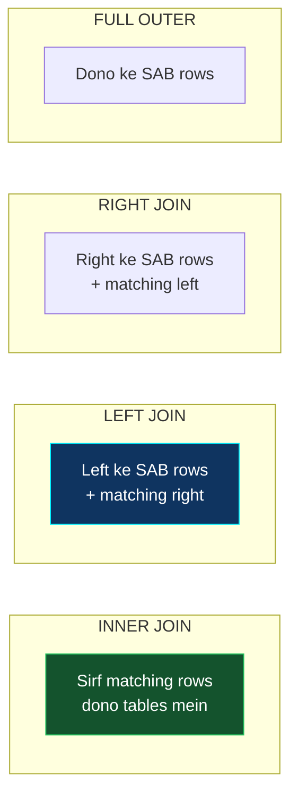
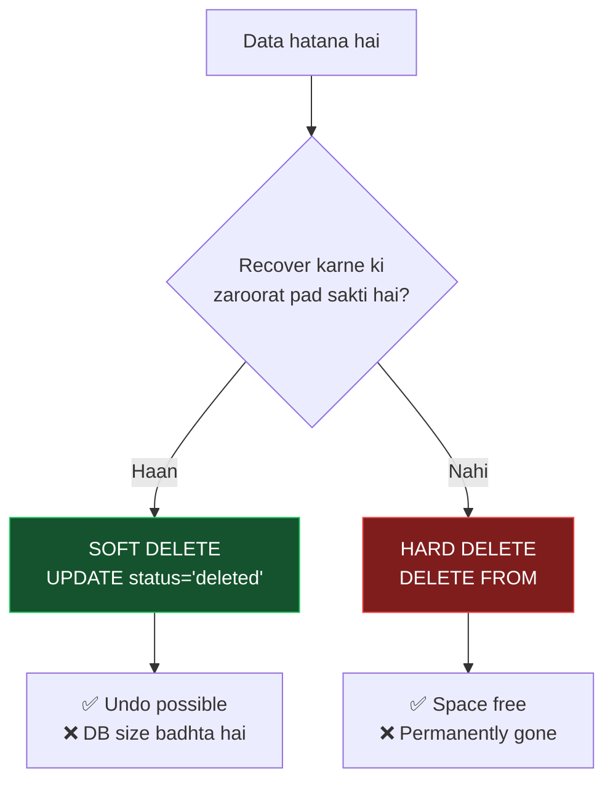
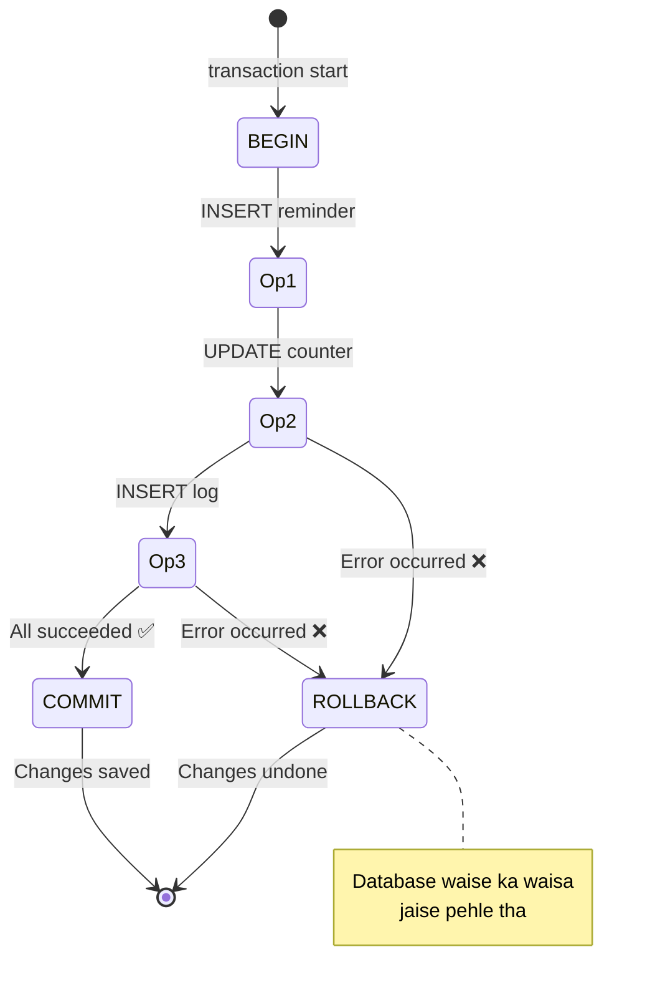
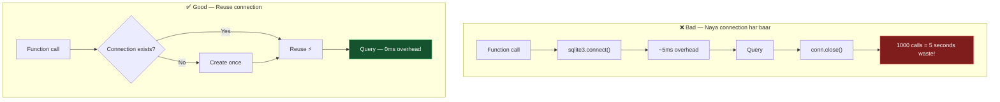
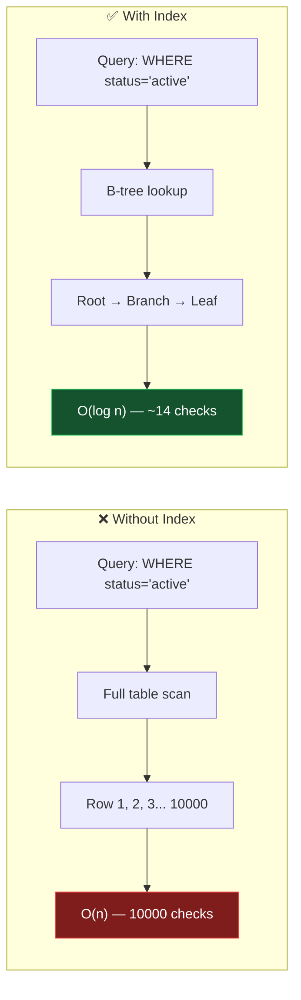

[⬅️ Previous: Backend Basics](./11-BACKEND-BASICS.md) | [🏠 Back to Master Index](./00-START-HERE.md) | [➡️ Next: Code Walkthrough](./13-CODE-WALKTHROUGH.md)

---

# 🗃️ 12 — DATABASE BASICS (SQLite CRUD + Security)

> Database ka matlab sirf "data store karna" nahi hai. Isme **security**,
> **transactions**, **connection management** — sab aata hai. Chalo seekhte hain! 💾

---

## 🎯 CRUD — The Four Pillars


| Operation | SQL | HTTP equivalent |
|-----------|-----|-----------------|
| **C**reate | `INSERT INTO` | POST |
| **R**ead | `SELECT` | GET |
| **U**pdate | `UPDATE ... SET` | PUT/PATCH |
| **D**elete | `DELETE FROM` | DELETE |

---

## 1️⃣ CREATE — Data Insert Karna

```sql
-- Basic insert
INSERT INTO reminders (id, text, trigger_time, status)
VALUES ('abc-123', 'Chai break', '2026-07-02T15:30:00', 'active');

-- Multiple rows ek saath
INSERT INTO snippets (trigger, content) VALUES
    ('addr', '123 MG Road, New Delhi'),
    ('sig', 'Thanks,\nAmit'),
    ('email', 'amit@example.com');

-- UPSERT — insert ya update (bahut useful!)
INSERT INTO settings (key, value, updated_at)
VALUES ('accent_color', '#00f0ff', datetime('now'))
ON CONFLICT(key) DO UPDATE SET
    value = excluded.value,
    updated_at = excluded.updated_at;
```

**Python mein:**
```python
def add_reminder(self, text: str, trigger_time: datetime) -> str:
    rid = str(uuid.uuid4())
    with self.transaction() as cur:
        cur.execute(
            "INSERT INTO reminders(id, text, trigger_time) VALUES(?, ?, ?)",
            (rid, text, trigger_time.isoformat())    # ← TUPLE, comma zaroori!
        )
    return rid
```

> ⚠️ **Common bug:** `(rid)` tuple nahi hai! `(rid,)` hai. Comma bhoolna common
> galti hai — `TypeError: Incorrect number of bindings` aayega.

---

## 2️⃣ READ — Data Nikalna

```sql
-- Sab kuch
SELECT * FROM reminders;

-- Specific columns (faster — kam data transfer)
SELECT id, text, trigger_time FROM reminders;

-- Filtering
SELECT * FROM reminders WHERE status = 'active';

-- Multiple conditions
SELECT * FROM command_log
WHERE category = 'files' AND status = 'error';

-- Sorting + limiting
SELECT * FROM command_log
ORDER BY timestamp DESC
LIMIT 20;

-- Aggregation
SELECT category, COUNT(*) AS total, AVG(duration_ms) AS avg_time
FROM command_log
GROUP BY category
HAVING total > 5              -- HAVING filters AFTER grouping
ORDER BY total DESC;

-- Pattern matching
SELECT * FROM snippets WHERE trigger LIKE 'em%';   -- starts with 'em'
SELECT * FROM snippets WHERE content LIKE '%delhi%';  -- contains

-- Subquery
SELECT * FROM conversation
WHERE session_id = (SELECT id FROM sessions ORDER BY started_at DESC LIMIT 1);

-- JOIN
SELECT c.content, s.started_at
FROM conversation c
INNER JOIN sessions s ON c.session_id = s.id
WHERE s.message_count > 5;
```

### JOIN Types Visual



> **SQLite note:** `RIGHT JOIN` aur `FULL OUTER JOIN` sirf SQLite 3.39+ mein hain.
> Purane versions mein `LEFT JOIN` ko reverse karke use karo.

**Python mein:**
```python
def get_active_reminders(self) -> list[dict]:
    conn = self._get_conn()
    conn.row_factory = sqlite3.Row       # dict-like access enable
    rows = conn.execute(
        "SELECT * FROM reminders WHERE status = ? ORDER BY trigger_time ASC",
        ("active",)
    ).fetchall()
    return [dict(r) for r in rows]

# fetchone() — sirf pehli row
row = conn.execute("SELECT * FROM settings WHERE key = ?", ("theme",)).fetchone()
value = row["value"] if row else "dark"

# fetchmany(n) — n rows
rows = cursor.fetchmany(10)
```

---

## 3️⃣ UPDATE — Data Badalna

```sql
-- Single field
UPDATE reminders SET status = 'triggered' WHERE id = 'abc-123';

-- Multiple fields
UPDATE settings
SET value = '#ff00ff', updated_at = datetime('now')
WHERE key = 'accent_color';

-- Increment counter
UPDATE snippets SET use_count = use_count + 1 WHERE trigger = 'addr';

-- Conditional update
UPDATE reminders
SET status = 'triggered'
WHERE status = 'active' AND trigger_time <= datetime('now');
```

> ⚠️ **WHERE bhoolna = disaster!** `UPDATE reminders SET status = 'x'` — yeh SAARE
> rows update kar dega. Hamesha WHERE lagao (jab tak intentionally sab na badalna ho).

---

## 4️⃣ DELETE — Data Hatana

```sql
-- Specific row
DELETE FROM reminders WHERE id = 'abc-123';

-- Conditional
DELETE FROM command_log WHERE timestamp < datetime('now', '-30 days');

-- Sab kuch (careful!)
DELETE FROM clipboard_history;

-- Soft delete (better practice — data recoverable rehta hai)
UPDATE reminders SET status = 'cancelled' WHERE id = 'abc-123';
```



---

## 🛡️ SQL INJECTION — The #1 Security Threat

### Attack Demonstration

```mermaid
sequenceDiagram
    actor H as 😈 Hacker
    participant A as App
    participant DB as Database

    Note over H,DB: ❌ VULNERABLE CODE
    H->>A: Input: Robert'); DROP TABLE users;--
    A->>A: query = f"SELECT * WHERE name='{input}'"
    A->>DB: SELECT * WHERE name='Robert'); DROP TABLE users;--'
    DB->>DB: 💀 Table DROPPED!
    DB-->>A: Success (data gone forever)

    Note over H,DB: ✅ SAFE CODE
    H->>A: Input: Robert'); DROP TABLE users;--
    A->>DB: execute("SELECT * WHERE name=?", (input,))
    DB->>DB: Searches for literal string
    DB-->>A: 0 rows found ✅
```

### The Golden Rules

```python
# ❌ NEVER — String concatenation
cur.execute("SELECT * FROM users WHERE id = " + user_id)
cur.execute(f"SELECT * FROM users WHERE id = {user_id}")
cur.execute("SELECT * FROM users WHERE id = %s" % user_id)

# ✅ ALWAYS — Parameterized queries
cur.execute("SELECT * FROM users WHERE id = ?", (user_id,))

# ✅ Named parameters (more readable)
cur.execute(
    "INSERT INTO reminders(id, text) VALUES(:id, :text)",
    {"id": rid, "text": text}
)

# ✅ Multiple rows
cur.executemany(
    "INSERT INTO snippets(trigger, content) VALUES(?, ?)",
    [("addr", "Delhi"), ("sig", "Thanks")]
)
```

### ⚠️ Table/Column names can't be parameterized!

```python
# ❌ Yeh kaam nahi karega
cur.execute("SELECT * FROM ?", (table_name,))

# ✅ Whitelist approach
ALLOWED_TABLES = {"reminders", "settings", "snippets"}
if table_name not in ALLOWED_TABLES:
    raise ValueError("Invalid table")
cur.execute(f"SELECT * FROM {table_name}")   # ab safe hai
```

---

## 🔄 TRANSACTIONS — All or Nothing



### ACID Properties

| Letter | Property | Meaning |
|--------|----------|---------|
| **A** | Atomicity | Sab ya kuch nahi — half-done nahi |
| **C** | Consistency | Constraints hamesha valid rahenge |
| **I** | Isolation | Parallel transactions ek dusre ko disturb nahi karte |
| **D** | Durability | Commit ke baad data permanent (crash pe bhi safe) |

### Implementation

```python
from contextlib import contextmanager

@contextmanager
def transaction(self):
    """
    Auto-commit on success, auto-rollback on error.
    Usage:
        with db.transaction() as cur:
            cur.execute("INSERT ...")
            cur.execute("UPDATE ...")
        # Yahan tak pahunche toh COMMIT ho gaya
    """
    conn = self._get_conn()
    cur = conn.cursor()
    try:
        yield cur
        conn.commit()          # ✅ success
    except Exception:
        conn.rollback()        # ❌ error → undo everything
        raise                  # re-raise so caller knows
    finally:
        cur.close()            # hamesha cleanup
```

**Real-world example:**
```python
# Bank transfer — dono operations saath mein hone chahiye
with db.transaction() as cur:
    cur.execute("UPDATE accounts SET balance = balance - 500 WHERE id = 'A'")
    cur.execute("UPDATE accounts SET balance = balance + 500 WHERE id = 'B'")
# Agar doosri line fail hui toh pehli bhi rollback ho jayegi
# Warna paisa gayab ho jata! 💸
```

---

## 🏊 CONNECTION POOLING (Singleton Pattern)

### Problem



### Thread-Safe Implementation

```python
import sqlite3
import threading
from pathlib import Path


class Database:
    _instance = None
    _lock = threading.Lock()

    def __new__(cls, db_path: str = "./data/pika.db"):
        with cls._lock:                              # thread-safe creation
            if cls._instance is None:
                cls._instance = super().__new__(cls)
                cls._instance._initialized = False
            return cls._instance

    def __init__(self, db_path: str = "./data/pika.db"):
        if self._initialized:
            return
        self.db_path = Path(db_path)
        self.db_path.parent.mkdir(parents=True, exist_ok=True)
        self._local = threading.local()             # per-thread storage
        self._init_tables()
        self._initialized = True

    def _get_conn(self) -> sqlite3.Connection:
        """
        SQLite connections thread-safe NAHI hote by default.
        Isliye har thread ko apna connection dete hain (threading.local).
        """
        if not hasattr(self._local, "conn"):
            self._local.conn = sqlite3.connect(
                str(self.db_path),
                check_same_thread=False,
                timeout=10.0                        # lock wait timeout
            )
            self._local.conn.row_factory = sqlite3.Row
            self._local.conn.execute("PRAGMA foreign_keys = ON")
            self._local.conn.execute("PRAGMA journal_mode = WAL")
        return self._local.conn
```

### Important PRAGMAs

| PRAGMA | Value | Effect |
|--------|-------|--------|
| `foreign_keys` | `ON` | FK constraints enforce karo (default OFF!) |
| `journal_mode` | `WAL` | Write-Ahead Logging — readers + writer parallel |
| `synchronous` | `NORMAL` | Speed vs durability balance |
| `cache_size` | `-64000` | 64 MB cache (negative = KB) |
| `busy_timeout` | `10000` | Lock ke liye 10s wait |

---

## 🔍 INDEXES — Speed Boost



```sql
-- Single column index
CREATE INDEX idx_reminders_status ON reminders(status);

-- Composite index (order matters!)
CREATE INDEX idx_reminders_status_time ON reminders(status, trigger_time);
-- Yeh queries fast karega:
--   WHERE status = ?                        ✅
--   WHERE status = ? ORDER BY trigger_time  ✅
--   WHERE trigger_time = ?                  ❌ (leftmost prefix rule)

-- Unique index (duplicate rokta hai)
CREATE UNIQUE INDEX idx_settings_key ON settings(key);

-- Check if index is being used
EXPLAIN QUERY PLAN
SELECT * FROM reminders WHERE status = 'active';
-- Output: SEARCH reminders USING INDEX idx_reminders_status  ✅
-- Agar "SCAN reminders" dikhe toh index use nahi ho raha ❌
```

**Index trade-offs:**
| | Benefit | Cost |
|---|---------|------|
| SELECT | 🚀 100x faster | — |
| INSERT | — | 🐌 ~10% slower (tree update) |
| UPDATE | — | 🐌 ~10% slower |
| Disk | — | 📀 Extra space |

> **Rule:** Index un columns par lagao jo `WHERE`, `ORDER BY`, ya `JOIN` mein
> frequently use hote hain.

---

## 🧹 Maintenance

```python
def auto_prune(self, days: int = 30) -> int:
    """Purane records delete + disk space reclaim"""
    cutoff = (datetime.now() - timedelta(days=days)).isoformat()
    total = 0
    with self.transaction() as cur:
        for table, col in [
            ("command_log", "timestamp"),
            ("clipboard_history", "saved_at"),
            ("conversation", "timestamp"),
        ]:
            cur.execute(f"DELETE FROM {table} WHERE {col} < ?", (cutoff,))
            total += cur.rowcount
    self._get_conn().execute("VACUUM")   # ← disk space wapas lo
    return total
```

> **VACUUM kya karta hai?** DELETE se rows "logically" delete hoti hain par disk
> space free nahi hota. VACUUM database ko rebuild karke space reclaim karta hai.
> Isse file size chhoti ho jaati hai.

---

## 🎓 Free Learning Resources

| Topic | Resource |
|-------|----------|
| SQLite Official | [sqlite.org/docs.html](https://www.sqlite.org/docs.html) |
| SQLite Tutorial | [sqlitetutorial.net](https://www.sqlitetutorial.net/) ⭐ |
| W3Schools SQL | [w3schools.com/sql](https://www.w3schools.com/sql/) |
| SQL (Hindi) | [CodeWithHarry](https://www.youtube.com/watch?v=hlGoQC332VM) |
| SQLBolt (interactive) | [sqlbolt.com](https://sqlbolt.com/) ⭐ Best for practice |
| Python sqlite3 | [docs.python.org/3/library/sqlite3](https://docs.python.org/3/library/sqlite3.html) |
| DB Browser (GUI) | [sqlitebrowser.org](https://sqlitebrowser.org/) |
| SQL Injection (OWASP) | [owasp.org/SQL_Injection](https://owasp.org/www-community/attacks/SQL_Injection) |
| GFG DBMS | [geeksforgeeks.org/dbms](https://www.geeksforgeeks.org/dbms/) |
| SQL Online Playground | [sqliteonline.com](https://sqliteonline.com/) |

---

## 🔗 Related Reading
- Full schema + ERD → [03-DATABASE.md](./03-DATABASE.md)
- Practice exercises → [21-DATA-PRACTICE-LAB.md](./21-DATA-PRACTICE-LAB.md)
- Backup scripts → [20-SECURITY-OPERATIONS.md](./20-SECURITY-OPERATIONS.md)

---

[⬅️ Previous: Backend Basics](./11-BACKEND-BASICS.md) | [🏠 Back to Master Index](./00-START-HERE.md) | [➡️ Next: Code Walkthrough](./13-CODE-WALKTHROUGH.md)
