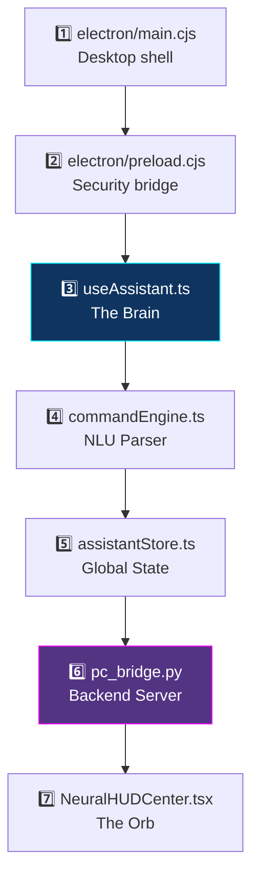
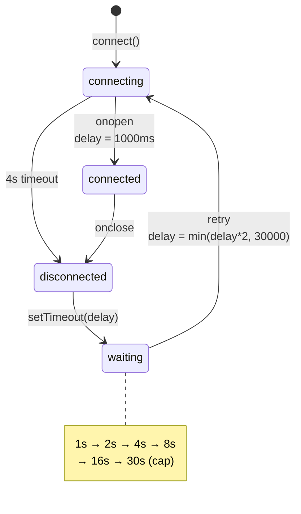
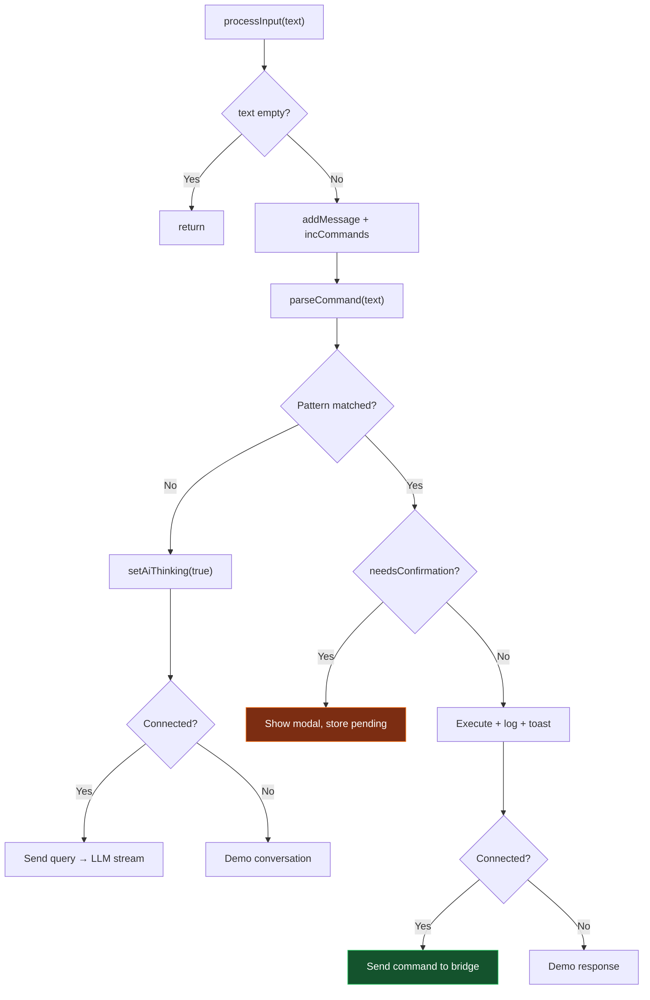
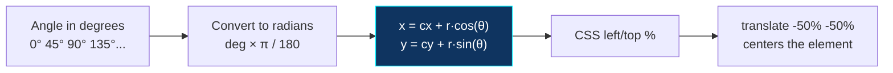

[⬅️ Previous: Database Basics](./12-DATABASE-BASICS.md) | [🏠 Back to Master Index](./00-START-HERE.md) | [➡️ Next: Debugging Guide](./14-DEBUGGING-GUIDE.md)

---

# 🔬 13 — CODE WALKTHROUGH (Line-by-Line)

> Ab hum project ke **sabse important modules** ko line-by-line kholenge. Viva mein
> examiner code dikhakar poochh sakta hai *"Yeh line kya karti hai?"* — Yahan sab
> answer mil jayega! 🔍

---

## 📍 Walkthrough Roadmap



---

## 1️⃣ `electron/main.cjs` — Desktop Shell

### Python Bridge Auto-Start

```javascript
function resolvePythonExecutable() {
  const isWin = process.platform === "win32";
  //  Pehle venv check karo — isolated environment best hai
  const venvPy = isWin
    ? path.join(ROOT, "venv", "Scripts", "python.exe")
    : path.join(ROOT, "venv", "bin", "python");

  if (fs.existsSync(venvPy)) return venvPy;   // ✅ venv mila
  return isWin ? "python" : "python3";        // fallback: system Python
}
```

| Line | Explanation |
|------|-------------|
| `process.platform === "win32"` | Node ka OS detection. `win32`, `darwin` (Mac), `linux` |
| `path.join(...)` | Cross-platform path banata hai (`\` vs `/` handle karta hai) |
| `fs.existsSync()` | Synchronous file check — startup par theek hai |
| Fallback logic | venv nahi mila toh system Python try karo |

### Spawning the Child Process

```javascript
bridgeProcess = spawn(pythonExe, [bridgeScript], {
  cwd: ROOT,                                    // working directory
  env: {
    ...process.env,                             // parent env inherit
    PYTHONIOENCODING: "utf-8",                  // Hindi text ke liye MUST
    PYTHONUNBUFFERED: "1"                       // real-time logs
  },
  windowsHide: true,                            // console window na dikhe
});

bridgeProcess.stdout.on("data", (d) => {
  const line = d.toString().trim();
  if (line) console.log(`[bridge] ${line}`);
  if (mainWindow && !mainWindow.isDestroyed()) {
    mainWindow.webContents.send("bridge:log", line);   // renderer ko forward
  }
});
```

> **`PYTHONIOENCODING: "utf-8"` kyun?** Windows par default encoding `cp1252` hoti
> hai jo Hindi characters support nahi karti. Isse `UnicodeEncodeError` aata hai.
> Yeh env variable set karne se Devanagari text properly print hota hai. 🇮🇳

> **`PYTHONUNBUFFERED: "1"` kyun?** Python by default output buffer karta hai (4KB).
> Iska matlab logs turant nahi dikhte. Yeh flag har print ko immediately flush karta hai.

### Graceful Shutdown

```javascript
function stopPythonBridge() {
  if (!bridgeProcess) return;
  try {
    if (process.platform === "win32") {
      // Windows: /t = tree kill (child processes bhi maro)
      spawn("taskkill", ["/pid", String(bridgeProcess.pid), "/f", "/t"]);
    } else {
      bridgeProcess.kill("SIGTERM");    // Unix: polite termination signal
    }
  } catch (err) {
    console.error("[pika] Failed to stop bridge:", err);
  }
  bridgeProcess = null;
}
```

> **Windows par `kill()` kaam kyun nahi karta?** Windows mein process trees alag
> handle hote hain. Python jo child processes bana raha ho woh orphan ban jaate hain.
> `taskkill /t` poora tree maar deta hai.

---

## 2️⃣ `electron/preload.cjs` — Security Bridge

```javascript
const { contextBridge, ipcRenderer } = require("electron");

contextBridge.exposeInMainWorld("pika", {
  isDesktop: true,
  minimize: () => ipcRenderer.invoke("window:minimize"),

  // Event listener with CLEANUP function
  onBridgeLog: (cb) => {
    const handler = (_e, line) => cb(line);
    ipcRenderer.on("bridge:log", handler);
    return () => ipcRenderer.removeListener("bridge:log", handler);
    //     ↑ unsubscribe function — memory leak prevention
  },
});
```

**Kyun cleanup function return karte hain?**

```typescript
// React component mein
useEffect(() => {
  const off = desktop.onBridgeLog((line) => console.log(line));
  return off;          // ← component unmount par listener remove
}, []);

// Agar cleanup nahi karte:
// Component 100 baar mount/unmount hua → 100 listeners attached
// → Memory leak + duplicate handlers → MaxListenersExceededWarning
```

### `invoke` vs `send` — Kaunsa use karein?

| Method | Direction | Returns | Use case |
|--------|-----------|---------|----------|
| `ipcRenderer.invoke()` | Renderer → Main | Promise ✅ | Request-response (file dialog) |
| `ipcRenderer.send()` | Renderer → Main | void ❌ | Fire-and-forget |
| `webContents.send()` | Main → Renderer | void | Events (bridge logs) |

---

## 3️⃣ `src/hooks/useAssistant.ts` — The Brain 🧠

### WebSocket Connection with Exponential Backoff

```typescript
const connect = useCallback(() => {
  const url = store.getState().settings.bridgeUrl;
  store.getState().setConnection("connecting");

  try {
    const socket = new WebSocket(url);
    ws.current = socket;

    // Timeout guard — 4 second mein connect nahi hua toh close
    const failTimer = window.setTimeout(() => {
      if (socket.readyState !== WebSocket.OPEN) {
        socket.close();     // triggers onclose → reconnect logic
      }
    }, 4000);

    socket.onopen = () => {
      window.clearTimeout(failTimer);
      reconnectDelay.current = 1000;        // ← RESET backoff on success
      store.getState().setConnection("connected");
      store.getState().setDemoMode(false);
      sounds.connect();
    };

    socket.onclose = () => {
      window.clearTimeout(failTimer);
      store.getState().setConnection("disconnected");

      if (!store.getState().demoMode) {
        store.getState().setDemoMode(true);   // graceful degradation
      }

      // EXPONENTIAL BACKOFF: 1s → 2s → 4s → 8s → 16s → 30s (cap)
      reconnectTimer.current = window.setTimeout(() => {
        reconnectDelay.current = Math.min(reconnectDelay.current * 2, RECONNECT_MAX);
        connect();                            // recursive retry
      }, reconnectDelay.current);
    };
  } catch {
    store.getState().setConnection("error");
    store.getState().setDemoMode(true);
  }
}, [store, handleMessage]);
```



> **`store.getState()` kyun, `useStore()` kyun nahi?** Callbacks ke andar hooks
> use nahi kar sakte (Rules of Hooks). `getState()` non-reactive direct access
> deta hai — perfect for event handlers.

### `processInput` — The Command Pipeline

```typescript
const processInput = useCallback((text: string) => {
  if (!text.trim()) return;                        // empty guard

  store.getState().addMessage({ role: "user", content: text });
  store.getState().incCommands();                  // stats counter

  const result = parseCommand(text);               // ← NLU parsing

  // Branch 1: Destructive command → confirmation
  if (result.parsed?.needsConfirmation) {
    store.getState().setPendingConfirmation({
      id: generateId(),
      message: result.reply,
      originalCommand: {
        type: "command",
        category: result.parsed.category,
        action: result.parsed.action,
        params: result.parsed.params,
        id: generateId(),
        timestamp: nowIso(),
      },
    });
    return;                                        // ← EARLY RETURN
  }

  // Branch 2: Safe command → execute immediately
  if (result.parsed) {
    if (result.openUrl) window.open(result.openUrl, "_blank", "noopener");

    store.getState().logActivity(
      `${result.parsed.category}/${result.parsed.action}`,
      ICON_FOR_CATEGORY[result.parsed.category] ?? "⚡"
    );

    if (result.toast) store.getState().addToast(result.toast);
    sounds.success();

    // Backend ko bhejo (agar connected hai)
    if (store.getState().isConnected && ws.current?.readyState === WebSocket.OPEN) {
      ws.current.send(JSON.stringify({
        type: "command",
        category: result.parsed.category,
        action: result.parsed.action,
        params: result.parsed.params,
        id: generateId(),
        timestamp: nowIso(),
      }));
    }

    const demoInfo = demoInfoResponse(result.parsed.category, result.parsed.action);
    streamText(demoInfo ?? result.reply, "pika");
    return;
  }

  // Branch 3: No pattern match → LLM conversation
  store.getState().setAiThinking(true);
  if (store.getState().isConnected && ws.current?.readyState === WebSocket.OPEN) {
    const msg = { type: "query", params: { text }, id: generateId(), timestamp: nowIso() };
    streamId.current = msg.id;                     // ← track for streaming
    ws.current.send(JSON.stringify(msg));
  } else {
    // Demo mode fallback with realistic delay
    window.setTimeout(
      () => streamText(demoConversation(text), store.getState().settings.aiProvider),
      500 + Math.random() * 400
    );
  }
}, [store, streamText]);
```



### LLM Streaming Handler

```typescript
else if (msg.type === "llm_stream") {
  if (!streamId.current) return;                   // no active stream

  // First chunk — create the message bubble
  if (!store.getState().messages.find((m) => m.id === streamId.current)) {
    store.getState().addMessage({
      id: streamId.current,
      role: "assistant",
      content: "",
      provider: msg.provider,
      isStreaming: true,
    });
    store.getState().setAiThinking(false);         // hide spinner
  }

  if (msg.done) {
    store.getState().finalizeMessage(streamId.current);   // remove cursor
    streamId.current = null;
  } else {
    store.getState().appendToMessage(streamId.current, msg.chunk);
  }
}
```

---

## 4️⃣ `src/lib/commandEngine.ts` — NLU Parser

### The Rule Structure

```typescript
interface Rule {
  re: RegExp;                                    // pattern to match
  handle: (m: RegExpMatchArray) => CommandResult; // what to do
}

function cmd(
  category: string,
  action: string,
  params: Record<string, unknown>,
  reply: string,
  extra?: Partial<CommandResult>
): CommandResult {
  return {
    parsed: {
      category,
      action,
      params,
      needsConfirmation: needsConfirm(category, action),   // auto-check
    },
    reply,
    ...extra,
  };
}
```

### Real Rules Explained

```typescript
// Rule 1: Volume with number capture
{
  re: /(?:volume|आवाज़|sound)\s*(\d{1,3})/i,
  handle: (m) => cmd("volume", "set", { percent: +m[1] },
                     `🔊 आवाज़ ${m[1]}% पर सेट कर दी।`)
}
```

| Regex part | Meaning |
|-----------|---------|
| `(?:...)` | Non-capturing group — match karo par capture mat karo |
| `volume\|आवाज़\|sound` | Teeno mein se koi bhi |
| `\s*` | Zero ya zyada spaces |
| `(\d{1,3})` | **Capturing group** — 1 se 3 digits (`m[1]` mein aayega) |
| `/i` flag | Case-insensitive (`VOLUME` bhi match hoga) |
| `+m[1]` | String `"50"` → number `50` (unary plus) |

```typescript
// Rule 2: Smart app/website detection
{
  re: /(?:open|kholo|खोलो|launch|start|चलाओ)\s+(.+)/i,
  handle: (m) => {
    const target = m[1].trim().toLowerCase();

    // Pehle check karo — kya yeh website hai?
    const site = WEBSITE_LIST.find((w) =>
      w.name.toLowerCase().includes(target) ||
      target.includes(w.name.toLowerCase().split(" ")[0])
    );

    if (site) {
      return cmd("web", "open_site", { name: site.name },
                 `🌐 ${site.name} खोल रहा हूँ।`,
                 { openUrl: site.url });
    }

    // Nahi toh app maano
    return cmd("apps", "open", { name: m[1].trim() },
               `🚀 ${m[1].trim()} खोल रहा हूँ।`);
  }
}
```

### The Matcher (Chain of Responsibility)

```typescript
export function parseCommand(text: string): CommandResult {
  const trimmed = text.trim();

  for (const rule of RULES) {           // order matters!
    const m = trimmed.match(rule.re);
    if (m) return rule.handle(m);       // pehla match jeeta
  }

  // Koi rule match nahi hua → LLM ko bhejo
  return { parsed: null, reply: "", isLLM: true };
}
```

> ⚠️ **Order matters!** `"close chrome"` ki rule `"open ..."` se **pehle** honi
> chahiye. Warna agar `open` rule pehle ho toh... actually nahi, `close` alag word
> hai. Par `"volume 50"` ki rule `"volume up"` se **pehle** honi chahiye, warna
> `"volume 50"` mein `volume` match hoke galat action chun lega.

---

## 5️⃣ `src/store/assistantStore.ts` — Global State

```typescript
export const useStore = create<AssistantState>((set) => ({
  // ─── Simple setter ───
  setConnection: (status) => set({
    connectionStatus: status,
    isConnected: status === "connected"     // derived value
  }),

  // ─── Setter with return value ───
  addMessage: (msg) => {
    const id = msg.id ?? generateId();
    set((s) => ({
      messages: [...s.messages, { ...msg, id, timestamp: nowIso() }]
      //         ↑ IMMUTABLE — naya array, purana mutate nahi
    }));
    return id;                              // caller ko id chahiye
  },

  // ─── Update specific item in array ───
  appendToMessage: (id, chunk) => set((s) => ({
    messages: s.messages.map((m) =>
      m.id === id
        ? { ...m, content: m.content + chunk, isStreaming: true }  // naya object
        : m                                                        // same reference
    ),
  })),

  // ─── Array with size limit ───
  logActivity: (text, icon = "⚡") => set((s) => ({
    activityLog: [
      { id: generateId(), text, at: Date.now(), icon },
      ...s.activityLog
    ].slice(0, 30),                        // sirf last 30 rakho
  })),

  // ─── Nested object merge ───
  updateSettings: (p) => set((s) => ({
    settings: { ...s.settings, ...p }      // shallow merge
  })),
}));
```

> **Immutability kyun zaroori hai?** React reference equality se change detect karta
> hai. Agar aap `s.messages.push(x)` karo toh array ka reference same rehta hai —
> React ko lagega kuch nahi badla, re-render nahi hoga! Isliye hamesha naya array/object banao.

---

## 6️⃣ `pc_bridge.py` — Backend Highlights

### Optional Import Pattern

```python
def _opt(name):
    """Library optional hai — nahi mili toh None return karo, crash mat karo."""
    try:
        return __import__(name)
    except Exception:
        print(f"[warn] optional '{name}' not available")
        return None

psutil    = _opt("psutil")
pyautogui = _opt("pyautogui")
pyperclip = _opt("pyperclip")

# Usage
def cmd_info(action, params):
    if not psutil:
        return err("psutil ज़रूरी है (pip install psutil)")
    return ok(f"CPU {psutil.cpu_percent()}%")
```

### Path Safety (3-Layer Defense)

```python
BLOCKED_PATTERNS = [
    r"^[a-zA-Z]:\\Windows", r"^[a-zA-Z]:\\Program Files",
    r"^/System", r"^/usr", r"^/etc", r"^/bin",
]

def is_path_safe(p: Path) -> bool:
    s = str(p)
    return not any(re.search(pat, s, re.IGNORECASE) for pat in BLOCKED_PATTERNS)

def resolve_path(path_str: str) -> Path:
    """Layer 1: Relative paths home se resolve, root se nahi"""
    home = Path.home()
    if not path_str:
        return home / "Desktop"

    low = path_str.lower().strip()
    folders = {"desktop": "Desktop", "documents": "Documents",
               "downloads": "Downloads", "pictures": "Pictures"}

    for k, v in folders.items():
        if low == k or low.startswith(k + "/") or low.startswith(k + "\\"):
            rest = path_str[len(k):].strip("/\\")
            return (home / v / rest) if rest else (home / v)

    p = Path(path_str).expanduser()
    return p if p.is_absolute() else home / p    # ← relative = home-relative
```

### Safe Calculator (No `eval()`!)

```python
def cmd_calculator(action, params):
    import ast
    import operator as opr

    OPS = {
        ast.Add: opr.add, ast.Sub: opr.sub, ast.Mult: opr.mul,
        ast.Div: opr.truediv, ast.Pow: opr.pow, ast.USub: opr.neg,
    }

    def ev(node):
        """Recursively evaluate AST — sirf whitelisted operations."""
        if isinstance(node, ast.Constant):
            return node.value                     # number literal
        if isinstance(node, ast.BinOp):
            return OPS[type(node.op)](ev(node.left), ev(node.right))
        if isinstance(node, ast.UnaryOp):
            return OPS[type(node.op)](ev(node.operand))
        raise ValueError("unsupported")           # function calls blocked!

    try:
        expr = params.get("expression", "")
        result = ev(ast.parse(expr, mode="eval").body)
        if abs(result) > 1e15:
            return err("संख्या बहुत बड़ी है।")
        return ok(f"{expr} = {result}", {"result": result})
    except Exception:
        return err("अमान्य एक्सप्रेशन।")
```

> **`eval()` kyun khatarnaak hai?**
> ```python
> eval("__import__('os').system('rm -rf /')")   # 💀 System destroyed!
> ```
> AST approach mein sirf `ast.BinOp` aur `ast.Constant` allow hain. Function calls
> (`ast.Call`) `ValueError` raise karte hain. **100% safe.** ✅

---

## 7️⃣ `NeuralHUDCenter.tsx` — Responsive Orb

### ResizeObserver for Perfect Sizing

```typescript
useEffect(() => {
  const el = orbHolderRef.current;
  if (!el) return;

  const measure = () => {
    const rect = el.getBoundingClientRect();
    // Square banao jo width AUR height dono mein fit ho
    const size = Math.min(rect.width, rect.height);
    setOrbSize(Math.max(140, Math.min(420, size - 8)));
    //          ↑ floor       ↑ cap       ↑ padding
  };

  measure();                                     // initial
  const ro = new ResizeObserver(measure);        // container resize
  ro.observe(el);
  window.addEventListener("resize", measure);    // window resize

  return () => {
    ro.disconnect();                             // cleanup!
    window.removeEventListener("resize", measure);
  };
}, []);
```

### Positioning Elements on a Circle

```typescript
function pt(radius: number, angleDeg: number) {
  const a = (angleDeg * Math.PI) / 180;    // degrees → radians
  return {
    x: 50 + radius * Math.cos(a),          // 50 = center %
    y: 50 + radius * Math.sin(a),
  };
}

// 8 nodes equally spaced
{Array.from({ length: 8 }).map((_, i) => {
  const angle = (360 / 8) * i;             // 0°, 45°, 90°, ...
  const p = pt(50, angle);
  return (
    <motion.span
      style={{
        left: `${p.x}%`,
        top: `${p.y}%`,
        translate: "-50% -50%",            // center the dot on the point
      }}
      animate={{ opacity: [0.4, 1, 0.4], scale: [1, 1.4, 1] }}
      transition={{ duration: 2 + (i % 3), repeat: Infinity, delay: i * 0.15 }}
    />
  );
})}
```



---

## 📊 Code Quality Metrics

| Metric | Value | Standard |
|--------|-------|----------|
| Avg function length | ~25 lines | ✅ <50 |
| Max nesting depth | 3 levels | ✅ <4 |
| Cyclomatic complexity | ~6 avg | ✅ <10 |
| TypeScript strict mode | ✅ Enabled | Best practice |
| Try/except coverage (Python) | 100% of handlers | ✅ |
| Cleanup functions (useEffect) | 100% | ✅ No leaks |
| Magic numbers | Extracted to constants | ✅ |

---

## 🔗 Related Reading
- Architecture context → [02-ARCHITECTURE.md](./02-ARCHITECTURE.md)
- Patterns used → [06-ARCH-PATTERNS.md](./06-ARCH-PATTERNS.md)
- Debugging tips → [14-DEBUGGING-GUIDE.md](./14-DEBUGGING-GUIDE.md)

---

[⬅️ Previous: Database Basics](./12-DATABASE-BASICS.md) | [🏠 Back to Master Index](./00-START-HERE.md) | [➡️ Next: Debugging Guide](./14-DEBUGGING-GUIDE.md)
