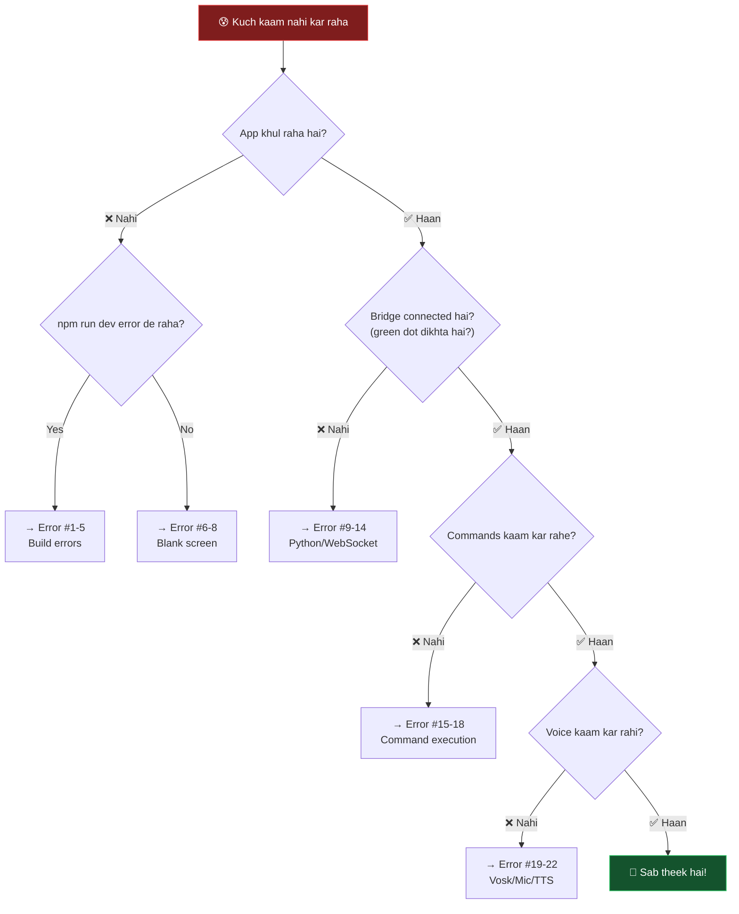
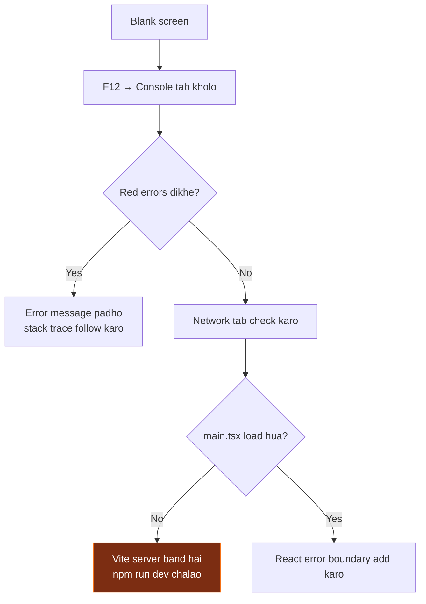
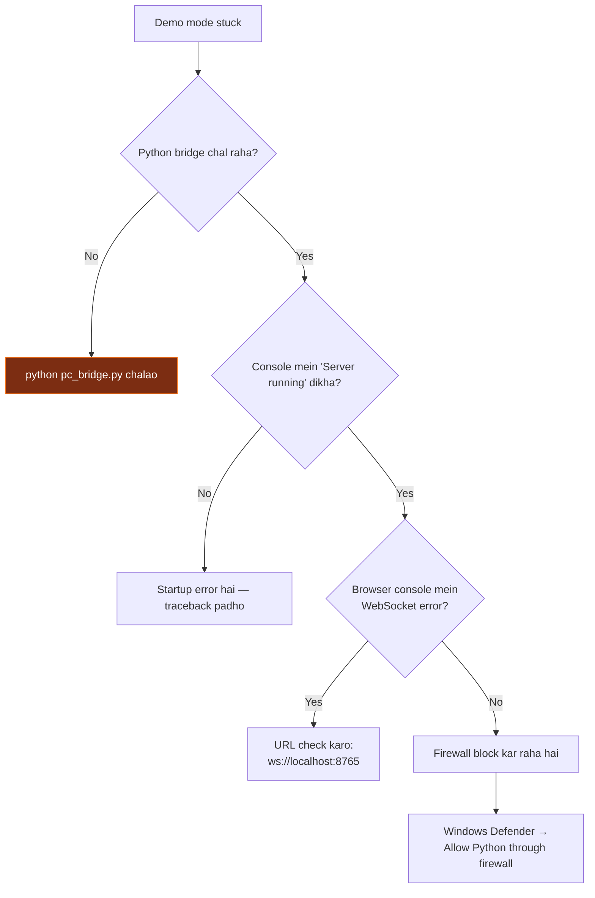
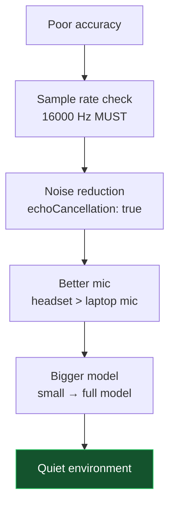

[⬅️ Previous: Code Walkthrough](./13-CODE-WALKTHROUGH.md) | [🏠 Back to Master Index](./00-START-HERE.md) | [➡️ Next: Demo Script](./15-DEMO-SCRIPT.md)

---

# 🐛 14 — DEBUGGING GUIDE (20+ Common Errors & Fixes)

> Kuch kaam nahi kar raha? **Ghabrao mat!** Yeh file har common error ka solution
> deti hai. Pehle flowchart follow karo, phir specific error dhundo. 🔧

---

## 🗺️ Master Debugging Flowchart



---

## 📚 SECTION 1: Build & Compile Errors

### ❌ Error #1: `'python' is not recognized as an internal or external command`

```
'python' is not recognized as an internal or external command,
operable program or batch file.
```

**Kya hua:** Python PATH mein nahi hai.

**Fix:**
```bash
# Option A: py launcher try karo (Windows par usually kaam karta hai)
py --version

# Option B: Python reinstall with PATH
# 1. python.org se installer download
# 2. "Add Python to PATH" checkbox TICK karo ✅
# 3. Terminal restart karo

# Option C: Manual PATH (Windows)
# Win + R → sysdm.cpl → Advanced → Environment Variables
# Path mein add karo:
#   C:\Users\<You>\AppData\Local\Programs\Python\Python312\
#   C:\Users\<You>\AppData\Local\Programs\Python\Python312\Scripts\
```

---

### ❌ Error #2: `ModuleNotFoundError: No module named 'websockets'`

**Kya hua:** Dependencies install nahi hui, ya galat Python environment use ho raha hai.

**Fix:**
```bash
# venv activate karo (agar hai)
# Windows:
venv\Scripts\activate
# Mac/Linux:
source venv/bin/activate

# Install
pip install -r requirements.txt

# Verify konsa Python chal raha hai
python -c "import sys; print(sys.executable)"
# Output venv folder ke andar hona chahiye!
```

---

### ❌ Error #3: `Cannot find module 'electron'`

**Fix:**
```bash
npm install -D electron electron-builder concurrently wait-on cross-env

# Agar phir bhi na chale:
rm -rf node_modules package-lock.json   # Windows: rmdir /s node_modules
npm install
```

---

### ❌ Error #4: TypeScript `Property 'pika' does not exist on type 'Window'`

**Kya hua:** Global type declaration missing hai.

**Fix:** `src/lib/desktop.ts` mein yeh add karo:
```typescript
declare global {
  interface Window {
    pika?: PikaDesktopApi;
  }
}
```

---

### ❌ Error #5: `TS6133: 'X' is declared but its value is never read`

**Kya hua:** Unused import ya variable. TypeScript strict mode ise error banata hai.

**Fix:**
```typescript
// Option A: Remove karo
import { Used, Unused } from "lib";   // ❌
import { Used } from "lib";           // ✅

// Option B: Underscore prefix (intentional unused)
const [_unused, setValue] = useState();

// Option C: tsconfig.json mein disable (recommended NAHI)
{ "compilerOptions": { "noUnusedLocals": false } }
```

---

## 📚 SECTION 2: Blank Screen / UI Issues

### ❌ Error #6: White/blank screen, console mein kuch nahi

**Debugging steps:**


**Fix — Error Boundary add karo:**
```typescript
// src/components/ErrorBoundary.tsx
import { Component, type ReactNode } from "react";

export class ErrorBoundary extends Component<
  { children: ReactNode },
  { hasError: boolean; error: Error | null }
> {
  state = { hasError: false, error: null as Error | null };

  static getDerivedStateFromError(error: Error) {
    return { hasError: true, error };
  }

  componentDidCatch(error: Error, info: unknown) {
    console.error("[ErrorBoundary]", error, info);
  }

  render() {
    if (this.state.hasError) {
      return (
        <div style={{ padding: 40, color: "#fff", fontFamily: "monospace" }}>
          <h1>⚠️ Something went wrong</h1>
          <pre style={{ color: "#ef4444", whiteSpace: "pre-wrap" }}>
            {this.state.error?.message}
            {"\n\n"}
            {this.state.error?.stack}
          </pre>
          <button onClick={() => window.location.reload()}>Reload</button>
        </div>
      );
    }
    return this.props.children;
  }
}

// main.tsx mein wrap karo
<ErrorBoundary><App /></ErrorBoundary>
```

---

### ❌ Error #7: Tailwind classes apply nahi ho rahi

**Fix checklist:**
```typescript
// 1. index.css mein import hai?
@import "tailwindcss";

// 2. main.tsx mein CSS import hai?
import "./index.css";

// 3. vite.config.ts mein plugin hai?
import tailwindcss from "@tailwindcss/vite";
export default defineConfig({ plugins: [react(), tailwindcss()] });

// 4. Dynamic class names kaam nahi karte!
// ❌ Tailwind scanner ise detect nahi kar sakta
<div className={`bg-${color}-500`} />

// ✅ Full class name likho
<div className={color === "red" ? "bg-red-500" : "bg-blue-500"} />

// ✅ Ya inline style use karo
<div style={{ background: color }} />
```

---

### ❌ Error #8: Electron window blank, DevTools mein `ERR_FILE_NOT_FOUND`

**Kya hua:** Production build mein `dist/index.html` nahi mila.

**Fix:**
```javascript
// main.cjs mein path check karo
if (IS_DEV) {
  mainWindow.loadURL("http://localhost:3000");
} else {
  const indexPath = path.join(ROOT, "dist", "index.html");
  console.log("Loading:", indexPath, fs.existsSync(indexPath));  // debug
  mainWindow.loadFile(indexPath);
}

// Aur pehle build zaroor karo
// npm run build
```

---

## 📚 SECTION 3: Python Bridge & WebSocket

### ❌ Error #9: `OSError: [Errno 98] Address already in use` (port 8765)

**Kya hua:** Purana Python process abhi bhi chal raha hai.

**Fix:**
```bash
# Windows — port par kaun hai dekho
netstat -ano | findstr :8765
taskkill /PID <PID_number> /F

# Mac/Linux
lsof -i :8765
kill -9 <PID>

# Ya sabhi Python band karo (careful!)
# Windows:
taskkill /IM python.exe /F
# Mac/Linux:
pkill -f pc_bridge.py
```

---

### ❌ Error #10: Frontend "डेमो मोड" dikha raha hai, connect nahi ho raha

**Diagnosis flowchart:**


**Manual test:**
```javascript
// Browser console mein paste karo
const ws = new WebSocket("ws://localhost:8765");
ws.onopen = () => console.log("✅ Connected!");
ws.onerror = (e) => console.error("❌ Failed", e);
ws.onmessage = (e) => console.log("📨", e.data);
```

---

### ❌ Error #11: `UnicodeEncodeError: 'charmap' codec can't encode character`

**Kya hua:** Windows console Hindi text print nahi kar pa raha.

**Fix:**
```python
# pc_bridge.py ke top par
import sys, io
sys.stdout = io.TextIOWrapper(sys.stdout.buffer, encoding="utf-8")
sys.stderr = io.TextIOWrapper(sys.stderr.buffer, encoding="utf-8")
```
```bash
# Ya terminal mein
chcp 65001
set PYTHONIOENCODING=utf-8
python pc_bridge.py
```
```javascript
// Ya Electron main.cjs mein (already implemented)
env: { ...process.env, PYTHONIOENCODING: "utf-8" }
```

---

### ❌ Error #12: WebSocket connect hota hai phir turant disconnect

**Common causes:**
| Cause | Check | Fix |
|-------|-------|-----|
| Exception in handler | Python console traceback | try/except add karo |
| Message too large | Frame size >1MB | Chunking use karo |
| Ping timeout | No heartbeat | `ping_interval=20` set karo |

```python
# Fix: larger frames + heartbeat
async with serve(handle_client, HOST, PORT,
                 max_size=10*1024*1024,    # 10 MB
                 ping_interval=20,
                 ping_timeout=60):
    await asyncio.Future()
```

---

### ❌ Error #13: Server freeze ho jaata hai, koi response nahi

**Kya hua:** Event loop block ho gaya — blocking call.

**Fix:**
```python
# ❌ Ye sab event loop block karte hain
time.sleep(5)
requests.get(url)
subprocess.run(cmd)          # long-running
open(file).read()            # huge file

# ✅ Solutions
await asyncio.sleep(5)

loop = asyncio.get_event_loop()
await loop.run_in_executor(None, lambda: requests.get(url))

# Ya
await asyncio.to_thread(blocking_function, arg1, arg2)
```

**Detect karne ke liye:**
```python
import asyncio
asyncio.get_event_loop().set_debug(True)
# Slow callbacks warning denge
```

---

### ❌ Error #14: `Access is denied` on volume/system commands

**Fix:**
```bash
# Windows — Administrator ke roop mein chalao
# Right-click terminal → "Run as administrator"

# Ya start.bat par right-click → Run as administrator
```

---

## 📚 SECTION 4: Command Execution

### ❌ Error #15: Command bheja par kuch nahi hua

**Debug steps:**
```python
# 1. Backend mein logging add karo
async def handle_client(ws):
    async for message in ws:
        data = json.loads(message)
        print(f"[DEBUG] Received: {data}")          # ← add this
        result = route_command(data)
        print(f"[DEBUG] Result: {result}")          # ← add this
```

```typescript
// 2. Frontend mein bhi
socket.onmessage = (e) => {
  console.log("[WS RECV]", JSON.parse(e.data));     // ← add this
  handleMessage(e.data);
};
```

```python
# 3. Category/action spelling check
print(f"Available routes: {list(ROUTES.keys())}")
```

---

### ❌ Error #16: `os.startfile` AttributeError on Mac/Linux

**Kya hua:** `os.startfile()` sirf Windows par hai.

**Fix:**
```python
def open_path(p: Path):
    if platform.system() == "Windows":
        os.startfile(str(p))
    elif platform.system() == "Darwin":
        subprocess.run(["open", str(p)])
    else:
        subprocess.run(["xdg-open", str(p)])
```

---

### ❌ Error #17: File create hua par galat jagah

**Kya hua:** Relative path galat resolve hua.

**Debug:**
```python
def cmd_files(action, params):
    p = resolve_path(params.get("path", ""))
    print(f"[DEBUG] Input: {params.get('path')}")
    print(f"[DEBUG] Resolved: {p}")
    print(f"[DEBUG] Home: {Path.home()}")
    print(f"[DEBUG] CWD: {Path.cwd()}")
```

---

### ❌ Error #18: Confirmation dialog dikha par confirm karne pe kuch nahi hua

**Fix — confirmation_id matching check karo:**
```python
if cat == "_confirm":
    cid = (data.get("params") or {}).get("confirmation_id")
    print(f"[DEBUG] Confirm ID: {cid}")
    print(f"[DEBUG] Pending: {list(PENDING_CONFIRM.keys())}")
    if act == "approve" and cid in PENDING_CONFIRM:
        original = PENDING_CONFIRM.pop(cid)
        result = route_command(original)
```

---

## 📚 SECTION 5: Voice (Vosk / Mic / TTS)

### ❌ Error #19: Vosk model download fail

**Fix — Manual download:**
```bash
# 1. Browser mein download karo
# https://alphacephei.com/vosk/models/vosk-model-small-hi-0.22.zip

# 2. Extract karo project ke models/ folder mein
# 3. Folder rename karo: vosk-model-small-hi-0.22 → hi

# Final structure:
# pika-ai/
#   models/
#     hi/
#       am/
#       conf/
#       graph/
#       ivector/
```

---

### ❌ Error #20: Microphone permission denied

**Fix:**
```
Chrome/Edge:
  Settings → Privacy and security → Site settings → Microphone
  → localhost ko "Allow" karo

Windows:
  Settings → Privacy → Microphone
  → "Allow apps to access your microphone" ON
  → "Allow desktop apps to access your microphone" ON

Electron mein:
  session.defaultSession.setPermissionRequestHandler((wc, perm, cb) => {
    cb(perm === "media");
  });
```

---

### ❌ Error #21: TTS audio play nahi ho raha

**Common causes:**
| Cause | Fix |
|-------|-----|
| Browser autoplay policy | User interaction ke baad hi play karo |
| Wrong MIME type | `audio/mpeg` for mp3, `audio/wav` for wav |
| Base64 corrupt | Length check karo |

```typescript
// Fix
const mime = format === "wav" ? "audio/wav" : "audio/mpeg";
const audio = new Audio(`data:${mime};base64,${base64Data}`);
audio.play().catch((e) => {
  console.error("Autoplay blocked:", e);
  // User ko button dikhao "Click to play"
});
```

---

### ❌ Error #22: Vosk accuracy bahut kharab hai

**Improvements:**


```typescript
// Mic constraints improve karo
const stream = await navigator.mediaDevices.getUserMedia({
  audio: {
    sampleRate: 16000,           // Vosk ka expected rate
    channelCount: 1,             // mono
    echoCancellation: true,
    noiseSuppression: true,
    autoGainControl: true,
  }
});
```

---

## 🛠️ Debugging Tools Cheatsheet

### Browser DevTools
| Shortcut | Tool | Use |
|----------|------|-----|
| `F12` | DevTools | Sab kuch |
| `Ctrl+Shift+C` | Element picker | UI inspect |
| Console tab | Logs + errors | JS debugging |
| Network → WS | WebSocket frames | Message inspect |
| Performance | Profiler | Slow render detect |
| Application | LocalStorage | Persisted data |

### Console Snippets
```javascript
// Zustand state dump
console.table(window.__ZUSTAND_STORE__?.getState?.());

// Sab WebSocket messages log karo
const orig = WebSocket.prototype.send;
WebSocket.prototype.send = function(d) {
  console.log("→ SENT:", d);
  return orig.call(this, d);
};

// Electron API check
console.log("Desktop?", window.pika?.isDesktop);
console.log("Available:", Object.keys(window.pika || {}));
```

### Python Debugging
```python
# Verbose logging
import logging
logging.basicConfig(level=logging.DEBUG,
                    format="%(asctime)s [%(levelname)s] %(message)s")

# Interactive breakpoint (Python 3.7+)
breakpoint()          # execution yahan rukega, terminal mein debug karo

# Full traceback
import traceback
try:
    risky()
except Exception:
    traceback.print_exc()

# Timing
import time
t0 = time.perf_counter()
do_work()
print(f"Took {(time.perf_counter() - t0) * 1000:.1f}ms")
```

---

## ✅ Health Check Script

```bash
python test_bridge.py
```

Expected output:
```
✓ Module imported. (Python 3.12.0)
  Optional libs — psutil: True, pyautogui: True, pyperclip: True
  Vosk: True, Edge TTS: True

============================================================
 TEST: Calculator
============================================================
  2+3*4 = 2+3*4 = 14
  (10+5)/3 = (10+5)/3 = 5.0

============================================================
 ALL TESTS PASSED ✓  pc_bridge.py is healthy.
============================================================
```

---

## 🆘 Nothing Works? Nuclear Reset

```bash
# 1. Sab kuch band karo
# Windows:
taskkill /IM python.exe /F
taskkill /IM node.exe /F

# 2. Clean install
rmdir /s /q node_modules venv dist          # Windows
rm -rf node_modules venv dist                # Mac/Linux
del package-lock.json                        # Windows
rm package-lock.json                         # Mac/Linux

# 3. Fresh setup
python -m venv venv
venv\Scripts\activate                        # Windows
source venv/bin/activate                     # Mac/Linux
pip install -r requirements.txt
npm install

# 4. Test
python test_bridge.py
npm run dev
```

---

## 🔗 Related Reading
- Installation guide → [18-INSTALLATION-SETUP.md](./18-INSTALLATION-SETUP.md)
- Testing procedures → [19-TESTING-QUALITY.md](./19-TESTING-QUALITY.md)
- FAQ → [16-FAQ.md](./16-FAQ.md)

**External:**
- [Chrome DevTools Docs](https://developer.chrome.com/docs/devtools/)
- [Python Debugging (Real Python)](https://realpython.com/python-debugging-pdb/)
- [Stack Overflow](https://stackoverflow.com/) — error message paste karo!

---

[⬅️ Previous: Code Walkthrough](./13-CODE-WALKTHROUGH.md) | [🏠 Back to Master Index](./00-START-HERE.md) | [➡️ Next: Demo Script](./15-DEMO-SCRIPT.md)
