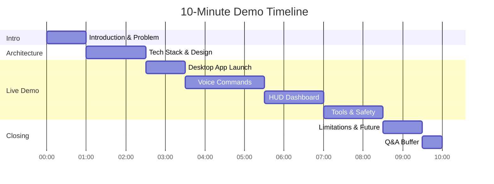
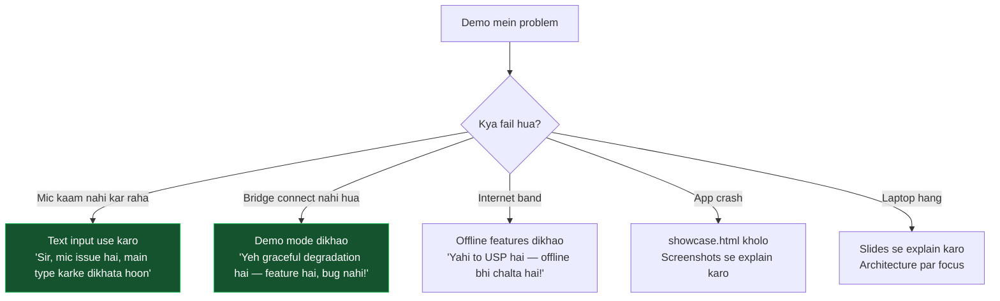

[⬅️ Previous: Debugging Guide](./14-DEBUGGING-GUIDE.md) | [🏠 Back to Master Index](./00-START-HERE.md) | [➡️ Next: FAQ](./16-FAQ.md)

---

# 🎬 15 — DEMO SCRIPT (10-Minute Presentation)

> Yeh **word-by-word script** hai. Kya bolna hai, kahan click karna hai, kya dikhana
> hai — sab likha hai. 3 baar practice karo, viva mein perfect performance! 🎤

---

## ⏱️ Time Allocation

---

## 🎒 Pre-Demo Checklist (30 minutes before)

- [ ] Laptop **fully charged** + charger paas mein
- [ ] `start.bat` chalake **sab kuch test** kar liya
- [ ] Python bridge green dot dikha raha hai
- [ ] Microphone test kiya — awaaz clear aa rahi hai
- [ ] Volume 60% par set (demo mein dikhega)
- [ ] Chrome/Notepad **band** hain (open karke dikhana hai)
- [ ] Desktop clean hai (screenshot demo ke liye)
- [ ] Internet on hai (weather/crypto ke liye)
- [ ] Backup: `showcase.html` ready (agar app crash ho)
- [ ] Phone charged (mobile access demo ke liye)
- [ ] Notifications OFF (Focus Assist ON)
- [ ] Browser zoom 100%

---

## 🎤 THE SCRIPT

### ⏰ [00:00 – 01:00] — Introduction & Problem Statement

> **[Slide 1 dikhao — Title slide]**

**बोलो:**
> "Good morning Sir/Ma'am. मेरा नाम **[आपका नाम]** है, roll number **[XX]**.
> आज मैं अपना project present कर रहा हूँ — **Pika AI Assistant**.
>
> Sir, problem statement यह है: आजकल हर किसी के पास Alexa, Siri, Google Assistant
> है — लेकिन इन सबकी **तीन बड़ी दिक्कतें** हैं:
>
> **पहली** — ये सब **cloud-dependent** हैं। Internet नहीं तो कुछ नहीं।
> **दूसरी** — आपकी हर आवाज़ **company के server** पर जाती है — privacy zero।
> **तीसरी** — ये आपका **computer control नहीं कर सकते**। Alexa से आप Chrome नहीं
> खोल सकते, file delete नहीं कर सकते।
>
> Pika इन तीनों problems को solve करता है — यह **100% offline voice recognition**
> use करता है, आपका **data कहीं नहीं जाता**, और यह **पूरा PC control** करता है —
> वो भी **Hindi, English और Hinglish** तीनों में।"

---

### ⏰ [01:00 – 02:30] — Architecture & Tech Stack

> **[Slide 2 dikhao — Architecture diagram]**

**बोलो:**
> "Sir, यह **three-layer architecture** है।
>
> **Layer 1** — Presentation Layer. यह **Electron desktop application** है जो
> **React 19 + TypeScript** से बना है। Electron इसलिए चुना क्योंकि normal web app
> browser के sandbox में होता है — वो OS को touch नहीं कर सकता। Electron में
> Node.js runtime मिलता है, तो हम file system, process list, volume — सब access
> कर सकते हैं।
>
> **Layer 2** — Application Layer. यह **Python asyncio WebSocket server** है जो
> port 8765 पर चलता है। इसमें **120+ NLU regex patterns** हैं जो natural language
> को structured commands में convert करते हैं।
>
> **Layer 3** — Services Layer. इसमें **Vosk** offline speech-to-text, **Microsoft
> Edge Neural TTS**, OS APIs, और **7 free LLM providers** हैं auto-fallback के साथ।
>
> दोनों layers के बीच **WebSocket** पर communication होती है — REST API नहीं।
> क्यों? क्योंकि हमें **server push** चाहिए system stats के लिए, **binary streaming**
> चाहिए audio के लिए, और **low latency** चाहिए voice के लिए। REST में हर call पर
> नया TCP handshake होता — 50 milliseconds waste। WebSocket में सिर्फ 2-8ms।"

---

### ⏰ [02:30 – 03:30] — Desktop App Launch

> **[Screen share on. Terminal kholo]**

**बोलो:**
> "अब live demo करते हैं। Sir, मैंने एक **one-click launcher** बनाया है।"

> **[`start.bat` par double-click]**

**बोलो (jab tak load ho raha hai):**
> "यह script automatically:
> - Python detect करती है
> - अपना **isolated virtual environment** बनाती है
> - सारी dependencies install करती है
> - Python bridge start करती है background में
> - और browser खोल देती है
>
> Sir, ध्यान दीजिए — यह **LAN IP** भी detect करके दिखा रही है। इसका मतलब मैं अपने
> **phone से भी** इसे control कर सकता हूँ, same WiFi पर।"

> **[App khul gaya. Top-right green dot par point karo]**

**बोलो:**
> "यह **green dot** दिखा रहा है कि Python bridge connected है। अगर bridge बंद हो
> जाए तो app crash नहीं होगा — वो **demo mode** में चला जाएगा। यह
> **graceful degradation** है।"

---

### ⏰ [03:30 – 05:30] — Voice Commands (Main Attraction!)

> **[Mic button par click karo]**

**बोलो:**
> "अब मैं voice command देता हूँ।"

#### Demo 1: App Open
> **[Bolo clearly]:** **"Chrome kholo"**

**Commentary:**
> "देखिए Sir — **live transcript** दिख रहा है जैसे-जैसे मैं बोल रहा हूँ। यह Vosk
> का **partial result** है। और... Chrome खुल गया! **यह पूरी तरह offline हुआ** —
> internet band कर दूँ तो भी काम करेगा।"

#### Demo 2: Volume Control
> **[Bolo]:** **"Volume 30 karo"**

**Commentary:**
> "Volume 30% हो गया — देखिए system volume indicator। यह Hinglish command थी —
> Hindi + English mixed. मेरा NLU engine तीनों languages handle करता है।"

#### Demo 3: System Info
> **[Bolo]:** **"Battery dikhao"**

**Commentary:**
> "यह real system data है — `psutil` library से आ रहा है।"

#### Demo 4: Wake Word
> **[Bolo]:** **"Hey Assistant"**

**Commentary:**
> "Sir, यह **wake word detection** है। जैसे 'Hey Siri' या 'OK Google'. जब यह
> detect होता है तो assistant active mode में चला जाता है।"

#### Demo 5: TTS Reply
> **[Type karo]: "namaste"** → Enter

**Commentary:**
> "और यह **Microsoft Edge Neural TTS** है — natural Hindi voice। अगर internet न
> हो तो यह automatically **pyttsx3 offline engine** पर switch हो जाता है। Failover
> automatic है।"

---

### ⏰ [05:30 – 07:00] — Futurist HUD Dashboard

> **[Top-right "फ्यूचर मोड" button par click]**

**बोलो:**
> "Sir, यह मेरा **Futurist HUD mode** है — cyberpunk inspired dashboard।"

> **[Center orb par point karo]**

**बोलो:**
> "बीच में यह **Neural Core** है — चार rotating rings, आठ orbiting nodes, और एक
> radar sweep animation. यह पूरी तरह **SVG + Framer Motion** से बना है, कोई image
> नहीं। और **ResizeObserver** use किया है — window resize करने पर यह automatically
> adjust हो जाता है।"

> **[Window resize karke dikhao]**

**बोलो:**
> "देखिए — perfectly responsive."

> **[Left column par point]**

**बोलो:**
> "बाईं तरफ **live telemetry** है — network latency, download speed, packet rate,
> और यह **live traffic bars** हैं। नीचे **Storage Explorer** है जो actual drives
> दिखाता है — C drive, D drive, कितना space free है।
>
> यह **Recharts** से बना real-time chart है — CPU, RAM, Temperature — हर 2 second
> update होता है।"

> **[Right column par point]**

**बोलो:**
> "दाईं तरफ **live weather** है — यह **Open-Meteo API** से आ रहा है, बिल्कुल free,
> कोई API key नहीं चाहिए। नीचे **NASA का Astronomy Picture of the Day**, और
> **crypto prices** CoinGecko से।"

> **[Theme button par click]**

**बोलो:**
> "और यह मेरा **favourite feature** है — **live theme engine**. देखिए..."

> **[Alag-alag colors par click karo]**

**बोलो:**
> "पूरा UI instantly recolor हो जाता है — बिना reload के! यह **CSS custom
> properties** से किया है। Runtime पर `--accent` variable change करता हूँ, और सारे
> components automatically update हो जाते हैं। Dual-color gradient भी support करता है।"

---

### ⏰ [07:00 – 08:30] — Safety & Tools

> **[Type karo]: "delete file test.txt"**

**बोलो:**
> "अब मैं एक **destructive command** देता हूँ..."

> **[Confirmation dialog dikha]**

**बोलो:**
> "देखिए Sir — यह directly execute नहीं हुआ! यह **two-phase commit pattern** है।
>
> **Phase 1** में server command को execute नहीं करता — उसे `PENDING_CONFIRM`
> dictionary में UUID के साथ store करता है, और client को `confirmation_required`
> status भेजता है।
>
> **Phase 2** में user confirm करे तभी execute होता है।
>
> यह इसलिए ज़रूरी है क्योंकि अगर Vosk गलती से 'delete' सुन ले, तो accidental data
> loss न हो।"

> **[Cancel par click]**

**बोलो:**
> "इसके अलावा तीन और security layers हैं:
> - **Path traversal protection** — Windows folder, Program Files — सब blocked हैं
> - **Safe calculator** — `eval()` नहीं, **AST-based evaluation**। `eval` से कोई
>   `__import__('os').system('format C:')` चला सकता था
> - **contextIsolation** — Electron में renderer को Node access नहीं मिलता"

> **[Live PiP button par click]**

**बोलो:**
> "और यह **Live Activity Monitor** है। यह **Document Picture-in-Picture API** use
> करता है — इसे browser से **बाहर** निकाल सकते हैं, always-on-top window में। जब
> आप दूसरे apps use कर रहे हों तब भी Pika का काम live देख सकते हैं।"

---

### ⏰ [08:30 – 09:30] — Limitations & Future Scope

> **[Slide 3 dikhao]**

**बोलो:**
> "Sir, मैं honestly limitations भी बताना चाहूँगा:
>
> **1.** Vosk की accuracy noisy environment में लगभग 75% है। Professional solution
> के लिए **Whisper.cpp** better होता, लेकिन वो 1 GB+ का model है।
>
> **2.** कुछ features — जैसे brightness control — Windows पर best काम करते हैं।
> Linux/Mac पर limited हैं।
>
> **3.** WebSocket `ws://` है, `wss://` नहीं। Localhost के लिए ठीक है, लेकिन
> network पर expose करना insecure होगा।
>
> **Future scope:**
> - **Whisper.cpp** integration better accuracy के लिए
> - **wss:// with self-signed certificate**
> - **Multi-user profiles** with voice biometrics
> - **Plugin system** ताकि community अपने commands add कर सके
> - **Mobile companion app** React Native में"

---

### ⏰ [09:30 – 10:00] — Closing

**बोलो:**
> "Sir, summary में — Pika AI एक **production-grade desktop assistant** है जो:
> - **100% offline** voice recognition करता है
> - **Privacy-first** है — कोई data cloud पर नहीं जाता
> - **120+ commands** support करता है Hindi, English और Hinglish में
> - **Security-first** design है — confirmation flow, path protection, safe eval
> - और **cross-platform** है — Windows, Mac, Linux
>
> मैंने इसके लिए **25 files की complete documentation** भी बनाई है — architecture,
> database design, API protocol, testing, security — सब कुछ।
>
> **Thank you Sir. आपके questions का स्वागत है।** 🙏"

---

## 🎯 Backup Plans (Agar Kuch Fail Ho)

> **Pro tip:** Har failure ko **feature** ki tarah present karo!
> - Bridge down → *"Sir, dekhiye graceful degradation kaam kar raha hai"*
> - Internet down → *"Perfect timing! Ab main offline capability dikhata hoon"*

---

## 🗣️ Voice Command Cheat Sheet (Print karke rakho)

| Command | Expected Result | Backup if fails |
|---------|----------------|-----------------|
| `chrome kholo` | Chrome opens | Type it instead |
| `volume 30 karo` | Volume → 30% | Show slider in Media tab |
| `battery dikhao` | Battery % message | Show System Info panel |
| `screenshot lo` | Screenshot saved | Show screenshots folder |
| `hey assistant` | Wake word toast | Skip, explain concept |
| `namaste` | TTS greeting | Show chat text reply |
| `cpu usage` | CPU % message | Point to HUD gauge |
| `calculate 25 * 4` | 100 | Use Calculator tool |
| `open youtube` | Browser opens | Show Web Launcher grid |
| `delete file test.txt` | Confirmation modal | **Must work — practice this!** |

---

## 📊 Presentation Slides (11 Slides)

| # | Slide Title | Content |
|---|-------------|---------|
| 1 | **Title** | Project name, your name, roll no, guide name |
| 2 | **Problem Statement** | 3 problems with existing assistants |
| 3 | **Objectives** | 5 bullet points |
| 4 | **Architecture** | 3-layer Mermaid diagram |
| 5 | **Tech Stack** | Logo grid + justification table |
| 6 | **Database Design** | ER diagram |
| 7 | **Key Features** | 8 feature cards with icons |
| 8 | **Security** | 4 layers of protection |
| 9 | **Live Demo** | *(switch to app)* |
| 10 | **Limitations & Future** | Honest list + roadmap |
| 11 | **Thank You** | Q&A + GitHub link |

---

## 🎭 Body Language Tips

| Do ✅ | Don't ❌ |
|-------|---------|
| Eye contact examiner se | Screen ko ghurte raho |
| Confident, medium pace | Bahut fast bolna |
| Point at screen elements | Haath jeb mein |
| "Sir/Ma'am" respectfully | Over-casual language |
| Pause after key points | Non-stop bolte raho |
| Smile when demo works | Panic when it fails |

---

## 🔗 Related Reading
- Expected questions → [07-VIVA-GUIDE.md](./07-VIVA-GUIDE.md)
- More Q&A → [16-FAQ.md](./16-FAQ.md)
- Report structure → [23-PROJECT-REPORT-WRITING.md](./23-PROJECT-REPORT-WRITING.md)
- If demo breaks → [14-DEBUGGING-GUIDE.md](./14-DEBUGGING-GUIDE.md)

---

[⬅️ Previous: Debugging Guide](./14-DEBUGGING-GUIDE.md) | [🏠 Back to Master Index](./00-START-HERE.md) | [➡️ Next: FAQ](./16-FAQ.md)
