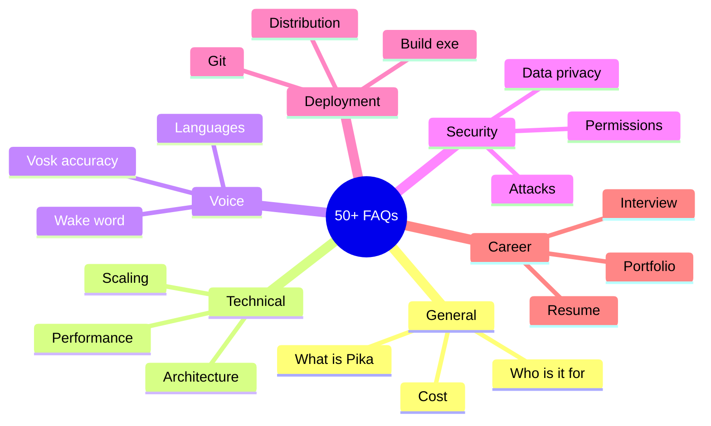
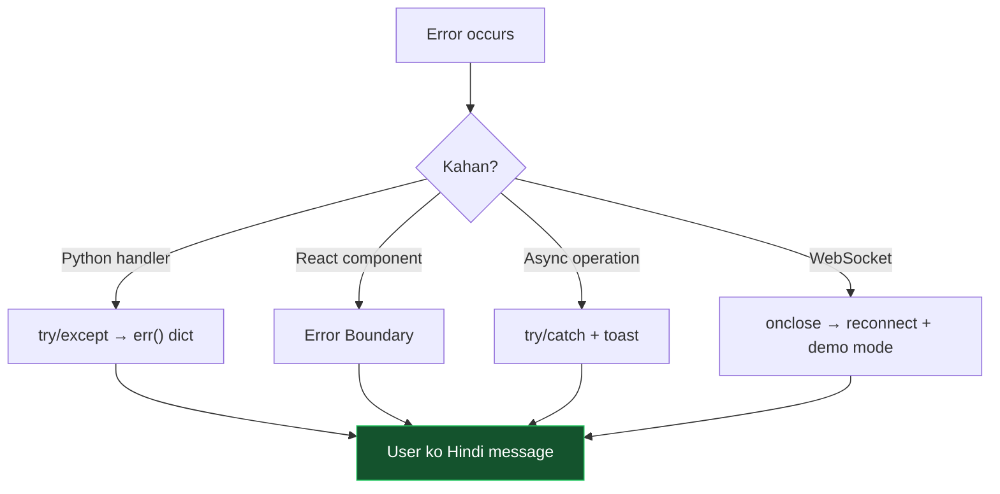
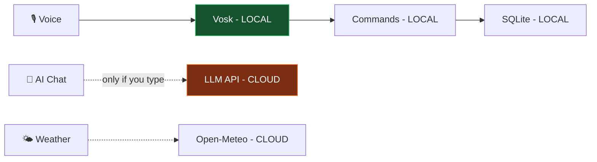

[⬅️ Previous: Demo Script](./15-DEMO-SCRIPT.md) | [🏠 Back to Master Index](./00-START-HERE.md) | [➡️ Next: Free Resources](./17-FREE-RESOURCES.md)

---

# ❓ 16 — FAQ (50+ Questions Answered)

> Har woh sawaal jo aapke, examiner ke, ya kisi user ke dimaag mein aa sakta hai.
> Categories mein organized hai — Ctrl+F karke dhundo! 🔍

---

## 📚 FAQ Categories



---

## 🌟 SECTION A: General (Q1–Q10)

### Q1. Pika AI exactly kya hai?
Ek **cross-platform desktop AI assistant** jo voice se PC control karta hai. Electron
+ React frontend, Python backend, Vosk offline STT, Edge TTS, aur 7 free LLM providers.

### Q2. Yeh Alexa/Siri se kaise alag hai?
| Feature | Alexa/Siri | Pika |
|---------|-----------|------|
| PC control | ❌ | ✅ Full |
| Offline STT | ❌ | ✅ Vosk |
| Privacy | ❌ Cloud | ✅ Local |
| Hindi support | Limited | ✅ Native |
| Customizable | ❌ | ✅ Open source |
| Cost | Device purchase | ✅ Free |

### Q3. Kya yeh completely free hai?
Haan! Saari libraries open-source hain. LLM providers ke free tiers use hote hain
(Groq: 30 req/min free). Koi subscription nahi.

### Q4. Internet ke bina kya-kya kaam karega?
✅ Voice recognition (Vosk), PC control, file operations, system info, calculator,
password generator, TTS (pyttsx3 fallback), saare HUD panels
❌ AI chat, weather, crypto prices, NASA feed, translation

### Q5. Kaunse operating systems support hain?
| OS | Support | Notes |
|----|---------|-------|
| Windows 10/11 | ✅ Full | Best experience |
| macOS 11+ | 🟡 Most | Volume/brightness limited |
| Linux (Ubuntu/Debian) | 🟡 Most | `xdotool` chahiye kuch features ke liye |

### Q6. Kitni RAM chahiye?
Minimum 4 GB, recommended 8 GB. Breakdown: Electron ~250 MB, Vosk model ~150 MB,
Python ~80 MB.

### Q7. Kya mobile par chalega?
Direct app nahi, par **same WiFi par phone browser se access** kar sakte ho:
`http://YOUR_PC_IP:3000`. Settings mein IP dikhta hai.

### Q8. Multiple users support karta hai?
Abhi nahi — single-user design hai. Future scope mein voice biometrics ke saath
multi-user profiles plan hain.

### Q9. Kya main isse apne project mein use kar sakta hoon?
Haan, MIT License hai. Bas original credit de dena.

### Q10. Development mein kitna time laga?
Approximately **5 days** structured development (dekho [08-STEP-BY-STEP.md](./08-STEP-BY-STEP.md)),
plus documentation. Total ~11,000 lines of code.

---

## ⚙️ SECTION B: Technical Architecture (Q11–Q22)

### Q11. Electron ke bajaye Tauri kyun nahi?
Tauri 8 MB hai vs Electron 120 MB — bahut better. Par Tauri mein **Rust** likhna
padta hai, aur uska ecosystem chhota hai. Time constraint aur familiarity ke wajah
se Electron chuna. Production mein Tauri better choice hoti.

### Q12. Python ke bajaye Node.js backend kyun nahi?
Python mein PC automation libraries **kaafi zyada mature** hain:
- `pyautogui` — keyboard/mouse (Node mein `robotjs` deprecated ho gaya)
- `psutil` — system info (Node mein `systeminformation` kam features)
- `vosk` — official Python bindings
- `edge-tts` — best Python implementation

### Q13. Kya ek hi language mein poora project bana sakte the?
Haan, par:
- **Pure Node:** PC automation weak, Vosk bindings unofficial
- **Pure Python:** UI ke liye Tkinter/PyQt — modern glassmorphism mushkil

Current hybrid approach **best of both worlds** deta hai.

### Q14. WebSocket ke bajaye gRPC?
gRPC browsers mein natively support nahi hai — `grpc-web` proxy chahiye. Extra
complexity, koi real benefit nahi localhost par.

### Q15. Performance kaisi hai?
| Operation | Latency |
|-----------|---------|
| UI render | 16ms (60fps) |
| WebSocket round-trip | 2-8ms |
| Vosk STT final | 200-400ms |
| Command parse | <1ms |
| OS command | 50-500ms |
| Edge TTS | 300-800ms |
| LLM first token | 200-1500ms |

### Q16. Memory leaks se kaise bache?
```typescript
// Har useEffect mein cleanup
useEffect(() => {
  const t = setInterval(fn, 1000);
  return () => clearInterval(t);      // ← MUST
}, []);

// Event listeners
useEffect(() => {
  const off = desktop.onBridgeLog(cb);
  return off;                          // ← unsubscribe
}, []);

// Arrays with limits
activityLog: [...new, ...old].slice(0, 30)
```

### Q17. Bundle size optimize kaise kiya?
- Vite **tree-shaking** — unused code removed
- **Lucide React** — sirf used icons bundle mein aate hain
- No moment.js/lodash — native APIs use kiye
- Production build: **~950 KB** (280 KB gzipped)

### Q18. Kitne concurrent WebSocket clients handle kar sakta hai?
Theoretically hundreds (asyncio efficient hai). Practically desktop app mein 1-3
clients (main window + phone + PiP).

### Q19. Kya microservices architecture better hota?
Nahi! Yeh **desktop app** hai, distributed system nahi. Microservices se sirf
complexity badhti — network hops, service discovery, deployment overhead. Monolith
yahan **sahi choice** hai.

### Q20. Error handling strategy kya hai?


### Q21. State management scale karega?
Zustand 100+ state fields tak comfortable hai. Agar aur bada ho toh **slices** mein
tod sakte hain:
```typescript
const useVoiceStore = create(...)
const useSystemStore = create(...)
const useUIStore = create(...)
```

### Q22. Testing framework kyun nahi use kiya?
Time constraint. Production mein:
- **Vitest** — unit tests for `lib/` functions
- **React Testing Library** — component tests
- **Playwright** — E2E tests
- **pytest** — Python handler tests

Abhi manual test cases + `test_bridge.py` health script hai.

---

## 🎙️ SECTION C: Voice & AI (Q23–Q33)

### Q23. Vosk ki accuracy kitni hai?
| Condition | Accuracy |
|-----------|----------|
| Quiet room, clear speech | ~85-90% |
| Normal room | ~75-80% |
| Noisy environment | ~60-70% |
| Heavy accent | ~65-75% |

### Q24. Accuracy improve kaise karein?
1. **Bigger model** — `vosk-model-hi-0.22` (1.5 GB) vs small (45 MB)
2. **Better mic** — headset > laptop mic
3. **Audio preprocessing** — noise suppression enable
4. **Quiet environment**
5. **Slow, clear speech**

### Q25. Aur languages add kar sakte hain?
Haan! Vosk mein 20+ languages hain:
```python
MODELS = {
    "hi": "vosk-model-small-hi-0.22",
    "en": "vosk-model-small-en-us-0.15",
    "es": "vosk-model-small-es-0.42",
    "fr": "vosk-model-small-fr-0.22",
}
```
[Full list](https://alphacephei.com/vosk/models)

### Q26. Hinglish kaise handle hota hai?
Regex patterns mein **teeno variants** likhe hain:
```typescript
/(?:open|kholo|खोलो|launch|start|चलाओ)\s+(.+)/i
```
Ek hi pattern English, Roman Hindi, aur Devanagari — sab match karta hai.

### Q27. Wake word customize kar sakte hain?
Haan:
```python
WAKE_WORDS = ["hey assistant", "hey pika", "पिका", "jarvis", "computer"]
```

### Q28. Wake word "always listening" hai — privacy issue nahi?
Nahi, kyunki:
1. Audio **kabhi bhi network par nahi jaata**
2. Processing 100% local (Vosk)
3. Kuch bhi record/save nahi hota
4. User manually mic toggle kar sakta hai

### Q29. LLM providers mein se best kaunsa?
| Provider | Speed | Quality | Free Limit |
|----------|-------|---------|------------|
| **Groq** ⭐ | ⚡⚡⚡ Fastest | Very good | 30 RPM |
| Cerebras | ⚡⚡⚡ | Very good | 100k tokens/day |
| Gemini | ⚡⚡ | Excellent | 15 RPM |
| Mistral | ⚡⚡ | Good | 1M tokens/day |
| DeepSeek | ⚡ | Excellent (code) | 500/day |

### Q30. Custom LLM (Ollama/LM Studio) use kar sakte hain?
Haan! Settings mein **Custom Provider** add karo:
```
Name: Ollama
Base URL: http://localhost:11434/v1/chat/completions
Model: llama3.2
API Key: (blank)
```

### Q31. LLM streaming kaise kaam karta hai?
Server-Sent Events (SSE) format:
```
data: {"choices":[{"delta":{"content":"Hello"}}]}
data: {"choices":[{"delta":{"content":" world"}}]}
data: [DONE]
```
Python `requests` se `stream=True` karke line-by-line parse karte hain, phir
WebSocket par forward.

### Q32. TTS mein Edge kyun, Google kyun nahi?
Edge TTS **completely free** hai, no API key, aur neural quality deta hai. Google
TTS ke liye API key + billing account chahiye.

### Q33. Offline TTS ki quality kaisi hai?
pyttsx3 (SAPI5 on Windows) **robotic** lagti hai Edge ke comparison mein. Par
emergency fallback ke liye theek hai — kaam ho jaata hai.

---

## 🔐 SECTION D: Security & Privacy (Q34–Q42)

### Q34. Mera data kahan jaata hai?

**Local:** Voice, commands, files, system info, database
**Cloud (optional):** AI chat text, weather coordinates, crypto/NASA fetches

### Q35. API keys secure hain?
- `.env` file mein (`.gitignore` mein hai)
- Ya app settings mein (browser localStorage)
- **Kabhi console mein log nahi hote**
- **Kabhi kisi server par nahi jaate** (except respective provider)

### Q36. Koi meri machine hack kar sakta hai WebSocket se?
Server `0.0.0.0:8765` par bind hota hai — matlab **LAN par accessible** hai. Same
WiFi par koi bhi connect kar sakta hai.

**Mitigation:**
```python
HOST = "127.0.0.1"    # sirf localhost, LAN nahi
```
Ya token authentication add karo:
```python
async def handle_client(ws):
    first = await asyncio.wait_for(ws.recv(), timeout=5)
    if json.loads(first).get("token") != os.getenv("PIKA_TOKEN"):
        await ws.close(1008, "Unauthorized")
        return
```

### Q37. Path traversal kaise prevent kiya?
3 layers: (1) Home-relative resolution, (2) Blocklist regex, (3) Confirmation dialog.
Detail: [13-CODE-WALKTHROUGH.md](./13-CODE-WALKTHROUGH.md)

### Q38. `eval()` use kiya kya?
**Bilkul nahi!** Calculator AST-based hai:
```python
OPS = {ast.Add: opr.add, ast.Sub: opr.sub, ...}
def ev(node):
    if isinstance(node, ast.Constant): return node.value
    if isinstance(node, ast.BinOp): return OPS[type(node.op)](ev(node.left), ev(node.right))
    raise ValueError("unsupported")   # ast.Call blocked!
```

### Q39. XSS possible hai?
React **automatically escape** karta hai. `dangerouslySetInnerHTML` kahin use nahi
kiya. Markdown renderer bhi custom hai jo sirf whitelisted tags render karta hai.

### Q40. Electron mein nodeIntegration ka kya status hai?
```javascript
webPreferences: {
  contextIsolation: true,    // ✅ ON
  nodeIntegration: false,    // ✅ OFF
  sandbox: false,            // preload ko limited Node chahiye
  webSecurity: true,         // ✅ ON
}
```

### Q41. Confirmation bypass ho sakta hai?
Nahi — server-side enforcement hai:
```python
if (cat, act) in CONFIRM_REQUIRED and not params.get("confirmed"):
    # server khud rok deta hai, chahe client kuch bhi bheje
```

### Q42. Rate limiting hai?
Haan — sliding window: 5/second, 60/minute, 500/hour. Isse accidental infinite loops
se system overload nahi hota.

---

## 🚀 SECTION E: Deployment (Q43–Q50)

### Q43. .exe kaise banayein?
```bash
npm run build              # React build
npx electron-builder --win --x64
# Output: release/Pika-AI-Setup-1.0.0.exe
```

### Q44. Installer ka size kitna hoga?
~120-150 MB (Electron + Chromium). Portable version thoda chhota.

### Q45. Python bhi bundle ho sakta hai?
Haan, do tarike:
1. **PyInstaller** — `pc_bridge.py` ko standalone `.exe` banao, phir
   `extraResources` mein include karo
2. **Embedded Python** — Python embeddable package ship karo

### Q46. Auto-update kaise add karein?
```bash
npm install electron-updater
```
```javascript
const { autoUpdater } = require("electron-updater");
app.whenReady().then(() => autoUpdater.checkForUpdatesAndNotify());
```
GitHub Releases ko publish target banao.

### Q47. GitHub par kaise deploy karein?
```bash
git init
git add .
git commit -m "Initial commit: Pika AI Assistant"
git branch -M main
git remote add origin https://github.com/USERNAME/pika-ai.git
git push -u origin main
```

**`.gitignore` (MUST):**
```gitignore
node_modules/
venv/
dist/
release/
data/
models/
screenshots/
.env
*.log
__pycache__/
*.pyc
```

### Q48. Showcase page GitHub Pages par kaise?
```bash
# showcase.html ko index.html rename karo docs/ folder mein
# GitHub → Settings → Pages → Source: main branch /docs
# URL: https://USERNAME.github.io/pika-ai/
```

### Q49. Code signing zaroori hai?
Windows par bina signing ke SmartScreen warning aayega. Certificate ~$200/year hai.
Personal/academic project ke liye zaroori nahi.

### Q50. Multiple machines par install kar sakte hain?
Haan, no license restriction. Har machine par apni `.env` aur `data/pika.db` hogi.

---

## 💼 SECTION F: Career & Portfolio (Q51–Q55)

### Q51. Resume mein kaise likhein?

> **Pika AI Assistant** — Cross-platform Desktop Voice Assistant
> *React 19, TypeScript, Electron, Python, WebSocket, Vosk, SQLite*
> - Built an offline-first desktop assistant supporting 120+ Hindi/English/Hinglish
>   voice commands with 100% local speech recognition (Vosk), eliminating cloud
>   privacy concerns
> - Architected a 3-layer system with Python asyncio WebSocket backend achieving
>   <10ms command latency and real-time bidirectional streaming
> - Implemented multi-provider LLM router with automatic failover across 7 free APIs,
>   ensuring zero downtime for AI features
> - Designed security-first architecture: two-phase commit for destructive operations,
>   AST-based safe evaluation, path traversal protection, contextIsolation
> - Authored 25-file technical documentation suite covering architecture, database
>   design, API protocol, and testing procedures

### Q52. Interview mein kaunse concepts highlight karein?
1. **Async programming** — event loop, executors, thread-safe communication
2. **Security** — contextIsolation, safe eval, path validation, two-phase commit
3. **Design patterns** — Singleton, Observer, Strategy, Adapter, Facade
4. **Real-time systems** — WebSocket, streaming, backpressure
5. **Graceful degradation** — demo mode, TTS fallback, LLM failover

### Q53. Isse aur impressive kaise banayein?
- ✅ **Unit tests** add karo (Vitest + pytest)
- ✅ **CI/CD** — GitHub Actions se auto-build
- ✅ **Demo video** — 2 min YouTube video
- ✅ **Live showcase page** — GitHub Pages
- ✅ **Blog post** — Dev.to par "How I built..."
- ✅ **Docker** — reproducible dev environment

### Q54. Open source contribution ban sakta hai?
Bilkul! Add karo:
- `CONTRIBUTING.md`
- Issue templates
- Good first issues label
- Code of conduct
- MIT LICENSE file

### Q55. Kya yeh production-ready hai?
**Personal use:** Haan ✅
**Commercial product:** Nahi abhi — chahiye:
- Comprehensive test suite (>80% coverage)
- Code signing certificate
- Crash reporting (Sentry)
- Auto-update system
- Multi-user support
- `wss://` encryption
- Accessibility (screen reader support)

---

## 🔗 Related Reading
- Viva questions → [07-VIVA-GUIDE.md](./07-VIVA-GUIDE.md)
- Demo script → [15-DEMO-SCRIPT.md](./15-DEMO-SCRIPT.md)
- Glossary → [24-GLOSSARY.md](./24-GLOSSARY.md)
- Free resources → [17-FREE-RESOURCES.md](./17-FREE-RESOURCES.md)

---

[⬅️ Previous: Demo Script](./15-DEMO-SCRIPT.md) | [🏠 Back to Master Index](./00-START-HERE.md) | [➡️ Next: Free Resources](./17-FREE-RESOURCES.md)
