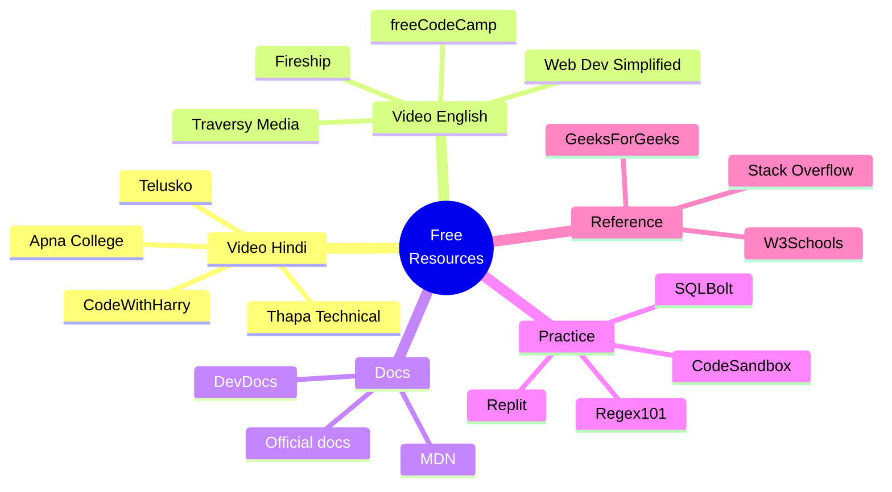
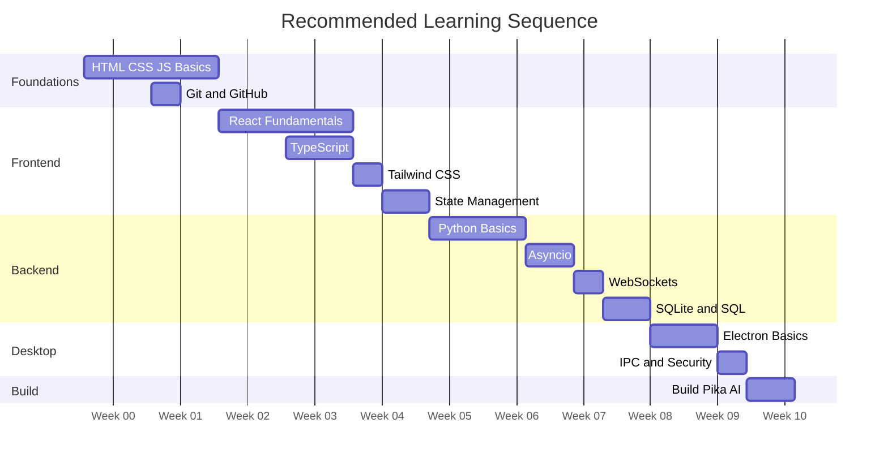

[⬅️ Previous: FAQ](./16-FAQ.md) | [🏠 Back to Master Index](./00-START-HERE.md) | [➡️ Next: Installation Setup](./18-INSTALLATION-SETUP.md)

---

# 🎁 17 — FREE RESOURCES DIRECTORY

> **100% free** resources — koi paid course nahi, koi subscription nahi. Sab verified
> links hain. Bookmark kar lo! 🔖

---

## 🗺️ Resource Map

---

## 🎥 YouTube Channels (Hindi) 🇮🇳

| Channel | Best For | Link |
|---------|----------|------|
| **CodeWithHarry** ⭐ | Python, JS, React, Web Dev | [youtube.com/@CodeWithHarry](https://www.youtube.com/@CodeWithHarry) |
| **Apna College** | DSA, Web Dev, Placement | [youtube.com/@ApnaCollegeOfficial](https://www.youtube.com/@ApnaCollegeOfficial) |
| **Telusko** | Java, Python, Spring | [youtube.com/@Telusko](https://www.youtube.com/@Telusko) |
| **Thapa Technical** | React, Node, Full Stack | [youtube.com/@ThapaTechnical](https://www.youtube.com/@ThapaTechnical) |
| **Love Babbar** | DSA, System Design | [youtube.com/@LoveBabbar1](https://www.youtube.com/@LoveBabbar1) |
| **Chai aur Code** | React deep dive, JS | [youtube.com/@chaiaurcode](https://www.youtube.com/@chaiaurcode) |

### Specific Hindi Playlists

| Topic | Playlist |
|-------|----------|
| Python Complete | [CodeWithHarry Python](https://www.youtube.com/playlist?list=PLu0W_9lII9agICnT8t4iYVSZ3eykIAOME) |
| JavaScript Complete | [CodeWithHarry JS](https://www.youtube.com/playlist?list=PLu0W_9lII9ah7DDtYtflgwMwpT3xmjXY9) |
| React Complete | [CodeWithHarry React](https://www.youtube.com/playlist?list=PLu0W_9lII9agx66oZnT6IyhcMIbUMNMdt) |
| React One-shot | [Apna College](https://www.youtube.com/watch?v=SqcY0GlETPk) |
| SQL Complete | [CodeWithHarry SQL](https://www.youtube.com/watch?v=hlGoQC332VM) |
| Git & GitHub | [Apna College Git](https://www.youtube.com/watch?v=Ez8F0nW6S-w) |

---

## 🎥 YouTube Channels (English) 🌍

| Channel | Best For | Link |
|---------|----------|------|
| **freeCodeCamp** ⭐ | Full courses (4-12 hrs) | [youtube.com/@freecodecamp](https://www.youtube.com/@freecodecamp) |
| **Fireship** ⭐ | Quick concepts (100 sec) | [youtube.com/@Fireship](https://www.youtube.com/@Fireship) |
| **Traversy Media** | Practical projects | [youtube.com/@TraversyMedia](https://www.youtube.com/@TraversyMedia) |
| **Web Dev Simplified** | React, JS explained simply | [youtube.com/@WebDevSimplified](https://www.youtube.com/@WebDevSimplified) |
| **Theo - t3.gg** | Modern React, TypeScript | [youtube.com/@t3dotgg](https://www.youtube.com/@t3dotgg) |
| **ArjanCodes** | Python architecture, patterns | [youtube.com/@ArjanCodes](https://www.youtube.com/@ArjanCodes) |
| **Tech With Tim** | Python projects | [youtube.com/@TechWithTim](https://www.youtube.com/@TechWithTim) |

---

## 📖 Official Documentation

### Frontend
| Tech | Docs |
|------|------|
| React | [react.dev](https://react.dev/) ⭐ Best-in-class |
| TypeScript | [typescriptlang.org/docs](https://www.typescriptlang.org/docs/) |
| Vite | [vite.dev](https://vite.dev/guide/) |
| Tailwind CSS | [tailwindcss.com/docs](https://tailwindcss.com/docs) |
| Zustand | [zustand.docs.pmnd.rs](https://zustand.docs.pmnd.rs/) |
| Framer Motion | [motion.dev/docs](https://motion.dev/docs) |
| Recharts | [recharts.org](https://recharts.org/en-US/) |
| Lucide Icons | [lucide.dev](https://lucide.dev/icons/) |

### Desktop
| Tech | Docs |
|------|------|
| Electron | [electronjs.org/docs](https://www.electronjs.org/docs/latest/) |
| Electron Security | [electronjs.org/docs/tutorial/security](https://www.electronjs.org/docs/latest/tutorial/security) ⭐ MUST READ |
| electron-builder | [electron.build](https://www.electron.build/) |
| Electron Forge | [electronforge.io](https://www.electronforge.io/) |

### Backend
| Tech | Docs |
|------|------|
| Python | [docs.python.org/3](https://docs.python.org/3/) |
| asyncio | [docs.python.org/3/library/asyncio](https://docs.python.org/3/library/asyncio.html) |
| websockets | [websockets.readthedocs.io](https://websockets.readthedocs.io/) |
| psutil | [psutil.readthedocs.io](https://psutil.readthedocs.io/) |
| PyAutoGUI | [pyautogui.readthedocs.io](https://pyautogui.readthedocs.io/) |
| SQLite | [sqlite.org/docs.html](https://www.sqlite.org/docs.html) |
| Python sqlite3 | [docs.python.org/3/library/sqlite3](https://docs.python.org/3/library/sqlite3.html) |

### Voice & AI
| Tech | Docs |
|------|------|
| Vosk | [alphacephei.com/vosk](https://alphacephei.com/vosk/) |
| Vosk Models | [alphacephei.com/vosk/models](https://alphacephei.com/vosk/models) ⭐ 20+ languages |
| edge-tts | [github.com/rany2/edge-tts](https://github.com/rany2/edge-tts) |
| Web Speech API | [MDN Web Speech](https://developer.mozilla.org/en-US/docs/Web/API/Web_Speech_API) |
| Whisper (alternative) | [github.com/openai/whisper](https://github.com/openai/whisper) |

---

## 🆓 Free APIs (No Credit Card!)

### LLM Providers
| Provider | Free Limit | Signup |
|----------|-----------|--------|
| **Groq** ⭐ | 30 req/min | [console.groq.com](https://console.groq.com) |
| Google Gemini | 15 RPM, 1M tokens | [aistudio.google.com](https://aistudio.google.com) |
| Cerebras | 100k tokens/day | [cloud.cerebras.ai](https://cloud.cerebras.ai) |
| Mistral | 1M tokens/day | [console.mistral.ai](https://console.mistral.ai) |
| OpenRouter | 20+ free models | [openrouter.ai](https://openrouter.ai) |
| DeepSeek | 500 req/day | [platform.deepseek.com](https://platform.deepseek.com) |
| Together AI | $25 credit | [together.ai](https://www.together.ai/) |

### Data APIs (No key needed!)
| API | What | URL |
|-----|------|-----|
| **Open-Meteo** ⭐ | Weather forecast | [open-meteo.com](https://open-meteo.com/) |
| wttr.in | Weather (text/JSON) | [wttr.in](https://wttr.in/) |
| CoinGecko | Crypto prices | [coingecko.com/api](https://www.coingecko.com/en/api) |
| NASA APOD | Space image daily | [api.nasa.gov](https://api.nasa.gov/) |
| MyMemory | Translation | [mymemory.translated.net](https://mymemory.translated.net/doc/spec.php) |
| BigDataCloud | Reverse geocoding | [bigdatacloud.com](https://www.bigdatacloud.com/geocoding-apis) |
| REST Countries | Country data | [restcountries.com](https://restcountries.com/) |
| JSONPlaceholder | Fake REST data | [jsonplaceholder.typicode.com](https://jsonplaceholder.typicode.com/) |
| QR Server | QR generation | [goqr.me/api](https://goqr.me/api/) |
| ipify | Public IP | [ipify.org](https://www.ipify.org/) |

### Public API Directories
- [public-apis GitHub](https://github.com/public-apis/public-apis) ⭐ 1400+ free APIs
- [apilist.fun](https://apilist.fun/)
- [rapidapi.com/collection/list-of-free-apis](https://rapidapi.com/collection/list-of-free-apis)

---

## 🧪 Online Playgrounds

| Tool | Purpose | Link |
|------|---------|------|
| **CodeSandbox** ⭐ | Full React apps in browser | [codesandbox.io](https://codesandbox.io/) |
| StackBlitz | Instant dev environments | [stackblitz.com](https://stackblitz.com/) |
| **Replit** | Python, Node, 50+ languages | [replit.com](https://replit.com/) |
| TS Playground | TypeScript experiments | [typescriptlang.org/play](https://www.typescriptlang.org/play) |
| Tailwind Play | Tailwind CSS testing | [play.tailwindcss.com](https://play.tailwindcss.com/) |
| **SQLite Online** | SQL practice | [sqliteonline.com](https://sqliteonline.com/) |
| **Regex101** ⭐ | Regex builder + explainer | [regex101.com](https://regex101.com/) |
| Mermaid Live | Diagram editor | [mermaid.live](https://mermaid.live/) |
| JSON Formatter | JSON validate/format | [jsonformatter.org](https://jsonformatter.org/) |
| WebSocket Test | WS connection testing | [piehost.com/websocket-tester](https://piehost.com/websocket-tester) |
| Can I Use | Browser compatibility | [caniuse.com](https://caniuse.com/) |

---

## 📚 Reference Sites

| Site | Best For | Link |
|------|----------|------|
| **MDN Web Docs** ⭐ | Web APIs, JS, CSS, HTML | [developer.mozilla.org](https://developer.mozilla.org/) |
| **W3Schools** | Quick syntax lookup | [w3schools.com](https://www.w3schools.com/) |
| **GeeksForGeeks** | CS concepts, DSA, DBMS | [geeksforgeeks.org](https://www.geeksforgeeks.org/) |
| **Stack Overflow** | Error solutions | [stackoverflow.com](https://stackoverflow.com/) |
| **DevDocs** | All docs in one place | [devdocs.io](https://devdocs.io/) |
| **Refactoring Guru** ⭐ | Design patterns visual | [refactoring.guru](https://refactoring.guru/) |
| **JavaScript.info** | Deep JS tutorial | [javascript.info](https://javascript.info/) |
| **Real Python** | Python tutorials | [realpython.com](https://realpython.com/) |
| **Patterns.dev** | React patterns | [patterns.dev](https://www.patterns.dev/) |
| **roadmap.sh** ⭐ | Learning roadmaps | [roadmap.sh](https://roadmap.sh/) |

---

## 🎓 Free Full Courses

| Course | Platform | Duration | Link |
|--------|----------|----------|------|
| CS50 (Harvard) ⭐ | edX | 12 weeks | [cs50.harvard.edu](https://cs50.harvard.edu/x/) |
| The Odin Project | Self-paced | 6 months | [theodinproject.com](https://www.theodinproject.com/) |
| freeCodeCamp Curriculum | freeCodeCamp | Self-paced | [freecodecamp.org/learn](https://www.freecodecamp.org/learn) |
| Full Stack Open ⭐ | Univ. Helsinki | 12 weeks | [fullstackopen.com](https://fullstackopen.com/en/) |
| MIT 6.0001 Python | MIT OCW | 9 weeks | [ocw.mit.edu](https://ocw.mit.edu/courses/6-0001-introduction-to-computer-science-and-programming-in-python-fall-2016/) |
| Scrimba React | Scrimba | 12 hours | [scrimba.com/learn/learnreact](https://scrimba.com/learn/learnreact) |

---

## 🛠️ Free Tools

### Development
| Tool | Purpose | Link |
|------|---------|------|
| **VS Code** ⭐ | Code editor | [code.visualstudio.com](https://code.visualstudio.com/) |
| Git | Version control | [git-scm.com](https://git-scm.com/) |
| GitHub | Code hosting | [github.com](https://github.com/) |
| Postman | API testing | [postman.com](https://www.postman.com/) |
| DB Browser SQLite | Database GUI | [sqlitebrowser.org](https://sqlitebrowser.org/) |
| Windows Terminal | Better terminal | [Microsoft Store](https://aka.ms/terminal) |

### VS Code Extensions (Must-have)
| Extension | Purpose |
|-----------|---------|
| ES7+ React Snippets | `rafce` → component boilerplate |
| Tailwind CSS IntelliSense | Class autocomplete |
| Python (Microsoft) | Python support |
| Pylance | Python type checking |
| Error Lens | Inline error display |
| GitLens | Git blame inline |
| Prettier | Code formatting |
| Thunder Client | API testing in VS Code |
| Markdown Preview Mermaid | Mermaid diagrams preview ⭐ |

### Design
| Tool | Purpose | Link |
|------|---------|------|
| Figma | UI design (free tier) | [figma.com](https://www.figma.com/) |
| Coolors | Color palette generator | [coolors.co](https://coolors.co/) |
| Lucide Icons | Icon library | [lucide.dev](https://lucide.dev/) |
| Google Fonts | Free fonts | [fonts.google.com](https://fonts.google.com/) |
| unDraw | Free illustrations | [undraw.co](https://undraw.co/) |
| Excalidraw | Hand-drawn diagrams | [excalidraw.com](https://excalidraw.com/) |

---

## 📊 Diagram Tools

| Tool | Purpose | Link |
|------|---------|------|
| **Mermaid** ⭐ | Text-to-diagram (used in these docs!) | [mermaid.js.org](https://mermaid.js.org/) |
| Mermaid Live Editor | Test diagrams | [mermaid.live](https://mermaid.live/) |
| draw.io | Free diagram editor | [app.diagrams.net](https://app.diagrams.net/) |
| PlantUML | UML diagrams | [plantuml.com](https://plantuml.com/) |
| dbdiagram.io | Database ER diagrams | [dbdiagram.io](https://dbdiagram.io/) |

---

## 🎯 Curated Learning Path for THIS Project

**Total realistic timeline:** ~10 weeks (2-3 hrs/day)

**Fast track (already know JS/Python):** 2 weeks

---

## 💡 Study Tips

| Tip | Why |
|-----|-----|
| **Code along, don't just watch** | Passive watching = 10% retention |
| **Break things intentionally** | Errors se sabse zyada seekhte hain |
| **Read official docs first** | Tutorials outdated ho jaate hain |
| **Build, don't tutorial-hop** | Ek project complete karo |
| **Explain to someone** | Feynman technique — best test |
| **Use Regex101 for regex** | Visual explanation milti hai |
| **Bookmark MDN** | Sabse reliable web reference |

---

## 🔗 Related Reading
- Prerequisites → [01-REQUIREMENTS.md](./01-REQUIREMENTS.md)
- Build plan → [08-STEP-BY-STEP.md](./08-STEP-BY-STEP.md)
- Language basics → [09-LANGUAGE-BASICS.md](./09-LANGUAGE-BASICS.md)

---

[⬅️ Previous: FAQ](./16-FAQ.md) | [🏠 Back to Master Index](./00-START-HERE.md) | [➡️ Next: Installation Setup](./18-INSTALLATION-SETUP.md)
