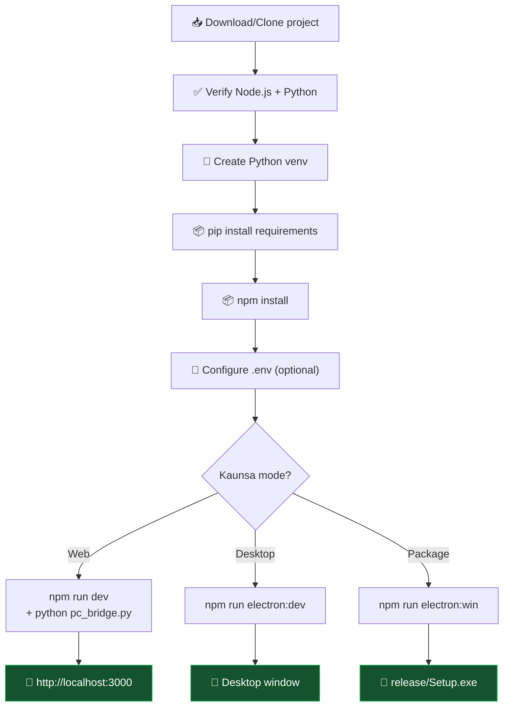
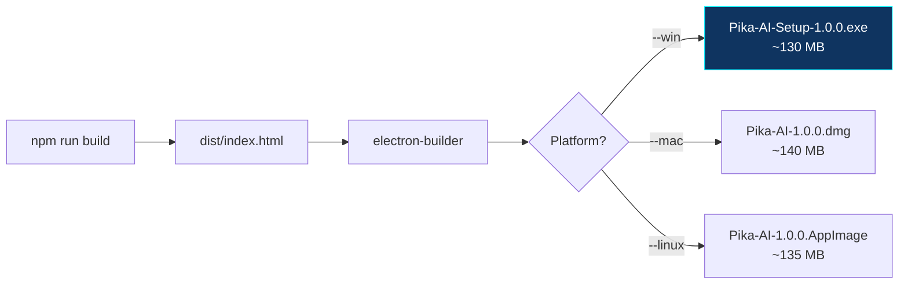
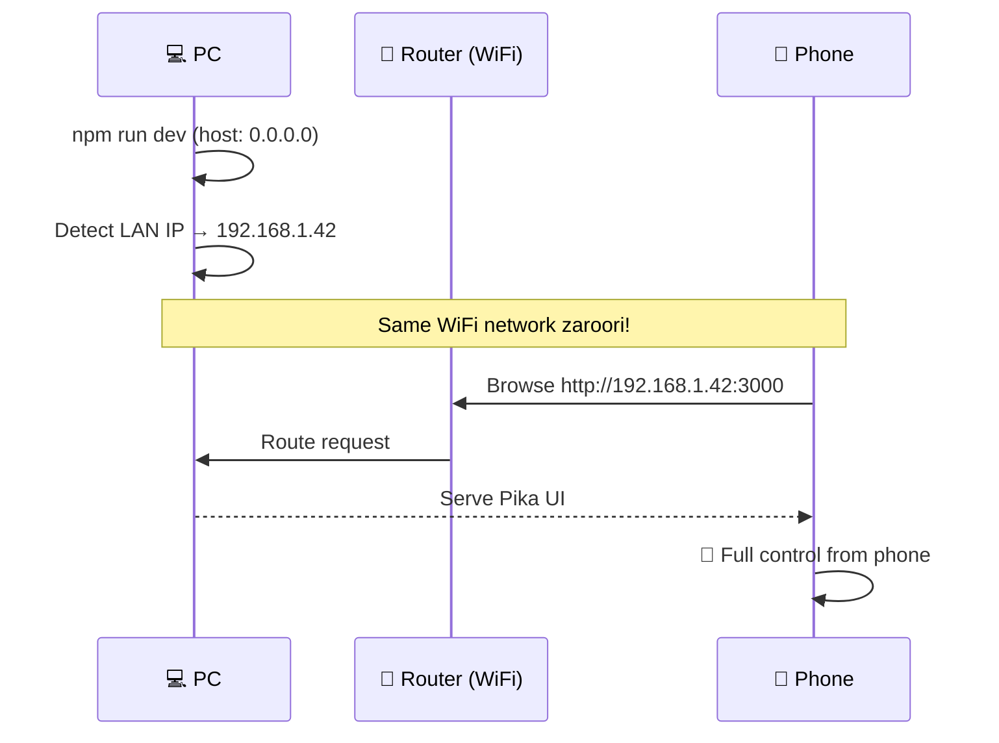

[⬅️ Previous: Free Resources](./17-FREE-RESOURCES.md) | [🏠 Back to Master Index](./00-START-HERE.md) | [➡️ Next: Testing & Quality](./19-TESTING-QUALITY.md)

---

# ⚙️ 18 — INSTALLATION & SETUP MANUAL

> Zero se app chalane tak ka **complete guide**. Har step verify karne ka tarika bhi
> diya hai. Follow karo, 15 minute mein ready! ⏱️

---

## 🗺️ Installation Flow



---

## 🚀 METHOD 1: One-Click (Recommended)

### Windows
```
start.bat par DOUBLE-CLICK karo
```

Yeh script automatically:
1. ✅ Python detect karti hai (`py` → `python` → `python3`)
2. ✅ Node.js verify karti hai
3. ✅ Virtual environment banati hai (`venv/`)
4. ✅ Python packages install karti hai (venv ke andar)
5. ✅ npm packages install karti hai
6. ✅ Python bridge start karti hai (minimized window)
7. ✅ LAN IP detect karke dikhati hai
8. ✅ Browser kholti hai

### Mac / Linux
```bash
chmod +x start.sh
./start.sh

# Ya cross-platform Python launcher
python3 start.py
```

---

## 🔧 METHOD 2: Manual Setup (Step-by-Step)

### Step 1 — Prerequisites Verify

```bash
node --version      # v18.0.0+ chahiye
npm --version       # 9.0.0+
python --version    # 3.10.0+   (ya: py --version)
git --version       # 2.30+
```

| Missing? | Download |
|----------|----------|
| Node.js | [nodejs.org/download](https://nodejs.org/en/download) |
| Python | [python.org/downloads](https://www.python.org/downloads/) |
| Git | [git-scm.com/downloads](https://git-scm.com/downloads) |

> ⚠️ **Windows par Python install karte waqt "Add Python to PATH" ZAROOR tick karo!**

---

### Step 2 — Project Setup

```bash
# Clone (ya ZIP download karke extract karo)
git clone https://github.com/YOUR_USERNAME/pika-ai.git
cd pika-ai

# Folder structure verify
ls          # Mac/Linux
dir         # Windows
# Dikhna chahiye: package.json, pc_bridge.py, src/, electron/
```

---

### Step 3 — Python Virtual Environment

**Kyun venv?** Global Python mein packages install karne se version conflicts hote
hain. venv har project ko apna isolated environment deta hai.

```bash
# Create
python -m venv venv

# Activate — Windows CMD
venv\Scripts\activate.bat

# Activate — Windows PowerShell
venv\Scripts\Activate.ps1

# Activate — Mac/Linux
source venv/bin/activate

# Prompt ke aage (venv) dikhna chahiye:
# (venv) C:\pika-ai>
```

**PowerShell error aaye toh:**
```powershell
Set-ExecutionPolicy -ExecutionPolicy RemoteSigned -Scope CurrentUser
```

**Verify:**
```bash
python -c "import sys; print(sys.executable)"
# Output venv folder ke andar hona chahiye ✅
```

---

### Step 4 — Python Dependencies

```bash
pip install --upgrade pip
pip install -r requirements.txt
```

**Package breakdown:**
| Package | Size | Purpose | Required? |
|---------|------|---------|:---------:|
| `websockets` | 100 KB | WebSocket server | ✅ MUST |
| `psutil` | 500 KB | System info | 🟡 Recommended |
| `pyautogui` | 2 MB | Keyboard/mouse | 🟡 Recommended |
| `pyperclip` | 20 KB | Clipboard | 🔵 Optional |
| `requests` | 200 KB | HTTP/LLM | 🟡 Recommended |
| `vosk` | 15 MB | Offline STT | 🔵 Optional |
| `edge-tts` | 100 KB | Neural TTS | 🔵 Optional |
| `pyttsx3` | 50 KB | Offline TTS | 🔵 Optional |
| `python-dotenv` | 20 KB | .env loading | 🟡 Recommended |

**Verify:**
```bash
python test_bridge.py
```

Expected:
```
✓ Module imported. (Python 3.12.0)
  Optional libs — psutil: True, pyautogui: True, pyperclip: True
  Vosk: True, Edge TTS: True
...
 ALL TESTS PASSED ✓
```

---

### Step 5 — Node Dependencies

```bash
npm install
```

**Takes 2-5 minutes first time.** Downloads ~500 MB into `node_modules/`.

**Verify:**
```bash
npm list --depth=0
# react, typescript, vite, electron, zustand... sab dikhna chahiye
```

---

### Step 6 — Environment Configuration (Optional)

```bash
# Windows
copy .env.example .env

# Mac/Linux
cp .env.example .env
```

Edit `.env`:
```env
# Sabse fast + generous free tier
GROQ_API_KEY=gsk_xxxxxxxxxxxxxxxxxxxx

# Optional backups
GEMINI_API_KEY=
CEREBRAS_API_KEY=
MISTRAL_API_KEY=
DEEPSEEK_API_KEY=
OPENROUTER_API_KEY=

# Weather default
DEFAULT_WEATHER_LOCATION=Delhi
```

> **API key nahi hai?** Koi baat nahi! App **demo mode** mein chalega. Sab UI
> features kaam karenge, bas AI chat ke local canned responses honge.

**Get free keys:**
| Provider | Link | Time to get |
|----------|------|-------------|
| Groq ⭐ | [console.groq.com](https://console.groq.com) | 2 min |
| Gemini | [aistudio.google.com](https://aistudio.google.com) | 2 min |

---

### Step 7 — Run!

#### Option A: Web Mode (2 terminals)
```bash
# Terminal 1 — Backend
venv\Scripts\activate          # Windows
source venv/bin/activate       # Mac/Linux
python pc_bridge.py

# Terminal 2 — Frontend
npm run dev
```
Open: `http://localhost:3000`

#### Option B: Desktop Mode (1 command)
```bash
npm run electron:dev
```

> ⚠️ **Important:** `package.json` mein yeh scripts add karni hongi (manually):
> ```json
> {
>   "main": "electron/main.cjs",
>   "scripts": {
>     "dev": "vite",
>     "build": "tsc -b && vite build",
>     "electron:dev": "concurrently -k \"vite\" \"wait-on tcp:3000 && cross-env NODE_ENV=development electron .\"",
>     "electron:build": "npm run build && electron-builder",
>     "electron:win": "npm run build && electron-builder --win --x64",
>     "electron:mac": "npm run build && electron-builder --mac",
>     "electron:linux": "npm run build && electron-builder --linux"
>   }
> }
> ```

---

## 📦 Building for Distribution

### Web Build
```bash
npm run build
# Output: dist/index.html (single file, ~950 KB)

# Test the build
npm run preview
```

### Desktop Installer



```bash
# Windows (.exe installer + portable)
npm run electron:win

# macOS (.dmg)
npm run electron:mac

# Linux (.AppImage + .deb)
npm run electron:linux

# Output: release/ folder
```

**Build time:** 2-5 minutes

---

## 📱 Mobile Access Setup



### Steps:
1. **Vite config already set:** `server: { host: "0.0.0.0", port: 3000 }`
2. **Find your IP:**
   ```bash
   # Windows
   ipconfig | findstr IPv4

   # Mac/Linux
   ifconfig | grep "inet "
   # or
   hostname -I
   ```
   Ya app mein: **Settings → मोबाइल एक्सेस** (auto-detected + copy button)

3. **Phone browser mein:** `http://192.168.1.42:3000`

### Firewall (agar connect na ho)
```powershell
# Windows — PowerShell as Administrator
New-NetFirewallRule -DisplayName "Pika Vite" -Direction Inbound -LocalPort 3000 -Protocol TCP -Action Allow
New-NetFirewallRule -DisplayName "Pika Bridge" -Direction Inbound -LocalPort 8765 -Protocol TCP -Action Allow
```

```bash
# Linux (ufw)
sudo ufw allow 3000/tcp
sudo ufw allow 8765/tcp
```

---

## ✅ Post-Install Verification Checklist

| # | Check | Command / Action | Expected |
|---|-------|------------------|----------|
| 1 | Node works | `node --version` | v18+ |
| 2 | Python works | `python --version` | 3.10+ |
| 3 | venv active | `python -c "import sys;print(sys.executable)"` | Path has `venv` |
| 4 | Python deps | `python test_bridge.py` | ALL TESTS PASSED |
| 5 | Node deps | `npm list --depth=0` | No UNMET errors |
| 6 | Frontend builds | `npm run build` | `dist/index.html` created |
| 7 | Bridge starts | `python pc_bridge.py` | Banner + "ws://localhost:8765" |
| 8 | Dev server | `npm run dev` | "Local: http://localhost:3000" |
| 9 | UI loads | Open browser | Dark HUD dashboard |
| 10 | Bridge connected | Check top-right | 🟢 Green dot |
| 11 | Command works | Type "cpu usage" | Real CPU % |
| 12 | Voice works | Click mic, say "hello" | Transcript appears |
| 13 | Desktop mode | `npm run electron:dev` | Native window |
| 14 | Mobile access | Phone → `http://IP:3000` | UI loads |

---

## 📂 Directory After Setup

```
pika-ai/
├── node_modules/          ← 500 MB (npm install se)
├── venv/                  ← 80 MB (python -m venv se)
├── models/
│   └── hi/                ← 45 MB (auto-download on first voice use)
├── data/
│   └── pika.db            ← auto-created
├── screenshots/           ← auto-created
├── dist/                  ← npm run build se
├── release/               ← electron-builder se
├── src/                   ← source code
├── electron/              ← desktop shell
├── docs/                  ← this documentation
├── .env                   ← your API keys (git-ignored)
├── pc_bridge.py
├── package.json
└── start.bat
```

**Total disk:** ~800 MB after full setup

---

## 🔄 Updating

```bash
git pull origin main

# Dependencies update
npm install
pip install -r requirements.txt --upgrade

# Rebuild
npm run build
```

---

## 🗑️ Uninstalling / Clean Reset

```bash
# Windows
rmdir /s /q node_modules venv dist release
del package-lock.json

# Mac/Linux
rm -rf node_modules venv dist release package-lock.json

# Keep your data
# data/ aur .env ko mat delete karo agar settings save rakhni hain
```

---

## 🐳 Docker Setup (Advanced/Optional)

```dockerfile
# Dockerfile
FROM python:3.12-slim

RUN apt-get update && apt-get install -y \
    nodejs npm \
    && rm -rf /var/lib/apt/lists/*

WORKDIR /app
COPY requirements.txt .
RUN pip install --no-cache-dir -r requirements.txt

COPY package*.json ./
RUN npm ci

COPY . .
RUN npm run build

EXPOSE 3000 8765
CMD ["sh", "-c", "python pc_bridge.py & npm run preview -- --host 0.0.0.0"]
```

```bash
docker build -t pika-ai .
docker run -p 3000:3000 -p 8765:8765 pika-ai
```

> ⚠️ **Note:** Docker mein PC control features kaam nahi karenge (container isolated
> hai). Sirf UI + AI chat ke liye useful hai.

---

## 🔗 Related Reading
- Errors aa rahe? → [14-DEBUGGING-GUIDE.md](./14-DEBUGGING-GUIDE.md)
- Testing → [19-TESTING-QUALITY.md](./19-TESTING-QUALITY.md)
- Daily operations → [20-SECURITY-OPERATIONS.md](./20-SECURITY-OPERATIONS.md)
- User guide → [22-UI-USER-MANUAL.md](./22-UI-USER-MANUAL.md)

---

[⬅️ Previous: Free Resources](./17-FREE-RESOURCES.md) | [🏠 Back to Master Index](./00-START-HERE.md) | [➡️ Next: Testing & Quality](./19-TESTING-QUALITY.md)
