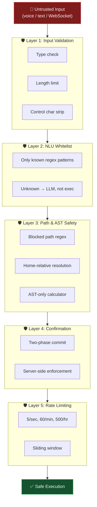
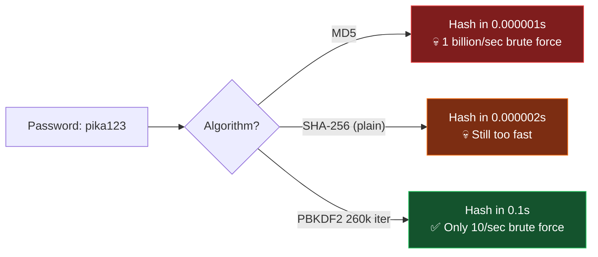
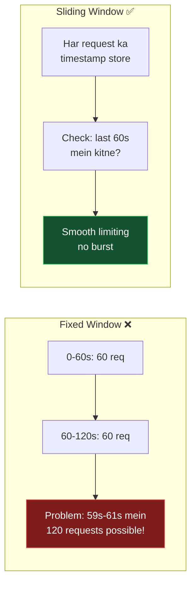
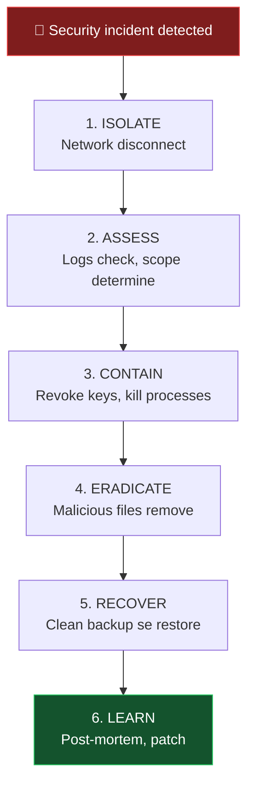

[⬅️ Previous: Testing & Quality](./19-TESTING-QUALITY.md) | [🏠 Back to Master Index](./00-START-HERE.md) | [➡️ Next: Data Practice Lab](./21-DATA-PRACTICE-LAB.md)

---

# 🔐 20 — SECURITY & DAY-TO-DAY OPERATIONS

> Security sirf "password lagana" nahi hai. Yeh file **defense-in-depth** strategy,
> hashing, sanitization, backups, aur daily operator checklists deti hai. 🛡️

---

## 🏰 Defense in Depth — 5 Layers



---

## 1️⃣ Password Hashing (For Future Auth)

> Abhi Pika single-user hai, par agar multi-user add karo toh **NEVER store plain
> passwords!**

```python
import hashlib
import secrets
import hmac


class PasswordManager:
    """
    PBKDF2-HMAC-SHA256 based password hashing.
    Bcrypt/Argon2 better hain par unke liye extra dependency chahiye.
    PBKDF2 Python stdlib mein hai — zero dependency.
    """

    ITERATIONS = 260_000        # OWASP 2023 recommendation
    SALT_BYTES = 32
    HASH_NAME = "sha256"

    @classmethod
    def hash_password(cls, password: str) -> str:
        """
        Returns: "algorithm$iterations$salt_hex$hash_hex"
        Har user ka SALT alag hota hai — rainbow table attack useless.
        """
        salt = secrets.token_bytes(cls.SALT_BYTES)
        dk = hashlib.pbkdf2_hmac(
            cls.HASH_NAME,
            password.encode("utf-8"),
            salt,
            cls.ITERATIONS
        )
        return f"pbkdf2_{cls.HASH_NAME}${cls.ITERATIONS}${salt.hex()}${dk.hex()}"

    @classmethod
    def verify_password(cls, password: str, stored: str) -> bool:
        """
        Timing-attack safe comparison using hmac.compare_digest().
        Normal == comparison se attacker character-by-character guess kar sakta hai.
        """
        try:
            algo, iterations, salt_hex, hash_hex = stored.split("$")
            hash_name = algo.split("_")[1]
            salt = bytes.fromhex(salt_hex)
            expected = bytes.fromhex(hash_hex)
            dk = hashlib.pbkdf2_hmac(
                hash_name, password.encode("utf-8"), salt, int(iterations)
            )
            return hmac.compare_digest(dk, expected)   # ← constant-time!
        except (ValueError, IndexError):
            return False


# Usage
stored = PasswordManager.hash_password("MySecret123!")
print(stored)
# pbkdf2_sha256$260000$a3f1...$8b2c...

print(PasswordManager.verify_password("MySecret123!", stored))  # True
print(PasswordManager.verify_password("WrongPass", stored))     # False
```

### Why not MD5/SHA1?



| Algorithm | Speed | Secure for passwords? |
|-----------|-------|:---------------------:|
| MD5 | ⚡⚡⚡⚡ Very fast | ❌ NEVER |
| SHA-1 | ⚡⚡⚡⚡ Very fast | ❌ NEVER |
| SHA-256 (plain) | ⚡⚡⚡ Fast | ❌ No (too fast) |
| PBKDF2 | 🐌 Slow (good!) | ✅ Yes |
| bcrypt | 🐌 Slow | ✅ Yes (better) |
| Argon2 | 🐌 Slow | ✅ Yes (best) |

> **Slow = Good for passwords!** Attacker ko har guess ke liye 0.1s lagega. 8-char
> password crack karne mein years lag jayenge.

---

## 2️⃣ Input Sanitization

```python
import re
import unicodedata


class InputSanitizer:
    """Har user input yahan se guzarta hai."""

    MAX_LENGTH = 4096
    MAX_PATH_LENGTH = 260              # Windows MAX_PATH
    CONTROL_CHARS = re.compile(r"[\x00-\x08\x0b\x0c\x0e-\x1f\x7f]")
    DANGEROUS_FILENAME = re.compile(r'[<>:"|?*\x00-\x1f]')
    RESERVED_NAMES = {
        "CON", "PRN", "AUX", "NUL",
        *[f"COM{i}" for i in range(1, 10)],
        *[f"LPT{i}" for i in range(1, 10)],
    }

    @classmethod
    def sanitize_text(cls, s: str) -> str:
        """General text — control chars hatao, length limit."""
        if not isinstance(s, str):
            return ""
        s = unicodedata.normalize("NFKC", s)     # Unicode normalize
        s = cls.CONTROL_CHARS.sub("", s)         # invisible chars remove
        return s.strip()[:cls.MAX_LENGTH]

    @classmethod
    def sanitize_filename(cls, name: str) -> str:
        """Filename — Windows reserved names + illegal chars handle."""
        name = cls.sanitize_text(name)
        name = cls.DANGEROUS_FILENAME.sub("_", name)
        name = name.strip(". ")                  # trailing dots/spaces (Windows bug)

        stem = name.split(".")[0].upper()
        if stem in cls.RESERVED_NAMES:
            name = f"_{name}"                    # CON.txt → _CON.txt

        return name[:255] or "untitled"

    @classmethod
    def sanitize_sql_identifier(cls, name: str) -> str:
        """Table/column names — sirf alphanumeric + underscore."""
        clean = re.sub(r"[^a-zA-Z0-9_]", "", name)
        if not clean or clean[0].isdigit():
            raise ValueError(f"Invalid SQL identifier: {name}")
        return clean

    @classmethod
    def validate_url(cls, url: str) -> bool:
        """Sirf http/https allow — javascript:, file:, data: block."""
        return bool(re.match(r"^https?://[\w\-.]+", url, re.IGNORECASE))
```

### Sanitization Test Cases

| Input | After sanitize | Why |
|-------|---------------|-----|
| `hello\x00world` | `helloworld` | Null byte removed |
| `CON.txt` | `_CON.txt` | Windows reserved name |
| `file<>:.txt` | `file___.txt` | Illegal chars replaced |
| `test.  ` | `test` | Trailing dots/spaces |
| `javascript:alert(1)` | ❌ Rejected | Not http/https |
| `a` × 10000 | First 4096 chars | Length limit |

---

## 3️⃣ Path Traversal Protection

```python
import re
from pathlib import Path


BLOCKED_PATTERNS = [
    r"^[a-zA-Z]:\\Windows",
    r"^[a-zA-Z]:\\Program Files",
    r"^[a-zA-Z]:\\ProgramData",
    r"^[a-zA-Z]:\\\$Recycle",
    r"^/System", r"^/usr", r"^/etc", r"^/bin", r"^/sbin", r"^/boot",
    r"^/Library", r"^/private",
]


def is_path_safe(p: Path) -> bool:
    """Layer 2: Blocklist check on RESOLVED path."""
    try:
        resolved = str(p.resolve())              # symlinks resolve karo!
    except (OSError, RuntimeError):
        return False
    return not any(re.search(pat, resolved, re.IGNORECASE) for pat in BLOCKED_PATTERNS)


def resolve_path(path_str: str) -> Path:
    """Layer 1: Relative paths HOME se resolve, root se nahi."""
    home = Path.home()
    if not path_str:
        return home / "Desktop"

    low = path_str.lower().strip()
    folders = {
        "desktop": "Desktop", "documents": "Documents",
        "downloads": "Downloads", "pictures": "Pictures",
        "music": "Music", "videos": "Videos",
    }
    for k, v in folders.items():
        if low == k or low.startswith(k + "/") or low.startswith(k + "\\"):
            rest = path_str[len(k):].strip("/\\")
            return (home / v / rest) if rest else (home / v)

    p = Path(path_str).expanduser()
    return p if p.is_absolute() else home / p
```

### Attack Test Matrix

| Attack Input | Resolved To | Blocked? |
|--------------|-------------|:--------:|
| `../../../etc/passwd` | `/home/user/../../../etc/passwd` → `/etc/passwd` | ✅ Yes |
| `C:\Windows\System32\config\SAM` | Same | ✅ Yes |
| `~/../../Windows/notepad.exe` | `C:\Windows\notepad.exe` | ✅ Yes |
| `/proc/self/environ` | Same | 🟡 Add to blocklist |
| `desktop/notes.txt` | `~/Desktop/notes.txt` | ❌ No (safe) |
| `notes.txt` | `~/notes.txt` | ❌ No (safe) |

---

## 4️⃣ Safe Expression Evaluation

```python
import ast
import operator as opr


SAFE_OPS = {
    ast.Add: opr.add, ast.Sub: opr.sub, ast.Mult: opr.mul,
    ast.Div: opr.truediv, ast.FloorDiv: opr.floordiv,
    ast.Pow: opr.pow, ast.Mod: opr.mod, ast.USub: opr.neg, ast.UAdd: opr.pos,
}
MAX_RESULT = 10 ** 15


def safe_eval(expression: str) -> float:
    """
    AST-based math evaluation. eval() se 100x safer.
    Function calls, attribute access, imports — sab blocked.
    """
    def _eval(node):
        if isinstance(node, ast.Constant):
            if not isinstance(node.value, (int, float)):
                raise ValueError("Only numbers allowed")
            return node.value
        if isinstance(node, ast.BinOp):
            op = SAFE_OPS.get(type(node.op))
            if not op:
                raise ValueError("Unsupported operator")
            return op(_eval(node.left), _eval(node.right))
        if isinstance(node, ast.UnaryOp):
            op = SAFE_OPS.get(type(node.op))
            if not op:
                raise ValueError("Unsupported unary operator")
            return op(_eval(node.operand))
        # ast.Call, ast.Attribute, ast.Name → sab reject
        raise ValueError(f"Unsupported node: {type(node).__name__}")

    if len(expression) > 200:
        raise ValueError("Expression too long")

    tree = ast.parse(expression, mode="eval")
    result = _eval(tree.body)

    if abs(result) > MAX_RESULT:
        raise ValueError("Result too large")
    return result
```

### Attack Comparison

```python
# ❌ With eval() — CATASTROPHIC
eval("__import__('os').system('rm -rf /')")           # 💀 System wiped
eval("open('/etc/passwd').read()")                     # 💀 Data leaked
eval("__import__('socket').create_connection(...)")    # 💀 Reverse shell

# ✅ With safe_eval() — ALL BLOCKED
safe_eval("__import__('os').system('rm -rf /')")
# ValueError: Unsupported node: Call ✅
```

---

## 5️⃣ Rate Limiting (Sliding Window)

```python
import time
from collections import deque
from threading import Lock


class RateLimiter:
    """
    Sliding window rate limiter — fixed window se better hai.
    Fixed window mein boundary par 2x burst possible hai.
    """

    LIMITS = {
        "second": (5, 1),        # 5 requests per 1 second
        "minute": (60, 60),      # 60 per 60 seconds
        "hour":   (500, 3600),   # 500 per 3600 seconds
    }

    def __init__(self):
        self._windows: dict[str, dict[str, deque]] = {}
        self._lock = Lock()

    def check(self, client_id: str) -> tuple[bool, str]:
        """Returns (allowed, reason)"""
        now = time.time()
        with self._lock:
            if client_id not in self._windows:
                self._windows[client_id] = {k: deque() for k in self.LIMITS}

            for name, (max_req, window) in self.LIMITS.items():
                dq = self._windows[client_id][name]

                # Purane entries hatao (sliding!)
                while dq and dq[0] < now - window:
                    dq.popleft()

                if len(dq) >= max_req:
                    return False, f"Rate limit: max {max_req} per {name}"

            # Sab pass — record karo
            for name in self.LIMITS:
                self._windows[client_id][name].append(now)

            return True, "OK"

    def reset(self, client_id: str) -> None:
        with self._lock:
            self._windows.pop(client_id, None)


# Usage in WebSocket handler
limiter = RateLimiter()

async def handle_client(ws):
    client_id = f"{ws.remote_address[0]}"
    async for message in ws:
        allowed, reason = limiter.check(client_id)
        if not allowed:
            await ws.send(json.dumps({"type": "response", "status": "error",
                                      "message": f"⏱️ {reason}"}))
            continue
        # ... process
```



---

## 6️⃣ Secrets Management

### ✅ DO
```python
import os
from dotenv import load_dotenv

load_dotenv()
api_key = os.getenv("GROQ_API_KEY")

if not api_key:
    logger.warning("GROQ_API_KEY not set — AI features limited")
```

```gitignore
# .gitignore — MUST HAVE
.env
.env.local
.env.*.local
data/
*.log
venv/
node_modules/
release/
__pycache__/
```

### ❌ DON'T
```python
API_KEY = "gsk_abc123..."              # ❌ Hardcoded
print(f"Using key: {api_key}")         # ❌ Logged
logger.info(f"Request: {headers}")     # ❌ Auth header leaked
```

### Key Rotation Checklist
- [ ] Har 90 din key rotate karo
- [ ] Purani key revoke karo provider dashboard se
- [ ] Nayi key `.env` mein update karo
- [ ] Git history check karo: `git log -p | grep -i "api_key"`
- [ ] Agar leak hua toh **turant revoke** karo

---

## 7️⃣ Electron Security Checklist

| Setting | Required Value | Status | Why |
|---------|---------------|:------:|-----|
| `contextIsolation` | `true` | ✅ | Renderer ↔ preload separate context |
| `nodeIntegration` | `false` | ✅ | No `require()` in renderer |
| `webSecurity` | `true` | ✅ | CORS + same-origin enforced |
| `allowRunningInsecureContent` | `false` | ✅ | No mixed content |
| `experimentalFeatures` | `false` | ✅ | No unstable APIs |
| Remote module | Not used | ✅ | Deprecated & insecure |
| `setWindowOpenHandler` | Deny + shell | ✅ | External links safe |
| CSP header | Set | 🟡 TODO | XSS defense |

```javascript
// main.cjs — external links handling
mainWindow.webContents.setWindowOpenHandler(({ url }) => {
  shell.openExternal(url);      // default browser mein kholo
  return { action: "deny" };    // app ke andar mat kholo
});

// Optional: Content Security Policy
session.defaultSession.webRequest.onHeadersReceived((details, callback) => {
  callback({
    responseHeaders: {
      ...details.responseHeaders,
      "Content-Security-Policy": [
        "default-src 'self'; " +
        "script-src 'self'; " +
        "style-src 'self' 'unsafe-inline' https://fonts.googleapis.com; " +
        "img-src 'self' data: https:; " +
        "connect-src 'self' ws://localhost:8765 https://api.open-meteo.com"
      ],
    },
  });
});
```

---

## 💾 Backup & Restore

### Automated Backup Script

```python
#!/usr/bin/env python3
"""backup.py — Pika data backup with rotation"""
import shutil
import sqlite3
import json
import zipfile
from pathlib import Path
from datetime import datetime, timedelta

ROOT = Path(__file__).parent
DATA = ROOT / "data"
BACKUP_DIR = ROOT / "backups"
RETENTION_DAYS = 30


def backup_database() -> Path:
    """SQLite backup API — safe even while DB is in use."""
    BACKUP_DIR.mkdir(exist_ok=True)
    ts = datetime.now().strftime("%Y%m%d_%H%M%S")
    dest = BACKUP_DIR / f"pika_{ts}.db"

    src_conn = sqlite3.connect(str(DATA / "pika.db"))
    dst_conn = sqlite3.connect(str(dest))
    with dst_conn:
        src_conn.backup(dst_conn)      # ← atomic, hot backup
    src_conn.close()
    dst_conn.close()
    print(f"✓ Database backed up: {dest.name}")
    return dest


def backup_config() -> Path:
    """Settings + .env template (WITHOUT actual keys)"""
    ts = datetime.now().strftime("%Y%m%d_%H%M%S")
    dest = BACKUP_DIR / f"config_{ts}.zip"

    with zipfile.ZipFile(dest, "w", zipfile.ZIP_DEFLATED) as z:
        for f in ["requirements.txt", "package.json", ".env.example"]:
            p = ROOT / f
            if p.exists():
                z.write(p, f)
    print(f"✓ Config backed up: {dest.name}")
    return dest


def prune_old_backups() -> int:
    """RETENTION_DAYS se purane backups delete"""
    cutoff = datetime.now() - timedelta(days=RETENTION_DAYS)
    removed = 0
    for f in BACKUP_DIR.glob("*"):
        if datetime.fromtimestamp(f.stat().st_mtime) < cutoff:
            f.unlink()
            removed += 1
    print(f"✓ Pruned {removed} old backups")
    return removed


def verify_backup(path: Path) -> bool:
    """Backup readable hai ya nahi check karo"""
    try:
        conn = sqlite3.connect(str(path))
        tables = conn.execute(
            "SELECT COUNT(*) FROM sqlite_master WHERE type='table'"
        ).fetchone()[0]
        conn.close()
        print(f"✓ Backup verified: {tables} tables")
        return tables > 0
    except Exception as e:
        print(f"✗ Backup verification FAILED: {e}")
        return False


if __name__ == "__main__":
    print("=" * 50)
    print(f" PIKA BACKUP — {datetime.now():%Y-%m-%d %H:%M:%S}")
    print("=" * 50)
    db = backup_database()
    backup_config()
    verify_backup(db)
    prune_old_backups()
    print("=" * 50)
    print(" BACKUP COMPLETE ✓")
    print("=" * 50)
```

### Restore
```bash
# 1. App band karo
# 2. Purani DB rename karo (safety)
mv data/pika.db data/pika.db.old

# 3. Backup restore karo
cp backups/pika_20260702_103000.db data/pika.db

# 4. Verify
python -c "import sqlite3; c=sqlite3.connect('data/pika.db'); print(c.execute('SELECT name FROM sqlite_master WHERE type=\"table\"').fetchall())"

# 5. App start karo
```

### Schedule (Windows Task Scheduler)
```powershell
schtasks /create /tn "Pika Daily Backup" /tr "C:\pika-ai\venv\Scripts\python.exe C:\pika-ai\backup.py" /sc daily /st 02:00
```

### Schedule (Linux cron)
```bash
crontab -e
# Add:
0 2 * * * cd /home/user/pika-ai && ./venv/bin/python backup.py >> backup.log 2>&1
```

---

## 📋 Daily Operator Checklists

### 🌅 Morning Opening (5 minutes)


- [ ] `start.bat` chalao ya Electron app kholo
- [ ] Top-right **green dot** verify karo (bridge connected)
- [ ] Ek test command: `cpu usage` → real value aani chahiye
- [ ] Mic test: "hello" bolo → transcript dikhe
- [ ] Disk space check: Storage Explorer panel dekho (>10% free)
- [ ] `pc_bridge.log` mein overnight errors check karo
- [ ] Weather widget load hua? (internet check)

### 🌙 Evening Closing (3 minutes)

- [ ] Active reminders review karo — koi pending toh nahi?
- [ ] `python backup.py` chalao
- [ ] Backup verify: `backups/` mein aaj ki file hai?
- [ ] Log file size check: `pc_bridge.log` >10 MB toh rotate karo
- [ ] Tray → Quit se clean shutdown karo (Python bhi band ho jayega)

### 📅 Weekly Maintenance (15 minutes)

- [ ] `python -c "from pc_bridge import *; Database().auto_prune()"` — old records clean
- [ ] `pip list --outdated` — Python packages check
- [ ] `npm outdated` — Node packages check
- [ ] Old screenshots delete karo (`screenshots/` folder)
- [ ] Command stats review: sabse zyada kaunsa command use hua?
- [ ] Error rate check: <5% hona chahiye

### 📆 Monthly Audit (30 minutes)

- [ ] API keys rotate karo
- [ ] Full test suite run: [19-TESTING-QUALITY.md](./19-TESTING-QUALITY.md)
- [ ] Dependency security audit: `npm audit`, `pip-audit`
- [ ] Backup restore test karo (dry run)
- [ ] Documentation update karo agar features change hue
- [ ] Disk usage trend check karo

---

## 🚨 Incident Response



### Emergency Commands

```bash
# 1. Sab kuch turant band karo
taskkill /IM python.exe /F        # Windows
taskkill /IM electron.exe /F
pkill -9 -f pc_bridge.py          # Linux/Mac

# 2. Network isolate
netsh interface set interface "Wi-Fi" admin=disable   # Windows

# 3. Suspicious activity check
python -c "
import sqlite3
c = sqlite3.connect('data/pika.db')
for r in c.execute('''SELECT timestamp, category, action, status, message
                      FROM command_log ORDER BY timestamp DESC LIMIT 50'''):
    print(r)
"

# 4. API keys revoke karo (provider dashboards par jao)
# 5. .env rotate karo
# 6. Clean backup se restore
```

---

## 📊 Security Posture Summary

| Control | Implemented | Notes |
|---------|:-----------:|-------|
| Input sanitization | ✅ | Control chars, length limits |
| Path traversal protection | ✅ | Blocklist + home-relative |
| Safe expression eval | ✅ | AST-based, no `eval()` |
| SQL injection prevention | ✅ | Parameterized queries only |
| XSS prevention | ✅ | React auto-escape |
| Destructive action guard | ✅ | Two-phase confirmation |
| Rate limiting | ✅ | Sliding window |
| Secrets management | ✅ | `.env` + gitignore |
| Electron hardening | ✅ | contextIsolation, no nodeIntegration |
| Transport encryption | ❌ | `ws://` not `wss://` (localhost only) |
| Authentication | ❌ | Single-user assumption |
| Audit logging | ✅ | `command_log` table |
| Backup & restore | ✅ | Automated script |
| Dependency scanning | 🟡 | Manual `npm audit` |

---

## 🔗 Related Reading
- Database security → [12-DATABASE-BASICS.md](./12-DATABASE-BASICS.md)
- Security test cases → [19-TESTING-QUALITY.md](./19-TESTING-QUALITY.md)
- Viva security questions → [07-VIVA-GUIDE.md](./07-VIVA-GUIDE.md)

**External:**
- [OWASP Top 10](https://owasp.org/www-project-top-ten/)
- [Electron Security](https://www.electronjs.org/docs/latest/tutorial/security) ⭐
- [OWASP Password Storage Cheat Sheet](https://cheatsheetseries.owasp.org/cheatsheets/Password_Storage_Cheat_Sheet.html)
- [Python Security Best Practices](https://snyk.io/blog/python-security-best-practices-cheat-sheet/)

---

[⬅️ Previous: Testing & Quality](./19-TESTING-QUALITY.md) | [🏠 Back to Master Index](./00-START-HERE.md) | [➡️ Next: Data Practice Lab](./21-DATA-PRACTICE-LAB.md)
