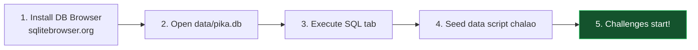

[⬅️ Previous: Security & Operations](./20-SECURITY-OPERATIONS.md) | [🏠 Back to Master Index](./00-START-HERE.md) | [➡️ Next: UI User Manual](./22-UI-USER-MANUAL.md)

---

# 🧪 21 — DATA PRACTICE LAB (Hands-On SQL Challenges)

> Padhna alag baat hai, **karna** alag! Yeh lab aapko real Pika database par SQL
> practice karwayegi. Har challenge ka solution bhi hai — pehle khud try karo! 💪

---

## 🎮 Lab Setup



**Option A:** [DB Browser for SQLite](https://sqlitebrowser.org/dl/) (GUI, recommended)
**Option B:** [sqliteonline.com](https://sqliteonline.com/) (browser, no install)
**Option C:** Command line — `sqlite3 data/pika.db`

---

## 🌱 Seed Data Script

Pehle yeh chalao taaki practice karne ke liye data ho:

```sql
-- ═══════════════════════════════════════════════════════════
-- PIKA PRACTICE LAB — Seed Data
-- ═══════════════════════════════════════════════════════════

-- Clean slate
DELETE FROM command_log;
DELETE FROM reminders;
DELETE FROM conversation;
DELETE FROM sessions;
DELETE FROM snippets;
DELETE FROM provider_stats;

-- Sessions
INSERT INTO sessions (id, started_at, ended_at, message_count) VALUES
('s1', '2026-07-01 09:00:00', '2026-07-01 09:45:00', 12),
('s2', '2026-07-01 14:30:00', '2026-07-01 15:10:00', 8),
('s3', '2026-07-02 10:00:00', NULL, 5);

-- Conversations
INSERT INTO conversation (id, role, content, provider, session_id, timestamp) VALUES
('c1','user','namaste',NULL,'s1','2026-07-01 09:00:10'),
('c2','assistant','नमस्ते! कैसे मदद करूँ?','groq','s1','2026-07-01 09:00:12'),
('c3','user','joke sunao',NULL,'s1','2026-07-01 09:05:00'),
('c4','assistant','प्रोग्रामर बीमार क्यों नहीं पड़ता? 😄','groq','s1','2026-07-01 09:05:03'),
('c5','user','weather batao',NULL,'s2','2026-07-01 14:31:00'),
('c6','assistant','दिल्ली में 32°C है','gemini','s2','2026-07-01 14:31:04'),
('c7','user','python kya hai',NULL,'s3','2026-07-02 10:01:00'),
('c8','assistant','Python एक programming language है','cerebras','s3','2026-07-02 10:01:05');

-- Command log (realistic distribution)
INSERT INTO command_log (id, command_type, category, action, params, status, message, duration_ms, timestamp) VALUES
('l01','command','apps','open','{"name":"chrome"}','success','Chrome खोल दिया',180,'2026-07-01 09:01:00'),
('l02','command','apps','open','{"name":"notepad"}','success','Notepad खोल दिया',95,'2026-07-01 09:02:00'),
('l03','command','apps','open','{"name":"chrome"}','success','Chrome खोल दिया',175,'2026-07-01 10:15:00'),
('l04','command','volume','set','{"percent":50}','success','आवाज़ 50%',45,'2026-07-01 09:10:00'),
('l05','command','volume','up','{}','success','आवाज़ बढ़ाई',38,'2026-07-01 09:15:00'),
('l06','command','volume','up','{}','success','आवाज़ बढ़ाई',41,'2026-07-01 11:20:00'),
('l07','command','volume','mute','{}','success','म्यूट',30,'2026-07-01 12:00:00'),
('l08','command','info','cpu','{}','success','CPU 45%',420,'2026-07-01 09:20:00'),
('l09','command','info','ram','{}','success','RAM 62%',15,'2026-07-01 09:21:00'),
('l10','command','info','battery','{}','success','बैटरी 78%',12,'2026-07-01 09:22:00'),
('l11','command','files','create_file','{"path":"test.txt"}','success','फाइल बनी',85,'2026-07-01 10:00:00'),
('l12','command','files','delete','{"path":"old.txt"}','success','डिलीट',70,'2026-07-01 10:05:00'),
('l13','command','files','delete','{"path":"C:\\Windows\\x"}','error','सुरक्षा: पथ प्रतिबंधित',5,'2026-07-01 10:06:00'),
('l14','command','files','list','{"path":"Downloads"}','success','24 आइटम',120,'2026-07-01 10:10:00'),
('l15','command','screen','screenshot','{}','success','स्क्रीनशॉट सेव',650,'2026-07-01 11:00:00'),
('l16','command','screen','screenshot','{}','success','स्क्रीनशॉट सेव',610,'2026-07-01 15:00:00'),
('l17','command','web','open_site','{"name":"youtube"}','success','YouTube खोला',200,'2026-07-01 13:00:00'),
('l18','command','web','search','{"query":"react hooks"}','success','सर्च कर रहा हूँ',190,'2026-07-01 13:05:00'),
('l19','command','calculator','eval','{"expression":"25*4"}','success','25*4 = 100',3,'2026-07-01 14:00:00'),
('l20','command','calculator','eval','{"expression":"10**1000"}','error','संख्या बहुत बड़ी',4,'2026-07-01 14:01:00'),
('l21','command','system','lock','{}','success','लॉक कर दिया',110,'2026-07-01 18:00:00'),
('l22','command','processes','list','{}','success','30 प्रोसेस',890,'2026-07-02 10:20:00'),
('l23','command','processes','kill','{"name_or_pid":"chrome"}','error','अनुमति नहीं',25,'2026-07-02 10:21:00'),
('l24','command','apps','open','{"name":"vscode"}','success','VS Code खोला',320,'2026-07-02 10:30:00'),
('l25','command','weather','get','{"location":"Delhi"}','success','32°C',1150,'2026-07-02 11:00:00');

-- Reminders
INSERT INTO reminders (id, text, trigger_time, created_at, status) VALUES
('r1','Chai break','2026-07-01 11:00:00','2026-07-01 10:45:00','triggered'),
('r2','Meeting with guide','2026-07-01 15:00:00','2026-07-01 09:00:00','triggered'),
('r3','Submit report','2026-07-03 17:00:00','2026-07-02 09:00:00','active'),
('r4','Call mom','2026-07-02 20:00:00','2026-07-02 10:00:00','active'),
('r5','Old task','2026-06-28 10:00:00','2026-06-28 09:00:00','cancelled');

-- Snippets
INSERT INTO snippets (trigger, content, use_count, created_at) VALUES
('addr','123 MG Road, New Delhi 110001',15,'2026-06-15 10:00:00'),
('sig','Thanks & Regards,\nAmit Kumar',42,'2026-06-15 10:05:00'),
('email','amit.kumar@example.com',28,'2026-06-20 11:00:00'),
('phone','+91-98765-43210',7,'2026-06-25 12:00:00'),
('gst','27AABCU9603R1ZX',2,'2026-07-01 09:00:00');

-- Provider stats
INSERT INTO provider_stats (provider, total_calls, failed_calls, avg_latency_ms, last_used) VALUES
('groq',145,3,890,'2026-07-02 10:01:05'),
('gemini',67,8,1450,'2026-07-01 14:31:04'),
('cerebras',89,2,720,'2026-07-02 10:01:05'),
('mistral',23,5,1680,'2026-06-30 16:00:00'),
('deepseek',12,0,1200,'2026-06-28 14:00:00');
```

---

## 🟢 LEVEL 1: Beginner (SELECT Basics)

### Challenge 1.1
**Task:** Saare active reminders dikhao.

<details><summary>💡 Solution</summary>

```sql
SELECT * FROM reminders WHERE status = 'active';
```
**Expected:** 2 rows (r3, r4)
</details>

---

### Challenge 1.2
**Task:** Snippets ko use_count ke hisaab se descending order mein dikhao.

<details><summary>💡 Solution</summary>

```sql
SELECT trigger, content, use_count
FROM snippets
ORDER BY use_count DESC;
```
**Expected:** sig(42), email(28), addr(15), phone(7), gst(2)
</details>

---

### Challenge 1.3
**Task:** Sirf woh commands dikhao jo fail hue.

<details><summary>💡 Solution</summary>

```sql
SELECT category, action, message, timestamp
FROM command_log
WHERE status = 'error';
```
**Expected:** 3 rows (l13, l20, l23)
</details>

---

### Challenge 1.4
**Task:** Top 5 sabse slow commands (duration ke hisaab se).

<details><summary>💡 Solution</summary>

```sql
SELECT category, action, duration_ms
FROM command_log
ORDER BY duration_ms DESC
LIMIT 5;
```
**Expected:** weather/get(1150), processes/list(890), screen/screenshot(650, 610), info/cpu(420)
</details>

---

### Challenge 1.5
**Task:** Kitne total commands run hue?

<details><summary>💡 Solution</summary>

```sql
SELECT COUNT(*) AS total_commands FROM command_log;
```
**Expected:** 25
</details>

---

## 🟡 LEVEL 2: Intermediate (Aggregation & Grouping)

### Challenge 2.1
**Task:** Har category mein kitne commands chale? Descending order mein.

<details><summary>💡 Solution</summary>

```sql
SELECT category, COUNT(*) AS uses
FROM command_log
GROUP BY category
ORDER BY uses DESC;
```
**Expected:** apps(4), volume(4), files(4), info(3), calculator(2), screen(2), processes(2), web(2), system(1), weather(1)
</details>

---

### Challenge 2.2
**Task:** Har category ka average execution time nikalo, 1 decimal tak round karo.

<details><summary>💡 Solution</summary>

```sql
SELECT category,
       COUNT(*) AS n,
       ROUND(AVG(duration_ms), 1) AS avg_ms,
       MIN(duration_ms) AS fastest,
       MAX(duration_ms) AS slowest
FROM command_log
GROUP BY category
ORDER BY avg_ms DESC;
```
</details>

---

### Challenge 2.3
**Task:** Overall error rate percentage nikalo.

<details><summary>💡 Solution</summary>

```sql
SELECT
    COUNT(*) AS total,
    SUM(CASE WHEN status = 'error' THEN 1 ELSE 0 END) AS errors,
    ROUND(100.0 * SUM(CASE WHEN status = 'error' THEN 1 ELSE 0 END) / COUNT(*), 2)
        AS error_percent
FROM command_log;
```
**Expected:** total=25, errors=3, error_percent=12.0
</details>

---

### Challenge 2.4
**Task:** Sirf woh categories dikhao jinme 3 se zyada commands chale.

<details><summary>💡 Solution</summary>

```sql
SELECT category, COUNT(*) AS uses
FROM command_log
GROUP BY category
HAVING uses > 3          -- HAVING grouping ke BAAD filter karta hai
ORDER BY uses DESC;
```
> **WHERE vs HAVING:** `WHERE` rows par filter karta hai (grouping se pehle),
> `HAVING` groups par filter karta hai (grouping ke baad).
</details>

---

### Challenge 2.5
**Task:** Har LLM provider ka success rate nikalo.

<details><summary>💡 Solution</summary>

```sql
SELECT provider,
       total_calls,
       failed_calls,
       ROUND(100.0 * (total_calls - failed_calls) / total_calls, 1) AS success_pct,
       avg_latency_ms
FROM provider_stats
ORDER BY success_pct DESC, avg_latency_ms ASC;
```
**Expected:** deepseek(100%), cerebras(97.8%), groq(97.9%), mistral(78.3%), gemini(88.1%)
</details>

---

## 🟠 LEVEL 3: Advanced (JOINs & Subqueries)

### Challenge 3.1
**Task:** Har session ke saath uske messages ka count dikhao (JOIN use karke).

<details><summary>💡 Solution</summary>

```sql
SELECT s.id,
       s.started_at,
       COUNT(c.id) AS actual_messages,
       s.message_count AS recorded_count
FROM sessions s
LEFT JOIN conversation c ON s.id = c.session_id
GROUP BY s.id, s.started_at, s.message_count
ORDER BY s.started_at;
```
> **LEFT JOIN kyun?** Taaki woh sessions bhi dikhein jinme koi message nahi hai.
> INNER JOIN se woh gayab ho jaate.
</details>

---

### Challenge 3.2
**Task:** Sabse latest session ke saare messages dikhao (subquery use karke).

<details><summary>💡 Solution</summary>

```sql
SELECT role, content, provider, timestamp
FROM conversation
WHERE session_id = (
    SELECT id FROM sessions ORDER BY started_at DESC LIMIT 1
)
ORDER BY timestamp;
```
**Expected:** s3 ke 2 messages
</details>

---

### Challenge 3.3
**Task:** Kaun se providers ne assistant messages generate kiye aur kitne?

<details><summary>💡 Solution</summary>

```sql
SELECT c.provider,
       COUNT(*) AS messages,
       ps.avg_latency_ms
FROM conversation c
LEFT JOIN provider_stats ps ON c.provider = ps.provider
WHERE c.role = 'assistant' AND c.provider IS NOT NULL
GROUP BY c.provider, ps.avg_latency_ms
ORDER BY messages DESC;
```
</details>

---

### Challenge 3.4
**Task:** Woh commands dhundo jinka duration category average se zyada hai.

<details><summary>💡 Solution</summary>

```sql
SELECT cl.category, cl.action, cl.duration_ms,
       ROUND(avg_table.category_avg, 1) AS category_avg
FROM command_log cl
INNER JOIN (
    SELECT category, AVG(duration_ms) AS category_avg
    FROM command_log
    GROUP BY category
) avg_table ON cl.category = avg_table.category
WHERE cl.duration_ms > avg_table.category_avg
ORDER BY cl.duration_ms DESC;
```
> Yeh **correlated subquery in JOIN** pattern hai — bahut powerful!
</details>

---

### Challenge 3.5
**Task:** Har din ka command count nikalo (date grouping).

<details><summary>💡 Solution</summary>

```sql
SELECT DATE(timestamp) AS day,
       COUNT(*) AS commands,
       SUM(CASE WHEN status='success' THEN 1 ELSE 0 END) AS successes,
       SUM(CASE WHEN status='error' THEN 1 ELSE 0 END) AS errors
FROM command_log
GROUP BY DATE(timestamp)
ORDER BY day;
```
**Expected:** 2026-07-01 (21 commands), 2026-07-02 (4 commands)
</details>

---

## 🔴 LEVEL 4: Expert (Window Functions & CTEs)

### Challenge 4.1
**Task:** Har category mein commands ko duration ke hisaab se rank do.

<details><summary>💡 Solution</summary>

```sql
SELECT category, action, duration_ms,
       RANK() OVER (PARTITION BY category ORDER BY duration_ms DESC) AS rank_in_category
FROM command_log
ORDER BY category, rank_in_category;
```
> **Window function** — GROUP BY se rows collapse nahi hote, har row apni rank ke
> saath rehti hai.
</details>

---

### Challenge 4.2
**Task:** Running total of commands over time.

<details><summary>💡 Solution</summary>

```sql
SELECT timestamp, category, action,
       COUNT(*) OVER (ORDER BY timestamp
                      ROWS BETWEEN UNBOUNDED PRECEDING AND CURRENT ROW)
           AS running_total
FROM command_log
ORDER BY timestamp;
```
</details>

---

### Challenge 4.3
**Task:** CTE use karke top 3 categories ka detailed breakdown.

<details><summary>💡 Solution</summary>

```sql
WITH top_categories AS (
    SELECT category, COUNT(*) AS uses
    FROM command_log
    GROUP BY category
    ORDER BY uses DESC
    LIMIT 3
),
category_details AS (
    SELECT cl.category, cl.action, COUNT(*) AS action_count,
           ROUND(AVG(cl.duration_ms), 1) AS avg_ms
    FROM command_log cl
    INNER JOIN top_categories tc ON cl.category = tc.category
    GROUP BY cl.category, cl.action
)
SELECT * FROM category_details
ORDER BY category, action_count DESC;
```
> **CTE (Common Table Expression)** = temporary named result set. Complex queries
> ko readable banata hai.
</details>

---

### Challenge 4.4
**Task:** Consecutive commands ke beech time gap nikalo (LAG function).

<details><summary>💡 Solution</summary>

```sql
SELECT timestamp,
       category || '/' || action AS command,
       LAG(timestamp) OVER (ORDER BY timestamp) AS prev_time,
       ROUND((julianday(timestamp) -
              julianday(LAG(timestamp) OVER (ORDER BY timestamp))) * 86400)
           AS gap_seconds
FROM command_log
ORDER BY timestamp;
```
> `julianday()` SQLite ka date→number converter hai. Difference × 86400 = seconds.
</details>

---

## 🏗️ LEVEL 5: Schema Design Challenges

### Challenge 5.1
**Task:** Ek `macros` table design karo jo recorded macros store kare.

<details><summary>💡 Solution</summary>

```sql
CREATE TABLE IF NOT EXISTS macros (
    id            TEXT PRIMARY KEY NOT NULL,
    name          TEXT NOT NULL UNIQUE,
    description   TEXT,
    events        TEXT NOT NULL,              -- JSON array
    event_count   INTEGER NOT NULL DEFAULT 0,
    duration_ms   INTEGER NOT NULL DEFAULT 0,
    is_destructive INTEGER NOT NULL DEFAULT 0 CHECK(is_destructive IN (0,1)),
    play_count    INTEGER NOT NULL DEFAULT 0,
    created_at    TEXT NOT NULL DEFAULT (datetime('now')),
    last_played   TEXT
);

CREATE INDEX idx_macros_name ON macros(name);
```

**Design decisions:**
- `name UNIQUE` — duplicate macro names nahi
- `events` as JSON TEXT — flexible schema, SQLite mein JSON functions hain
- `is_destructive` flag — confirmation ke liye
- `play_count` — analytics ke liye
</details>

---

### Challenge 5.2
**Task:** Multi-user support ke liye schema modify karo.

<details><summary>💡 Solution</summary>

```sql
-- Users table
CREATE TABLE IF NOT EXISTS users (
    id             TEXT PRIMARY KEY NOT NULL,
    username       TEXT NOT NULL UNIQUE,
    password_hash  TEXT NOT NULL,           -- PBKDF2 format
    display_name   TEXT,
    role           TEXT NOT NULL DEFAULT 'user'
                   CHECK(role IN ('admin','user','readonly')),
    created_at     TEXT NOT NULL DEFAULT (datetime('now')),
    last_login     TEXT,
    is_active      INTEGER NOT NULL DEFAULT 1
);

-- Existing tables mein user_id add karo
ALTER TABLE reminders ADD COLUMN user_id TEXT REFERENCES users(id);
ALTER TABLE command_log ADD COLUMN user_id TEXT REFERENCES users(id);
ALTER TABLE snippets ADD COLUMN user_id TEXT REFERENCES users(id);
ALTER TABLE sessions ADD COLUMN user_id TEXT REFERENCES users(id);

-- Indexes for user-scoped queries
CREATE INDEX idx_reminders_user ON reminders(user_id, status);
CREATE INDEX idx_cmdlog_user ON command_log(user_id, timestamp DESC);
```
</details>

---

## 📊 Analytics Dashboard Queries

Real-world queries jo aap app mein use kar sakte ho:

```sql
-- 1. Daily activity heatmap data
SELECT
    DATE(timestamp) AS day,
    CAST(strftime('%H', timestamp) AS INTEGER) AS hour,
    COUNT(*) AS commands
FROM command_log
GROUP BY day, hour
ORDER BY day, hour;

-- 2. Most productive hour
SELECT strftime('%H', timestamp) AS hour, COUNT(*) AS commands
FROM command_log
GROUP BY hour
ORDER BY commands DESC
LIMIT 1;

-- 3. Command diversity score (unique commands / total)
SELECT
    COUNT(DISTINCT category || '/' || action) AS unique_commands,
    COUNT(*) AS total_commands,
    ROUND(100.0 * COUNT(DISTINCT category || '/' || action) / COUNT(*), 1)
        AS diversity_pct
FROM command_log;

-- 4. Reminder completion rate
SELECT
    status,
    COUNT(*) AS count,
    ROUND(100.0 * COUNT(*) / (SELECT COUNT(*) FROM reminders), 1) AS pct
FROM reminders
GROUP BY status;

-- 5. Snippet ROI (characters saved)
SELECT
    trigger,
    use_count,
    LENGTH(content) AS content_len,
    use_count * (LENGTH(content) - LENGTH(trigger)) AS chars_saved
FROM snippets
ORDER BY chars_saved DESC;

-- 6. Provider reliability ranking
SELECT
    provider,
    total_calls,
    ROUND(100.0 * (total_calls - failed_calls) / total_calls, 1) AS reliability,
    avg_latency_ms,
    ROUND((100.0 * (total_calls - failed_calls) / total_calls) / (avg_latency_ms / 1000.0), 1)
        AS score      -- reliability per second of latency
FROM provider_stats
WHERE total_calls > 10
ORDER BY score DESC;
```

---

## 🔧 Maintenance Queries

```sql
-- Database size breakdown
SELECT
    name AS table_name,
    (SELECT COUNT(*) FROM pragma_table_info(name)) AS columns
FROM sqlite_master
WHERE type = 'table' AND name NOT LIKE 'sqlite_%';

-- Row counts per table
SELECT 'command_log' AS tbl, COUNT(*) AS rows FROM command_log
UNION ALL SELECT 'conversation', COUNT(*) FROM conversation
UNION ALL SELECT 'reminders', COUNT(*) FROM reminders
UNION ALL SELECT 'snippets', COUNT(*) FROM snippets
UNION ALL SELECT 'sessions', COUNT(*) FROM sessions
ORDER BY rows DESC;

-- Cleanup old data (30+ days)
DELETE FROM command_log WHERE timestamp < datetime('now', '-30 days');
DELETE FROM conversation WHERE timestamp < datetime('now', '-30 days');
VACUUM;

-- Integrity check
PRAGMA integrity_check;
PRAGMA foreign_key_check;

-- Index usage verify
EXPLAIN QUERY PLAN
SELECT * FROM reminders WHERE status='active' ORDER BY trigger_time;
```

---

## 🎯 Self-Assessment Quiz

| # | Question | Answer |
|---|----------|--------|
| 1 | `WHERE` aur `HAVING` mein kya farak? | WHERE rows par (before grouping), HAVING groups par (after) |
| 2 | `INNER JOIN` vs `LEFT JOIN`? | INNER sirf matching, LEFT sab left rows + matching right |
| 3 | Index kab lagana chahiye? | WHERE/ORDER BY/JOIN mein frequently use hone wale columns |
| 4 | `VACUUM` kya karta hai? | Deleted rows ka disk space reclaim karta hai |
| 5 | SQL injection kaise rokein? | Parameterized queries (`?` placeholder) |
| 6 | Transaction ka use? | Multiple operations atomic banane ke liye |
| 7 | `COUNT(*)` vs `COUNT(col)`? | `*` sab rows, `col` sirf non-NULL values |
| 8 | CTE kya hai? | Common Table Expression — temporary named result set |
| 9 | Window function ka fayda? | Rows collapse kiye bina aggregate calculations |
| 10 | WAL mode ka benefit? | Readers aur writer parallel chal sakte hain |

---

## 🔗 Related Reading
- Full schema → [03-DATABASE.md](./03-DATABASE.md)
- SQL tutorial → [12-DATABASE-BASICS.md](./12-DATABASE-BASICS.md)
- Backup scripts → [20-SECURITY-OPERATIONS.md](./20-SECURITY-OPERATIONS.md)

**Practice more:**
- [SQLBolt](https://sqlbolt.com/) ⭐ Interactive lessons
- [SQLZoo](https://sqlzoo.net/) — Challenge-based
- [HackerRank SQL](https://www.hackerrank.com/domains/sql) — Interview prep
- [LeetCode Database](https://leetcode.com/problemset/database/) — Advanced
- [SQLite Online](https://sqliteonline.com/) — Browser playground

---

[⬅️ Previous: Security & Operations](./20-SECURITY-OPERATIONS.md) | [🏠 Back to Master Index](./00-START-HERE.md) | [➡️ Next: UI User Manual](./22-UI-USER-MANUAL.md)
