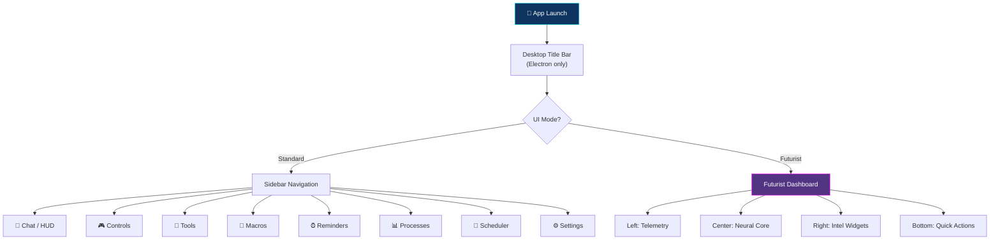
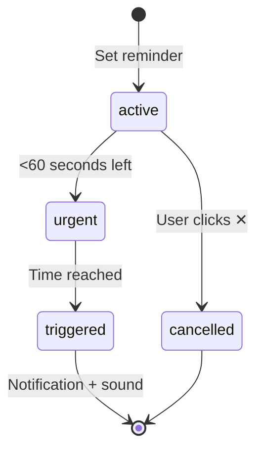

[⬅️ Previous: Data Practice Lab](./21-DATA-PRACTICE-LAB.md) | [🏠 Back to Master Index](./00-START-HERE.md) | [➡️ Next: Project Report Writing](./23-PROJECT-REPORT-WRITING.md)

---

# 📱 22 — UI USER MANUAL (Screen-by-Screen Guide)

> Yeh **end-user manual** hai. Har screen, har button, har feature ka detailed
> explanation. Non-technical user bhi padh kar app use kar sakta hai! 👤

---

## 🗺️ App Navigation Map



---

## 🖥️ SCREEN 1: Desktop Title Bar (Electron Only)

```
┌────────────────────────────────────────────────────────────────┐
│ ⚡ PIKA AI v1.0.0    🟢 BRIDGE LIVE ⟳    🖼 📋 │ ─  □  ✕      │
└────────────────────────────────────────────────────────────────┘
```

| Element | Icon | Function |
|---------|------|----------|
| Logo + version | ⚡ | Branding, drag handle |
| Bridge status | 🟢/🔴 | Green = Python connected, Red = offline |
| Restart bridge | ⟳ | Python backend restart karta hai |
| Mini mode | 🖼 | Always-on-top chhoti window |
| Copy URL | 📋 | `http://localhost:3000` copy |
| Minimize | ─ | Taskbar mein chhupao |
| Maximize | □ | Full screen toggle |
| Close | ✕ | Tray mein hide (quit nahi) |

> 💡 **Tip:** Title bar ko drag karke window move kar sakte ho. Close karne se app
> quit nahi hota — tray mein chala jaata hai. Poora quit karne ke liye tray icon par
> right-click → Quit.

---

## 🖥️ SCREEN 2: Standard Mode — Sidebar

```
┌──────────┐
│ ⚡ पिका   │  ← Logo (expand/collapse ke liye click)
│ AI असिस्टेंट│
├──────────┤
│ 💬 चैट    │  ← HUD Dashboard + Chat
│ 🎮 कंट्रोल │  ← PC controls (10 sub-tabs)
│ 🔧 टूल्स   │  ← Utilities (9 sub-tabs)
│ 🔁 मैक्रो  │  ← Record/play automations
│ ⏰ रिमाइंडर│  ← Timers & reminders
│ 📊 प्रोसेस │  ← Task manager
│ 📅 शेड्यूलर│  ← Cron-like tasks
│ ⚙️ सेटिंग्स│  ← Configuration
├──────────┤
│    ◀     │  ← Collapse toggle
└──────────┘
```

> 💡 900px se chhoti screen par sidebar **automatically collapse** ho jaata hai.

---

## 🖥️ SCREEN 3: Top Bar (Standard Mode)

```
┌─────────────────────────────────────────────────────────────────┐
│ 🟢 IDLE   ⚡ Groq llama-3.3-70b        🎨 थीम  🌙  ✨ फ्यूचर मोड │
└─────────────────────────────────────────────────────────────────┘
```

| Element | States | Meaning |
|---------|--------|---------|
| Status pill | IDLE / LISTENING / THINKING / SPEAKING | Assistant ki current activity |
| Provider badge | Groq / Gemini / etc. | Active AI model |
| 🎨 थीम | Click → picker | Accent colors change |
| 🌙 / ☀️ | Toggle | Dark/light brightness |
| ✨ फ्यूचर मोड | Toggle | Futurist dashboard par switch |

### Theme Picker (🎨 थीम)

```
┌─────────────────────────────┐
│ प्रीसेट थीम्स                 │
│ [🔵][🟢][🔷][🟣][🟠]         │  ← 5 gradient presets
│                             │
│ कस्टम कलर                    │
│ Primary   [#00f0ff] [■]     │  ← hex input + color picker
│ Secondary [#ff00ff] [■]     │
│                             │
│ प्रीव्यू  ▬▬▬▬▬▬▬▬▬        │  ← live gradient preview
└─────────────────────────────┘
```

| Preset | Primary | Secondary | Vibe |
|--------|---------|-----------|------|
| Neon | Cyan | Magenta | Cyberpunk |
| Emerald | Green | Cyan | Matrix |
| Vulcan | Orange | Red | Fire |
| Matrix | Bright green | Dark green | Hacker |
| Royal | Purple | Pink | Premium |

> 🎲 **Shuffle button** random color combination generate karta hai!

---

## 🖥️ SCREEN 4: HUD Dashboard (Chat Tab)

3-column layout:

```
┌───────────────┬────────────────────┬──────────────────┐
│ TELEMETRY     │                    │ TRANSCRIPT LOGS  │
│ • Latency     │    ⭕ Neural Orb   │  😊 PIKA         │
│ • Packet rate │   (4 rings +       │  :: NEUTRAL      │
├───────────────┤    8 nodes +       │                  │
│ CORE METRICS  │    radar sweep)    │  [chat messages] │
│ ⭕CPU ⭕RAM 💻OS│                    │                  │
│ 📈 Timeline   │  NEURAL_NET: READY │  [quick actions] │
├───────────────┤  UI_REACTION: .02s │                  │
│ SYSTEM HEALTH │                    │ ┌──────────────┐ │
│ 🕸️ Radar 70%  │  🔇  📞  💬        │ │🎤 Type...  ➤│ │
├───────────────┤                    │ └──────────────┘ │
│ WEBCAM FEED   │                    │                  │
│ [OFF ⚪]      │                    │                  │
├───────────────┤                    │                  │
│ REMINDERS     │                    │                  │
├───────────────┤                    │                  │
│ WEATHER       │                    │                  │
└───────────────┴────────────────────┴──────────────────┘
```

### Center: Neural Orb

| Element | Behavior |
|---------|----------|
| 4 rotating rings | Alternate directions, different speeds |
| 8 orbiting nodes | Pulse + scale animation |
| Radar sweep | 6-second rotation |
| Center core | Click = voice toggle. Pulses when active |
| Red pulse rings | Appear when listening |

**Status colors:**
| Status | Color | Meaning |
|--------|-------|---------|
| READY | 🟢 Green | Connected, idle |
| STANDBY | 🟡 Yellow | Demo mode |
| LISTENING | 🔴 Red | Mic active |
| PROCESSING | 🟡 Yellow | AI thinking |
| SPEAKING | 🔵 Cyan | TTS playing |

---

## 🖥️ SCREEN 5: Futurist Dashboard

```
┌────────────────────────────────────────────────────────────────┐
│ ⚡PIKA AI    10:32:24    🎨 CPU 45% RAM 57% 🟢ONLINE ✨स्टैंडर्ड│
├──────────────┬──────────────────────────┬──────────────────────┤
│📡 NETWORK    │                          │ ☁️ मौसम अपडेट        │
│ 33ms  73MB/s │      ⭕ NEURAL CORE      │  32°C दिल्ली         │
│ 34MB/s 1067  │                          │  💧59% 💨5km/h 👁10km│
│ ▁▃▅▇▅▃▁▃▅▇   │   NEURAL_NET: READY      │  5-day forecast      │
├──────────────┤                          ├──────────────────────┤
│💾 STORAGE    │   [voice input bar]      │ 🔔 सक्रिय रिमाइंडर   │
│ C:\ 68% ▓▓▓░ │                          │  [+ नया रिमाइंडर]    │
│ D:\ 42% ▓▓░░ ├──────────────┬───────────┤  Chai break 4:32 ▓▓░ │
├──────────────┤ ₿ CRYPTO     │🌍 CLOCK   ├──────────────────────┤
│📊 METRICS    │ BIT $60,763  │दिल्ली 10:32│ 🖼️ NASA FEED        │
│ CPU RAM TEMP │ ETH $1,631   │NY    01:02│  [space image]       │
│ 49% 📈       │ SOL $78      │लंदन  06:02├──────────────────────┤
├──────────────┴──────────────┴───────────┤ 🛡️ SYSTEM HEALTH     │
│📷 WEBCAM [OFF ⚪]                        │  🕸️ Radar    70% GOOD│
├──────────────────────────────────────────┴──────────────────────┤
│ 🌐Chrome ▶YouTube 📷स्क्रीनशॉट 🎵म्यूज़िक ⌨टर्मिनल 🧮कैलक 🌍अनुवाद│
└─────────────────────────────────────────────────────────────────┘
```

### Widget Reference

| Widget | Data Source | Update Frequency |
|--------|-------------|:----------------:|
| Network Telemetry | Simulated + connection state | 1.5s |
| Storage Explorer | Python `shutil.disk_usage()` | 30s |
| Live Metrics Chart | `psutil` via WebSocket | 2s |
| Webcam Feed | Browser `getUserMedia` | Real-time |
| Weather | Open-Meteo API (free) | 5 min |
| Active Reminders | Local store | 1s countdown |
| NASA Feed | NASA APOD API | On load |
| System Health | Computed from all metrics | 5s |
| Crypto | CoinGecko API (free) | 60s |
| World Clock | Browser `Intl.DateTimeFormat` | 1s |

---

## 🎮 SCREEN 6: Controls Tab

10 sub-tabs:

### 6.1 सिस्टम (System)
```
[🔒 लॉक]  [🌙 स्लीप]  [🔄 रीस्टार्ट]
[⛔ शटडाउन] [🚪 लॉग ऑफ] [❄️ हाइबरनेट]
```
> ⚠️ Red buttons = confirmation required

### 6.2 ऐप्स (Apps)
20 app tiles: Chrome, Firefox, Brave, VS Code, Notepad, Terminal, File Explorer,
Spotify, VLC, Telegram, Discord, Word, Excel, PowerPoint, Paint, Calculator,
Settings, Task Manager, Control Panel, CMD

### 6.3 मीडिया (Media)
```
     ⏮   ▶️   ⏭        ← Large play button with glow
   ─────●────── 50%     ← Volume slider
[🔊 बढ़ाओ][🔉 कम][🔇 म्यूट]
```

### 6.4 फाइल्स (Files)
Name input + `[📄 फाइल बनाओ] [📁 फोल्डर] [🗑 डिलीट] [📂 एक्सप्लोरर]`

### 6.5 क्लिपबोर्ड
Text input + save/clear + scrollable history (click to copy)

### 6.6 जानकारी (Info)
6 cards: CPU, RAM, Disk, Battery, IP, Time — click for voice response

### 6.7 वेब
Search bar + 16 website tiles

### 6.8 स्क्रीन
Screenshot, Record start/stop, Brightness slider, Color picker

### 6.9 नेटवर्क
IP Info, Speed Test, WiFi Networks

### 6.10 म्यूज़िक
Now playing + Play/Pause/Stop + track list

---

## 🔧 SCREEN 7: Tools Tab

9 sub-tabs:

| Tool | What it does | Backend needed? |
|------|-------------|:---------------:|
| 📁 **फाइल मैनेजर** | Create/read/write/rename/delete files | ✅ Yes |
| 🧮 कैलकुलेटर | Safe math with history | ❌ No |
| 🌍 अनुवाद | 8 languages | 🟡 Optional |
| 🔐 पासवर्ड | Secure generator + strength meter | ❌ No |
| 📱 QR कोड | Generate from text/URL | ❌ No |
| 👁 OCR | Screen text extraction | ✅ Yes |
| 📄 PDF | Merge/split/extract | ✅ Yes |
| 🖼 इमेज | Resize/convert/compress | ✅ Yes |
| ✂️ स्निपेट | Text expansion shortcuts | ❌ No |

### File Manager Pro (Detailed)

```
┌─────────────────────────────────────────┐
│ 📁 फाइल पथ                              │
│ [Desktop/pika-note.txt              ]   │
│ ℹ️ Relative paths home से resolve होते   │
├─────────────────────────────────────────┤
│ ✏️ कंटेंट (create / edit)               │
│ ┌─────────────────────────────────────┐ │
│ │ यहाँ फाइल का टेक्स्ट लिखें...        │ │
│ └─────────────────────────────────────┘ │
│ [+ बनाओ][💾 सेव][📄 पढ़ो][🗑 डिलीट]     │
├─────────────────────────────────────────┤
│ रीनेम                                    │
│ [नया नाम        ] [⟳ रीनेम]             │
├─────────────────────────────────────────┤
│ फोल्डर क्रियाएँ                          │
│ [+ फोल्डर][📋 लिस्ट][📂 एक्सप्लोरर]      │
│ 💡 वॉइस से भी: "desktop par file banao" │
└─────────────────────────────────────────┘
```

---

## ⏰ SCREEN 8: Reminders

```
┌────────────────────────────────────────┐
│ [मुझे याद दिलाओ...    ] [5] मिनट [+सेट]│
│ [1 मिनट][5][10][15][30][1 घंटा]        │  ← quick presets
├────────────────────────────────────────┤
│ सक्रिय                                  │
│ 🟡 Chai break          4:32  [✕]       │
│    ▓▓▓▓▓▓▓░░░░░░                      │  ← shrinking progress
│ 🔴 Call mom            0:45  [✕]       │  ← red = urgent (<60s)
│    ▓▓░░░░░░░░░░░                      │
├────────────────────────────────────────┤
│ पूर्ण                                   │
│ ✓ Meeting with guide (strikethrough)   │
└────────────────────────────────────────┘
```

**Reminder lifecycle:**


---

## 📊 SCREEN 9: Process Manager

```
┌─────────────────────────────────────────────────┐
│ [🔍 प्रोसेस खोजें...          ]  [⟳ रिफ्रेश]    │
├──────┬─────────────┬──────┬──────┬────────┬────┤
│ PID  │ नाम         │ CPU  │ RAM  │ स्थिति  │    │
├──────┼─────────────┼──────┼──────┼────────┼────┤
│ 4821 │ chrome.exe  │12.4% │22.1% │running │ ⊗  │
│ 2103 │ Code.exe    │ 8.7% │14.3% │running │ ⊗  │
│  981 │ explorer.exe│ 2.1% │ 6.4% │running │ ⊗  │
└──────┴─────────────┴──────┴──────┴────────┴────┘
```
> Sorted by RAM descending. ⊗ = kill (confirmation required)

---

## ⚙️ SCREEN 10: Settings

### 10.1 AI प्रोवाइडर
```
[Groq — सबसे तेज़          ▼]  🎚 मॉडल [llama-3.3-70b-versatile]

🟢 Groq      llama-3.3-70b      142ms  [⟳ टेस्ट]
   [••••••••••••••••••]  👁  ✓
🔴 Gemini    gemini-2.0-flash          [⟳ टेस्ट]
   [GEMINI_API_KEY    ]  👁  ✗
   ⚠ HTTP 401
```

| Health Dot | Meaning |
|:----------:|---------|
| ⚪ Grey | Not tested |
| 🟡 Yellow | Testing... |
| 🟢 Green | Working (latency shown) |
| 🔴 Red | Failed (error shown) |

### 10.2 कस्टम AI प्रोवाइडर
Add any OpenAI-compatible endpoint (Ollama, LM Studio, etc.)

### 10.3 आवाज़ सेटिंग्स
- Language: हिंदी (Swara) / English (Jenny)
- Speed: 0.5x – 2.0x slider
- Wake word toggle
- 🔊 Test voice button

### 10.4 दिखावट
- Theme accent picker
- Sound effects toggle
- Particle background toggle
- PiP mode toggle

### 10.5 कनेक्शन
Bridge URL input + Connect button

### 10.6 आँकड़े
Total commands + configured providers count

### 10.7 मोबाइल एक्सेस
```
http://192.168.1.42:3000  [📋]
```

### 10.8 स्टेप-बाय-स्टेप सेटअप
5-step troubleshooting guide + manual commands

---

## 📺 SCREEN 11: Live PiP Monitor

Floating button (bottom-right, draggable):
```
        ┌─────────────────────┐
   ⚡3  │ 🔗 ✕                │
        │ 😊 PIKA LIVE   🟢   │
        │    तैयार             │
        ├─────────────────────┤
        │ ⚡ Live Activity     │
        │ 🚀 apps/open    2s  │
        │ 🔊 volume/set   8s  │
        │ 📸 screen/shot  15s │
        ├─────────────────────┤
        │ ⚡ PIKA AI · 10:32   │
        └─────────────────────┘
```

| Button | Function |
|--------|----------|
| 🔗 | **Pop out of browser** (Document PiP — Chrome/Edge) |
| ✕ | Close card |
| Red badge | Number of logged activities |
| Drag anywhere | Reposition |

---

## ⌨️ Keyboard Shortcuts

| Shortcut | Action | Scope |
|----------|--------|-------|
| `Ctrl + Space` | Toggle voice | In-app |
| `Ctrl + Shift + Space` | Focus + voice | **Global** (Electron) |
| `Enter` | Send message | Input focused |
| `Esc` | Close modal | Modal open |
| `F12` | DevTools | Dev mode |

---

## 🗣️ Voice Command Reference

### System
| Say | Result |
|-----|--------|
| `lock computer` / `लॉक करो` | Screen locks |
| `shutdown` / `बंद करो` | Confirmation → shutdown |
| `restart` / `रीस्टार्ट` | Confirmation → restart |
| `sleep` / `स्लीप` | Sleep mode |

### Apps & Web
| Say | Result |
|-----|--------|
| `open chrome` / `chrome kholo` | Chrome launches |
| `notepad खोलो` | Notepad launches |
| `open youtube` | Browser → YouTube |
| `search react hooks` | Google search |

### Volume & Media
| Say | Result |
|-----|--------|
| `volume up` / `आवाज़ बढ़ाओ` | +10% |
| `volume 50` / `आवाज़ 50 करो` | Set to 50% |
| `mute` / `म्यूट` | Toggle mute |
| `next song` / `अगला गाना` | Next track |

### Files
| Say | Result |
|-----|--------|
| `create file notes.txt` | Creates on Desktop |
| `desktop par file banao a.txt` | ~/Desktop/a.txt |
| `rename a.txt to b.txt` | Renames |
| `downloads mein kya hai` | Lists Downloads |
| `show my drives` | Drive list |

### Info
| Say | Result |
|-----|--------|
| `cpu usage` | CPU % |
| `battery dikhao` | Battery status |
| `ram usage` | Memory % |
| `ip address` | Network info |
| `time` / `समय` | Current time |

### Tools
| Say | Result |
|-----|--------|
| `screenshot` / `स्क्रीनशॉट लो` | Saves screenshot |
| `calculate 25 * 4` | Returns 100 |
| `weather delhi` | Weather info |
| `generate password 20` | Secure password |
| `translate hello to hindi` | Translation |

### AI Chat
| Say | Result |
|-----|--------|
| `namaste` / `hello` | Greeting |
| `joke sunao` | Random joke |
| `help` / `मदद` | Feature list |
| `switch to gemini` | Change provider |
| *anything else* | AI conversation |

---

## 🔴 Status Indicators Legend

| Indicator | Meaning |
|-----------|---------|
| 🟢 Green dot | Connected / healthy |
| 🟡 Yellow dot | Warning / demo mode / processing |
| 🔴 Red dot | Error / listening / disconnected |
| ⚪ Grey dot | Inactive / not tested |
| Pulsing | Active operation |
| Spinning ⟳ | Loading |

---

## 🆘 Common User Issues

| Problem | Solution |
|---------|----------|
| Red dot, "डेमो मोड" | Python bridge start karo (`python pc_bridge.py`) |
| Mic button kuch nahi karta | Browser mic permission allow karo |
| Voice galat samajh raha | Dhire aur clear bolo, quiet room |
| No AI response | Settings mein API key add karo |
| Weather not loading | Internet check, location permission |
| Commands nahi chal rahe | Green dot check karo |
| App slow | Particle background off karo Settings mein |

---

## 🔗 Related Reading
- Installation → [18-INSTALLATION-SETUP.md](./18-INSTALLATION-SETUP.md)
- Troubleshooting → [14-DEBUGGING-GUIDE.md](./14-DEBUGGING-GUIDE.md)
- Demo script → [15-DEMO-SCRIPT.md](./15-DEMO-SCRIPT.md)

---

[⬅️ Previous: Data Practice Lab](./21-DATA-PRACTICE-LAB.md) | [🏠 Back to Master Index](./00-START-HERE.md) | [➡️ Next: Project Report Writing](./23-PROJECT-REPORT-WRITING.md)
