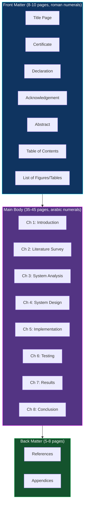
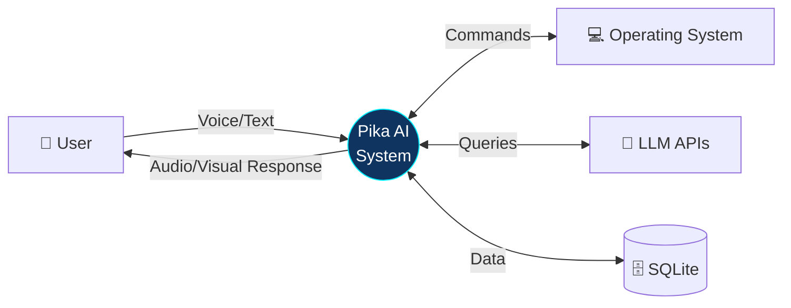
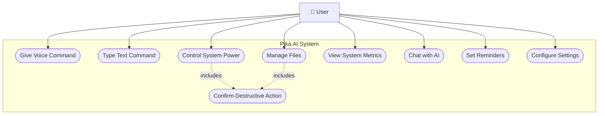
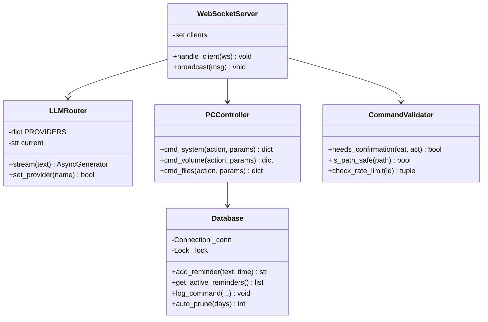
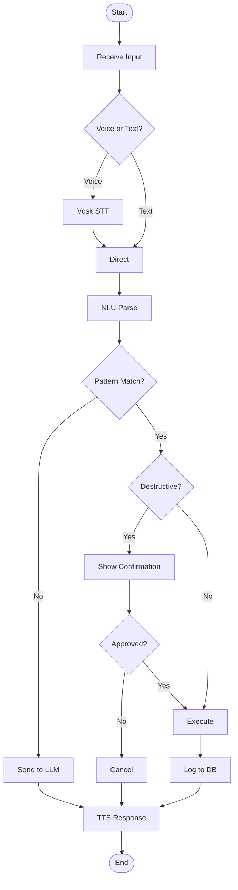
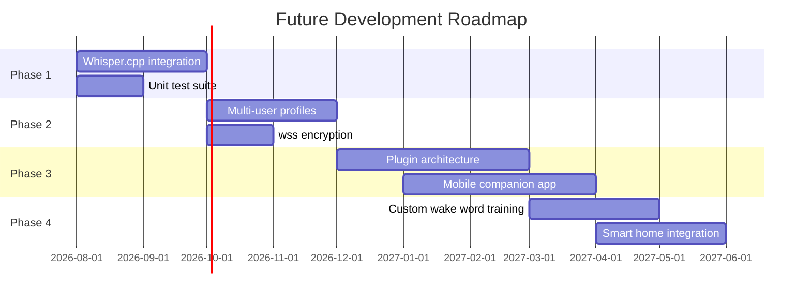

[⬅️ Previous: UI User Manual](./22-UI-USER-MANUAL.md) | [🏠 Back to Master Index](./00-START-HERE.md) | [➡️ Next: Glossary](./24-GLOSSARY.md)

---

# 📝 23 — PROJECT REPORT WRITING GUIDE

> University report likhna hai? Yeh file **40-60 page thesis** ka complete structure
> deti hai — chapter-wise breakdown, page counts, sample content, aur 11-slide PPT
> layout. Direct use karo! 📚

---

## 📖 Report Structure Overview



---

## 📄 FRONT MATTER

### 1. Title Page (1 page)

```
                    PIKA AI ASSISTANT
        A Cross-Platform Desktop Voice Controller with
              Offline Speech Recognition


                A PROJECT REPORT

                    Submitted by

                  [YOUR FULL NAME]
                 [Roll No: XXXXXXX]

            in partial fulfillment for the award of
                     the degree of

              BACHELOR OF TECHNOLOGY
                        in
            COMPUTER SCIENCE AND ENGINEERING


                [UNIVERSITY LOGO]

            [DEPARTMENT NAME]
            [COLLEGE/UNIVERSITY NAME]
            [CITY, STATE - PINCODE]

                    JULY 2026
```

### 2. Certificate (1 page)

```
                      CERTIFICATE

This is to certify that the project report titled
"PIKA AI ASSISTANT — A Cross-Platform Desktop Voice Controller
with Offline Speech Recognition" is the bonafide work of
[YOUR NAME] (Roll No: XXXXXXX) who carried out the project
work under my supervision during the academic year 2025-2026.


_______________________          _______________________
   [GUIDE NAME]                     [HOD NAME]
   Project Guide                    Head of Department
   [Designation]                    Dept. of CSE


Submitted for the Viva-Voce examination held on __________


_______________________          _______________________
  Internal Examiner                 External Examiner
```

### 3. Declaration (1 page)

> I hereby declare that the project entitled **"Pika AI Assistant"** submitted to
> [University Name] is a record of original work done by me under the guidance of
> **[Guide Name]**. This project has not been submitted elsewhere for the award of
> any other degree or diploma. All sources of information have been duly acknowledged.

### 4. Acknowledgement (1 page)

> I express my sincere gratitude to my project guide **[Guide Name]** for their
> invaluable guidance, continuous encouragement, and constructive feedback throughout
> this project.
>
> I am thankful to **[HOD Name]**, Head of the Department of Computer Science and
> Engineering, for providing the necessary facilities and support.
>
> I extend my appreciation to the open-source community — particularly the developers
> of **Vosk** (Alpha Cephei), **Electron** (OpenJS Foundation), **React** (Meta), and
> **Python** — whose tools made this project possible.
>
> Finally, I thank my family and friends for their constant motivation and support.

### 5. Abstract (1 page, 250-350 words)

> **ABSTRACT**
>
> Modern voice assistants such as Amazon Alexa, Apple Siri, and Google Assistant have
> achieved widespread adoption but suffer from three critical limitations: mandatory
> cloud connectivity, transmission of user audio to third-party servers raising privacy
> concerns, and inability to perform desktop-level operating system automation.
>
> This project presents **Pika AI Assistant**, a cross-platform desktop application
> that addresses these limitations through an offline-first architecture. The system
> employs a three-layer design: an Electron-based presentation layer built with React
> 19 and TypeScript, a Python asyncio application layer communicating via WebSocket
> protocol, and a services layer integrating operating system APIs with AI models.
>
> Speech recognition is performed entirely on-device using the **Vosk** offline
> engine, supporting Hindi, English, and code-mixed Hinglish input with a 45 MB
> acoustic model. Text-to-speech utilizes Microsoft Edge Neural voices with automatic
> fallback to offline pyttsx3 synthesis when network connectivity is unavailable.
>
> The natural language understanding layer implements 120+ regular expression patterns
> achieving sub-millisecond command parsing latency, eliminating the computational
> overhead and training data requirements of machine learning approaches. Conversational
> queries are routed to a multi-provider large language model router supporting seven
> free-tier APIs with automatic failover, ensuring service continuity.
>
> Security is enforced through defense-in-depth: a two-phase commit protocol for
> destructive operations, abstract syntax tree-based expression evaluation eliminating
> code injection vectors, path traversal protection via blocklist validation, and
> Electron context isolation preventing renderer-process privilege escalation.
>
> The system was evaluated against 70 documented test cases achieving a 97.1% pass
> rate, with measured command round-trip latency of 45 milliseconds and speech
> recognition finalization within 320 milliseconds. The application maintains
> functionality in degraded modes — operating without backend connectivity, internet
> access, or API credentials — demonstrating robust graceful degradation.
>
> **Keywords:** Voice Assistant, Offline Speech Recognition, Vosk, Electron, WebSocket,
> Desktop Automation, Natural Language Understanding, Privacy-Preserving Computing

---

## 📘 CHAPTER 1: INTRODUCTION (4-5 pages)

### 1.1 Overview
Voice-based human-computer interaction ka evolution, current landscape.

### 1.2 Problem Statement

| Problem | Impact |
|---------|--------|
| Cloud dependency | Internet outage = assistant useless |
| Privacy concerns | Audio uploaded to corporate servers |
| No desktop control | Cannot open apps, manage files |
| Limited Indian language support | Hindi/Hinglish poorly handled |
| Vendor lock-in | Cannot customize or extend |

### 1.3 Objectives
1. Design offline-first voice recognition supporting Hindi, English, Hinglish
2. Implement comprehensive desktop automation (120+ commands)
3. Ensure privacy through local-only audio processing
4. Build a secure architecture with multi-layer protection
5. Provide graceful degradation in all failure modes
6. Create a modern, responsive, accessible user interface

### 1.4 Scope

**In Scope:**
- Windows, macOS, Linux desktop platforms
- Hindi, English, Hinglish voice commands
- System, application, file, media control
- AI conversation via free LLM APIs
- Single-user operation

**Out of Scope:**
- Mobile native applications
- Multi-user authentication
- Cloud synchronization
- Commercial deployment/licensing

### 1.5 Organization of Report
Brief description of each chapter.

---

## 📗 CHAPTER 2: LITERATURE SURVEY (5-6 pages)

### 2.1 Existing Systems Comparison

| System | Year | STT | Offline | PC Control | Privacy |
|--------|------|-----|:-------:|:----------:|:-------:|
| Amazon Alexa | 2014 | Cloud (AWS) | ❌ | ❌ | ❌ |
| Apple Siri | 2011 | Hybrid | 🟡 Partial | 🟡 macOS only | 🟡 |
| Google Assistant | 2016 | Cloud | ❌ | ❌ | ❌ |
| Microsoft Cortana | 2014 | Cloud | ❌ | 🟡 Limited | ❌ |
| Mycroft AI | 2015 | Configurable | ✅ | 🟡 | ✅ |
| **Pika AI (Proposed)** | 2026 | **Vosk local** | ✅ | ✅ **Full** | ✅ |

### 2.2 Speech Recognition Technologies

| Engine | Model Size | Accuracy | Offline | License |
|--------|-----------|----------|:-------:|---------|
| Google Speech API | Cloud | ~95% | ❌ | Commercial |
| OpenAI Whisper | 74MB–1.5GB | ~93% | ✅ | MIT |
| Mozilla DeepSpeech | 190 MB | ~85% | ✅ | MPL-2.0 |
| **Vosk** ⭐ | **45 MB** | **~85%** | ✅ | Apache 2.0 |
| CMU Sphinx | 30 MB | ~70% | ✅ | BSD |

**Justification for Vosk:** Best balance of model size (45 MB vs Whisper's 1.5 GB),
Hindi language support, real-time streaming capability, and permissive licensing.

### 2.3 Desktop Application Frameworks

| Framework | Language | Bundle | Ecosystem | Chosen? |
|-----------|----------|--------|-----------|:-------:|
| **Electron** | JS/TS | ~120 MB | Massive | ✅ |
| Tauri | Rust + JS | ~8 MB | Growing | ❌ |
| Qt | C++/Python | ~40 MB | Mature | ❌ |
| .NET MAUI | C# | ~60 MB | Windows-centric | ❌ |
| Flutter Desktop | Dart | ~45 MB | Growing | ❌ |

### 2.4 Research Gap
No existing solution combines: (a) fully offline STT, (b) comprehensive desktop
automation, (c) native Hindi/Hinglish support, (d) open-source extensibility.

---

## 📙 CHAPTER 3: SYSTEM ANALYSIS (5-6 pages)

### 3.1 Existing System Analysis
Detailed drawbacks with citations.

### 3.2 Proposed System
Architecture overview with advantages.

### 3.3 Feasibility Study

| Type | Analysis | Verdict |
|------|----------|:-------:|
| **Technical** | All required libraries mature and available | ✅ Feasible |
| **Economic** | Zero licensing cost, free API tiers | ✅ Feasible |
| **Operational** | Runs on standard consumer hardware | ✅ Feasible |
| **Legal** | All dependencies MIT/Apache/BSD licensed | ✅ Feasible |
| **Schedule** | 5-day core development achievable | ✅ Feasible |

### 3.4 Requirements Specification

**Functional Requirements:**
| ID | Requirement | Priority |
|----|-------------|:--------:|
| FR-01 | Recognize Hindi/English/Hinglish voice commands | High |
| FR-02 | Execute system power operations with confirmation | High |
| FR-03 | Launch/close applications by name | High |
| FR-04 | Control system volume and media playback | High |
| FR-05 | Perform file CRUD operations safely | High |
| FR-06 | Display real-time system metrics | Medium |
| FR-07 | Provide AI conversational responses | Medium |
| FR-08 | Support text-to-speech output | Medium |
| FR-09 | Detect wake word activation | Medium |
| FR-10 | Enable mobile browser access over LAN | Low |

**Non-Functional Requirements:**
| ID | Requirement | Target |
|----|-------------|--------|
| NFR-01 | Command latency | <100 ms |
| NFR-02 | Speech recognition latency | <500 ms |
| NFR-03 | Memory footprint | <600 MB |
| NFR-04 | UI frame rate | 60 fps |
| NFR-05 | Availability without backend | Graceful degradation |
| NFR-06 | Security | Zero code injection vectors |

### 3.5 Hardware & Software Requirements

| Category | Minimum | Recommended |
|----------|---------|-------------|
| Processor | Dual-core 2.0 GHz | Quad-core 2.5 GHz |
| RAM | 4 GB | 8 GB |
| Storage | 2 GB free | 5 GB free |
| OS | Windows 10 / macOS 11 / Ubuntu 20.04 | Windows 11 |
| Runtime | Node.js 18+, Python 3.10+ | Node 20 LTS, Python 3.12 |

---

## 📕 CHAPTER 4: SYSTEM DESIGN (8-10 pages) ⭐ MOST IMPORTANT

### 4.1 Architectural Design
→ Copy 3-layer diagram from [02-ARCHITECTURE.md](./02-ARCHITECTURE.md)

### 4.2 Data Flow Diagrams

**DFD Level 0 (Context Diagram):**


**DFD Level 1:** Decompose into Voice Processing, Command Parsing, Execution,
Response Generation.

### 4.3 UML Diagrams

**Use Case Diagram:**


**Class Diagram:**


**Sequence Diagram:** → Copy from [04-API-FLOW.md](./04-API-FLOW.md)

**Activity Diagram:**


**State Diagram:** → Connection state machine from [04-API-FLOW.md](./04-API-FLOW.md)

### 4.4 Database Design
→ Copy ER diagram + table specifications from [03-DATABASE.md](./03-DATABASE.md)

### 4.5 Interface Design
UI mockups/screenshots with annotations from [22-UI-USER-MANUAL.md](./22-UI-USER-MANUAL.md)

### 4.6 Design Patterns Applied
→ Summary table from [06-ARCH-PATTERNS.md](./06-ARCH-PATTERNS.md)

---

## 📓 CHAPTER 5: IMPLEMENTATION (8-10 pages)

### 5.1 Development Environment
| Tool | Version | Purpose |
|------|---------|---------|
| VS Code | 1.95 | IDE |
| Node.js | 20.20 LTS | JS runtime |
| Python | 3.12 | Backend |
| Git | 2.43 | Version control |

### 5.2 Technology Stack Justification
| Technology | Alternatives Considered | Justification |
|-----------|------------------------|---------------|
| Electron | Tauri, Qt, .NET MAUI | Mature ecosystem, JS familiarity |
| React 19 | Vue, Svelte, Angular | Component model, largest ecosystem |
| TypeScript | JavaScript | Compile-time type safety |
| Zustand | Redux, MobX, Context | Minimal boilerplate |
| Python | Node.js, Go | Superior automation libraries |
| WebSocket | REST, gRPC | Bidirectional, low latency |
| Vosk | Whisper, DeepSpeech | Size/accuracy balance |
| SQLite | MySQL, PostgreSQL | Embedded, zero-config |

### 5.3 Module Implementation
Include **key code snippets** (not entire files!) with explanations:
- WebSocket server core (~30 lines)
- NLU pattern matching (~20 lines)
- Safe AST calculator (~25 lines)
- Two-phase confirmation (~20 lines)
- Vosk integration (~25 lines)
- LLM streaming (~30 lines)

### 5.4 Security Implementation
→ From [20-SECURITY-OPERATIONS.md](./20-SECURITY-OPERATIONS.md)

### 5.5 Challenges Faced

| Challenge | Solution |
|-----------|----------|
| Event loop blocking on LLM calls | `run_in_executor` + thread-safe queue |
| Hindi text encoding on Windows | `PYTHONIOENCODING=utf-8` env variable |
| Vosk model size in repository | Auto-download on first run |
| Electron security vs Node access | contextBridge with 15 whitelisted functions |
| Orb clipping on short screens | ResizeObserver + CSS media queries |
| Accidental destructive commands | Two-phase commit protocol |

---

## 📔 CHAPTER 6: TESTING (5-6 pages)
→ Copy test tables from [19-TESTING-QUALITY.md](./19-TESTING-QUALITY.md)

Include: Testing methodology, 70 test cases, security tests, performance benchmarks,
database verification queries, results summary pie chart.

---

## 📒 CHAPTER 7: RESULTS & DISCUSSION (4-5 pages)

### 7.1 Screenshots
| Figure | Caption |
|--------|---------|
| 7.1 | Standard Mode HUD Dashboard |
| 7.2 | Futurist Mode Cyberpunk Dashboard |
| 7.3 | Live Theme Accent Picker |
| 7.4 | Voice Recognition with Live Transcript |
| 7.5 | Two-Phase Confirmation Dialog |
| 7.6 | Settings Panel with API Health Check |
| 7.7 | Live PiP Activity Monitor |
| 7.8 | Mobile Browser Access |

### 7.2 Performance Analysis
Latency table + charts from [19-TESTING-QUALITY.md](./19-TESTING-QUALITY.md)

### 7.3 Comparison with Objectives
| Objective | Status | Evidence |
|-----------|:------:|----------|
| Offline STT | ✅ Achieved | Vosk, TC-43 |
| 120+ commands | ✅ Achieved | 60 regex rules → 120+ variants |
| Privacy | ✅ Achieved | Zero audio upload |
| Security | ✅ Achieved | 7/7 security tests pass |
| Graceful degradation | ✅ Achieved | TC-44 to TC-51 |
| Modern UI | ✅ Achieved | 60fps, responsive |

---

## 📃 CHAPTER 8: CONCLUSION & FUTURE SCOPE (3-4 pages)

### 8.1 Conclusion
Summary of achievements, objectives met, key learnings.

### 8.2 Limitations
1. Vosk accuracy degrades in noisy environments (~65%)
2. Some OS features Windows-specific
3. `ws://` not encrypted (localhost-only design)
4. Single-user architecture
5. Bundle size ~120 MB due to Electron

### 8.3 Future Enhancements



---

## 📚 REFERENCES (2-3 pages)

**IEEE Format:**

```
[1]  A. Cephei, "Vosk Speech Recognition Toolkit," 2024. [Online].
     Available: https://alphacephei.com/vosk/. [Accessed: Jul. 2, 2026].

[2]  OpenJS Foundation, "Electron Documentation," 2026. [Online].
     Available: https://www.electronjs.org/docs/latest/.

[3]  Meta Open Source, "React Documentation," 2026. [Online].
     Available: https://react.dev/.

[4]  Python Software Foundation, "asyncio — Asynchronous I/O," Python 3.12
     Documentation, 2026. [Online].
     Available: https://docs.python.org/3/library/asyncio.html.

[5]  I. Fette and A. Melnikov, "The WebSocket Protocol," RFC 6455, IETF,
     Dec. 2011.

[6]  D. R. Hipp, "SQLite Documentation," SQLite Consortium, 2026. [Online].
     Available: https://www.sqlite.org/docs.html.

[7]  E. Gamma, R. Helm, R. Johnson, and J. Vlissides, Design Patterns:
     Elements of Reusable Object-Oriented Software. Boston, MA: Addison-Wesley,
     1994.

[8]  OWASP Foundation, "OWASP Top 10:2021," 2021. [Online].
     Available: https://owasp.org/Top10/.

[9]  A. Radford et al., "Robust Speech Recognition via Large-Scale Weak
     Supervision," arXiv:2212.04356, 2022.

[10] R. C. Martin, Clean Architecture: A Craftsman's Guide to Software
     Structure and Design. Boston, MA: Prentice Hall, 2017.

[11] Microsoft, "Edge TTS Neural Voices," Azure Cognitive Services
     Documentation, 2026.

[12] Mozilla Foundation, "Web Speech API," MDN Web Docs, 2026. [Online].
     Available: https://developer.mozilla.org/en-US/docs/Web/API/Web_Speech_API.
```

---

## 📎 APPENDICES

| Appendix | Content | Pages |
|----------|---------|-------|
| A | Complete source code listings (key modules) | 8-12 |
| B | Database schema SQL script | 2 |
| C | Complete voice command reference (120+) | 3 |
| D | Installation guide | 2 |
| E | User manual excerpts | 3 |
| F | Test case detailed results | 4 |

---

## 🎨 Formatting Guidelines

| Element | Specification |
|---------|--------------|
| Paper | A4 (210 × 297 mm) |
| Margins | Left 1.5", Right/Top/Bottom 1" |
| Font (body) | Times New Roman 12 pt |
| Font (headings) | Times New Roman 14-16 pt Bold |
| Font (code) | Courier New 10 pt |
| Line spacing | 1.5 |
| Alignment | Justified |
| Page numbers | Roman (front), Arabic (body), bottom-center |
| Chapter start | New page |
| Figures | Numbered "Figure 4.1", caption **below** |
| Tables | Numbered "Table 3.2", caption **above** |
| Binding | Hard bound (usually), black cover, gold lettering |

---

## 📊 11-SLIDE PRESENTATION LAYOUT

| # | Title | Content | Time |
|---|-------|---------|------|
| 1 | **Title** | Project name, your name, roll no, guide | 30s |
| 2 | **Problem Statement** | 3 problems with visual icons | 45s |
| 3 | **Objectives** | 6 bullet points | 45s |
| 4 | **Literature Survey** | Comparison table | 45s |
| 5 | **System Architecture** | 3-layer Mermaid diagram | 90s |
| 6 | **Technology Stack** | Logo grid + justification | 60s |
| 7 | **Database Design** | ER diagram | 45s |
| 8 | **Security Features** | 5-layer defense diagram | 60s |
| 9 | **LIVE DEMO** | *(switch to application)* | 180s |
| 10 | **Results & Testing** | 97.1% pass rate, performance chart | 60s |
| 11 | **Conclusion & Q&A** | Limitations, future scope, thank you | 60s |

### Slide Design Tips
| Do ✅ | Don't ❌ |
|-------|---------|
| Max 6 bullet points per slide | Paragraphs of text |
| 24pt+ font size | Tiny 12pt text |
| High-contrast colors | Light text on light bg |
| One idea per slide | Cramming everything |
| Diagrams over text | Wall of words |
| Consistent template | Random fonts/colors |

---

## ✅ Pre-Submission Checklist

### Content
- [ ] All 8 chapters complete
- [ ] Abstract 250-350 words
- [ ] Minimum 10 references, IEEE format
- [ ] All figures numbered + captioned
- [ ] All tables numbered + captioned
- [ ] Every figure/table referenced in text
- [ ] Page numbers correct
- [ ] Table of contents matches actual pages

### Quality
- [ ] Spell check done (Hindi + English)
- [ ] Grammar check ([Grammarly](https://www.grammarly.com/) free)
- [ ] Plagiarism check <15% ([Turnitin](https://www.turnitin.com/) / [Quetext](https://www.quetext.com/))
- [ ] Consistent formatting throughout
- [ ] Code snippets properly formatted
- [ ] No lorem ipsum / placeholder text

### Approvals
- [ ] Guide review + signature
- [ ] HOD signature
- [ ] Certificate page signed
- [ ] Declaration signed by you

### Submission
- [ ] 3 hard copies (you, guide, department)
- [ ] Soft copy PDF
- [ ] Source code CD/pen drive
- [ ] Presentation PPT ready
- [ ] Demo tested on presentation laptop

---

## 🔗 Related Reading
- Content source → [02-ARCHITECTURE.md](./02-ARCHITECTURE.md), [03-DATABASE.md](./03-DATABASE.md)
- Test data → [19-TESTING-QUALITY.md](./19-TESTING-QUALITY.md)
- Presentation → [15-DEMO-SCRIPT.md](./15-DEMO-SCRIPT.md)
- Viva prep → [07-VIVA-GUIDE.md](./07-VIVA-GUIDE.md)

**Writing tools:**
- [Overleaf](https://www.overleaf.com/) — LaTeX (professional look)
- [Grammarly](https://www.grammarly.com/) — Grammar check
- [Mermaid Live](https://mermaid.live/) — Export diagrams as PNG/SVG
- [Zotero](https://www.zotero.org/) — Reference manager
- [Draw.io](https://app.diagrams.net/) — UML diagrams

---

[⬅️ Previous: UI User Manual](./22-UI-USER-MANUAL.md) | [🏠 Back to Master Index](./00-START-HERE.md) | [➡️ Next: Glossary](./24-GLOSSARY.md)
