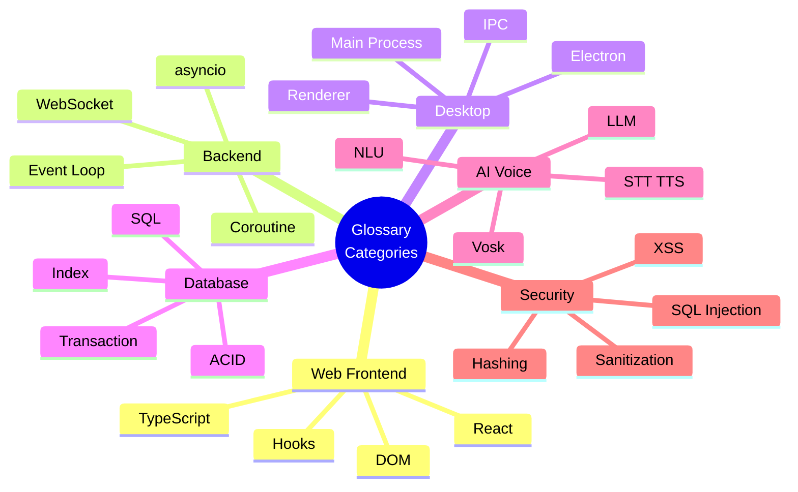

[⬅️ Previous: Project Report Writing](./23-PROJECT-REPORT-WRITING.md) | [🏠 Back to Master Index](./00-START-HERE.md)

---

# 📖 24 — GLOSSARY & ACRONYMS (A-Z Dictionary)

> Har technical term ka **simple Hinglish explanation**. Viva se pehle 30 minute mein
> revise kar lo! Ctrl+F karke koi bhi term dhundo. 🔍

---

## 🗺️ Concept Categories

---

## 🅰️ A

**ACID** — Database transaction ke 4 guarantees: **A**tomicity (sab ya kuch nahi),
**C**onsistency (rules maintained), **I**solation (parallel transactions independent),
**D**urability (commit ke baad permanent).

**API (Application Programming Interface)** — Do software ke beech baat karne ka
tarika. Jaise restaurant mein waiter — aap kitchen mein nahi jaate, waiter se order
dete ho.

**AST (Abstract Syntax Tree)** — Code ka tree structure representation. Pika ke
calculator mein use hota hai `eval()` ki jagah — safe evaluation ke liye.

**Async/Await** — JavaScript aur Python ka syntax jo asynchronous code ko synchronous
jaisa readable banata hai. `await` par function pause hota hai, dusre kaam chalte
rehte hain.

**asyncio** — Python ki built-in library for asynchronous programming. Event loop
chalati hai jo multiple tasks cooperatively schedule karta hai.

**Atomicity** — Operation ya toh **poora** hoga ya **bilkul nahi**. Half-done state
nahi ho sakti.

---

## 🅱️ B

**Backend** — Server-side code jo user ko directly nahi dikhta. Pika mein
`pc_bridge.py`.

**Base64** — Binary data ko text mein encode karne ka format. TTS audio browser tak
bhejne ke liye use hota hai. Size 33% badh jaata hai.

**B-tree** — Balanced tree data structure jo database indexes use karte hain. O(log n)
search deta hai.

**Blocking Call** — Aisa function jo complete hone tak poore program ko rok deta hai.
`time.sleep()`, `requests.get()`. Async code mein **avoid karo**!

**Bundle** — Saara JavaScript code jo build hone ke baad ek/kuch files mein pack ho
jaata hai. Pika ka bundle ~950 KB hai.

---

## 🅲 C

**Callback** — Function jo dusre function ko argument ke roop mein pass hota hai aur
baad mein call hota hai. `setTimeout(() => {}, 1000)`.

**CDN (Content Delivery Network)** — Distributed servers jo static files serve karte
hain user ke paas se.

**Chromium** — Open-source browser engine. Electron isse use karta hai UI render
karne ke liye.

**CommonJS (CJS)** — Node.js ka purana module system: `require()` / `module.exports`.
Electron main process isi ko use karta hai (isliye `.cjs` extension).

**Component** — React ka building block. Ek reusable UI piece. `<GlassCard>`,
`<NeuralHUDCenter>`.

**contextBridge** — Electron API jo preload script se renderer ko **safely** functions
expose karta hai. Security ka backbone.

**contextIsolation** — Electron security setting. `true` karne se preload aur web page
alag JS context mein chalte hain. **Always ON rakho!**

**Coroutine** — Function jo pause (`await`) aur resume ho sakta hai. Python mein
`async def` se banta hai.

**CORS (Cross-Origin Resource Sharing)** — Browser security jo ek domain ko dusre
domain ke resources access karne se rokti hai.

**CRUD** — **C**reate, **R**ead, **U**pdate, **D**elete — database ke 4 basic operations.

**CSS Variables (Custom Properties)** — `--accent: #00f0ff`. Runtime par change kar
sakte ho — Pika ka live theme system isi par based hai.

**CTE (Common Table Expression)** — SQL ka `WITH` clause. Temporary named result set
jo complex queries readable banata hai.

---

## 🅳 D

**Debouncing** — Multiple rapid events ko ek mein combine karna. Search box mein user
typing band kare tab search fire karo.

**Declarative Programming** — "Kya chahiye" batao, "kaise karna hai" nahi. React
declarative hai — aap state batate ho, React DOM update karta hai.

**Dependency** — External library jo project use karta hai. `package.json` aur
`requirements.txt` mein listed.

**Dependency Injection** — Object ko uski dependencies bahar se dena, andar create
karne ki jagah. Testing easy ho jaati hai.

**DevTools** — Browser ka debugging toolkit. `F12` se khulta hai.

**DOM (Document Object Model)** — HTML page ka tree representation jo JavaScript
manipulate kar sakta hai.

**Dunder Method** — Python ke special methods with double underscores: `__init__`,
`__new__`, `__repr__`.

---

## 🅴 E

**Electron** — Framework jo web technologies (HTML/CSS/JS) se desktop apps banata
hai. VS Code, Discord, Slack — sab Electron par hain.

**Encapsulation** — OOP pillar. Data aur methods ko ek unit mein bandhna, internal
details chupana.

**ERD (Entity Relationship Diagram)** — Database tables aur unke relationships ka
visual diagram.

**ESM (ES Modules)** — Modern JavaScript module system: `import` / `export`.

**Event Loop** — asyncio/JavaScript ka core. Single thread jo tasks ko queue se uthakar
run karta hai. Blocking call se **freeze** ho jaata hai.

**Exponential Backoff** — Retry strategy jisme har fail ke baad wait time double hota
hai: 1s → 2s → 4s → 8s. Server overload se bachata hai.

---

## 🅵 F

**Fallback** — Backup plan jab primary option fail ho. Edge TTS fail → pyttsx3.

**Frontend** — User ko dikhne wala part. Pika mein React app.

**Full-Duplex** — Dono directions mein ek saath communication. WebSocket full-duplex
hai, HTTP nahi.

---

## 🅶 G

**Generator** — Function jo `yield` se ek-ek value return karta hai, sab ek saath
nahi. Memory efficient.

**Generics** — TypeScript feature: `<T>`. Type-safe reusable code.

**Glassmorphism** — UI design trend: frosted glass effect (`backdrop-filter: blur()`).

**Graceful Degradation** — System ka partially kaam karte rehna jab kuch fail ho.
Pika ka demo mode.

---

## 🅷 H

**Hashing** — Data ko fixed-length string mein convert karna. **One-way** — wapas
original nahi mil sakta. Passwords ke liye.

**HMR (Hot Module Replacement)** — Code change karo, browser refresh kiye bina UI
update ho jaaye. Vite ka superpower.

**Hook (React)** — Function jo components mein state/lifecycle features add karta hai.
`useState`, `useEffect`.

**HTTP** — Web ka protocol. Request-response based, stateless.

---

## 🅸 I

**Idempotent** — Operation jo baar-baar chalane par same result de. `DELETE` idempotent
hai, `INSERT` nahi.

**Immutability** — Data ko modify na karna, naya copy banana. React mein **mandatory**
— warna re-render nahi hoga.

**Index (Database)** — Data structure jo search fast karta hai. O(n) → O(log n).

**Inheritance** — OOP pillar. Child class parent ke properties/methods inherit karti
hai.

**IPC (Inter-Process Communication)** — Do processes ke beech data exchange. Electron
mein main ↔ renderer.

---

## 🅹 J

**JSON (JavaScript Object Notation)** — Lightweight data format. Pika ke saare
WebSocket messages JSON hain.

**JWT (JSON Web Token)** — Authentication token format. Pika mein abhi use nahi hua
(single-user).

---

## 🅺 K

**Kernel** — OS ka core jo hardware manage karta hai.

**Key-Value Store** — Simple database jisme har value ek unique key se access hoti
hai. Pika ka `settings` table.

---

## 🅻 L

**LAN (Local Area Network)** — Local network. Pika ka phone access LAN par kaam karta
hai.

**Latency** — Request bhejne se response aane tak ka time. Kam = better.

**Lazy Loading** — Resources ko zaroorat padne par load karna, shuru mein nahi.

**LLM (Large Language Model)** — AI model jo human-like text generate karta hai. GPT,
Llama, Gemini.

**Loose Coupling** — Modules ka ek dusre par kam depend karna. Change karna easy.

---

## 🅼 M

**Main Process (Electron)** — Node.js process jo app lifecycle, windows, aur OS access
manage karta hai. `main.cjs`.

**Memoization** — Expensive computation ka result cache karna. `useMemo`, `useCallback`.

**Middleware** — Request-response cycle ke beech mein chalne wala code.

**Mutex (Mutual Exclusion)** — Lock jo ek time par sirf ek thread ko resource access
dene deta hai. `threading.Lock()`.

---

## 🅽 N

**NLU (Natural Language Understanding)** — Human language ko structured data mein
convert karna. Pika mein regex-based.

**Node.js** — JavaScript runtime jo browser ke bahar chalta hai.

**Non-blocking** — Operation jo program ko rokta nahi. `await asyncio.sleep()`.

**Normalization (Database)** — Data ko organize karna redundancy kam karne ke liye.
1NF, 2NF, 3NF, BCNF.

**npm (Node Package Manager)** — JavaScript packages install karne ka tool.

---

## 🅾️ O

**OOP (Object-Oriented Programming)** — Programming paradigm based on objects. 4
pillars: Encapsulation, Abstraction, Inheritance, Polymorphism.

**ORM (Object-Relational Mapping)** — Database rows ko objects mein map karna. Pika
mein raw SQL use kiya (simplicity ke liye).

**Optional Chaining** — `?.` operator. `window.pika?.minimize()` — undefined ho toh
crash nahi hoga.

---

## 🅿️ P

**PBKDF2** — Password hashing algorithm with configurable iterations. Slow = secure.

**Parameterized Query** — SQL query with `?` placeholders. **SQL injection se bachne
ka ekmatra sahi tarika.**

**PiP (Picture-in-Picture)** — Chhoti floating window jo dusre content ke upar rehti
hai.

**Polling** — Baar-baar check karna ki data ready hai ya nahi. WebSocket se avoid
hota hai.

**Polymorphism** — OOP pillar. Same interface, different implementations. Pika ka
`ROUTES` dictionary.

**Preload Script** — Electron script jo renderer se pehle chalti hai. `contextBridge`
se safe API expose karti hai.

**PRAGMA** — SQLite ka configuration command. `PRAGMA foreign_keys = ON`.

**Promise** — JavaScript object jo future value represent karta hai. States: pending,
fulfilled, rejected.

**Props** — React mein parent se child ko pass hone wala data. **Read-only**.

---

## 🆀 Q

**Query** — Database se data maangne ka request.

**Queue** — FIFO (First In First Out) data structure.

---

## 🆁 R

**Race Condition** — Bug jab do operations ka order unpredictable ho aur result galat
aa jaaye.

**Rate Limiting** — Kitne requests per time allow hain, uski limit. Abuse rokta hai.

**Reconciliation** — React ka process jo Virtual DOM compare karke real DOM update
karta hai.

**Regex (Regular Expression)** — Text pattern matching language. Pika ka NLU isi par
based hai.

**Renderer Process (Electron)** — Chromium process jo actual UI render karta hai.

**REST API** — HTTP-based API architecture. Stateless, resource-oriented.

**Rollback** — Transaction ko undo karna jab error aaye.

---

## 🆂 S

**Salt** — Random data jo password ke saath hash hota hai. Rainbow table attacks rokta
hai. **Har user ka alag hona chahiye.**

**Sandbox** — Restricted environment jisme code limited permissions ke saath chalta
hai. Browsers sandboxed hote hain.

**Sanitization** — User input se dangerous characters hatana.

**Schema** — Database ka structure definition — tables, columns, types, constraints.

**Selector (Zustand)** — Function jo store se specific piece select karta hai.
`useStore(s => s.isConnected)`. Performance ke liye important.

**Separation of Concerns** — Har module ka ek clear responsibility ho.

**Singleton** — Design pattern jisme class ka sirf **ek** instance hota hai.

**SOLID** — 5 OOP design principles: Single Responsibility, Open/Closed, Liskov
Substitution, Interface Segregation, Dependency Inversion.

**SQL (Structured Query Language)** — Relational databases ki language.

**SQL Injection** — Attack jisme malicious SQL user input ke through execute hota hai.
Parameterized queries se prevent hota hai.

**SQLite** — Serverless, file-based database. Zero configuration.

**SSE (Server-Sent Events)** — Server se client ko one-way streaming. LLM APIs isi
format mein streaming karte hain.

**State (React)** — Component ka data jo change hone par re-render trigger karta hai.

**State Machine** — System jisme finite states aur defined transitions hote hain.

**STT (Speech-To-Text)** — Bola gaya audio → text. Vosk, Whisper, Google Speech.

---

## 🆃 T

**Tailwind CSS** — Utility-first CSS framework. `flex items-center gap-3`.

**Thread** — Independent execution path. Python mein GIL ki wajah se true parallelism
limited hai.

**Thread-safe** — Code jo multiple threads se safely call ho sakta hai.

**Throttling** — Operation ko maximum N times per second limit karna.

**Transaction** — Multiple database operations jo ek atomic unit ki tarah execute hote
hain.

**Tree Shaking** — Build process jo unused code remove karta hai.

**TTS (Text-To-Speech)** — Text → spoken audio. Edge TTS, pyttsx3.

**TypeScript** — JavaScript + static types. Compile-time error checking.

**Two-Phase Commit** — Protocol jisme operation pehle prepare hota hai, phir confirm
hone par execute. Pika ka confirmation flow.

---

## 🆄 U

**UUID (Universally Unique Identifier)** — 128-bit unique ID.
`crypto.randomUUID()` / `uuid.uuid4()`.

**Unicode Normalization** — Text ko standard form mein convert karna. `NFKC`.

**UPSERT** — INSERT ya UPDATE — jo bhi appropriate ho.
`ON CONFLICT(key) DO UPDATE SET`.

---

## 🆅 V

**VACUUM** — SQLite command jo deleted rows ka disk space reclaim karta hai.

**venv (Virtual Environment)** — Python ka isolated environment. Har project ki apni
dependencies.

**Virtual DOM** — React ka in-memory DOM copy. Diffing ke liye use hota hai.

**Vite** — Modern build tool. ESM-based, super fast HMR.

**Vosk** — Offline speech recognition toolkit. 20+ languages, small models.

---

## 🆆 W

**WAL (Write-Ahead Logging)** — SQLite journal mode jo readers aur writer ko parallel
chalne deta hai.

**Wake Word** — Trigger phrase jo assistant ko activate karta hai. "Hey Assistant".

**WebSocket** — Full-duplex communication protocol over single TCP connection.

**Window Function (SQL)** — Aggregate calculation without collapsing rows.
`RANK() OVER (PARTITION BY ...)`.

---

## 🆇 X

**XSS (Cross-Site Scripting)** — Attack jisme malicious script inject hoti hai. React
auto-escape se protected.

---

## 🆈 Y

**YAML** — Human-readable config format. `electron-builder.yml`.

**yield** — Python keyword jo generator function mein value return karta hai bina
function terminate kiye.

---

## 🆉 Z

**Zustand** — Minimal React state management library. German mein "state" ka matlab.

---

# 📇 ACRONYMS QUICK TABLE

| Acronym | Full Form |
|---------|-----------|
| ACID | Atomicity, Consistency, Isolation, Durability |
| API | Application Programming Interface |
| AST | Abstract Syntax Tree |
| CJS | CommonJS |
| CORS | Cross-Origin Resource Sharing |
| CRUD | Create, Read, Update, Delete |
| CSS | Cascading Style Sheets |
| CTE | Common Table Expression |
| DOM | Document Object Model |
| DFD | Data Flow Diagram |
| ERD | Entity Relationship Diagram |
| ESM | ECMAScript Modules |
| GIL | Global Interpreter Lock |
| HMR | Hot Module Replacement |
| HTML | HyperText Markup Language |
| HTTP | HyperText Transfer Protocol |
| IPC | Inter-Process Communication |
| JSON | JavaScript Object Notation |
| JWT | JSON Web Token |
| LAN | Local Area Network |
| LLM | Large Language Model |
| MVC | Model-View-Controller |
| NLU | Natural Language Understanding |
| npm | Node Package Manager |
| OOP | Object-Oriented Programming |
| ORM | Object-Relational Mapping |
| PBKDF2 | Password-Based Key Derivation Function 2 |
| PiP | Picture-in-Picture |
| REST | Representational State Transfer |
| RFC | Request For Comments |
| SDK | Software Development Kit |
| SOLID | Single/Open-Closed/Liskov/Interface/Dependency |
| SQL | Structured Query Language |
| SSE | Server-Sent Events |
| STT | Speech-To-Text |
| TCP | Transmission Control Protocol |
| TS | TypeScript |
| TTS | Text-To-Speech |
| UI/UX | User Interface / User Experience |
| UML | Unified Modeling Language |
| URL | Uniform Resource Locator |
| UUID | Universally Unique Identifier |
| WAL | Write-Ahead Logging |
| WS | WebSocket |
| XSS | Cross-Site Scripting |
| YAML | YAML Ain't Markup Language |

---

# ⚡ 60-SECOND VIVA REVISION

| Term | One-Line Answer |
|------|-----------------|
| **Event Loop** | Single-threaded scheduler jo async tasks cooperatively chalata hai |
| **contextIsolation** | Electron security — renderer ko Node access nahi deta |
| **Two-Phase Commit** | Destructive command pehle confirm, phir execute |
| **Exponential Backoff** | Retry delay doubles: 1s→2s→4s→30s cap |
| **Graceful Degradation** | Backend down ho toh bhi UI kaam kare (demo mode) |
| **Parameterized Query** | `?` placeholder — SQL injection se 100% safe |
| **AST Evaluation** | `eval()` ki jagah safe math — code injection impossible |
| **Singleton** | Ek hi instance — Database, AudioContext |
| **Observer** | Zustand subscribers auto re-render hote hain |
| **Strategy** | Runtime par algorithm choose — Edge TTS vs pyttsx3 |
| **Index** | B-tree se O(n) → O(log n) search |
| **WAL mode** | Readers + writer parallel, better concurrency |
| **Immutability** | Naya object banao — React reference se change detect karta hai |
| **Optional Chaining** | `?.` — undefined par crash nahi |
| **Vosk** | 45 MB offline STT, Hindi support, Apache 2.0 |
| **Edge TTS** | Free Microsoft neural voices, no API key |
| **WebSocket** | Full-duplex, 2-8ms latency, binary support |
| **Zustand** | Redux se 70% kam boilerplate |
| **Tree Shaking** | Build par unused code remove |
| **Salt** | Random per-user data — rainbow table useless |

---

## 🔗 Related Reading
- Viva questions using these terms → [07-VIVA-GUIDE.md](./07-VIVA-GUIDE.md)
- Deep concepts → [02-ARCHITECTURE.md](./02-ARCHITECTURE.md)
- Patterns explained → [06-ARCH-PATTERNS.md](./06-ARCH-PATTERNS.md)
- Learning resources → [17-FREE-RESOURCES.md](./17-FREE-RESOURCES.md)

---

## 🎉 Documentation Complete!

Aapne poori 25-file documentation suite complete kar li! 🎊

**Next steps:**
1. [08-STEP-BY-STEP.md](./08-STEP-BY-STEP.md) — Project banao
2. [07-VIVA-GUIDE.md](./07-VIVA-GUIDE.md) — Questions ratt lo
3. [15-DEMO-SCRIPT.md](./15-DEMO-SCRIPT.md) — Demo practice karo
4. [23-PROJECT-REPORT-WRITING.md](./23-PROJECT-REPORT-WRITING.md) — Report likho

**All the best! 🚀**

---

[⬅️ Previous: Project Report Writing](./23-PROJECT-REPORT-WRITING.md) | [🏠 Back to Master Index](./00-START-HERE.md)
