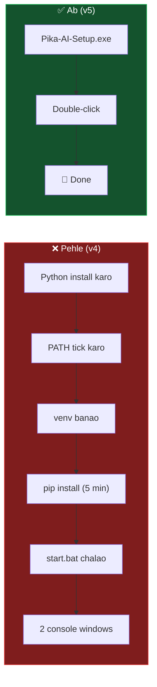
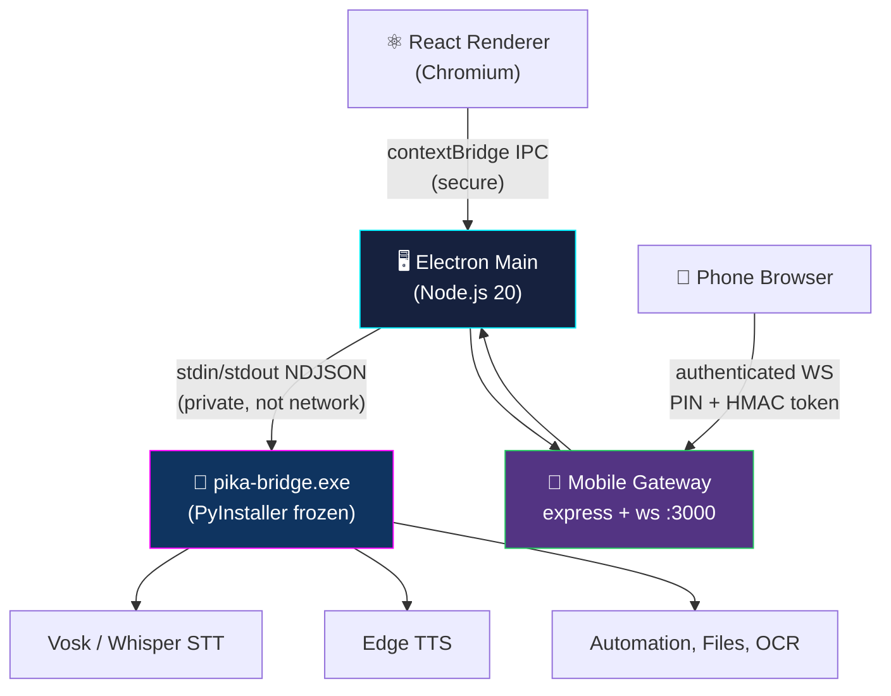
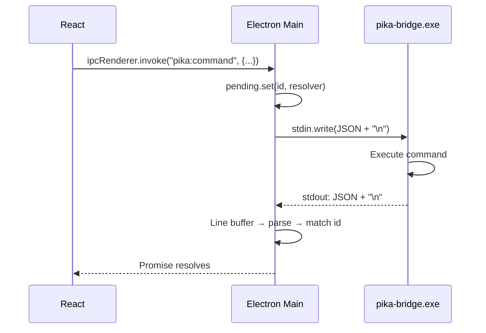
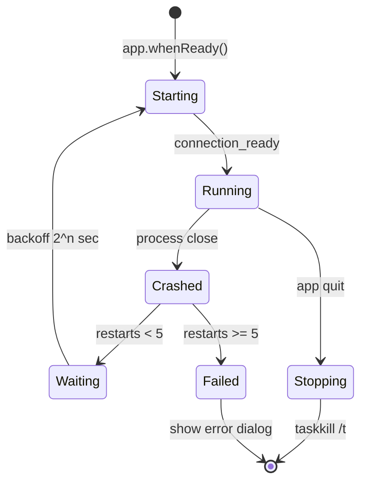
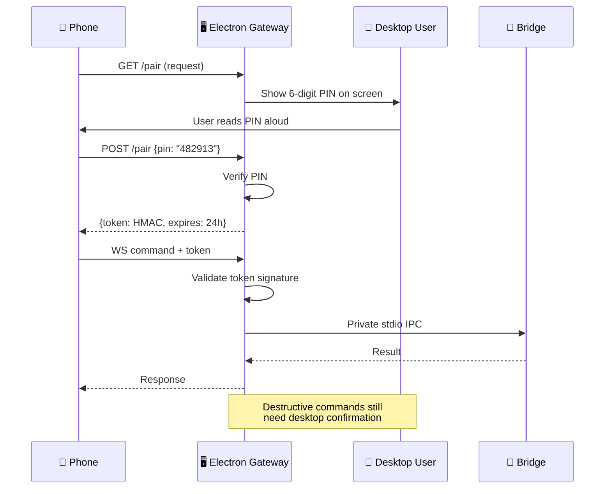

[⬅️ Previous: Glossary](./24-GLOSSARY.md) | [🏠 Back to Master Index](./00-START-HERE.md)

---

# 📦 25 — PACKAGING & DISTRIBUTION (Single .exe, No Python Install)

> Ab tak user ko Python install karna padta tha. Yeh guide batati hai kaise
> **Electron + Packaged Python Sidecar** se ek hi `Pika-AI-Setup.exe` banaya jaye
> jisme user ko kuch bhi alag install na karna pade. 🚀

---

## 🎯 Goal



| | v4 (Hybrid, external Python) | v5 (Packaged Sidecar) |
|---|---|---|
| User installs Python | ✅ Required | ❌ Not needed |
| PATH errors | Common | Impossible |
| venv creation | Required | Not needed |
| pip install wait | 2–5 min | 0 sec |
| Launcher files | start.bat / .sh / .py | None |
| Console windows | 2 visible | 0 visible |
| Cold start | ~3 s | ~1.5 s |
| Distribution | ZIP + instructions | One `.exe` |

---

## 🏗️ Architecture



> **Key security win:** privileged bridge ab network par expose **nahi** hai.
> Sirf authenticated Electron gateway `0.0.0.0:3000` par sunta hai.

---

## 1️⃣ Python ko Executable Banao (PyInstaller)

### Install
```bash
pip install pyinstaller
```

### Build Command
```bash
pyinstaller --onefile --name pika-bridge ^
    --distpath python-dist ^
    --workpath .pyi-build ^
    --specpath .pyi-build ^
    --noconsole ^
    --collect-all vosk ^
    --collect-all edge_tts ^
    --hidden-import=pyttsx3.drivers ^
    --hidden-import=pyttsx3.drivers.sapi5 ^
    --hidden-import=comtypes ^
    pc_bridge.py
```

### Flags Explained

| Flag | Kya karta hai |
|------|---------------|
| `--onefile` | Sab kuch ek single `.exe` mein pack |
| `--name pika-bridge` | Output filename |
| `--distpath python-dist` | Output folder |
| `--noconsole` | Black console window nahi dikhega |
| `--collect-all vosk` | **MUST** — warna model loader runtime par fail hoga |
| `--collect-all edge_tts` | TTS voice list bundle karega |
| `--hidden-import` | Dynamically imported modules jo PyInstaller detect nahi kar pata |

### Output
```
python-dist/
└── pika-bridge.exe        (Windows)  ~85 MB
    pika-bridge            (macOS/Linux)
```

### ⚠️ Verify on Clean Machine
```bash
# Python UNINSTALL karke ya clean VM par test karo
python-dist\pika-bridge.exe
```
Pika banner print hona chahiye. Agar `ModuleNotFoundError` aaye toh us module
ko `--hidden-import` mein add karo.

---

## 2️⃣ npm Scripts

`package.json` mein add karo:

```json
{
  "scripts": {
    "dev": "vite",
    "build": "tsc -b && vite build",
    "build:bridge": "pyinstaller --onefile --name pika-bridge --distpath python-dist --workpath .pyi-build --specpath .pyi-build --noconsole --collect-all vosk --collect-all edge_tts pc_bridge.py",
    "electron:dev": "concurrently -k \"vite\" \"wait-on tcp:3000 && cross-env NODE_ENV=development electron .\"",
    "release:win": "npm run build:bridge && npm run build && electron-builder --win --x64",
    "release:mac": "npm run build:bridge && npm run build && electron-builder --mac",
    "release:linux": "npm run build:bridge && npm run build && electron-builder --linux"
  }
}
```

---

## 3️⃣ electron-builder Config

`electron-builder.yml`:

```yaml
appId: com.pika.ai.assistant
productName: Pika AI

directories:
  output: release

files:
  - dist/**/*
  - electron/**/*
  - package.json

# ⚠️ IMPORTANT: bridge exe MUST be in extraResources, NOT files
# Warna asar archive ke andar chala jayega aur executable nahi rahega
extraResources:
  - from: python-dist/pika-bridge.exe
    to: bridge/pika-bridge.exe
  - from: models/
    to: models/

asar: true
compression: maximum

win:
  target:
    - target: nsis
      arch: [x64]
    - target: portable
      arch: [x64]
  artifactName: "Pika-AI-Setup-${version}.${ext}"

nsis:
  oneClick: false
  allowToChangeInstallationDirectory: true
  createDesktopShortcut: true
  createStartMenuShortcut: true
  shortcutName: Pika AI

mac:
  target: [dmg]
  category: public.app-category.productivity

linux:
  target: [AppImage, deb]
  category: Utility
```

---

## 4️⃣ Electron Main: Bridge Spawn

```javascript
function resolveBridgeBinary() {
  const exeName = process.platform === "win32" ? "pika-bridge.exe" : "pika-bridge";

  const packaged = path.join(process.resourcesPath, "bridge", exeName);
  const dev = path.join(__dirname, "..", "python-dist", exeName);

  if (app.isPackaged && fs.existsSync(packaged)) return packaged;
  if (fs.existsSync(dev)) return dev;
  return null;   // dev fallback: system python
}

function startBridge() {
  const bin = resolveBridgeBinary();

  const env = {
    ...process.env,
    PYTHONIOENCODING: "utf-8",
    PYTHONUNBUFFERED: "1",
    PIKA_IPC_MODE: "stdio",
    PIKA_MODELS_DIR: app.isPackaged
      ? path.join(process.resourcesPath, "models")
      : path.join(ROOT, "models"),
    PIKA_DATA_DIR: app.getPath("userData"),
  };

  if (bin) {
    bridgeProcess = spawn(bin, [], {
      cwd: path.dirname(bin),
      env,
      windowsHide: true,
      stdio: ["pipe", "pipe", "pipe"],
    });
  } else {
    const py = process.platform === "win32" ? "python" : "python3";
    bridgeProcess = spawn(py, [path.join(ROOT, "pc_bridge.py")], { env, windowsHide: true, stdio: ["pipe","pipe","pipe"] });
  }

  attachBridgeHandlers();
}
```

---

## 5️⃣ Private NDJSON IPC

WebSocket ki jagah **stdin/stdout** use karo — yeh network par expose nahi hota.



### Node side — line buffering (MANDATORY)
```javascript
let stdoutBuffer = "";
const pending = new Map();

bridgeProcess.stdout.on("data", (chunk) => {
  stdoutBuffer += chunk.toString("utf8");
  let idx;
  while ((idx = stdoutBuffer.indexOf("\n")) >= 0) {
    const line = stdoutBuffer.slice(0, idx).trim();
    stdoutBuffer = stdoutBuffer.slice(idx + 1);
    if (!line) continue;
    try { handleBridgeMessage(JSON.parse(line)); }
    catch { console.log("[bridge]", line); }
  }
});

function sendToBridge(msg, timeoutMs = 30000) {
  return new Promise((resolve) => {
    if (!bridgeProcess || bridgeProcess.killed) {
      return resolve({ status: "error", message: "Bridge not running" });
    }
    const id = msg.id || randomUUID();
    const timer = setTimeout(() => {
      pending.delete(id);
      resolve({ status: "error", message: "Bridge timeout" });
    }, timeoutMs);
    pending.set(id, { resolve, timer });
    bridgeProcess.stdin.write(JSON.stringify({ ...msg, id }) + "\n");
  });
}
```

### Python side — stdio mode
```python
async def stdio_loop():
    loop = asyncio.get_event_loop()
    reader = asyncio.StreamReader()
    await loop.connect_read_pipe(
        lambda: asyncio.StreamReaderProtocol(reader), sys.stdin
    )

    def emit(obj):
        sys.stdout.write(json.dumps(obj, ensure_ascii=False) + "\n")
        sys.stdout.flush()

    emit({"type": "event", "event": "connection_ready",
          "data": {"server_version": SERVER_VERSION, "mode": "stdio"}})

    while True:
        line = await reader.readline()
        if not line:
            break
        try:
            msg = json.loads(line.decode("utf-8").strip())
        except Exception:
            continue
        asyncio.create_task(handle_stdio_message(msg, emit))


if __name__ == "__main__":
    if os.getenv("PIKA_IPC_MODE") == "stdio":
        asyncio.run(stdio_loop())
    else:
        asyncio.run(main())          # WebSocket mode preserved
```

---

## 6️⃣ Lifecycle: Auto-Restart + Clean Shutdown



```javascript
let bridgeRestarts = 0;
const MAX_RESTARTS = 5;

bridgeProcess.on("close", (code) => {
  bridgeProcess = null;
  mainWindow?.webContents.send("bridge:status", { running: false, code });

  if (!isQuitting && bridgeRestarts < MAX_RESTARTS) {
    bridgeRestarts++;
    setTimeout(startBridge, Math.min(1000 * 2 ** bridgeRestarts, 30000));
  } else if (bridgeRestarts >= MAX_RESTARTS) {
    dialog.showErrorBox("Pika Bridge",
      "Bridge repeatedly crashed. Running in limited mode.");
  }
});

// Heartbeat
setInterval(async () => {
  const r = await sendToBridge({ type: "ping" }, 5000);
  if (r.status === "error") { stopBridge(); startBridge(); }
}, 15000);

// Guaranteed cleanup — no orphan processes
function stopBridge() {
  if (!bridgeProcess) return;
  try {
    if (process.platform === "win32") {
      spawn("taskkill", ["/pid", String(bridgeProcess.pid), "/f", "/t"]);
    } else {
      bridgeProcess.kill("SIGTERM");
      setTimeout(() => bridgeProcess?.kill("SIGKILL"), 3000);
    }
  } catch {}
  bridgeProcess = null;
}

app.on("before-quit", () => { isQuitting = true; stopBridge(); });
app.on("will-quit", () => { globalShortcut.unregisterAll(); stopBridge(); });
process.on("exit", stopBridge);
process.on("SIGINT", () => { stopBridge(); process.exit(0); });
```

---

## 7️⃣ Mobile Gateway with PIN Pairing



| Rule | Implementation |
|------|----------------|
| No unpaired access | Reject WS without valid token |
| Token expiry | 24 hours, HMAC-SHA256 signed |
| Destructive guard | Desktop modal confirmation always |
| Bridge isolation | Phone never touches bridge directly |

---

## 8️⃣ Code Signing

### Windows
```bash
signtool sign /fd SHA256 /a /tr http://timestamp.digicert.com /td SHA256 ^
    "release\Pika-AI-Setup-1.0.0.exe"
```

| Certificate | Cost | SmartScreen |
|-------------|------|-------------|
| Unsigned | Free | ⚠️ Warning shown |
| OV Certificate | ~$200/yr | Reputation builds over time |
| EV Certificate | ~$400/yr | ✅ Instant trust |

### macOS
```bash
codesign --deep --force --options runtime \
    --sign "Developer ID Application: Your Name (TEAMID)" \
    "release/Pika AI.app"

xcrun notarytool submit "release/Pika-AI-1.0.0.dmg" \
    --apple-id you@example.com --team-id TEAMID --wait

xcrun stapler staple "release/Pika-AI-1.0.0.dmg"
```

> Academic/personal project ke liye signing optional hai — bas users ko batao
> ki SmartScreen par "More info → Run anyway" click karein.

---

## 9️⃣ GitHub Actions — Automated Release

`.github/workflows/release.yml`:

```yaml
name: Build & Release Pika AI

on:
  push:
    tags: ["v*"]
  workflow_dispatch:

jobs:
  build:
    strategy:
      matrix:
        os: [windows-latest, macos-latest, ubuntu-latest]
    runs-on: ${{ matrix.os }}
    steps:
      - uses: actions/checkout@v4

      - uses: actions/setup-node@v4
        with:
          node-version: 20
          cache: npm

      - uses: actions/setup-python@v5
        with:
          python-version: "3.12"

      - name: Install Python deps
        run: |
          python -m pip install --upgrade pip
          pip install -r requirements.txt pyinstaller

      - name: Build Python bridge
        run: npm run build:bridge

      - name: Install Node deps
        run: npm ci

      - name: Build renderer
        run: npm run build

      - name: Build Electron installer
        run: npx electron-builder --publish always
        env:
          GH_TOKEN: ${{ secrets.GITHUB_TOKEN }}

      - uses: actions/upload-artifact@v4
        with:
          name: pika-${{ matrix.os }}
          path: release/*
```

### Release karo
```bash
git tag v1.0.0
git push origin v1.0.0
```

GitHub Actions automatically teeno platforms ke installers bana kar
**Releases page** par publish kar dega:

```
https://github.com/USERNAME/pika-ai/releases/tag/v1.0.0
├── Pika-AI-Setup-1.0.0.exe        (Windows, ~180 MB)
├── Pika-AI-1.0.0-x64.dmg          (macOS Intel)
├── Pika-AI-1.0.0-arm64.dmg        (macOS Apple Silicon)
├── Pika-AI-1.0.0.AppImage         (Linux)
└── pika-ai_1.0.0_amd64.deb        (Debian/Ubuntu)
```

Yahi link aap kisi ko bhi de sakte ho — bas download aur install! 🎉

---

## 🔟 Size Optimization

| Technique | Savings |
|-----------|---------|
| `--exclude-module tkinter,matplotlib,numpy.testing` | ~20 MB |
| UPX compression (`--upx-dir`) | ~30% |
| Vosk model as first-run download (not bundled) | ~45 MB |
| `asar: true` + `compression: maximum` | ~15 MB |
| Remove `--collect-all` for unused packages | Variable |

```bash
# Optimized build
pyinstaller --onefile --name pika-bridge --noconsole ^
    --exclude-module tkinter --exclude-module matplotlib ^
    --exclude-module PIL.ImageTk --exclude-module numpy.testing ^
    --collect-all vosk --collect-all edge_tts ^
    --upx-dir C:\upx ^
    pc_bridge.py
```

**Typical final sizes:**
| Component | Size |
|-----------|------|
| Electron runtime | ~120 MB |
| pika-bridge.exe | ~85 MB (60 MB with UPX) |
| Vosk Hindi model | ~45 MB (optional download) |
| React bundle | ~1 MB |
| **Total installer** | **~180–250 MB** |

---

## ✅ Pre-Release Checklist

### Build
- [ ] `npm run build` → 0 TypeScript errors
- [ ] `npm run build:bridge` → `python-dist/pika-bridge.exe` created
- [ ] `python-dist\pika-bridge.exe` runs standalone (banner prints)
- [ ] `npm run release:win` → `release/Pika-AI-Setup-*.exe` created

### Clean Machine Test (सबसे ज़रूरी)
- [ ] Fresh VM with **NO Python installed**
- [ ] Installer runs without admin rights
- [ ] App launches, green bridge dot within 5 s
- [ ] `cpu usage` returns real percentage
- [ ] `desktop par file banao test.txt` creates actual file
- [ ] Drive explorer shows real C:\ usage
- [ ] Voice button works
- [ ] Wake word "hey assistant" triggers
- [ ] TTS speaks Hindi

### Lifecycle
- [ ] Kill `pika-bridge.exe` in Task Manager → auto-restarts
- [ ] Quit from tray → **no orphan** `pika-bridge.exe`
- [ ] Launch twice → second exits, first focuses
- [ ] Close window → hides to tray

### Security
- [ ] Port scan: **8765 NOT open** to LAN
- [ ] Phone requires PIN pairing
- [ ] `delete file C:\Windows\System32\x.dll` blocked
- [ ] `calculate __import__('os').system('dir')` rejected
- [ ] API keys absent from renderer DevTools

### UI
- [ ] Neural orb complete at 1920×1080, 1366×768, 1280×600
- [ ] Theme picker recolors everything instantly
- [ ] Futurist ↔ Standard toggle works
- [ ] Live PiP pops out of browser

---

## 🐛 Common Packaging Errors

| Error | Cause | Fix |
|-------|-------|-----|
| `ModuleNotFoundError: vosk` | Dynamic import not detected | `--collect-all vosk` |
| `Failed to execute script` | Missing hidden import | Run without `--noconsole` to see traceback |
| `pika-bridge.exe not found` (packaged) | Wrong `extraResources` path | Check `process.resourcesPath` |
| Bridge exits instantly | stdout not flushed | `sys.stdout.flush()` after every write |
| Garbled Hindi text | Encoding | `PYTHONIOENCODING=utf-8` env var |
| Orphan process after quit | No tree kill | `taskkill /pid X /f /t` |
| Antivirus deletes exe | Unsigned PyInstaller | Code sign, or submit false-positive report |
| Model not found | Wrong path in packaged app | Use `PIKA_MODELS_DIR` env var |

---

## 🔗 Related Reading
- Architecture → [02-ARCHITECTURE.md](./02-ARCHITECTURE.md)
- Installation → [18-INSTALLATION-SETUP.md](./18-INSTALLATION-SETUP.md)
- Security → [20-SECURITY-OPERATIONS.md](./20-SECURITY-OPERATIONS.md)
- Debugging → [14-DEBUGGING-GUIDE.md](./14-DEBUGGING-GUIDE.md)

**External:**
- [PyInstaller Docs](https://pyinstaller.org/en/stable/)
- [electron-builder](https://www.electron.build/)
- [Nuitka (faster alternative)](https://nuitka.net/)
- [UPX Compression](https://upx.github.io/)
- [Windows Code Signing](https://learn.microsoft.com/en-us/windows/win32/seccrypto/signtool)
- [macOS Notarization](https://developer.apple.com/documentation/security/notarizing-macos-software-before-distribution)

---

[⬅️ Previous: Glossary](./24-GLOSSARY.md) | [🏠 Back to Master Index](./00-START-HERE.md)
