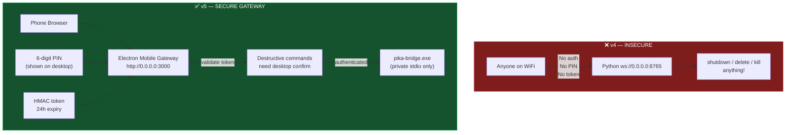
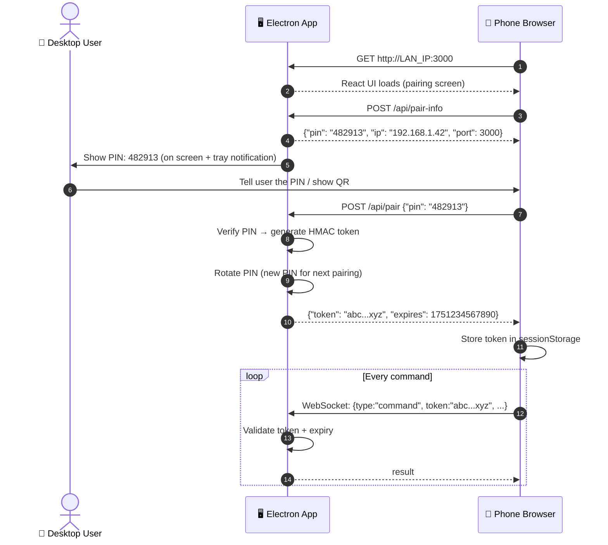

[⬅️ Previous: A Packaging Guide](./A-PACKAGING-GUIDE.md) | [🏠 Back to Master Index](./00-START-HERE.md)

---

# 📱 A — Mobile Gateway (PIN Pairing + Secure Phone Access)

> v5 mein phone access **secure** ho gaya hai. Pehle `0.0.0.0:8765` pe koi bhi
> command bhej sakta tha — ab **6-digit PIN + HMAC token** zaroori hai. 🔐

---

## 🔐 Security: v4 vs v5



---

## 🤝 Pairing Flow



---

## 📲 Phone User Experience

### Step 1 — Open app on phone
Type in phone browser: `http://192.168.1.42:3000`

> IP address Settings → मोबाइल एक्सेस mein dikhta hai + copy button.

### Step 2 — Enter PIN
Desktop par PIN dikhega (6 digits). Phone par enter karo.

### Step 3 — Full access
Pairing ke baad poora Pika UI phone par available. Same features jaise desktop.

### Token rules
| Rule | Detail |
|------|--------|
| Expiry | 24 hours |
| Rotation | PIN rotate hota hai after each successful pairing |
| Revoke | App restart → sab tokens invalid |
| Scope | Phone sirf Electron gateway se baat karta hai |
| Destructive | Desktop par confirmation dialog hamesha |

---

## 💻 Mobile Gateway Code

`electron/services/mobileServer.cjs`:

```javascript
'use strict';
const express = require("express");
const http = require("http");
const { WebSocketServer } = require("ws");
const path = require("path");
const crypto = require("crypto");
const os = require("os");

const MOBILE_PORT = 3000;
const TOKEN_VALIDITY_MS = 24 * 60 * 60 * 1000;

function generatePin() {
  return String(Math.floor(100000 + Math.random() * 900000));
}

function getLanIp() {
  for (const iface of Object.values(os.networkInterfaces())) {
    for (const info of (iface || [])) {
      if (info.family === "IPv4" && !info.internal) return info.address;
    }
  }
  return "127.0.0.1";
}

class MobileGateway {
  constructor({ distDir, onCommand, onShowPin }) {
    this.distDir = distDir;
    this.onCommand = onCommand;
    this.onShowPin = onShowPin;
    this.currentPin = generatePin();
    this.tokens = new Map();
    this.clients = new Set();
  }

  _generateToken(pin) {
    if (pin !== this.currentPin) return null;
    const token = crypto.randomBytes(32).toString("hex");
    this.tokens.set(token, Date.now() + TOKEN_VALIDITY_MS);
    this.currentPin = generatePin();  // rotate
    return token;
  }

  _validateToken(token) {
    const exp = this.tokens.get(token);
    if (!exp) return false;
    if (Date.now() > exp) { this.tokens.delete(token); return false; }
    return true;
  }

  start() {
    const app = express();
    app.use(express.json());

    // Serve React UI
    app.use(express.static(this.distDir));

    // Pairing endpoints
    app.post("/api/pair", (req, res) => {
      const pin = String(req.body?.pin || "").trim();
      const token = this._generateToken(pin);
      if (!token) return res.status(401).json({ error: "Invalid PIN" });
      this.onShowPin(null, getLanIp());
      res.json({ token, expires: Date.now() + TOKEN_VALIDITY_MS });
    });

    app.get("/api/pair-info", (req, res) => {
      res.json({ pin: this.currentPin, ip: getLanIp(), port: MOBILE_PORT });
    });

    // SPA fallback
    app.get("*", (_req, res) => {
      res.sendFile(path.join(this.distDir, "index.html"));
    });

    const server = http.createServer(app);
    const wss = new WebSocketServer({ server });

    wss.on("connection", (ws) => {
      let authenticated = false;
      this.clients.add(ws);

      ws.on("message", async (raw) => {
        let msg;
        try { msg = JSON.parse(raw.toString()); } catch { return; }

        if (!authenticated) {
          if (msg.type === "auth" && this._validateToken(msg.token)) {
            authenticated = true;
            ws.send(JSON.stringify({ type: "auth_ok" }));
          } else {
            ws.send(JSON.stringify({ type: "auth_fail" }));
            ws.close();
          }
          return;
        }

        try {
          const result = await this.onCommand(msg);
          ws.send(JSON.stringify({ ...result, id: msg.id }));
        } catch (e) {
          ws.send(JSON.stringify({ status: "error", message: e.message, id: msg.id }));
        }
      });

      ws.on("close", () => this.clients.delete(ws));
    });

    server.listen(MOBILE_PORT, "0.0.0.0", () => {
      const ip = getLanIp();
      this.onShowPin(this.currentPin, ip);
      console.log(`[mobile] Ready: http://${ip}:${MOBILE_PORT}`);
    });

    this._server = server;
    this._wss = wss;
  }

  broadcast(msg) {
    const str = JSON.stringify(msg);
    for (const ws of this.clients) {
      if (ws.readyState === 1) ws.send(str);
    }
  }

  stop() {
    this._wss?.close();
    this._server?.close();
  }
}

module.exports = { MobileGateway, getLanIp };
```

---

## 🔌 Integration in main.cjs

```javascript
const { MobileGateway, getLanIp } = require("./services/mobileServer.cjs");

let mobileGateway = null;

function startMobileGateway() {
  const distDir = app.isPackaged
    ? path.join(__dirname, "..", "dist")
    : path.join(ROOT, "dist");

  mobileGateway = new MobileGateway({
    distDir,
    onCommand: (msg) => sendToBridge(msg),  // forward to sidecar
    onShowPin: (pin, ip) => {
      if (mainWindow && !mainWindow.isDestroyed()) {
        mainWindow.webContents.send("mobile:pair-info", { pin, ip });
      }
      if (pin) logger.info(`[mobile] New PIN: ${pin} | http://${ip}:3000`);
    },
  });

  mobileGateway.start();
}
```

IPC handler for Settings UI:
```javascript
ipcMain.handle("mobile:get-pair-info", () => ({
  ip: getLanIp(),
  pin: mobileGateway?.currentPin,
  port: 3000,
}));
```

---

## 🔒 Security Rules

| Rule | Implementation |
|------|---------------|
| No unauthenticated WS | WebSocket ke pehle auth message zaroori |
| PIN one-time | Successful pairing ke baad rotate |
| Token expiry | 24h (localStorage mein save — sessionStorage better) |
| Destructive confirm | `shutdown`, `delete`, `kill` → desktop modal |
| Bridge never on network | Bridge sirf stdio, never network |
| HTTPS optional | localhost:3000 HTTP theek, but add self-signed cert for production |

---

## 📱 Firewall (agar connect na ho)

```powershell
# Windows — PowerShell as Administrator
New-NetFirewallRule -DisplayName "Pika Mobile" `
    -Direction Inbound -LocalPort 3000 -Protocol TCP -Action Allow
```

```bash
# Linux
sudo ufw allow 3000/tcp

# macOS
# System Preferences → Security & Privacy → Firewall → Allow Pika
```

---

## 🔗 Related Docs

- [A-SIDECAR-ARCHITECTURE.md](./A-SIDECAR-ARCHITECTURE.md) — Full architecture
- [A-PACKAGING-GUIDE.md](./A-PACKAGING-GUIDE.md) — Build + signing
- [22-UI-USER-MANUAL.md](./22-UI-USER-MANUAL.md) — User instructions

---

[⬅️ Previous: A Packaging Guide](./A-PACKAGING-GUIDE.md) | [🏠 Back to Master Index](./00-START-HERE.md)
