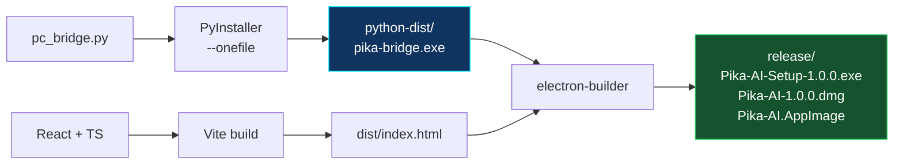
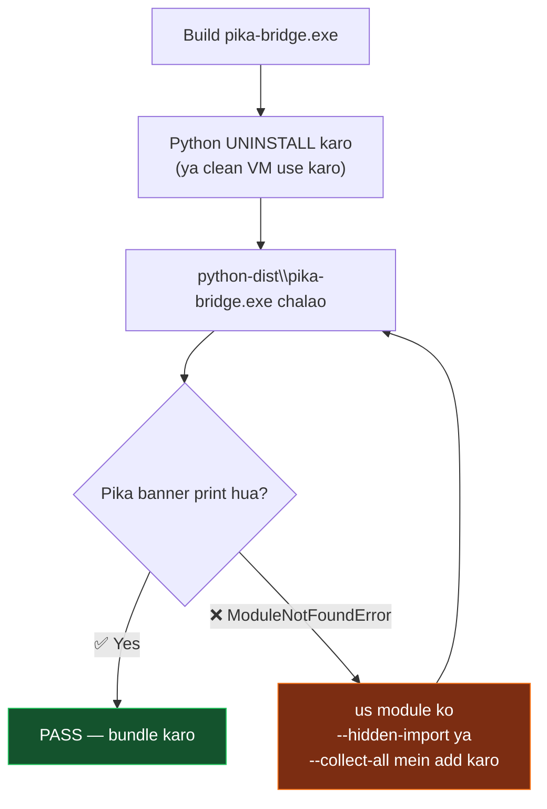
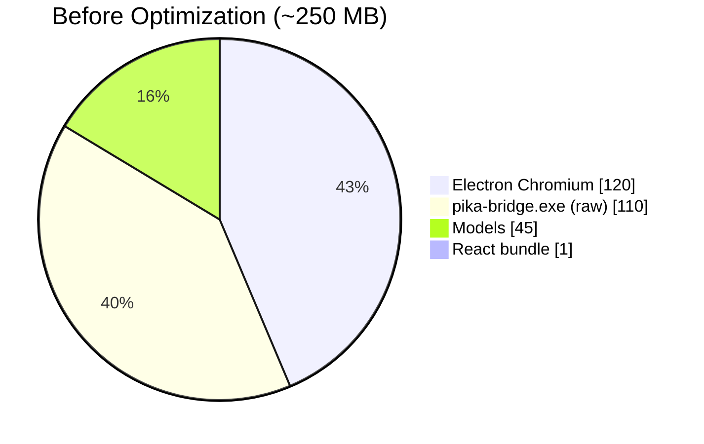
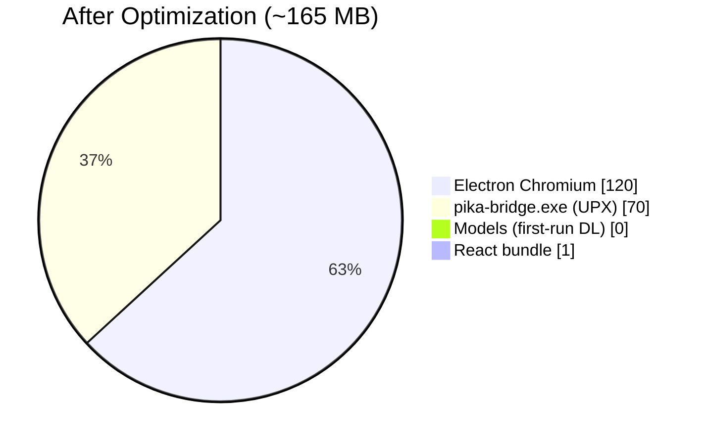
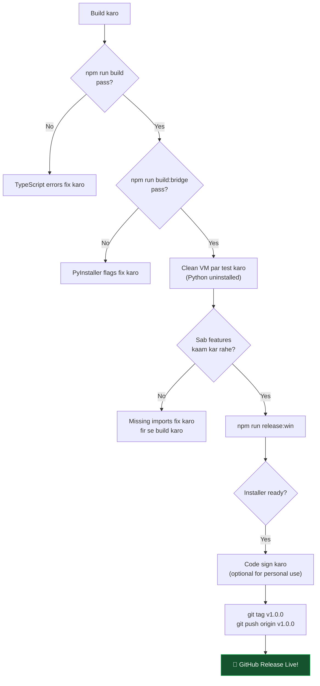

[⬅️ Previous: A Sidecar Architecture](./A-SIDECAR-ARCHITECTURE.md) | [🏠 Back to Master Index](./00-START-HERE.md) | [➡️ Next: A Mobile Gateway](./A-MOBILE-GATEWAY.md)

---

# 📦 A — Packaging Guide (PyInstaller + electron-builder + CI/CD)

> Yeh guide step-by-step batati hai `pc_bridge.py` ko freeze karke Electron installer
> mein bundle karna. End result: `Pika-AI-Setup.exe` jo bina Python ke chalta hai. 🚀

---

## 🗺️ Build Pipeline



---

## 1️⃣ PyInstaller Setup

```bash
# Activate your venv first
venv\Scripts\activate   # Windows
source venv/bin/activate  # Mac/Linux

pip install pyinstaller
```

### Full Build Command

```bash
# Windows (paste in terminal)
pyinstaller ^
    --onefile ^
    --name pika-bridge ^
    --distpath python-dist ^
    --workpath .pyi-build ^
    --specpath .pyi-build ^
    --noconsole ^
    --collect-all vosk ^
    --collect-all edge_tts ^
    --hidden-import=pyttsx3.drivers ^
    --hidden-import=pyttsx3.drivers.sapi5 ^
    --hidden-import=comtypes ^
    --hidden-import=engineio.async_drivers.threading ^
    pc_bridge.py
```

```bash
# Mac / Linux (one line)
pyinstaller \
    --onefile --name pika-bridge \
    --distpath python-dist \
    --noconsole \
    --collect-all vosk \
    --collect-all edge_tts \
    pc_bridge.py
```

### Flag Reference

| Flag | Kya karta hai |
|------|---------------|
| `--onefile` | Single file output (vs --onedir) |
| `--name pika-bridge` | Output filename |
| `--noconsole` | Windows: no black console popup |
| `--collect-all vosk` | **MUST** — model files + data |
| `--collect-all edge_tts` | TTS voice list |
| `--hidden-import` | Dynamically imported modules |
| `--upx-dir` | Optional: UPX compression |
| `--exclude-module` | Remove unused heavy packages |

---

## 2️⃣ Verify on Clean Machine



```bash
# NDJSON mode test (koi Python installed nahi chahiye)
set PIKA_IPC_MODE=stdio
echo {"id":"t1","type":"command","category":"info","action":"cpu"} | python-dist\pika-bridge.exe
```

Expected output (one JSON line):
```json
{"type":"response","status":"success","message":"CPU 34%","data":{"percent":34},"id":"t1","timestamp":"..."}
```

---

## 3️⃣ electron-builder.yml

```yaml
appId: com.pika.ai.assistant
productName: Pika AI
copyright: Copyright © 2026 Pika AI

directories:
  output: release

files:
  - dist/**/*
  - electron/**/*
  - package.json

# extraResources: OUTSIDE asar archive, executable permissions maintained
extraResources:
  - from: python-dist/pika-bridge.exe     # Windows
    to: bridge/pika-bridge.exe
  - from: models/                         # Vosk model (if bundling)
    to: models/

asar: true
compression: maximum

win:
  target:
    - target: nsis
      arch: [x64]
    - target: portable
      arch: [x64]
  artifactName: "Pika-AI-Setup-${version}.${ext}"

nsis:
  oneClick: false
  allowToChangeInstallationDirectory: true
  createDesktopShortcut: true
  shortcutName: Pika AI
  deleteAppDataOnUninstall: false

mac:
  target: [{ target: dmg, arch: [x64, arm64] }]
  extraResources:
    - from: python-dist/pika-bridge      # Mac (no .exe)
      to: bridge/pika-bridge

linux:
  target: [AppImage, deb]
  extraResources:
    - from: python-dist/pika-bridge
      to: bridge/pika-bridge
```

> **⚠️ CRITICAL:** Bridge **MUST** be in `extraResources`, NOT in `files`. Files inside
> `asar` archive cannot be executed on Windows (permission denied error).

---

## 4️⃣ resolveBridgeBinary() — Electron main.cjs

```javascript
function resolveBridgeBinary() {
  const exeName = process.platform === "win32" ? "pika-bridge.exe" : "pika-bridge";

  // Packaged: app.isPackaged = true → resourcesPath/bridge/
  const packaged = path.join(process.resourcesPath, "bridge", exeName);

  // Dev: python-dist/ next to electron/
  const dev = path.join(__dirname, "..", "python-dist", exeName);

  if (app.isPackaged && fs.existsSync(packaged)) {
    return { bin: packaged, mode: "packaged" };
  }
  if (fs.existsSync(dev)) {
    return { bin: dev, mode: "dev-exe" };
  }
  return null;   // will fall back to system Python in dev only
}
```

---

## 5️⃣ npm Scripts

```json
{
  "main": "electron/main.cjs",
  "scripts": {
    "dev":           "vite",
    "build":         "tsc -b && vite build",
    "build:bridge":  "pyinstaller --onefile --name pika-bridge --distpath python-dist --workpath .pyi-build --specpath .pyi-build --noconsole --collect-all vosk --collect-all edge_tts --hidden-import=pyttsx3.drivers --hidden-import=pyttsx3.drivers.sapi5 --hidden-import=comtypes pc_bridge.py",
    "electron:dev":  "concurrently -k \"vite\" \"wait-on tcp:3000 && cross-env NODE_ENV=development electron .\"",
    "release:win":   "npm run build:bridge && npm run build && electron-builder --win --x64",
    "release:mac":   "npm run build:bridge && npm run build && electron-builder --mac",
    "release:linux": "npm run build:bridge && npm run build && electron-builder --linux"
  }
}
```

---

## 6️⃣ GitHub Actions — Automated Release

`.github/workflows/release.yml`:

```yaml
name: Build & Release Pika AI
on:
  push:
    tags: ["v*"]
  workflow_dispatch:

jobs:
  build:
    strategy:
      matrix:
        include:
          - os: windows-latest
            artifact: Pika-AI-Setup-*.exe
          - os: macos-latest
            artifact: Pika-AI-*.dmg
          - os: ubuntu-latest
            artifact: Pika-AI-*.AppImage

    runs-on: ${{ matrix.os }}

    steps:
      - uses: actions/checkout@v4

      - uses: actions/setup-node@v4
        with: { node-version: 20, cache: npm }

      - uses: actions/setup-python@v5
        with: { python-version: "3.12" }

      - name: Cache pip
        uses: actions/cache@v4
        with:
          path: ~/.cache/pip
          key: ${{ runner.os }}-pip-${{ hashFiles('requirements.txt') }}

      - name: Install Python deps
        run: |
          python -m pip install --upgrade pip
          pip install -r requirements.txt pyinstaller

      - name: Build Python bridge
        run: npm run build:bridge

      - name: Install Node deps
        run: npm ci

      - name: Build renderer
        run: npm run build

      - name: Build Electron installer
        run: npx electron-builder --publish always
        env:
          GH_TOKEN: ${{ secrets.GITHUB_TOKEN }}

      - uses: actions/upload-artifact@v4
        with:
          name: pika-${{ matrix.os }}
          path: release/${{ matrix.artifact }}
```

**Release karna:**
```bash
git tag v1.0.0
git push origin v1.0.0
```

GitHub automatically produces:
```
https://github.com/USERNAME/pika-ai/releases/tag/v1.0.0
├── Pika-AI-Setup-1.0.0.exe     (Windows)
├── Pika-AI-1.0.0-x64.dmg      (macOS Intel)
├── Pika-AI-1.0.0-arm64.dmg    (macOS Apple Silicon)
└── Pika-AI-1.0.0.AppImage     (Linux)
```

---

## 7️⃣ Code Signing

### Windows

```powershell
signtool sign `
  /fd SHA256 `
  /tr http://timestamp.digicert.com `
  /td SHA256 `
  /a `
  "release\Pika-AI-Setup-1.0.0.exe"
```

| Certificate Type | Cost/yr | SmartScreen Effect |
|-----------------|---------|-------------------|
| Unsigned | Free | ⚠️ Warning every time |
| OV (Organization Validated) | ~$200 | Warning until reputation builds |
| EV (Extended Validation) | ~$400 | ✅ Immediate full trust |

> Academic project ke liye: users ko batao "More info → Run anyway" click karein.

### macOS

```bash
codesign --deep --force --options runtime \
    --sign "Developer ID Application: Your Name (TEAMID)" \
    "release/Pika AI.app"

xcrun notarytool submit "release/Pika-AI-1.0.0.dmg" \
    --apple-id you@example.com \
    --team-id TEAMID \
    --wait

xcrun stapler staple "release/Pika-AI-1.0.0.dmg"
```

---

## 8️⃣ Size Optimization





Optimization steps:
```bash
# 1. UPX (install from upx.github.io)
pyinstaller ... --upx-dir C:\upx pc_bridge.py

# 2. Exclude unused heavy modules
pyinstaller ... \
    --exclude-module tkinter \
    --exclude-module matplotlib \
    --exclude-module numpy.testing \
    --exclude-module PIL.ImageTk \
    --exclude-module _tkinter \
    pc_bridge.py

# 3. First-run model download (remove models/ from extraResources)
# Python bridge auto-downloads from alphacephei.com on first launch
```

---

## 🐛 Common Errors & Fixes

| Error | Cause | Fix |
|-------|-------|-----|
| `ModuleNotFoundError: vosk` | PyInstaller nahi detect kar paya | `--collect-all vosk` add karo |
| `Failed to execute script` | Missing hidden import | `--noconsole` hatao temporarily, error dekho |
| Bridge exe not found (packaged) | Wrong resourcesPath | `console.log(process.resourcesPath)` se debug karo |
| Bridge exits instantly | stdout nahi flush ho raha | `sys.stdout.buffer.flush()` har emit ke baad |
| Garbled Hindi text | Encoding | `PYTHONIOENCODING=utf-8` env set karo |
| Antivirus deletes exe | Unsigned PE | Sign karo ya exclusion add karo |
| Orphan process after quit | No tree kill | Windows: `taskkill /pid X /f /t` use karo |
| Model not found (packaged) | Path wrong | `PIKA_MODELS_DIR` env = `process.resourcesPath/models` |

---

## 9️⃣ Pre-Release Checklist



---

## 🔗 Related Docs

- [A-SIDECAR-ARCHITECTURE.md](./A-SIDECAR-ARCHITECTURE.md) — Architecture overview
- [A-MOBILE-GATEWAY.md](./A-MOBILE-GATEWAY.md) — Phone pairing
- [25-PACKAGING-DISTRIBUTION.md](./25-PACKAGING-DISTRIBUTION.md) — Full packaging reference

---

[⬅️ Previous: A Sidecar Architecture](./A-SIDECAR-ARCHITECTURE.md) | [🏠 Back to Master Index](./00-START-HERE.md) | [➡️ Next: A Mobile Gateway](./A-MOBILE-GATEWAY.md)
