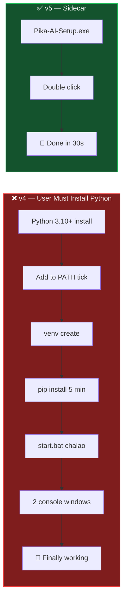
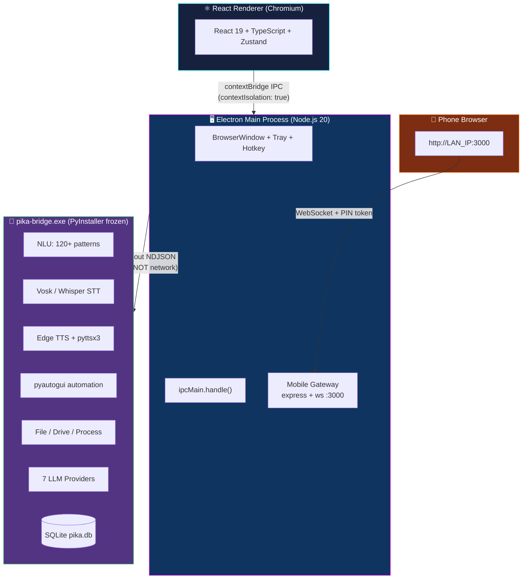
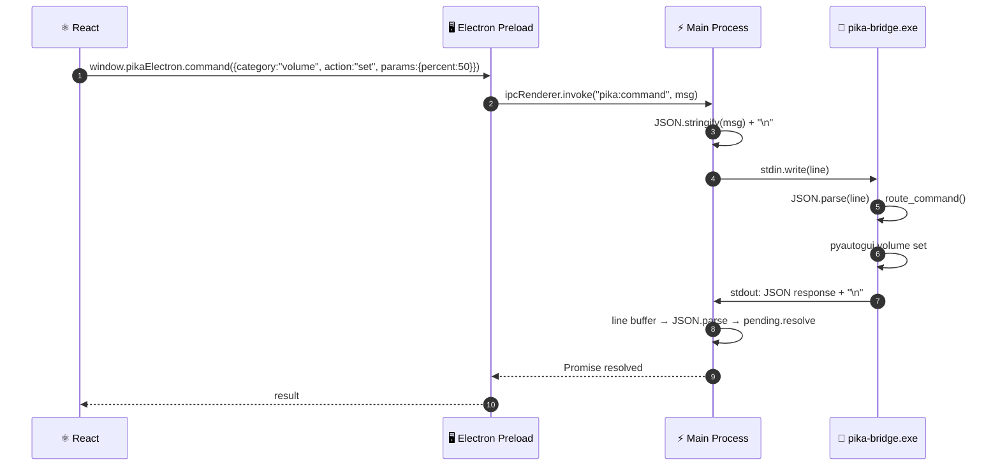
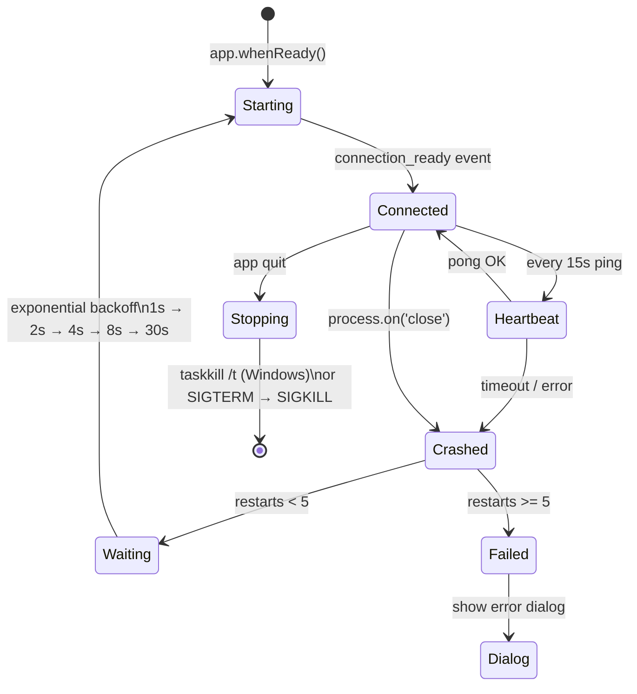
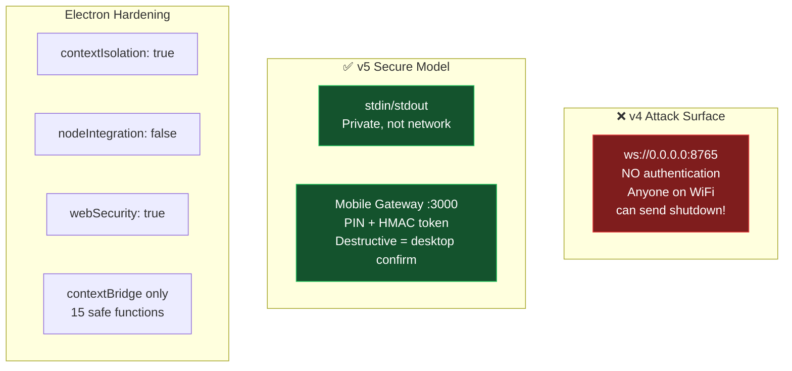
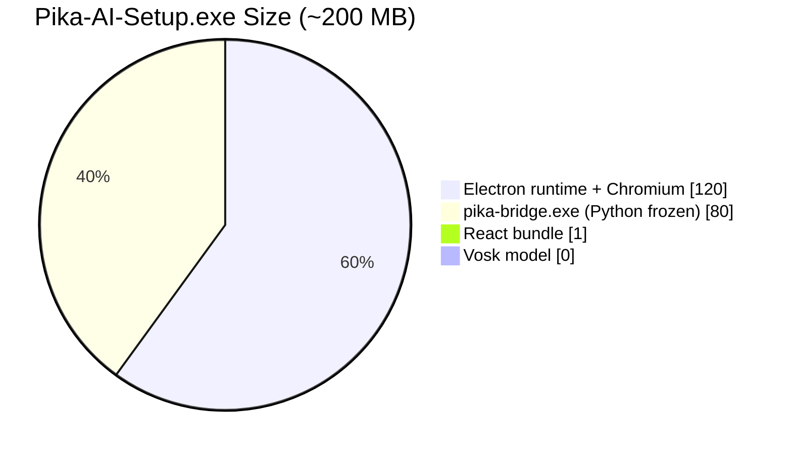

[🏠 Back to Master Index](./00-START-HERE.md) | [➡️ Next: A Packaging Guide](./A-PACKAGING-GUIDE.md)

---

# 🐍 A — Option A: Electron + Packaged Python Sidecar

> Pika ka sabse **production-ready** upgrade path. User ko Python install nahi karna
> padta — sirf ek `.exe` double-click, sab kuchh ho jaata hai. 🎯

---

## ⚡ 30-Second Comparison



---

## 🏗️ Full Architecture



---

## 🔌 IPC Communication — WebSocket vs Sidecar



> **Security advantage:** Bridge na to `0.0.0.0:8765` par hai, na koi network port
> open karta hai. Sirf Electron ke stdin/stdout se baat karta hai — 100% private.

---

## 📦 How PyInstaller Works


---

## 🔄 Bridge Lifecycle



---

## 🔐 Security Model



---

## ✅ Feature Support

| Feature | v4 Python | v5 Sidecar | Notes |
|---------|:---------:|:----------:|-------|
| Offline Hindi STT | ✅ | ✅ | Vosk bundled |
| Wake word background | ✅ | ✅ | Python in background |
| Mouse/keyboard macro | ✅ | ✅ | pyautogui bundled |
| OCR (pytesseract) | ✅ | ✅ | Bundled |
| Edge TTS | ✅ | ✅ | Bundled |
| Offline TTS fallback | ✅ | ✅ | pyttsx3 bundled |
| All 120+ commands | ✅ | ✅ | Unchanged |
| No Python install needed | ❌ | ✅ | Key improvement |
| Single .exe installer | ❌ | ✅ | Key improvement |
| No .bat launcher | ❌ | ✅ | Key improvement |
| Cold start <2s | ❌ 3s | ✅ 1.5s | No interpreter startup |
| LAN auth security | ❌ | ✅ | PIN pairing |

---

## 📊 Bundle Size Breakdown



> Vosk model (~45 MB) ko **first run download** karo size bachane ke liye.
> `PIKA_MODELS_DIR` env var se custom path set hoti hai.

**Size optimization tips:**
```bash
# UPX compression (~30% reduction on bridge.exe)
pyinstaller --onefile --upx-dir C:\upx ...

# Exclude unused modules
--exclude-module tkinter --exclude-module matplotlib
--exclude-module numpy.testing --exclude-module PIL.ImageTk
```

---

## 🚀 Build Commands

```bash
# 1. Bridge compile karo
npm run build:bridge
# → python-dist/pika-bridge.exe

# 2. React build
npm run build
# → dist/index.html

# 3. Electron installer
npm run release:win
# → release/Pika-AI-Setup-1.0.0.exe
```

---

## 🤔 FAQ

**Q: Agar user ki machine par Python installed ho toh kya bridge use karega?**
A: Nahi. App packaged bridge.exe use karta hai, system Python ignore karta hai.

**Q: PyInstaller ka exe antivirus flag karega?**
A: Kabhi-kabhi hota hai unsigned binaries ke saath. Fix: code sign karo.
Detail → [A-PACKAGING-GUIDE.md](./A-PACKAGING-GUIDE.md)

**Q: pc_bridge.py ab bhi dev mein kaam karega?**
A: Haan. `PIKA_IPC_MODE` set na ho toh WebSocket mode chalega jaise pehle.

**Q: Models app ke saath bundle hote hain ya download hote hain?**
A: Dono possible hain. electron-builder.yml mein `from: models/ to: models/` add
karo bundling ke liye, ya first-run auto-download raho (chhota installer).

---

## 🔗 Related Docs

- [A-PACKAGING-GUIDE.md](./A-PACKAGING-GUIDE.md) — PyInstaller + signing + GitHub Releases
- [A-MOBILE-GATEWAY.md](./A-MOBILE-GATEWAY.md) — Phone PIN pairing guide
- [02-ARCHITECTURE.md](./02-ARCHITECTURE.md) — Overall system architecture
- [25-PACKAGING-DISTRIBUTION.md](./25-PACKAGING-DISTRIBUTION.md) — Distribution guide

---

[🏠 Back to Master Index](./00-START-HERE.md) | [➡️ Next: A Packaging Guide](./A-PACKAGING-GUIDE.md)
