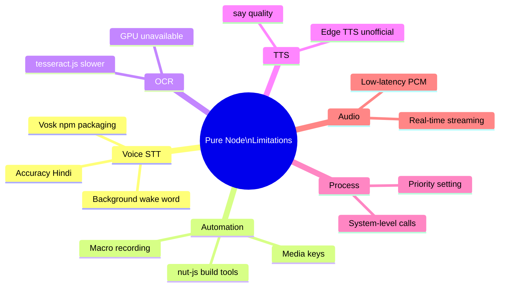
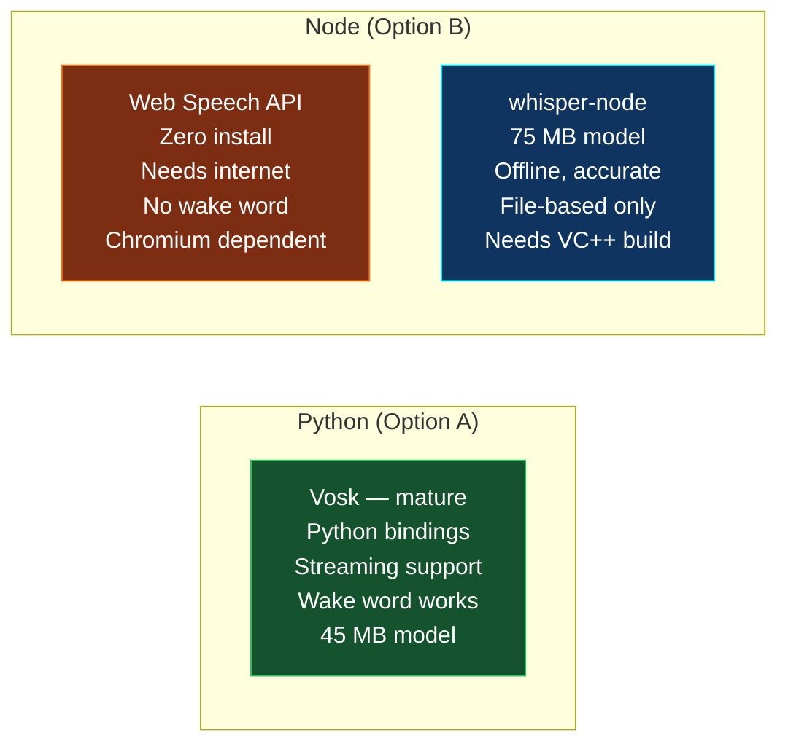
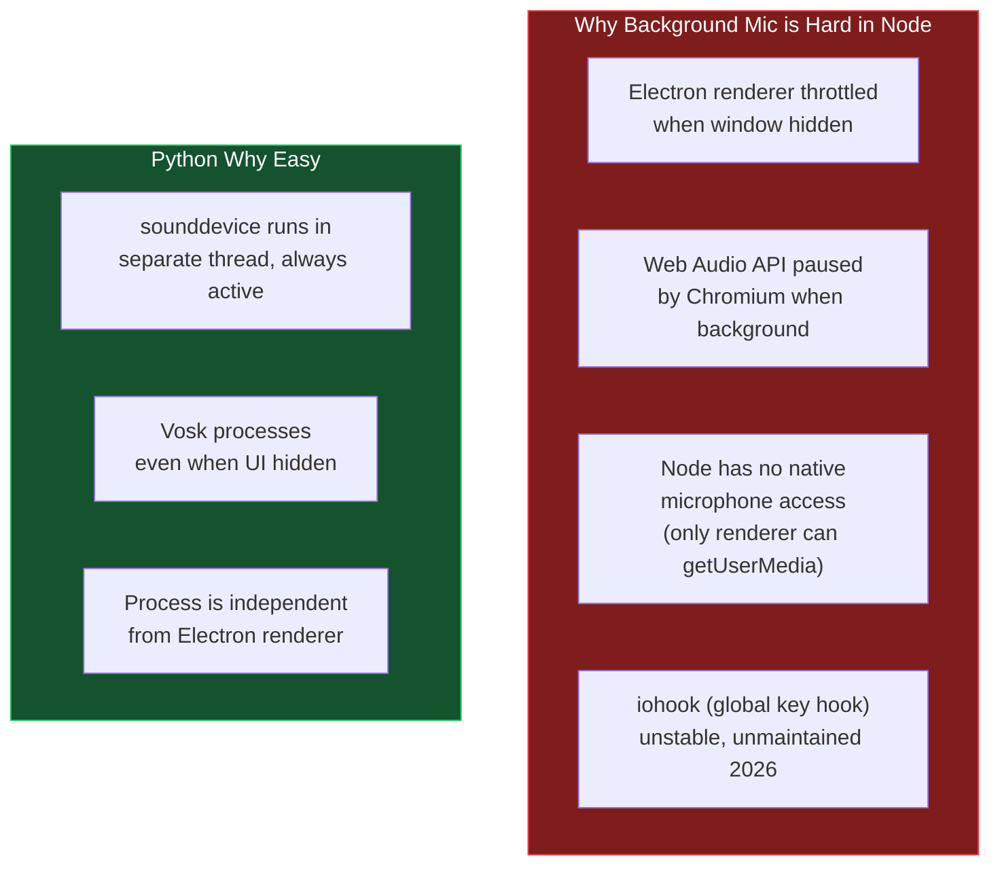
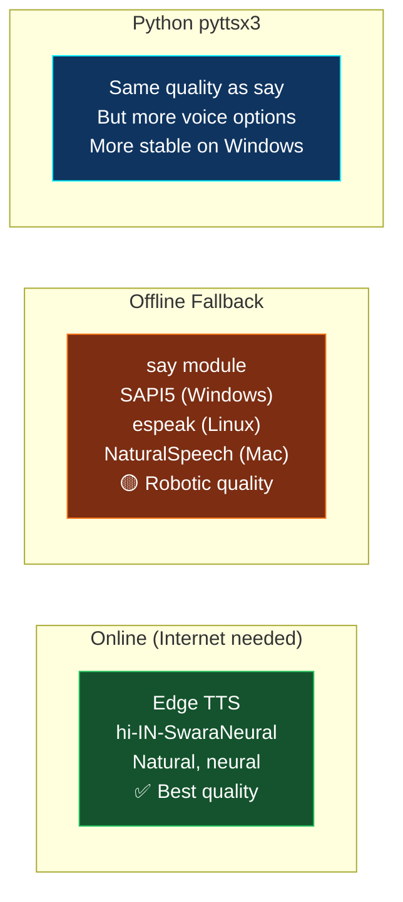

[⬅️ Previous: B Node Services Guide](./B-NODE-SERVICES-GUIDE.md) | [🏠 Back to Master Index](./00-START-HERE.md)

---

# ⚠️ B — Pure Node Limitations (Honest Tradeoffs)

> Ek honest document. Pure Electron approach kya-kya achhi tarah nahi kar sakta — aur
> unke mitigation strategies. 2026 mein Python libraries abhi bhi kuchh areas mein
> Node se aage hain. 🔍

---

## 🗺️ Limitation Categories



---

## 1️⃣ Offline Hindi Voice Recognition

### Problem



| Approach | Accuracy Hindi | Offline | Streaming | Wake word | Install |
|----------|:--------------:|:-------:|:---------:|:---------:|---------|
| Vosk Python | 85% | ✅ | ✅ | ✅ | pip |
| Web Speech API | ~80%* | ❌ | ✅ | ❌ | None |
| whisper-node | 88% | ✅ | ❌ file | ❌ | VC++ |
| @xenova/transformers | 88% | ✅ | ❌ slow | ❌ | 75 MB DL |

*Internet + Chrome's backend (Google)

### Mitigation 2026

```
Primary:     Web Speech API (renderer Chromium) — zero install, good enough
             Works: typing in Hindi, short commands, English
Upgrade:     whisper-node with tiny model — first-run 75 MB download
Wake word:   Ctrl+Shift+Space global shortcut (Electron globalShortcut)
             No background mic possible in pure Node
Background:  NOT POSSIBLE without Python or native process
```

---

## 2️⃣ Background Wake Word

### Problem

Wake word jaise "Hey Assistant" sunna background mein — jab Electron window hidden ho,
ya user doosre app mein kaam kar raha ho — Node mein reliable nahi hai.



### Mitigation

```
Solution A: Global keyboard shortcut (Ctrl+Shift+Space) from Electron globalShortcut
            Works even when window hidden — this is already implemented ✅

Solution B: Spawn a minimal Node process (just for mic) that sends results via IPC
            This is essentially re-inventing what Python sidecar does

Solution C: Accept limitation — Pika activates only when window focused or shortcut used
```

---

## 3️⃣ Mouse/Keyboard Automation (Macros)

### @nut-tree/nut-js Issues

```
Requires:   Visual C++ Build Tools (Windows) — 1.4 GB install
            Xcode Command Line Tools (macOS)
            libxtst-dev, libpng-dev (Linux)
Build time: 5-10 minutes on first npm install
Stability:  Better than robotjs, but occasional native crashes
Coverage:   Mouse + keyboard + screen read — good
Missing:    Media keys, special Windows API calls
```

### Mitigation

```javascript
// Graceful fallback if nut-js not available
let nut = null;
try { nut = require("@nut-tree/nut-js"); }
catch { console.warn("[voice] nut-js not available — basic automation only"); }

module.exports = {
  async pressKeys(...keys) {
    if (nut) {
      // nut-js implementation
      return { success: true };
    }
    // Fallback: Electron built-in (limited)
    const { Menu } = require("electron");
    return { success: false, message: "Install @nut-tree/nut-js for full automation" };
  },
};
```

For media keys specifically — use Electron's `globalShortcut` with VK codes:

```javascript
// Media keys via globalShortcut (works without nut-js)
globalShortcut.register("MediaPlayPause", () => { /* toggle */ });
globalShortcut.register("MediaNextTrack", () => { /* next */ });
globalShortcut.register("MediaPreviousTrack", () => { /* prev */ });
```

---

## 4️⃣ OCR — tesseract.js vs pytesseract

```mermaid
gantt
    title OCR Performance Comparison (1920x1080 screenshot)
    dateFormat X
    axisFormat %s

    section pytesseract (Python)
    Processing : 0, 800

    section tesseract.js WASM (Node)
    Processing : 0, 3500
```



| | pytesseract | tesseract.js |
|---|:-----------:|:------------:|
| Speed | ~0.8s | ~3.5s |
| Accuracy | Same (same engine) | Same |
| GPU support | ✅ | ❌ |
| Install | Tesseract binary | WASM (auto) |
| Hindi support | ✅ | ✅ |
| Package size | System binary | ~22 MB WASM |

### Mitigation

```javascript
// tesseract.js is acceptable for occasional OCR
// Just set user expectations: "OCR takes 3-4 seconds"
const { createWorker } = require("tesseract.js");

module.exports = {
  async captureAndRead() {
    const imgBuf = await screenshot();
    const worker = await createWorker("hin+eng");  // Hindi + English
    const { data: { text } } = await worker.recognize(imgBuf);
    await worker.terminate();
    return { success: true, message: "OCR done", data: { text: text.trim() } };
  },
};
```

---

## 5️⃣ Text-to-Speech Quality



**Node offline TTS is same quality as Python offline TTS** — both use SAPI5.
Edge TTS quality is same regardless of Python or Node — it's a network call.

The main difference: Python's `edge-tts` library is more stable and well-tested.
Node's edge-tts port works but is less maintained.

### Mitigation

```javascript
// Prioritize: Edge TTS (online) > say (offline)
// For voice assistant, online TTS is acceptable since AI chat needs internet anyway
async function speak(text, voice = "hi-IN-SwaraNeural") {
  if (await isOnline()) {
    const result = await edgeTtsFetch(text, voice);
    if (result.success) return result;
  }
  // say module offline
  return saySpeak(text);
}
```

---

## 6️⃣ Screen Recording

Currently `screenshot-desktop` gives screenshots. For screen recording:

```javascript
// Use Electron's desktopCapturer + browser MediaRecorder
// BUT: this requires renderer involvement (not main process only)
// Send IPC to renderer: "start recording"
// Renderer: desktopCapturer.getSources + MediaRecorder
// Save to disk when done

ipcMain.handle("screen:start-recording", async () => {
  mainWindow.webContents.send("screen:do-start-recording");
  return { success: true };
});
```

This is actually cleaner in Electron than in Python.

---

## 📊 Summary: What to Accept vs Solve

| Limitation | Accept | Solve (how) | Delegate to Python |
|-----------|:------:|:-----------:|:------------------:|
| Wake word background | ✅ (use hotkey) | | |
| Offline Hindi accuracy | ✅ (Web Speech) | whisper-node | |
| nut-js build tools | 🟡 | Document req | ✅ |
| OCR slowness | ✅ (3-4s) | | |
| TTS offline quality | ✅ (same SAPI5) | | |
| Macro recording | 🟡 | nut-js | ✅ |
| Media keys | | globalShortcut | |
| Screen recording | | desktopCapturer | |

---

## 🎯 Honest Recommendation

**For most Pika users:**
> Option A (Python Sidecar) is the right choice in 2026. Python ecosystem is more
> mature for voice + automation. The developer doesn't notice Python at runtime — only
> the build step needs Python.

**For Option B specifically:**
> Best for apps where voice is secondary and file/info/LLM features are primary.
> If your users don't need background wake word, OCR, or complex macros, Option B
> delivers a cleaner developer experience.

**Hybrid approach (best of both):**
> Use Option B services for easy features (file, system, LLM) with feature flags,
> while keeping Python sidecar active for voice, macros, and OCR. Migrate one
> service at a time over 6-12 months as Node libraries mature.

---

## 🔗 Related Docs

- [B-PURE-ELECTRON-ARCHITECTURE.md](./B-PURE-ELECTRON-ARCHITECTURE.md) — Overview
- [B-NODE-SERVICES-GUIDE.md](./B-NODE-SERVICES-GUIDE.md) — Implementation
- [A-SIDECAR-ARCHITECTURE.md](./A-SIDECAR-ARCHITECTURE.md) — The alternative

---

[⬅️ Previous: B Node Services Guide](./B-NODE-SERVICES-GUIDE.md) | [🏠 Back to Master Index](./00-START-HERE.md)
