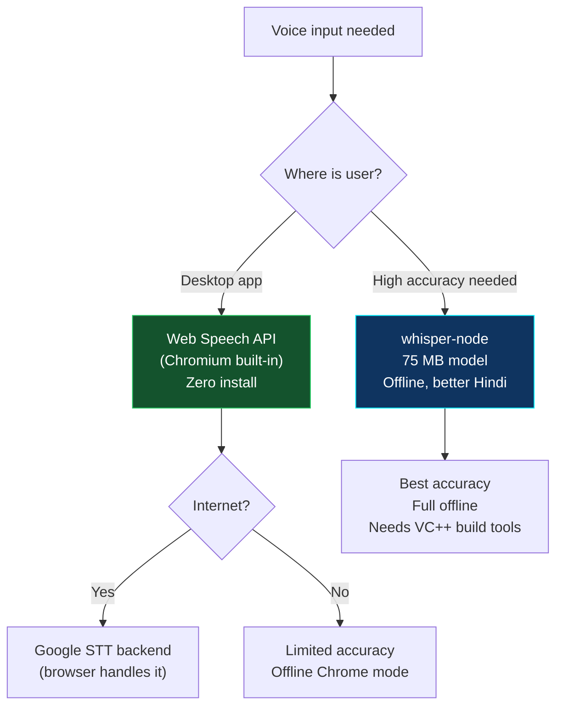

[⬅️ Previous: B Pure Electron Architecture](./B-PURE-ELECTRON-ARCHITECTURE.md) | [🏠 Back to Master Index](./00-START-HERE.md) | [➡️ Next: B Limitations](./B-LIMITATIONS.md)

---

# 🔧 B — Node.js Services Guide (Implementation Reference)

> Har service ka kya kaam hai, kaunsi library use kari, kaise test karo. 📚

---

## 🗺️ Service Map

```mermaid
flowchart TD
    CR["commandRouter.cjs\n(routes to services)"]
    CR --> SYS["systemService\nCPU RAM Battery Disk"]
    CR --> POW["powerService\nShutdown Restart Lock"]
    CR --> FILE["fileService\nCreate Read Write Rename Delete List"]
    CR --> DRV["driveService\nC:\\ D:\\ listing"]
    CR --> VOL["volumeService\nUp Down Set Mute"]
    CR --> SCR["screenService\nScreenshot"]
    CR --> PROC["processService\nList Kill"]
    CR --> NET["networkService\nIP Hostname"]
    CR --> LLM["llmService\n7 providers streaming"]
    CR --> TTS["ttsService\nEdge TTS + say offline"]
    CR --> VCS["voiceService\nwhisper-node + Web Speech"]
    CR --> DB["dbService\nbetter-sqlite3 sync"]
    CR --> APP["appService\nshell.openExternal"]
    CR --> MG["mobileServer\nexpress + ws + PIN"]

    style CR fill:#0f3460,stroke:#00f0ff,color:#fff
```



---

## 📦 All Dependencies

```bash
# Production
npm install \
    systeminformation \
    loudness \
    screenshot-desktop \
    drivelist \
    ps-list \
    clipboardy \
    better-sqlite3 \
    express \
    ws \
    say \
    mathjs

# Optional / enhanced voice
npm install whisper-node            # 75 MB model, offline Hindi
npm install @nut-tree/nut-js        # keyboard/mouse automation (needs VC++)

# Dev
npm install --save-dev @electron/rebuild
```

`package.json` mein add karo:
```json
{
  "scripts": {
    "postinstall": "electron-rebuild -f -w better-sqlite3"
  }
}
```

---

## 1️⃣ systemService.cjs

**Library:** `systeminformation@5` (pure JS, no native compile)

```javascript
const si = require("systeminformation");
const os = require("os");

module.exports = {
  async getCpu() {
    const load = await si.currentLoad();
    return {
      success: true,
      message: `CPU ${Math.round(load.currentLoad)}%`,
      data: { percent: Math.round(load.currentLoad), cores: os.cpus().length },
    };
  },
  async getRam() {
    const mem = await si.mem();
    const pct = Math.round((mem.used / mem.total) * 100);
    return {
      success: true, message: `RAM ${pct}%`,
      data: { percent: pct, used_gb: +(mem.used/2**30).toFixed(1), total_gb: +(mem.total/2**30).toFixed(1) },
    };
  },
  async getBattery() {
    const b = await si.battery();
    return { success: true, message: `बैटरी ${b.percent}%`, data: { percent: b.percent, plugged: b.isCharging } };
  },
  async getDisk() {
    const [fs] = await si.fsSize();
    if (!fs) return { success: false, message: "डिस्क नहीं मिली", data: null };
    const pct = Math.round((fs.used/fs.size)*100);
    return { success: true, message: `Disk ${pct}%`, data: { percent: pct, free_gb: +((fs.size-fs.used)/2**30).toFixed(1) } };
  },
};
```

**Test:**
```bash
node -e "require('./electron/services/systemService.cjs').getCpu().then(console.log)"
```

---

## 2️⃣ fileService.cjs

**Library:** `fs/promises` (Node built-in)

Key implementation points:

```javascript
const BLOCKED = [/^[a-zA-Z]:\\Windows/i, /^[a-zA-Z]:\\Program Files/i, /^\/System/i, /^\/usr/i, /^\/etc/i];

function resolvePath(p) {
  const home = os.homedir();
  const map = { desktop: "Desktop", documents: "Documents", downloads: "Downloads", pictures: "Pictures", music: "Music" };
  const low = (p || "").toLowerCase().trim();
  for (const [k, v] of Object.entries(map)) {
    if (low === k || low.startsWith(k + "/") || low.startsWith(k + "\\")) {
      const rest = p.slice(k.length).replace(/^[\\/]/, "");
      return rest ? path.join(home, v, rest) : path.join(home, v);
    }
  }
  return path.isAbsolute(p) ? p : path.join(home, p);
}

function isSafe(p) { return !BLOCKED.some(re => re.test(p)); }
```

**Test:**
```bash
node -e "const f = require('./electron/services/fileService.cjs'); f.createFile('Desktop/pika-test.txt', 'hello').then(console.log)"
```

---

## 3️⃣ volumeService.cjs

**Library:** `loudness@2` — cross-platform, no native compile

```javascript
const loudness = require("loudness");

module.exports = {
  async volumeUp(amount = 10) {
    const cur = await loudness.getVolume();
    await loudness.setVolume(Math.min(100, cur + amount));
    return { success: true, message: "आवाज़ बढ़ाई।", data: null };
  },
  async volumeDown(amount = 10) {
    const cur = await loudness.getVolume();
    await loudness.setVolume(Math.max(0, cur - amount));
    return { success: true, message: "आवाज़ कम की।", data: null };
  },
  async volumeSet(pct) {
    await loudness.setVolume(Math.max(0, Math.min(100, pct)));
    return { success: true, message: `Volume ${pct}%.`, data: null };
  },
  async mute() {
    const muted = await loudness.getMuted();
    await loudness.setMuted(!muted);
    return { success: true, message: muted ? "Unmuted." : "Muted.", data: null };
  },
};
```

**Test:**
```bash
node -e "require('./electron/services/volumeService.cjs').volumeSet(40).then(console.log)"
```

---

## 4️⃣ ttsService.cjs

**Libraries:** `say@0.16` (offline) + Edge TTS (online fetch)

```javascript
const say = require("say");

async function isOnline() {
  try {
    await fetch("https://speech.platform.bing.com", { signal: AbortSignal.timeout(700), method: "HEAD" });
    return true;
  } catch { return false; }
}

module.exports = {
  async speak(text, voice = "hi-IN-SwaraNeural") {
    if (await isOnline()) {
      try {
        // Edge TTS via unofficial API
        const res = await fetch(`https://edge-tts-api.example.com/speak?voice=${voice}&text=${encodeURIComponent(text)}`);
        if (res.ok) {
          const buf = Buffer.from(await res.arrayBuffer());
          return { success: true, audio: buf.toString("base64"), format: "mp3" };
        }
      } catch {}
    }
    // Offline: system TTS via say module (SAPI5 on Windows)
    return new Promise((resolve) => {
      say.speak(text, null, 1.0, (err) => {
        resolve(err
          ? { success: false, message: err.message }
          : { success: true, audio: null, format: "native" });
      });
    });
  },
  stop() { say.stop(); },
};
```

> **Note:** `format: "native"` means audio was played directly via system TTS,
> no base64 audio data to send to renderer. Renderer should just show speaking indicator.

---

## 5️⃣ voiceService.cjs — 2026 Strategy



```javascript
'use strict';
// Optional: whisper-node for high accuracy
let whisper = null;
try { whisper = require("whisper-node").whisper; } catch {}

module.exports = {
  isWhisperAvailable() { return Boolean(whisper); },
  getRecommendedEngine() { return whisper ? "whisper" : "web-speech"; },

  async transcribeFile(audioPath) {
    if (!whisper) return { success: false, message: "whisper-node not installed. `npm install whisper-node && npx whisper-node download`" };
    const segments = await whisper(audioPath, {
      modelName: "tiny",
      whisperOptions: { language: "auto" },
    });
    return { success: true, message: "Transcribed", data: { text: segments.map(s => s[2]).join(" ").trim() } };
  },
};
```

> **Web Speech API (primary):** Already works in Electron's Chromium. Pika already
> uses browser SpeechRecognition in the renderer — this requires NO changes.
>
> **Wake word:** Global shortcut (`Ctrl+Shift+Space`) replaces background mic in Option B.

---

## 6️⃣ llmService.cjs — Streaming with native fetch

```javascript
const PROVIDERS = {
  groq:     { url: "https://api.groq.com/openai/v1/chat/completions",    env: "GROQ_API_KEY",     model: "llama-3.3-70b-versatile" },
  cerebras: { url: "https://api.cerebras.ai/v1/chat/completions",        env: "CEREBRAS_API_KEY", model: "llama-3.3-70b" },
  mistral:  { url: "https://api.mistral.ai/v1/chat/completions",         env: "MISTRAL_API_KEY",  model: "mistral-small-latest" },
  deepseek: { url: "https://api.deepseek.com/chat/completions",          env: "DEEPSEEK_API_KEY", model: "deepseek-chat" },
};

const ORDER = ["groq", "cerebras", "mistral", "deepseek"];
const SYSTEM = "You are Pika AI. Default language: Hindi.";
const history = [];

module.exports = {
  setProvider(name) { /* store current */ },
  available() { return ORDER.filter(p => process.env[PROVIDERS[p].env]); },

  async* stream(text) {
    history.push({ role: "user", content: text });
    if (history.length > 40) history.splice(0, history.length - 40);

    const providers = ORDER.filter(p => process.env[PROVIDERS[p].env]);
    if (!providers.length) {
      yield { chunk: "API key nahi mili। Settings mein add karein।", provider: "local", done: false };
      yield { chunk: "", provider: "local", done: true };
      return;
    }

    for (const provider of providers) {
      const { url, env, model } = PROVIDERS[provider];
      let full = "";
      let ok = false;
      try {
        const res = await fetch(url, {
          method: "POST",
          headers: { Authorization: `Bearer ${process.env[env]}`, "Content-Type": "application/json" },
          body: JSON.stringify({ model, messages: [{ role:"system",content:SYSTEM }, ...history.slice(-20)], stream:true, max_tokens:2048 }),
          signal: AbortSignal.timeout(60000),
        });
        if (!res.ok) throw new Error(`HTTP ${res.status}`);
        const reader = res.body.getReader();
        const dec = new TextDecoder();
        let buf = "";
        while (true) {
          const { done, value } = await reader.read();
          if (done) break;
          buf += dec.decode(value, { stream: true });
          const lines = buf.split("\n"); buf = lines.pop();
          for (const line of lines) {
            const t = line.replace(/^data: /, "").trim();
            if (!t || t === "[DONE]") continue;
            try {
              const delta = JSON.parse(t).choices[0].delta.content || "";
              if (delta) { full += delta; yield { chunk: delta, provider, done: false }; }
            } catch {}
          }
        }
        ok = !!full;
      } catch (e) { console.error(`[llm] ${provider}:`, e.message); }
      if (ok) { history.push({ role:"assistant", content:full }); yield { chunk:"", provider, done:true }; return; }
    }
    yield { chunk: "सभी providers unavailable।", provider: "local", done: false };
    yield { chunk: "", provider: "local", done: true };
  },
};
```

**LLM streaming IPC in main.cjs:**
```javascript
ipcMain.handle("pika:llm-start", async (_e, { text, id }) => {
  (async () => {
    for await (const chunk of llmService.stream(text)) {
      if (!mainWindow?.isDestroyed()) {
        mainWindow.webContents.send("pika:bridge-event", { type: "llm_stream", ...chunk, id });
      }
      if (chunk.done) break;
    }
  })();
  return { started: true };
});
```

---

## 7️⃣ dbService.cjs — better-sqlite3 (Sync, 3x Faster)

**Library:** `better-sqlite3@9` — synchronous, perfect for Electron main thread

```javascript
const Database = require("better-sqlite3");
const { app } = require("electron");
const path = require("path");
const { randomUUID } = require("crypto");

let _db = null;

function getDb() {
  if (_db) return _db;
  const p = path.join(app.getPath("userData"), "pika.db");
  _db = new Database(p);
  _db.pragma("journal_mode = WAL");
  _db.pragma("foreign_keys = ON");
  initSchema();
  return _db;
}

// SCHEMA IDENTICAL to Python version (backward compatible)
function initSchema() {
  getDb().exec(`
    CREATE TABLE IF NOT EXISTS settings(key TEXT PRIMARY KEY, value TEXT NOT NULL);
    CREATE TABLE IF NOT EXISTS reminders(id TEXT PRIMARY KEY, text TEXT NOT NULL,
      trigger_time TEXT NOT NULL, status TEXT DEFAULT 'active');
    CREATE INDEX IF NOT EXISTS idx_rem ON reminders(status, trigger_time);
    CREATE TABLE IF NOT EXISTS command_log(id TEXT PRIMARY KEY, command_type TEXT,
      category TEXT, action TEXT, params TEXT, status TEXT, message TEXT,
      duration_ms INTEGER DEFAULT 0, timestamp TEXT DEFAULT(datetime('now')));
    CREATE INDEX IF NOT EXISTS idx_cmd ON command_log(timestamp DESC);
    CREATE TABLE IF NOT EXISTS snippets(trigger TEXT PRIMARY KEY, content TEXT NOT NULL,
      use_count INTEGER DEFAULT 0);
  `);
}

module.exports = {
  setSetting: (k, v) => getDb().prepare("INSERT INTO settings(key,value) VALUES(?,?) ON CONFLICT(key) DO UPDATE SET value=excluded.value").run(k, typeof v==="string"?v:JSON.stringify(v)),
  getSetting: (k, def=null) => { const r=getDb().prepare("SELECT value FROM settings WHERE key=?").get(k); return r?r.value:def; },
  addReminder: (text, triggerIso) => { const id=randomUUID(); getDb().prepare("INSERT INTO reminders(id,text,trigger_time) VALUES(?,?,?)").run(id,text,triggerIso); return id; },
  getActiveReminders: () => getDb().prepare("SELECT * FROM reminders WHERE status='active' ORDER BY trigger_time").all(),
  updateReminderStatus: (id, status) => getDb().prepare("UPDATE reminders SET status=? WHERE id=?").run(status, id),
  logCommand: (type,cat,action,params,status,msg,ms=0) => getDb().prepare("INSERT INTO command_log(id,command_type,category,action,params,status,message,duration_ms) VALUES(?,?,?,?,?,?,?,?)").run(randomUUID(),type,cat,action,JSON.stringify(params||{}),status,msg,ms),
  getSnippets: () => getDb().prepare("SELECT * FROM snippets ORDER BY use_count DESC").all(),
  addSnippet: (t,c) => getDb().prepare("INSERT INTO snippets(trigger,content) VALUES(?,?) ON CONFLICT(trigger) DO UPDATE SET content=excluded.content").run(t,c),
  deleteSnippet: (t) => getDb().prepare("DELETE FROM snippets WHERE trigger=?").run(t),
  prune: (days=30) => {
    const cut = new Date(Date.now() - days*86400000).toISOString();
    const n1 = getDb().prepare("DELETE FROM command_log WHERE timestamp<?").run(cut).changes;
    getDb().exec("VACUUM");
    return n1;
  },
};
```

> Schema is **identical** to Python version — if user had a v4 database, v5 reads it.

---

## 8️⃣ commandRouter.cjs

Routes `{ category, action, params }` to the correct service. Must include:

- All system commands (info, power, files, drive, volume, screen, processes, network, apps, web, calculator, password, llm)
- Confirmation flow for destructive actions
- Path safety checks delegated to fileService
- Feature flag checking (delegate to Python bridge if flag is false)

[See full implementation in PROMPT_B_PURE_ELECTRON_NODE.txt, STEP 14]

---

## ⚙️ Rebuild Native Modules

`better-sqlite3` needs native compile for specific Electron version:

```bash
# Dev
npm install --save-dev @electron/rebuild
npx electron-rebuild -f -w better-sqlite3

# In CI/CD (GitHub Actions)
- name: Rebuild native modules
  run: npx electron-rebuild -f -w better-sqlite3
```

`package.json`:
```json
{
  "scripts": {
    "postinstall": "electron-rebuild -f -w better-sqlite3"
  }
}
```

---

## 🧪 Test Each Service

```bash
# Start Node REPL with Electron context
npx electron -e "
const si = require('systeminformation');
si.currentLoad().then(r => console.log('CPU:', r.currentLoad.toFixed(1) + '%'));
"

# Test volume
npx electron -e "require('./electron/services/volumeService.cjs').volumeSet(40).then(console.log)"

# Test file
npx electron -e "require('./electron/services/fileService.cjs').createFile('Desktop/test.txt','hello').then(console.log)"

# Test drive
npx electron -e "require('./electron/services/driveService.cjs').listDrives().then(r => console.log(JSON.stringify(r.data.drives, null, 2)))"
```

---

## 🔗 Related Docs

- [B-PURE-ELECTRON-ARCHITECTURE.md](./B-PURE-ELECTRON-ARCHITECTURE.md) — Architecture overview
- [B-LIMITATIONS.md](./B-LIMITATIONS.md) — What doesn't work well
- [02-ARCHITECTURE.md](./02-ARCHITECTURE.md) — System architecture

---

[⬅️ Previous: B Pure Electron Architecture](./B-PURE-ELECTRON-ARCHITECTURE.md) | [🏠 Back to Master Index](./00-START-HERE.md) | [➡️ Next: B Limitations](./B-LIMITATIONS.md)
