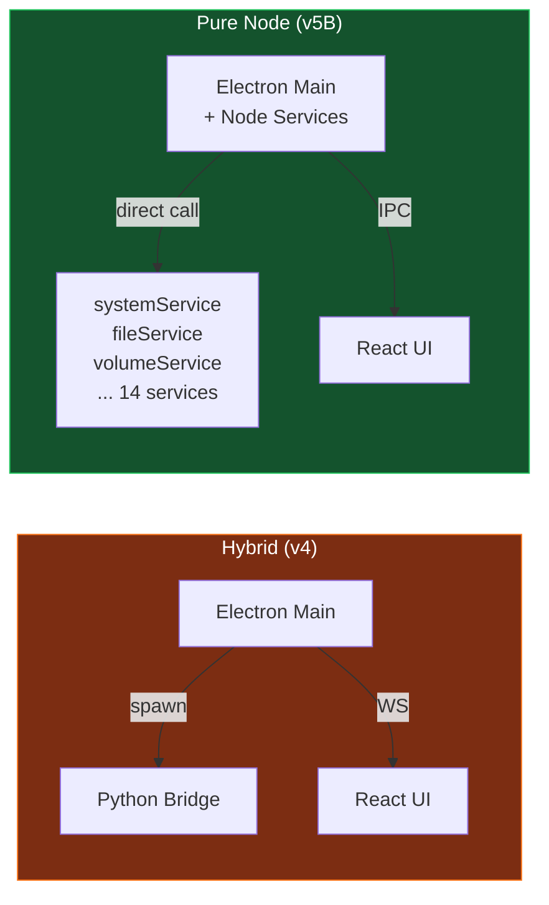
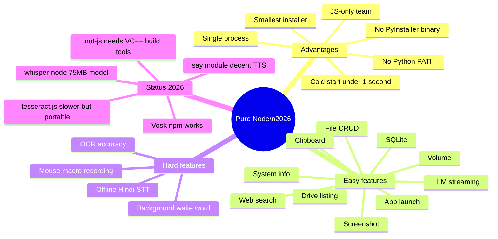
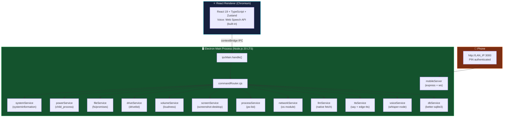
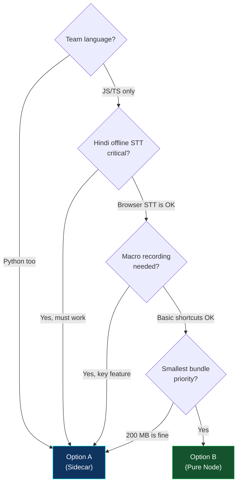
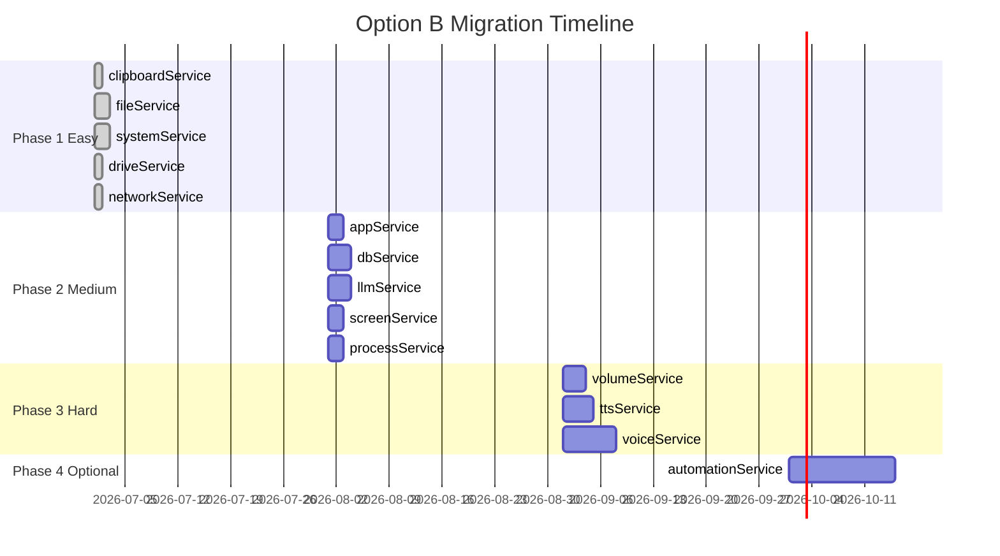

[🏠 Back to Master Index](./00-START-HERE.md) | [➡️ Next: B Node Services Guide](./B-NODE-SERVICES-GUIDE.md)

---

# ⚡ B — Option B: Pure Electron + Node.js (No Python)

> Yeh option **Python ko completely hata deta hai**. Sirf Electron + Node.js.
> 2026 analysis ke saath: kab choose karo, kab nahi. 🔬

---

## 🎯 Core Premise



**Net effect:** No spawn, no two processes, no Python install, no PyInstaller. Electron alone does everything.

---

## 🔬 2026 Honest Analysis



---

## 🏗️ Full Architecture



---

## 📊 Feature Status Table

| Feature | Node Library | Status | Notes |
|---------|-------------|:------:|-------|
| File CRUD | `fs/promises` (built-in) | ✅ Full | Zero deps |
| Drive listing | `drivelist@9` | ✅ Full | No native compile |
| CPU/RAM/Battery | `systeminformation@5` | ✅ Full | Pure JS |
| Volume | `loudness@2` | ✅ Full | No native compile |
| Screenshot | `screenshot-desktop@2` | ✅ Full | No native compile |
| Process list | `ps-list@8` | ✅ Full | No native compile |
| Clipboard | `electron.clipboard` | ✅ Full | Built-in |
| App launch | `shell.openExternal` | ✅ Full | Built-in |
| LLM streaming | `native fetch` | ✅ Full | Node 20 built-in |
| SQLite | `better-sqlite3@9` | ✅ Full | Needs node-gyp |
| Mobile gateway | `express + ws` | ✅ Full | No native |
| TTS online | Edge TTS fetch | ✅ Good | Network needed |
| TTS offline | `say@0.16` | 🟡 Decent | SAPI quality |
| Voice STT | Web Speech API | ✅ Desktop | Chromium built-in |
| Voice STT accuracy | `whisper-node` | 🟡 Optional | 75MB model download |
| Wake word (bg) | Global shortcut only | 🟡 Limited | No background mic |
| Keyboard macros | `@nut-tree/nut-js` | 🟡 Hard | Needs VC++ on Win |
| OCR | `tesseract.js` | 🟡 Slower | 3-5x vs pytesseract |
| Screen recording | `desktopCapturer` | 🟡 TODO | Needs MediaRecorder |

---

## 🆚 Option A vs Option B — Choose Wisely



| Criteria | Option A (Sidecar) | Option B (Pure Node) |
|----------|:-----------------:|:-------------------:|
| Installer size | ~200 MB | ~130 MB |
| Cold start | ~1.5s | <1s |
| Offline Hindi STT | ✅ Vosk (reliable) | 🟡 whisper-node (setup) |
| Background wake word | ✅ | ❌ |
| Mouse/key macros | ✅ | 🟡 |
| OCR speed | ✅ Fast | 🟡 Slower |
| Build complexity | Medium | Medium |
| Python dependency | For devs (build) | ❌ None |
| Node native modules | None | better-sqlite3 |
| Migration effort | Low | High |
| Recommended for | Voice-first apps | UI-first apps |

---

## 🗓️ Migration Strategy (Service by Service)



### Feature Flag Pattern

```typescript
// electron/services/featureFlags.cjs
module.exports = {
  USE_NODE_CLIPBOARD: true,
  USE_NODE_FILES:     true,
  USE_NODE_SYSTEM:    true,
  USE_NODE_DRIVE:     true,
  USE_NODE_NETWORK:   true,
  USE_NODE_VOLUME:    false,  // still Python
  USE_NODE_VOICE:     false,  // still Python
  USE_NODE_MACROS:    false,  // still Python
};
```

```javascript
// commandRouter.cjs with feature flags
const ff = require("./featureFlags.cjs");

case "volume":
  if (ff.USE_NODE_VOLUME) return volumeService.volumeUp(p.amount);
  return sendToBridge(msg);  // fallback to Python
```

This way Python bridge stays alive for hard services while Node handles easy ones.

---

## 💻 Quick Start Commands

```bash
# Install Node-only dependencies
npm install systeminformation loudness screenshot-desktop drivelist ps-list clipboardy better-sqlite3 express ws say mathjs

# Rebuild native modules for Electron
npm install --save-dev @electron/rebuild
npx electron-rebuild -f -w better-sqlite3

# Run (NO Python needed if USE_NODE_* flags are all true)
npm run electron:dev

# Package (NO build:bridge step!)
npm run release:win
```

---

## 🔗 Related Docs

- [B-NODE-SERVICES-GUIDE.md](./B-NODE-SERVICES-GUIDE.md) — Service implementations
- [B-LIMITATIONS.md](./B-LIMITATIONS.md) — Honest tradeoffs
- [02-ARCHITECTURE.md](./02-ARCHITECTURE.md) — Overall architecture

---

[🏠 Back to Master Index](./00-START-HERE.md) | [➡️ Next: B Node Services Guide](./B-NODE-SERVICES-GUIDE.md)
